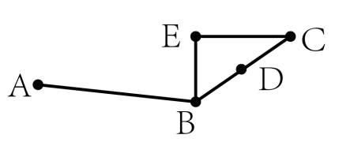
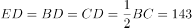
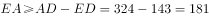
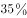
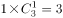
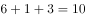
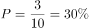
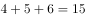
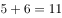

# 2019年420联考《行测》题（黑龙江公检法卷）（网友回忆版）

> 数量关系 · 15 题 · 黑龙江 2019

## 第 1 题　qid 2376451 · 数学运算

林先生要将从故乡带回的一包泥土分成小包装送给占其朋友总数的老年朋友。在分包过程中发现，如果每包200克，则少500克；如果每包150克，则多250克。那么，林先生的朋友共有多少人?

- **A**. 15
- **B**. 30
- **C**. 50　✅
- **D**. 100

**答案**：C

**官方解析**

设林先生的老年朋友为人，根据分包过程可得：，解得人。因老年朋友占朋友总数的，则林先生的朋友总共有：人。

故正确答案为C。

注：本题并未说明每人分1包，不够严谨；但是不按每人1包则有无数种可能，无法求解。

---

## 第 2 题　qid 2376445 · 数学运算

小林在距家1.5公里的工厂上班。一天，小林出发10分钟后，父亲老林发现小林的手机没带，立即追出去，并在距离工厂500米的地方追上了他。如果老林追赶的速度比小林快6公里/小时，那么，下列关于小林速度，求值所列方程正确的是：

- **A**. 

　✅
- **B**. 

- **C**. 

- **D**. 

**答案**：A

**官方解析**

根据题意，老林从家到追上小林，老林和小林行驶的路程均为 公里，老林比小林少用 分钟，即 小时。小林速度为，老林速度为，则。

故正确答案为A。

---

## 第 3 题　qid 2377251 · 数学运算

商店购入一百多件A款服装，其单件进价为整数元，总进价为1万元。已知单件B款服装的定价为其进价的1.6倍，其进价为A款服装的，销售每件B款服装的利润正好为A款服装的一半。某日商店以定价销售A款服装的总销售额超过2500元。问当天至少销售了多少件A款服装？

- **A**. 13
- **B**. 15
- **C**. 17　✅
- **D**. 19

**答案**：C

**官方解析**

假设A款服装每件进价为，则B款服装每件进价为，定价为，每件利润为，A款服装每件定价为。假设某日A款服装销售量为，则，当取得最大值时，可取得最小值。因购进100多件A款服装，单件进价为整数元，总进价为1万元， 则10000能被整除且，满足条件的最大值为20，此时，则至少售出了17件A款服装。

故正确答案为C。

---

## 第 4 题　qid 2377279 · 数学运算

2016年某电子产品定价为n元/台，2017年由于技术升级成本降低，定价降低，每台产品利润提升，2017年全年销售这种产品的总利润较2016年增加了。那么，2017年的销量比2016年：

- **A**. 
提高了不到
　✅
- **B**. 
提高了或以上

- **C**. 
降低了不到

- **D**. 
降低了或以上

**答案**：A

**官方解析**

赋值2016年每台电子产品的利润为100元，则2017年每台产品利润提升之后利润为110元。设2016年的销量为台，则2016年的总利润为，由于2017年总利润比2016年增加了，因此2017年总利润为，则2017年销量为，即2017年的销量比2016年提高了。

故正确答案为A。

---

## 第 5 题　qid 2376465 · 数学运算

某次田径运动会中，选手参加各单项比赛计入所在团体总分的规则为：一等奖得9分，二等奖得5分，三等奖得2分。甲队共有10位选手参赛，均获奖。现知甲队最后总分为61分，问该队最多有几位选手获得一等奖？

- **A**. 3
- **B**. 4
- **C**. 5　✅
- **D**. 6

**答案**：C

**官方解析**

设获得一等奖、二等奖、三等奖的人数分别为、、，根据题意得：，，整理两式，消去得：。

问获得一等奖人数最多，考虑从大到小代入：

代入D项，若，代入，为负且不是整数，排除；

代入C项，若，代入，解得，，符合题意。

故正确答案为C。

---

## 第 6 题　qid 2376459 · 数学运算

甲乙两人相约骑共享单车运动健身。停车点现有9辆单车，分属3个品牌，各有2、3、4辆。假如两人选择每一辆单车的概率相同，两人选到同一品牌单车的概率约为：

- **A**. 

- **B**. 

- **C**. 

　✅
- **D**. 

**答案**：C

**官方解析**

假设三个品牌分别为A、B、C，两人各选一辆单车的情况数共有种。两人选到同一品牌的单车，包含三种情况：

（1）两人同时选到A品牌，情况数为；

（2）两人同时选到B品牌，情况数为；

（3）两人同时选到C品牌，情况数为；

则两人选到同一品牌单车的概率。

故正确答案为C。

---

## 第 7 题　qid 2377282 · 数学运算

小张从甲地出发匀速前往乙地，同时小李和小王从乙地出发匀速前往甲地，小张和小李在途中的丙地相遇，小张和小王在途中的丁地相遇。已知小张的速度比小李快一半，小王的速度比小李慢一半，则丙、丁两地之间的距离与甲、乙两地之间的距离之比为：

- **A**. 2:15
- **B**. 1:4
- **C**. 3:20　✅
- **D**. 1:15

**答案**：C

**官方解析**

设甲乙两地的距离为，小张、小李、小王的速度分别为、、，由下图可知，小张和小李相遇时用时为，小张和小王相遇时用时为，因此小张走丙、丁之间的路程所用时为，所以丙、丁之间的路程。故丙、丁两地之间的距离与甲、乙两地之间的距离之比为。

故正确答案为C。

---

## 第 8 题　qid 2376467 · 数学运算

某河道由于淤泥堆积影响到船只航行安全，现由工程队使用挖沙机进行清淤工作，清淤时上游河水又会带来新的泥沙。若使用1台挖沙机300天可完成清淤工作，使用2台挖沙机100天可完成清淤工作。为了尽快让河道恢复使用，上级部门要求工程队25天内完成河道的全部清淤工作，那么工程队至少要有多少台挖沙机同时工作？

- **A**. 4
- **B**. 5
- **C**. 6
- **D**. 7　✅

**答案**：D

**官方解析**

假定每天每台挖沙机效率为1，每天新增泥沙的量为，原有泥沙量为。由于1台挖沙机300天可完成清淤工作，可得：；由于2台挖沙机100天可完成清淤工作，可得：。两式联立，解得，。若要求工程队25天内完成河道的全部清淤工作，此时，设所需的挖沙机台数为，则有，解得，至少需要7台挖沙机同时工作。

故正确答案为D。

---

## 第 9 题　qid 2377410 · 数学运算

人行步道ABC如图所示，BC两地之间的距离为286米，D地为BC中点，AD两点间的直线距离为324米。现经B点作直线BE，从C点作垂直于BE的直线CE并与BE相交于E点。问EA之间的最短距离为多少米？

- **A**. 38
- **B**. 168
- **C**. 176
- **D**. 181　✅

**答案**：D

**官方解析**

由题意可知，D为BC中点，且角E为90度，故米。由三角形两边和大于第三边可知：，即米。

故正确答案为D。

---

## 第 10 题　qid 2377412 · 数学运算

一家早餐店只出售粥、馒头和包子。粥有三种：大米粥、小米粥和绿豆粥，每份1元；馒头有两种：红糖馒头和牛奶馒头，每个2元；包子只有一种三鲜大肉包，每个3元。陈某在这家店吃早餐，花了4元钱，假设陈某点的早餐不重样，问他吃到包子的概率是多少？

- **A**. 

　✅
- **B**. 

- **C**. 

- **D**. 

**答案**：A

**官方解析**

花4元且不重样，可能分为3类：

1份馒头两种粥每种1份共有种情况；

两种馒头每种1份共有1种情况；

1个包子1份粥共有种，故总的情况有种。

其中吃到包子的情况为1个包子1份粥，有3种，所求概率。

故正确答案为A。

---

## 第 11 题　qid 2376466 · 数学运算

太阳高度角是太阳光的入射方向和地平面之间的夹角。在正午时，太阳高度角为，为纬度，为太阳赤纬。已知小陈的身高为180厘米，他所在地的纬度为，当日太阳赤纬为。那么，在正午时他的影子长度约为：

- **A**. 60厘米
- **B**. 90厘米
- **C**. 104厘米　✅
- **D**. 208厘米

**答案**：C

**官方解析**

根据题干，正午时太阳高度角为。如下图所示，在中，AC代表小陈的身高，故为180厘米。AB代表太阳光，由于正午太阳高度角为，故为。为，BC即为影子的长度。根据直角三角形三边关系可知，，因此，则。

故正确答案为C。

---

## 第 12 题　qid 2376449 · 数学运算

小张、小李和小王三人以擂台形式打乒乓球，每局2人对打，输的人下一局轮空。半天下来，小张共打了6局，小王共打了9局，而小李轮空了4局。那么，小李一共打了多少局？

- **A**. 5局
- **B**. 7局　✅
- **C**. 9局
- **D**. 11局

**答案**：B

**官方解析**

小李轮空4局，说明小王和小张打了4局。小王共打9局，则小王和小李打了9-4=5局。小张共打6局，则小张和小李打了6-4=2局，所以小李共打5+2=7局。
故正确答案为B。

---

## 第 13 题　qid 2376450 · 数学运算

某楼盘的地下停车位，第一次开盘时平均价格为15万元/个；第二次开盘时，车位的销售量增加了一倍、销售额增加了。那么，第二次开盘的车位平均价格为：

- **A**. 10万元/个
- **B**. 11万元/个
- **C**. 12万元/个　✅
- **D**. 13万元/个

**答案**：C

**官方解析**

赋值第一次车位销售量为1，则。根据题意，第二次开盘时，销售量增加了一倍、销售额增加了，可得第二次销售量为，销售额为，则第二次平均价格为。

故正确答案为C。

---

## 第 14 题　qid 2376446 · 数学运算

幼儿园老师设计了一个摸彩球游戏，在一个不透明的盒子里混放着红、黄两种颜色的小球，它们除了颜色不同，形状、大小均一致。已知随机摸取一个小球，摸到红球的概率为三分之一。如果从中先取出3红7黄共10个小球，再随机摸取一个小球，此时摸到红球的概率变为五分之二，那么原来盒中共有红球多少个？

- **A**. 5　✅
- **B**. 10
- **C**. 15
- **D**. 20

**答案**：A

**官方解析**

假设原来盒子中共有个红球，因随机摸取一个小球，摸到红球的概率为，则原来盒子中共有个小球。取出红黄共个小球后，红球剩下个，小球总个数为，此时随机摸取一个小球，摸到红球的概率为，则，解得。

故正确答案为A。

---

## 第 15 题　qid 2377413 · 数学运算

某公交站台附近区域停放A型共享单车4辆，B型共享单车5辆，C型共享单车6辆。一公交车到站后，下车的乘客随机选择其中13辆单车骑走。问B型和C型单车全部被骑走的概率在以下哪个范围内？

- **A**. 
在以下
　✅
- **B**. 
在之间

- **C**. 
在之间

- **D**. 
超过

**答案**：A

**官方解析**

A型车4辆，B型车5辆，C型车6辆，则总的车辆数为。下车乘客从中选择13辆骑走，总的情况为从15辆车中任意选13辆，情况数为。B型单车和C型单车全被骑走，即已经骑走了辆，还需要骑走2辆A型车，情况数为从4辆A型车中任意选2辆，情况数为。所求概率，在以下。

故正确答案为A。

---
