# 2019年420联考《行测》题（黑龙江县乡卷）（网友回忆版）

> 数量关系 · 10 题 · 黑龙江 2019

## 第 1 题　qid 2377401 · 数学运算

甲和乙两个工厂分别接到生产一批玩具的任务，其中甲工厂的任务量是乙工厂的1.5倍，甲工厂以乙工厂1.2倍的效率生产其任务量的后效率提升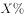继续生产。在乙工厂完成生产任务时，甲工厂的任务完成了。问X的值在以下哪个范围内？

- **A**. 
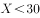

- **B**. 

　✅
- **C**. 

- **D**. 
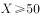

**答案**：B

**官方解析**

根据甲工厂的任务量是乙工厂的1.5倍，赋值甲任务量为150，乙任务量为100，甲工厂以乙工厂1.2倍的效率生产，设乙工厂效率为，甲工厂效率为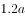，甲生产任务量之后效率提升了，提升后甲效率为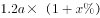。在乙工厂完成生产任务时，甲工厂的任务完成，根据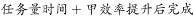：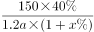，解得，即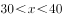，B选项符合。

故正确答案为B。

---

## 第 2 题　qid 2376731 · 数学运算

一工厂生产的某规格齿轮的齿数是一个三位数的质数（除了1和它本身之外，不能被其他整数整除的正整数），其个、十、百位数字各不相同且均为质数。若将该齿数的百位数字与个位数字对调，所得新的三位数比该齿数大495，则该齿数的十位数字为：

- **A**. 7
- **B**. 5　✅
- **C**. 3
- **D**. 2

**答案**：B

**官方解析**

三位数数字各不相同且均为质数，可知三位数字应在2、3、5、7中选择。调换位置后所得新数字比原数字大495，根据尾数判断则原数字的个位（调换后的百位）应为7，原数字的百位（调换后的个位）应为2，则十位数字只能是3或5。如果是3，则原数字为，不是质数，不符合题意，因此原十位数字只能为5。

故正确答案为B。

---

## 第 3 题　qid 2377255 · 数学运算

某企业员工编号为6位自然数，其中前两位代表入职年份的最后两位数，第3位代表所属部门，后3位代表员工当年在部门中的入职顺序。2018年入职的员工小张发现，自己的员工编号能同时被5、9和101整除。问当年他所在的部门最少可能有多少人入职？

- **A**. 不到250人
- **B**. 250～499人之间　✅
- **C**. 500～749人之间
- **D**. 超过749人

**答案**：B

**官方解析**

小张18年入职，则6位工号前两位为18。由于其员工编号能同时被5、9、101整除，因此，其6位工号组成的数是5、9、101的最小公倍数4545的倍数。前两位是18且是4545倍数的六位数只有4545的40倍为181800，及其41倍为186345。已知后三位为员工入职顺序，故其部门18年最少有345人入职，在B项的范围内。
故正确答案为B。

---

## 第 4 题　qid 2376501 · 数学运算

如右图所示，一条河流的两岸分别有A、B两处景点，河面宽80米，A与B的直线距离是100米。现需铺设一条观光栈道连接A与B。已知陆地栈道的铺设费用是0.1万元/米，河面栈道的铺设费用是0.125万元/米，则最少需要铺设费用：

- **A**. 12.5万元　✅
- **B**. 12万元
- **C**. 11.5万元
- **D**. 11万元

**答案**：A

**官方解析**

如图所示若沿AB建造观光栈道，则需建造河面栈道AB段100m，共需要铺设费用万元；若沿AO→OB铺设栈道，则需建造河面栈道AO段80m和陆地栈道OB段，共需要铺设费用万元。通过所给条件对比分析，最少铺设费用为12.5万元（沿AB段建造）。

故正确答案为A。

备注：如若讨论陆地与河面栈道的转折点：在OB段上取任意点C，设。沿AC→CB铺设栈道，则需建造河面栈道AC段和陆地栈道CB段，共需要铺设费用万元。取特值分析x和y的增减关系，取值如表：

由特值分析可知，x取值越大，费用y越小。故时（即C点与B点重合）， y可取得最小值12.5。

---

## 第 5 题　qid 2377247 · 数学运算

某助农项目从农民手中以1元/斤的价格收购一批芒果，通过网络平台销售，定价30元/10斤包邮，售出芒果的后调价为35元/10斤，售完全部芒果的总收入比调价前预计的多20万元。问这批芒果总重量为多少吨？

- **A**. 50
- **B**. 100
- **C**. 500　✅
- **D**. 1000

**答案**：C

**官方解析**

调价后，每10斤比预计多卖35-30=5元，总收入比预计多20万元，则调价后卖出的芒果量为，这批芒果的总重量为吨。

故正确答案为C。

---

## 第 6 题　qid 2376471 · 数学运算

小张用10万元购买某只股票1000股，在亏损时，又增持该只股票1000股。一段时间后，小张将该只股票全部卖出，不考虑交易成本，获利2万元。那么，这只股票在小张第二次买入到卖出期间涨了多少？

- **A**. 

- **B**. 

- **C**. 

　✅
- **D**. 

**答案**：C

**官方解析**

10万元购买1000股，即100元/股。在亏损时，即每股市值元，购得1000股，成本需要元，即8万元。

将这2000股全部卖出后获利2万元，共卖万元，即卖出价格为。那么小张第二次买入为80元/股，卖出为100元/股，共涨了。

故正确答案为C。

---

## 第 7 题　qid 2377404 · 数学运算

某企业从10名高级管理人员中选出3人参加国际会议。在10名高级管理人员中，有一线生产经验的有6人，有研发经验的有5人，另有2人既无一线生产经验也无研发经验。如果要求选出的人中，具备一线生产经验的人和具备研发经验的人都必须有，问有多少种不同的选择方式？

- **A**. 96
- **B**. 100
- **C**. 106　✅
- **D**. 112

**答案**：C

**官方解析**

在10名高级管理人员中，有一线生产经验的有6人，有研发经验的有5人，另有2人既无一线生产经验也无研发经验，根据两集合容斥原理公式：，代入数据，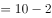，则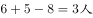。

要求选出的人中，具备一线生产经验和研发经验的人都必须有，从正面分析，情况较复杂，考虑从反面入手。

从10人中选出3人，要求选出具备一线生产经验和研发经验的人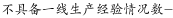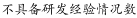。

总情况数等于，总人数为10人，具备一线生产经验人数为6人，则不具备一线生产经验人数为4人，从中选出3人，因此不具备一线生产经验情况数等于；

同理，具备研发经验人数为5人，则不具备研发经验人数为5人，从中选出3人，因此不具备研发经验情况数等于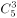；

两者都不具备人数为2人，不足3人，从中无法选出3人，因此都不具备的情况数为0。

则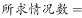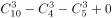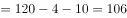。

故正确答案为C。

（备注：本题从反面入手，不需要考虑容斥原理，若从正面分析，则需要利用容斥原理）

---

## 第 8 题　qid 2376447 · 数学运算

调酒师调配鸡尾酒，先在调酒杯中倒入120毫升柠檬汁，再用伏特加补满，摇匀后倒出80毫升混合液备用，再往杯中加满番茄汁并摇匀，一杯鸡尾酒就调好了。若此时鸡尾酒中伏特加的比例是，问调酒杯的容量是多少毫升？

- **A**. 160
- **B**. 180
- **C**. 200　✅
- **D**. 220

**答案**：C

**官方解析**

假设调酒杯的容量为毫升，在原有120毫升柠檬汁的基础上，用伏特加补满，因此加入伏特加的量为，故伏特加浓度为。混匀后倒出80毫升后，还剩余毫升混合液，此时伏特加的量为。最后加入番茄汁，但是伏特加的量无变化，可得方程：。

由于本题属于分式方程，直接计算难度太高，故考虑代入选项验证。优先选择好算的选项入手，C项为整百的数，因此代入C项。，等式成立。

故正确答案为C。

---

## 第 9 题　qid 2377283 · 数学运算

现用5700立方厘米的蜡制作二十多个同样大小，且长、宽、高均为整数厘米的长方体实心蜡块，问蜡块的尺寸有多少种不同的可能性？

- **A**. 4
- **B**. 6
- **C**. 10　✅
- **D**. 16

**答案**：C

**官方解析**

5700立方厘米的蜡制作二十多个同样大小的长方形实心蜡块，将5700因式分解为，其因数为二十多的只有一种情况，因此可以拆分为25个，每个体积为立方厘米。蜡块的尺寸分类讨论如下：

①若长宽高有两条为1厘米：，1种情况；

②若长宽高只有一条为1厘米：，，，，，5种情况；

③若长宽高均不为1厘米：，，，，4种情况。

所以共有种情况。

故正确答案为C。

---

## 第 10 题　qid 2376452 · 数学运算

小王在商店消费了90元，口袋里只有1张50元、4张20元、8张10元的钞票，他共有几种付款方式，可以使店家不用找零钱?

- **A**. 5
- **B**. 6
- **C**. 7　✅
- **D**. 8

**答案**：C

**官方解析**

根据题干条件分析，付款方式可包含使用50元与不使用50元两种情况。对情况进行枚举可得：

可得共有7种付款方式，可以使店家不用找零钱。

故正确答案为C。

---
