# 2019年上海市公务员录用考试《行测》题（A类）（网友回忆版）

> 数量关系 · 28 题 · 上海 2019

## 材料 1

        截至2015年底，N市汽车拥有量为197.93万辆，比2014年增长，增速较2014年回落了7.7个百分点。扣除报废等因素，全市年净增汽车25.73万辆。

        截至2015年底，N市私家汽车拥有量为172.07万辆。私家汽车中有166.85万辆为小微型载客汽车，其中126.50万辆为轿车。全市共有进口载客汽车11.81万辆，一年净增加进口载客汽车1.90万辆，增长，增速高于全市载客汽车增速3.3个百分点。

        2015年底，在N市821.61万常住人口中，持有汽车驾驶执照的人员（简称汽车驾驶人）达275.82万人。全市全年新增汽车驾驶人30.58万人，新增汽车驾驶人人数比2014年高出1.47万人。

### 第 1 题　qid 2295353 · 数学运算

如按2015年汽车净增量计算，N市汽车数量将在      年底突破400万辆。

- **A**. 2023　✅
- **B**. 2024
- **C**. 2025
- **D**. 2026

**答案**：A

**官方解析**

由题干“按2015年······净增量计算，······将在<u>      </u>年底突破400万辆”，材料给出了2015年底的汽车数量，可判定本题为基期与现期的现期追赶问题。定位文字材料第一段“截至2015年底，N市汽车拥有量为197.93万辆，比2014年增长，增速较2014年回落了7.7个百分点。扣除报废等因素，全市年净增汽车25.73万辆”，假设过N年将突破400万辆，根据“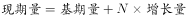”，可得，解得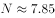，则过8年突破400万辆，即在。

故正确答案为A。

---

### 第 2 题　qid 2295354 · 数学运算

“十二五”（2011-2015年）期间，N市新注册汽车总数量为      。

- **A**. 不到120万辆
- **B**. 120多万辆　✅
- **C**. 130多万辆
- **D**. 140多万辆

**答案**：B

**官方解析**

定位统计图，可得“十二五”期间，N市新注册汽车总数量。

故正确答案为B。

---

### 第 3 题　qid 2295356 · 数学运算

2014-2015年，N市总计新增汽车驾驶人约      万人。

- **A**. 58.22
- **B**. 59.69　✅
- **C**. 61.16
- **D**. 62.63

**答案**：B

**官方解析**

定位文字材料第三段“2015年底······全市全年新增汽车驾驶人30.58万人，新增汽车驾驶人人数比2014年高出1.47万人”，可得2014年新增汽车驾驶人，选项精确度与材料数据精确度一致且尾数不同，利用尾数法即可，尾数为9。

故正确答案为B。

---

### 第 4 题　qid 2295358 · 数学运算

2012-2015年，N市全年新注册汽车数量排名第3的年份，私家汽车占全市汽车总数比重比上年提升了      个百分点。

- **A**. 0.6
- **B**. 1.9
- **C**. 2.0　✅
- **D**. 2.7

**答案**：C

**官方解析**

定位统计图，可得N市全年新注册汽车数量排名第3的年份为2013年，其私家汽车占全市汽车总数比重为，2012年比重为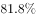，，则提升了2.0个百分点。

故正确答案为C。

---

### 第 5 题　qid 2295361 · 数学运算

下列选项中，不能从上述资料中推出的是      。

- **A**. 
2015年N市新注册汽车比年净增汽车多3万多辆

- **B**. 
2014年底N市汽车数量比2013年底增加了以上

- **C**. 
2015年底N市拥有的汽车中，私家汽车占八成多

- **D**. 
2015年底N市每百名常住人口拥有私家汽车30多辆
　✅

**答案**：D

**官方解析**

A项：定位文字材料第一段“截至2015年底，N市汽车拥有量为197.93万辆······扣除报废等因素，全市年净增汽车25.73万辆”和统计图，可知2015年N市新注册汽车数量为28.85万辆，全市年净增汽车25.73万辆，则，即2015年N市新注册汽车比年净增汽车多3万多辆，正确；

B选项：定位文字材料第一段“截至2015年底，N市汽车拥有量为197.93万辆，比2014年增长，增速较2014年回落了7.7个百分点”，可知2014年底N市汽车数量同比增长率，正确；

C选项：定位统计图，可知2015年底私家汽车占比为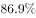，即八成多，正确；

D选项：定位文字材料第二段“截至2015年底，N市私家汽车拥有量为172.07万辆。私家汽车中有166.85万辆为小微型载客汽车，其中126.50万辆为轿车······”和第三段“2015年底，在N市821.61万常住人口中，持有汽车驾驶执照的人员(简称汽车驾驶人)达275.82万人······”，可知2015年底N市每百名常住人口拥有私家汽车数量，错误。

本题为选非题，故正确答案为D。

---

## 材料 2

### 第 6 题　qid 2295574 · 数学运算

2015年西南地区（云南、贵州、四川、重庆）四省市GDP之和约占长江经济带GDP的      。

- **A**. 

- **B**. 

　✅
- **C**. 
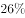

- **D**. 

**答案**：B

**官方解析**

根据题干“2015年······占······的”，结合选项为百分数，且材料中给出2015年部分和总体，可判断本题为现期比重问题。定位表格可知，2015年西南地区（云南、贵州、四川、重庆）四省市GDP之和为亿元，2015年长江经济带GDP为305200亿元，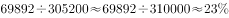，所以，2015年西南地区（云南、贵州、四川、重庆）四省市GDP之和约占长江经济带GDP的比重为。

故正确答案为B。

---

### 第 7 题　qid 2295575 · 数学运算

2015年长江经济带有      个省市的进出口总额高于上年水平。

- **A**. 2　✅
- **B**. 3
- **C**. 4
- **D**. 5

**答案**：A

**官方解析**

根据题干“2015年长江经济带······进出口总额高于上年水平”并结合表格中出现了2014年和2015年进出口总额的数据可知本题为直接找数问题。易知2015年长江经济带相关省市的进出口总额高于上年水平有湖北和贵州这两个省市，其余均为低于。
故正确答案为A。

---

### 第 8 题　qid 2295577 · 数学运算

2013-2015年长江经济带累计进出口总额最高的省市，其在2013-2015年间的累计贸易顺逆差状况为      。

- **A**. 逆差不到1000亿美元
- **B**. 逆差超过1000亿美元
- **C**. 顺差不到1000亿美元
- **D**. 顺差超过1000亿美元　✅

**答案**：D

**官方解析**

2013-2015年长江经济带累计进出口总额最高的省市为江苏省，共计为亿美元，出口额共计为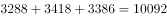亿美元，所以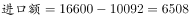亿美元，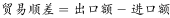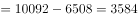亿美元，即顺差超过1000亿美元。

故正确答案为D。

---

### 第 9 题　qid 2295584 · 数学运算

关于2013-2015年长江经济带各省市GDP和进出口贸易状况，能够从上述资料中推出的是      。

- **A**. 
2015年GDP同比增速超过的省市有3个

- **B**. 
2013-2015年，累计进出口总额超过1万亿美元的省市有3个
　✅
- **C**. 
2014年贵州进口总额高于上年水平

- **D**. 
2015年长江经济带进出口总额占全国比重低于2013年水平

**答案**：B

**官方解析**

A.根据选项表述可知增速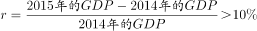,即需要找出的相关省市即可，进而比较容易判断，依据表格：满足条件的省市仅有重庆（）、贵州（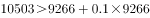）两个省市，而非3个，错误；

B.由表格可知，2013-2015年，累计进出口总额超过1万亿美元的省市有上海（）、江苏（）、浙江（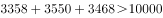），共3个省市，正确；

C.由表格可知，2014年、2013年贵州进出口总额分别为108、83亿美元，2014年、2013年贵州出口额分别为94、69亿美元，因，所以2014年、2013年贵州进口额应分别为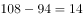亿美元、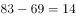亿美元，即2014年贵州进口总额等于上年水平，而非高于，错误；

D.由表格可知，2015年长江经济带进出口总额占全国比重为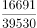，2013年长江经济带进出口总额占全国比重为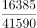，前者分子大、分母小，所以，即2015年长江经济带进出口总额占全国比重高于2013年水平，而非低于，错误。

故正确答案为B。

---

## 材料 3

        2017年1月17日国家能源局公布《能源发展“十三五”规划》《天然气“十三五”规划》，首次明确“发挥市场配置资源的决定性作用”，到2020年天然气综合保供能力应达到3600亿立方米以上，天然气消费占一次能源消费比例达到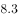-。

        2017年，我国天然气消费总量2373亿立方米，同比增长；全年天然气进口量920亿立方米，同比增长。

### 第 10 题　qid 2295387 · 数学运算

我国2016年天然气消费总量约为      亿立方米。

- **A**. 1172
- **B**. 2058　✅
- **C**. 2373
- **D**. 30856

**答案**：B

**官方解析**

由题干“我国2016年天然气消费总量约为······亿立方米”，结合材料时间为2017年，判定本题为基期计算问题。定位文字材料第二段可得“2017年，我国天然气消费总量2373亿立方米，同比增长”，根据，可得我国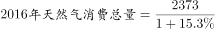，此式小于2373且首位商2，只有B项符合。

故正确答案为B。

---

### 第 11 题　qid 2295391 · 数学运算

2010-2015年，我国城市天然气供气总量年均约增长      亿立方米。

- **A**. 68
- **B**. 92
- **C**. 111　✅
- **D**. 191

**答案**：C

**官方解析**

由题干“2010-2015年···年均约增长···亿立方米。”判断本题为年均增长量问题。定位图表可得2010年我国城市天然气供气总量487.58亿立方米，2015年国城市天然气供气总量尾1040.79亿立方米，由可得，2010-2015年，。

故正确答案为C。

---

### 第 12 题　qid 2295397 · 数学运算

2016年我国城市天然气用气人口中，平均每人每月使用天然气约      立方米。

- **A**. 32　✅
- **B**. 65
- **C**. 167
- **D**. 380

**答案**：A

**官方解析**

由题干“2016年······平均每人每月使用天然······”，可判断题型为平均数问题。定位图表可得2016年城市天然气供应总量为1171.72亿立方米，城市天然气用气人口为30855.57万人。故2016年我国城市天然气用气人口中，平均每人每月使用天然气为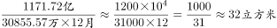。

故正确答案为A。

---

### 第 13 题　qid 2295403 · 数学运算

下列选项中，与资料不符的是      。

- **A**. 
2016年我国城市天然气供气总量比2015年增长以上

- **B**. 
从2007年到2016年，我国城市天然气用气人口逐渐增长

- **C**. 
2016年我国城市天然气用气人数是2007年的3倍多

- **D**. 
2007-2011年，我国城市天然气供气总量超过2500亿立方米
　✅

**答案**：D

**官方解析**

A项：定位图表可得2016年我国天然气供气总量为1171.72亿立方米，2015年我国天然气总量为1040.79亿立方米，故2016年我国城市天然气供气总量比2015年增长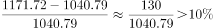，正确；

B项：由图表可知从2007年到2016年，我国城市天然气用气人口逐渐增长，正确；

C项：由图表可知2016年天然气用气人数是30855.57万人，2007年我国城市天然气用气人数是10189.8万人，故2016年我国城市天然气用气人数是2007年的 ，正确；

D项：由图表可2007-2011年，我国城市天然气供气总量为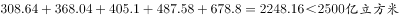，错误。

本题为选非题，故正确答案为D。

---

### 第 14 题　qid 2295554 · 数学运算

1，，3，，5，，7，<u>      </u>

- **A**. 
8

- **B**. 
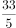

- **C**. 
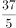

- **D**. 

　✅

**答案**：D

**官方解析**

方法一：数列较长，考虑多重数列。优先考虑交叉找规律：奇数项1,3,5,7，是公差为2的等差数列；偶数项，，，为分数数列，分母为公差为1的等差数列，则所求项分母是5。分子5，13，25无明显规律，考虑代入排除：代入四项的分子：40、33、37、41，发现只有代入D项存在规律：分子作差为8、12、16，是公差为4的等差数列。

故正确答案为D。

方法二：数列较长，考虑多重数列。两两分组：（1，），（3，），（5，），（7，<u>       </u>）将每组中分母统一：（，），（，），（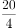，），则分母为公差为1的等差数列，故所求项分母为5, 即最后一组为（，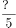）；分子作差得：3,4,5，则下一项为6，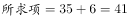，    即。

故正确答案为D。

---

### 第 15 题　qid 2295310 · 数学运算

- **A**. 49
- **B**. 45
- **C**. 35　✅
- **D**. 28

**答案**：C

**官方解析**

题干出现图形，通过观察，相邻数字存在倍数关系，考虑除法。横向观察，可以得到：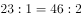；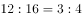；；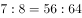，那么，推出。

故正确答案为C。

---

### 第 16 题　qid 2295557 · 数学运算

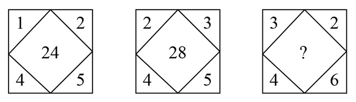

- **A**. 24
- **B**. 26
- **C**. 28
- **D**. 30　✅

**答案**：D

**官方解析**

题干出现图形，且图形存在中心，优先考虑凑中心。中心数字，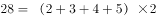，故规律为：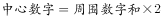。则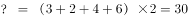。

故正确答案为D。

---

### 第 17 题　qid 2295304 · 数学运算

数列：981，（5），（4），109；896，（      ），（4），128

- **A**. 2
- **B**. 3　✅
- **C**. 4
- **D**. 5

**答案**：B

**官方解析**

题干中有分号，将数列分为两组，优先考虑多重数列。观察每组四个数字之间关系，发现，即。将第二组数字代入此规律：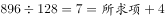，则。

故正确答案为B。

---

### 第 18 题　qid 2295307 · 数学运算

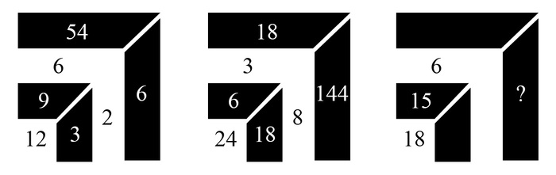

- **A**. 9　✅
- **B**. 24
- **C**. 35
- **D**. 48

**答案**：A

**官方解析**

题干出现图形，观察数字之间的规律。图一中：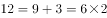，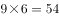，；图二中：，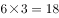，；图三中：，则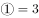，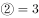，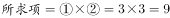。（注：为方便表述，设图三中18右边的两个数依次为①和②）

故正确答案为A。

---

### 第 19 题　qid 2295559 · 数学运算

为了缩短就医时间，小张打算在医院网站登录挂号，再以平均40公里/小时的速度驱车前往看病，四家医院到小张家的距离和目前排队人数如下：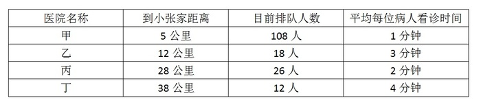

为了尽早就医，小张应该选择<u>      </u>医院。（不考虑小张去医院期间新增病人数）

- **A**. 甲
- **B**. 乙
- **C**. 丙　✅
- **D**. 丁

**答案**：C

**官方解析**

小张就医的时间是小张到医院的时间与排队总时间中较长的那个时间，所以就医时间列表如下：

根据就医时间可知，应选择最小的丙医院。

故正确答案为C。

---

### 第 20 题　qid 2295322 · 数学运算

一群蚂蚁将食物从A处运往B处，如果它们的速度每分钟增加1米，可提前15分钟到达，如果它们的速度每分钟再增加2米，则又可提前15分钟到达，那么A处到B处之间的路程是      米。

- **A**. 120
- **B**. 180　✅
- **C**. 240
- **D**. 270

**答案**：B

**官方解析**

设原速度为V，计划达到时间为t，总路程为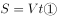；“速度每分钟增加1米，可提前15分钟到达”可得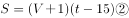；“它们的速度每分钟再增加2米，则又可提前15分钟到达”即速度每分钟增加3米，一共可提前30分钟到达，可得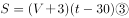，联立①②③解方程可得。

故正确答案为B。

---

### 第 21 题　qid 2295560 · 数学运算

踢毽子有内踢、直踢、外踢、膝击、叉踢、背踢、倒勾和踹毽八种基本动作。在一次踢毽子比赛中规定：前五种基本动作每次记1分；后三种基本动作由于难度较高，每次记3分。方华在1分钟内完成了35个基本动作，总分为69分。那么方华完成了      个3分动作。

- **A**. 16
- **B**. 17　✅
- **C**. 18
- **D**. 19

**答案**：B

**官方解析**

设完成1分动作个，完成3分动作个。根据总共完成35个动作，共得69分可列方程，，解得，，所以完成17个3分动作，选择B选项。

故正确答案为B。

---

### 第 22 题　qid 2295561 · 数学运算

一碗芝麻粉，第一次吃了半碗，然后用水加满搅匀；第二次喝了碗，用水加满搅匀；第三次喝了碗，用水加满搅匀；最后一次全吃完。则最后一次吃下的芝麻糊中芝麻粉含量是<u>      </u>。

- **A**. 

- **B**. 

- **C**. 
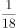

- **D**. 
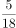
　✅

**答案**：D

**官方解析**

设一碗芝麻粉的质量为1，第一次吃了半碗，芝麻粉剩；水加满搅匀后，第二次又喝了，芝麻粉剩；再次水加满搅匀后，第三次又喝了，芝麻粉剩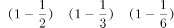，此时加满水搅匀后芝麻糊中芝麻的含量为，所以最后一次吃下的芝麻糊中芝麻含量是。

故正确答案为D。

---

### 第 23 题　qid 2295333 · 数学运算

用一辆小型箱式货车运送荔枝干，该货车货箱长4.2米、宽1.9米、高1.8米。600克装荔枝干的外包装长20厘米，宽和高都是14厘米。那么一次最多可以运送约      吨荔枝干。

- **A**. 2.1　✅
- **B**. 2.0
- **C**. 1.9
- **D**. 1.8

**答案**：A

**官方解析**

提问“最多可以运送约多少吨荔枝干”，应使车厢尽可能少留空隙，荔枝干的外包装有20厘米和14厘米两种边长，观察车箱的尺寸可以发现，4.2米能整除20厘米和14厘米都不留缝隙，1.9米无法整除20厘米和14厘米、都会留下缝隙，1.8米只能整除20厘米。

因此想最多运送荔枝干，应用1.8米的方向摆放荔枝干外包装20厘米的方向，可以摆放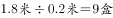；4.2米方向摆放14厘米可摆放；1.9米方向摆放14厘米可摆放，最多13盒。

因此车箱里最多可运送，共计。

故正确答案为A。

---

### 第 24 题　qid 2295317 · 数学运算

某酒店14名员工需要2个小时清理完所有房间，如果要将这个时间缩短1刻钟，那么需增加      名员工（假设每位员工的工作效率相同）。

- **A**. 1
- **B**. 2　✅
- **C**. 3
- **D**. 4

**答案**：B

**官方解析**

方法一：假设每名员工每分钟的效率为1，则14名员工2小时（即120分钟）的工作量为，若缩短一刻钟（15分钟），则实际总效率为，所以需要增加2人即可。

方法二：设每名员工每分钟的效率为1，缩短时间后需要n人清理。本题由于工作总量相同，则工作效率与时间成反比，即，解得，所以需要增加2人即可。

故正确答案为B。

---

### 第 25 题　qid 2295564 · 数学运算

如图，由四个全等的小长方形拼成一个大正方形，每个长方形的面积都是1，且长与宽之比大于等于2，则这个大正方形的面积至少为<u>      </u>。

- **A**. 3
- **B**. 4.5　✅
- **C**. 5
- **D**. 5.5

**答案**：B

**官方解析**

。要让大正方形面积尽可能小，则小正方形面积应尽可能小，，要想小正方形的边长尽可能短，则小长方形长与宽之比需尽可能小，即等于2。

设长方形短边为，则长边为，根据长方形面积公式可得，解得，长边为。因此小正方形面积为，。

故正确答案为B。

---

### 第 26 题　qid 2295338 · 数学运算

小李第一次买了A、B、C三种饮料各若干瓶，共花去了75元；之后他再次买了这三种饮料若干瓶，共花去了134元。两次购买的每种饮料数量之和相同，那么若三种饮料各买1瓶最多需花费      元。（假设饮料价格都是整数元）

- **A**. 11
- **B**. 15
- **C**. 19　✅
- **D**. 23

**答案**：C

**官方解析**

假设三种饮料各买1瓶共需要a元，两次购买的每种饮料数量之和为n，则两次购买饮料的费用总和为，或19元，因此三种饮料各买1瓶最多需要19元。

故正确答案为C。

---

### 第 27 题　qid 2295565 · 数学运算

汪先生乘飞机需托运69千克行李，应付行李超重费735元，后在候机室内巧遇2位没有托运行李的好友，他们也乘同一个航班，于是汪先生就将行李作为三人共有，因而只需付135元行李超重费，那么每位乘客可免费托运行李      千克。

- **A**. 20　✅
- **B**. 18
- **C**. 16
- **D**. 15

**答案**：A

**官方解析**

方法一：设每位乘客可免费托运行李重量千克，每千克行李费用为元。根据题意可知，每位乘客可免费托运行李的费用为元，因此有，即300可被整除，由此排除BC选项。代入A选项，千克，则每千克行李超重的单价元。剩余的行李重量千克，需要再付超重费元，满足题干全部条件（若代入D选项，可得每千克行李的单价。剩余的行李千克，因需要再付超重费元，与题干矛盾）。

方法二：设每位乘客可免费托运行李a千克，则超重千克行李超重费为735元，超重千克行李超重费为135元，由每千克超重费用相同可列式，解得。 

故正确答案为A。

---

### 第 28 题　qid 2295567 · 数学运算

某游戏击中一次加1分，如果连续击中，从第二次击中开始是前一次得分的2倍。小明在游戏中共得到了74分，那么他最多连续击中      次。

- **A**. 4
- **B**. 5
- **C**. 6　✅
- **D**. 7

**答案**：C

**官方解析**

设连续击中次，则得分分别为1、2、4、8、16……，由题意可知连续击中总得分小于等于74分。题目问最多多少次，从较大选项代入，若，则分，大于74分，不满足题意；若，则分，小于74分，满足题意。

故正确答案为C。

---
