# 2019年上海市公务员录用考试《行测》题（B类）（网友回忆版）

> 数量关系 · 28 题 · 上海 2019

## 材料 1

        截至2015年底，N市汽车拥有量为197.93万辆，比2014年增长，增速较2014年回落了7.7个百分点。扣除报废等因素，全市年净增汽车25.73万辆。

        截至2015年底，N市私家汽车拥有量为172.07万辆。私家汽车中有166.85万辆为小微型载客汽车，其中126.50万辆为轿车。全市共有进口载客汽车11.81万辆，一年净增加进口载客汽车1.90万辆，增长，增速高于全市载客汽车增速3.3个百分点。

        2015年底，在N市821.61万常住人口中，持有汽车驾驶执照的人员（简称汽车驾驶人）达275.82万人。全市全年新增汽车驾驶人30.58万人，新增汽车驾驶人人数比2014年高出1.47万人。

### 第 1 题　qid 2295353 · 数学运算

如按2015年汽车净增量计算，N市汽车数量将在      年底突破400万辆。

- **A**. 2023　✅
- **B**. 2024
- **C**. 2025
- **D**. 2026

**答案**：A

**官方解析**

由题干“按2015年······净增量计算，······将在<u>      </u>年底突破400万辆”，材料给出了2015年底的汽车数量，可判定本题为基期与现期的现期追赶问题。定位文字材料第一段“截至2015年底，N市汽车拥有量为197.93万辆，比2014年增长，增速较2014年回落了7.7个百分点。扣除报废等因素，全市年净增汽车25.73万辆”，假设过N年将突破400万辆，根据“”，可得，解得，则过8年突破400万辆，即在。

故正确答案为A。

---

### 第 2 题　qid 2295354 · 数学运算

“十二五”（2011-2015年）期间，N市新注册汽车总数量为      。

- **A**. 不到120万辆
- **B**. 120多万辆　✅
- **C**. 130多万辆
- **D**. 140多万辆

**答案**：B

**官方解析**

定位统计图，可得“十二五”期间，N市新注册汽车总数量。

故正确答案为B。

---

### 第 3 题　qid 2295356 · 数学运算

2014-2015年，N市总计新增汽车驾驶人约      万人。

- **A**. 58.22
- **B**. 59.69　✅
- **C**. 61.16
- **D**. 62.63

**答案**：B

**官方解析**

定位文字材料第三段“2015年底······全市全年新增汽车驾驶人30.58万人，新增汽车驾驶人人数比2014年高出1.47万人”，可得2014年新增汽车驾驶人，选项精确度与材料数据精确度一致且尾数不同，利用尾数法即可，尾数为9。

故正确答案为B。

---

### 第 4 题　qid 2295358 · 数学运算

2012-2015年，N市全年新注册汽车数量排名第3的年份，私家汽车占全市汽车总数比重比上年提升了      个百分点。

- **A**. 0.6
- **B**. 1.9
- **C**. 2.0　✅
- **D**. 2.7

**答案**：C

**官方解析**

定位统计图，可得N市全年新注册汽车数量排名第3的年份为2013年，其私家汽车占全市汽车总数比重为，2012年比重为，，则提升了2.0个百分点。

故正确答案为C。

---

### 第 5 题　qid 2295361 · 数学运算

下列选项中，不能从上述资料中推出的是      。

- **A**. 
2015年N市新注册汽车比年净增汽车多3万多辆

- **B**. 
2014年底N市汽车数量比2013年底增加了以上

- **C**. 
2015年底N市拥有的汽车中，私家汽车占八成多

- **D**. 
2015年底N市每百名常住人口拥有私家汽车30多辆
　✅

**答案**：D

**官方解析**

A项：定位文字材料第一段“截至2015年底，N市汽车拥有量为197.93万辆······扣除报废等因素，全市年净增汽车25.73万辆”和统计图，可知2015年N市新注册汽车数量为28.85万辆，全市年净增汽车25.73万辆，则，即2015年N市新注册汽车比年净增汽车多3万多辆，正确；

B选项：定位文字材料第一段“截至2015年底，N市汽车拥有量为197.93万辆，比2014年增长，增速较2014年回落了7.7个百分点”，可知2014年底N市汽车数量同比增长率，正确；

C选项：定位统计图，可知2015年底私家汽车占比为，即八成多，正确；

D选项：定位文字材料第二段“截至2015年底，N市私家汽车拥有量为172.07万辆。私家汽车中有166.85万辆为小微型载客汽车，其中126.50万辆为轿车······”和第三段“2015年底，在N市821.61万常住人口中，持有汽车驾驶执照的人员(简称汽车驾驶人)达275.82万人······”，可知2015年底N市每百名常住人口拥有私家汽车数量，错误。

本题为选非题，故正确答案为D。

---

## 材料 2

### 第 6 题　qid 2295363 · 数学运算

2007-2014年，香港特别行政区GDP增量有      年超过1000亿港元。

- **A**. 5　✅
- **B**. 4
- **C**. 3
- **D**. 2

**答案**：A

**官方解析**

根据题干“2007-2014年，······增量有<u>      </u>年超过1000亿港元”，可判定本题为增长量比较问题。定位折线图可知： 

香港特别行政区2007年的GDP增量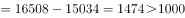、2008年的GDP增量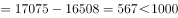、2009年的GDP增量、2010年的GDP增量、2011年的GDP增量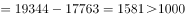、2012年的GDP增量、2013年的GDP增量、2014年的GDP增量。因此可知，香港特别行政区2007、2010、2011、2012、2014这5年的GDP增量超过1000亿港元。

故正确答案为A。

---

### 第 7 题　qid 2295365 · 数学运算

2014年香港特别行政区四大服务业增加值占该特区GDP的比重约为      。

- **A**. 

- **B**. 

　✅
- **C**. 

- **D**. 

**答案**：B

**官方解析**

根据题干“2014年······占······的比重约为<u>      </u>”，结合材料中给出2014年部分和总体的量，可知本题为现期比重问题。定位表格可知，2014年香港特别行政区四大服务业增加值为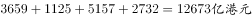；定位折线图可知，2014年香港特别行政区GDP为22457亿港元，所以占比为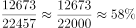，与B项最接近。

故正确答案为B。

---

### 第 8 题　qid 2295368 · 数学运算

2014年香港特别行政区四大服务业中增加值增速最低的行业，增加值增速比当年香港特别行政区GDP增速约      。

- **A**. 低0.3个百分点
- **B**. 低2.3个百分点　✅
- **C**. 高0.4个百分点
- **D**. 高0.8个百分点

**答案**：B

**官方解析**

根据题干“2014年香港特别行政区四大服务业中增加值增速最低的行业，增加值增速比当年香港特别行政区GDP增速约<u>      </u>”，结合选项可知，本题为增长率计算问题。定位表格可知，2014年香港特别行政区四大服务业中增加值增速分别为：

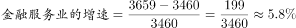；

；

；

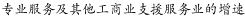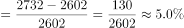。

所以，2014年香港特别行政区四大服务业中增加值增速最低的行业为贸易及物流业，其增速约为。

定位折线图可知，当年香港特别行政区GDP的增速为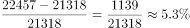。因此可知，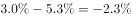，即2014年香港特别行政区贸易及物流业增加值的增速比当年香港特别行政区GDP的增速低了2.3个百分点。

故正确答案为B。

---

### 第 9 题　qid 2295372 · 数学运算

关于香港特别行政区GDP和四大服务业发展状况，能够从上述资料中推出的是      。

- **A**. 2001-2008年，香港GDP有4年增速为负值
- **B**. 与2008年相比，2014年专业服务及其他工商业支援服务业从业人员增速在四大服务业中排第二
- **C**. 2000-2014年，旅游业的从业人数翻了1番，增加值翻了2番
- **D**. 香港GDP首次超过2万亿港元的年份，旅游业增加值同比增量为四大服务行业中最低　✅

**答案**：D

**官方解析**

A.定位折线图，通过观察可知，在2001-2008年之间，2001、2002、2003这三年的增速为负值，并非4年，错误；

B.定位表格可知，与2008年相比，2014年四大服务业专从业人员增速分别为：

；

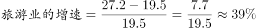；

；

。因此可知，专业服务及其他工商业业支援服务业从业人员增速在四大服务业中排第三，错误；

C.定位表格可知，2014年旅游业的从业人数为27.2万人，2000年旅游业的从业人数11.5万人，，满足翻了1番；2014年旅游业的增加值为1125亿港元，2000年旅游业的增加值为310亿港元，，不满足翻了2番，错误；

D.定位折线图，香港GDP首次超过2万亿港元的年份为2012年，定位表格可知，2012年旅游业增加值同比增量为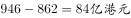，同年，金融服务业的同比增量为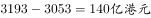、贸易及物流业的同比增量为、专业服务及其他工商业支援服务业的同比增量为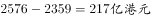，所以2012年旅游业增加值同比增量为四大服务行业中最低，正确。

故正确答案为D。

---

## 材料 3

        2017年1月17日国家能源局公布《能源发展“十三五”规划》《天然气“十三五”规划》，首次明确“发挥市场配置资源的决定性作用”，到2020年天然气综合保供能力应达到3600亿立方米以上，天然气消费占一次能源消费比例达到-。

        2017年，我国天然气消费总量2373亿立方米，同比增长；全年天然气进口量920亿立方米，同比增长。

### 第 10 题　qid 2295387 · 数学运算

我国2016年天然气消费总量约为      亿立方米。

- **A**. 1172
- **B**. 2058　✅
- **C**. 2373
- **D**. 30856

**答案**：B

**官方解析**

由题干“我国2016年天然气消费总量约为······亿立方米”，结合材料时间为2017年，判定本题为基期计算问题。定位文字材料第二段可得“2017年，我国天然气消费总量2373亿立方米，同比增长”，根据，可得我国，此式小于2373且首位商2，只有B项符合。

故正确答案为B。

---

### 第 11 题　qid 2295391 · 数学运算

2010-2015年，我国城市天然气供气总量年均约增长      亿立方米。

- **A**. 68
- **B**. 92
- **C**. 111　✅
- **D**. 191

**答案**：C

**官方解析**

由题干“2010-2015年···年均约增长···亿立方米。”判断本题为年均增长量问题。定位图表可得2010年我国城市天然气供气总量487.58亿立方米，2015年国城市天然气供气总量尾1040.79亿立方米，由可得，2010-2015年，。

故正确答案为C。

---

### 第 12 题　qid 2295397 · 数学运算

2016年我国城市天然气用气人口中，平均每人每月使用天然气约      立方米。

- **A**. 32　✅
- **B**. 65
- **C**. 167
- **D**. 380

**答案**：A

**官方解析**

由题干“2016年······平均每人每月使用天然······”，可判断题型为平均数问题。定位图表可得2016年城市天然气供应总量为1171.72亿立方米，城市天然气用气人口为30855.57万人。故2016年我国城市天然气用气人口中，平均每人每月使用天然气为。

故正确答案为A。

---

### 第 13 题　qid 2295403 · 数学运算

下列选项中，与资料不符的是      。

- **A**. 
2016年我国城市天然气供气总量比2015年增长以上

- **B**. 
从2007年到2016年，我国城市天然气用气人口逐渐增长

- **C**. 
2016年我国城市天然气用气人数是2007年的3倍多

- **D**. 
2007-2011年，我国城市天然气供气总量超过2500亿立方米
　✅

**答案**：D

**官方解析**

A项：定位图表可得2016年我国天然气供气总量为1171.72亿立方米，2015年我国天然气总量为1040.79亿立方米，故2016年我国城市天然气供气总量比2015年增长，正确；

B项：由图表可知从2007年到2016年，我国城市天然气用气人口逐渐增长，正确；

C项：由图表可知2016年天然气用气人数是30855.57万人，2007年我国城市天然气用气人数是10189.8万人，故2016年我国城市天然气用气人数是2007年的 ，正确；

D项：由图表可2007-2011年，我国城市天然气供气总量为，错误。

本题为选非题，故正确答案为D。

---

### 第 14 题　qid 2295301 · 数学运算

数列：3，1，4，8；15，12，3，30；7，11，9，

- **A**. 5
- **B**. 9
- **C**. 13
- **D**. 27　✅

**答案**：D

**官方解析**

题干中有分号，数列可按分号提示分为三组，优先考虑多重数列。观察每组四个数字之间关系，每一组的最大数都在最后，考虑凑大数。发现有；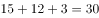；即前三项之和等于第四项，故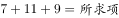，则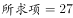。

故正确答案为D。

---

### 第 15 题　qid 2295302 · 数学运算

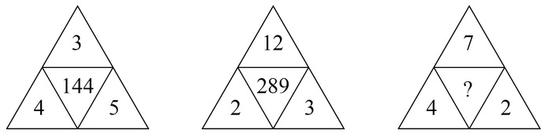

- **A**. 144
- **B**. 169　✅
- **C**. 196
- **D**. 289

**答案**：B

**官方解析**

题干为图形数阵，按照有中心凑中心的原则，优先考虑凑中心。中心数字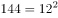，而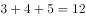；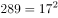，而；即，。

故正确答案为B。

---

### 第 16 题　qid 2295304 · 数学运算

数列：981，（5），（4），109；896，（      ），（4），128

- **A**. 2
- **B**. 3　✅
- **C**. 4
- **D**. 5

**答案**：B

**官方解析**

题干中有分号，将数列分为两组，优先考虑多重数列。观察每组四个数字之间关系，发现，即。将第二组数字代入此规律：，则。

故正确答案为B。

---

### 第 17 题　qid 2295307 · 数学运算

- **A**. 9　✅
- **B**. 24
- **C**. 35
- **D**. 48

**答案**：A

**官方解析**

题干出现图形，观察数字之间的规律。图一中：，，；图二中：，，；图三中：，则，，。（注：为方便表述，设图三中18右边的两个数依次为①和②）

故正确答案为A。

---

### 第 18 题　qid 2295310 · 数学运算

- **A**. 49
- **B**. 45
- **C**. 35　✅
- **D**. 28

**答案**：C

**官方解析**

题干出现图形，通过观察，相邻数字存在倍数关系，考虑除法。横向观察，可以得到：；；；，那么，推出。

故正确答案为C。

---

### 第 19 题　qid 2295313 · 数学运算

有一瓶浓度为的盐水500克，每次加入34克浓度为的盐水，则至少加<u>      </u>次该盐水，使这瓶盐水的浓度超过。

- **A**. 6
- **B**. 7
- **C**. 8　✅
- **D**. 9

**答案**：C

**官方解析**

假设至少加入n次浓度为的盐水，则一共加入34n克盐水。根据溶液混合前后溶质的质量不变，可列方程，解得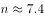，说明加入7.4次盐水能让混合后盐水浓度为，则至少需要加8次才能让混合后浓度超过。 

故正确答案为C。

---

### 第 20 题　qid 2295317 · 数学运算

某酒店14名员工需要2个小时清理完所有房间，如果要将这个时间缩短1刻钟，那么需增加      名员工（假设每位员工的工作效率相同）。

- **A**. 1
- **B**. 2　✅
- **C**. 3
- **D**. 4

**答案**：B

**官方解析**

方法一：假设每名员工每分钟的效率为1，则14名员工2小时（即120分钟）的工作量为，若缩短一刻钟（15分钟），则实际总效率为，所以需要增加2人即可。

方法二：设每名员工每分钟的效率为1，缩短时间后需要n人清理。本题由于工作总量相同，则工作效率与时间成反比，即，解得，所以需要增加2人即可。

故正确答案为B。

---

### 第 21 题　qid 2295319 · 数学运算

甲、乙两人在400米环形跑道上从同一起点反向匀速慢跑，甲的速度为5米/秒，乙的速度为3米/秒，则甲、乙两人经过      再次在起跑点相遇。

- **A**. 4分10秒
- **B**. 5分50秒
- **C**. 6分40秒　✅
- **D**. 7分30秒

**答案**：C

**官方解析**

若两人再次在起跑点相遇，那么每人都重新回到起点，即每人都跑了整数圈，假设此时甲跑了n圈，则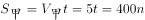，解得，所以在起点再次相遇的时间t为80的倍数，代入选项验证即可。A项4分10秒即250秒，不是80的倍数，排除；B项5分50秒即350秒,不是80的倍数，排除； C项6分40秒即400秒，是80的倍数，当选；D项7分30秒即450秒，不是80的倍数，排除。

故正确答案为C。

---

### 第 22 题　qid 2295322 · 数学运算

一群蚂蚁将食物从A处运往B处，如果它们的速度每分钟增加1米，可提前15分钟到达，如果它们的速度每分钟再增加2米，则又可提前15分钟到达，那么A处到B处之间的路程是      米。

- **A**. 120
- **B**. 180　✅
- **C**. 240
- **D**. 270

**答案**：B

**官方解析**

设原速度为V，计划达到时间为t，总路程为；“速度每分钟增加1米，可提前15分钟到达”可得；“它们的速度每分钟再增加2米，则又可提前15分钟到达”即速度每分钟增加3米，一共可提前30分钟到达，可得，联立①②③解方程可得。

故正确答案为B。

---

### 第 23 题　qid 2295332 · 数学运算

某广告牌上需安装特殊的艺术字模型，大字价格是小字价格的2倍，而大字字数是小字字数的三分之一。若总费用不变，而将所有字都改为小字，那么可以制作的小字数量是原来所有字数量的      。

- **A**. 

- **B**. 

- **C**. 

　✅
- **D**. 

**答案**：C

**官方解析**

设小字的价格为1，数量为3x；大字的价格为2，数量为x，所以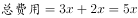；若费用不变，全改为小字，则可以制作小字的，而原来所有字数量为，所以所求为。

故正确答案为C。

---

### 第 24 题　qid 2295333 · 数学运算

用一辆小型箱式货车运送荔枝干，该货车货箱长4.2米、宽1.9米、高1.8米。600克装荔枝干的外包装长20厘米，宽和高都是14厘米。那么一次最多可以运送约      吨荔枝干。

- **A**. 2.1　✅
- **B**. 2.0
- **C**. 1.9
- **D**. 1.8

**答案**：A

**官方解析**

提问“最多可以运送约多少吨荔枝干”，应使车厢尽可能少留空隙，荔枝干的外包装有20厘米和14厘米两种边长，观察车箱的尺寸可以发现，4.2米能整除20厘米和14厘米都不留缝隙，1.9米无法整除20厘米和14厘米、都会留下缝隙，1.8米只能整除20厘米。

因此想最多运送荔枝干，应用1.8米的方向摆放荔枝干外包装20厘米的方向，可以摆放；4.2米方向摆放14厘米可摆放；1.9米方向摆放14厘米可摆放，最多13盒。

因此车箱里最多可运送，共计。

故正确答案为A。

---

### 第 25 题　qid 2295334 · 数学运算

赵、钱、孙三人共带1000元钱外出游玩，赵、钱两人平均花了220元，钱、孙平均花了230元，赵、孙平均花了290元，回来后三人想把剩下的钱平分，结果怎样也分不开，赵出了一个主意，三人谁花钱最少就把剩下的钱给谁。则花钱最少的是      ，他分到了      元。

- **A**. 钱，240
- **B**. 赵，260
- **C**. 孙，260
- **D**. 钱，260　✅

**答案**：D

**官方解析**

根据题意可知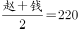①，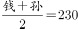②，③，由①②可推出，②③可推出，因此花钱最少的人是“钱”，排除B、C两项。三人共花费：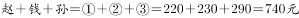，因此剩余。 

故正确答案为D。

---

### 第 26 题　qid 2295336 · 数学运算

如图，由四个全等的直角三角形拼成一个大正方形，每个三角形的面积都是1，且两直角边之比大于等于2，则这个大正方形的面积至少是<u>      </u>。

- **A**. 4
- **B**. 5　✅
- **C**. 6
- **D**. 7

**答案**：B

**官方解析**

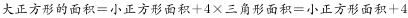。要让大正方形面积尽可能小，则小正方形面积应尽可能小。观察图形可知：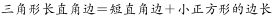，要想小正方形的边长尽可能小，则长短直角边的差值应尽量小，即两直角边之比尽可能小，此时该比值等于2。

设三角形短直角边为x，则长直角边为2x，根据三角形面积公式可得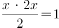，解得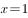，则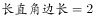，因此小正方形面积为，大正方形的面积。

故正确答案为B。

---

### 第 27 题　qid 2295338 · 数学运算

小李第一次买了A、B、C三种饮料各若干瓶，共花去了75元；之后他再次买了这三种饮料若干瓶，共花去了134元。两次购买的每种饮料数量之和相同，那么若三种饮料各买1瓶最多需花费      元。（假设饮料价格都是整数元）

- **A**. 11
- **B**. 15
- **C**. 19　✅
- **D**. 23

**答案**：C

**官方解析**

假设三种饮料各买1瓶共需要a元，两次购买的每种饮料数量之和为n，则两次购买饮料的费用总和为，或19元，因此三种饮料各买1瓶最多需要19元。

故正确答案为C。

---

### 第 28 题　qid 2295344 · 数学运算

射击用的靶子是由若干个同心圆组成，最中心的圆代表10环，而10环外圈的一个圆环代表9环。在随机射击时，若要使得击中10环和9环的概率相同，那么10环外圈半径与9环外圈半径的比值为      。

- **A**. 
1

- **B**. 

- **C**. 

- **D**. 

　✅

**答案**：D

**官方解析**

在随机射击时，若要使得击中10环和9环的概率相同，应使10环和9环部分的面积相同。设10环半径为1，9环半径为x，由面积相等可列公式：，解得。10环外圈半径与9环外圈半径的比值为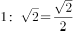。

故正确答案为D。

---
