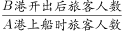

# 2019年上海市行政执法类考试《行测》试题（网友回忆版）

> 数量关系 · 16 题 · 上海 2019

## 材料 1

### 第 1 题　qid 5666003 · 数学运算

能够从上述资料中推出的是        。

- **A**. 2009年所有项目税收额都高于上年水平
- **B**. 2013年全国税收总额比5年前翻了一番　✅
- **C**. 2008-2014年，国内增值税年平均增速快于营业税
- **D**. 2009-2014年间，国内消费税增速最慢的是2012年

**答案**：B

**官方解析**

A项：定位表格可得：2009年关税为1484亿元，2008年为1770亿元，可知并非所有项目税收额都高于上年水平，错误；

B项：定位表格可得：2013年全国税收总额为110531亿元，2008年为54224亿元。，可知2013年全国税收总额比5年前翻了一番，正确；

C项：定位表格可得：2008年国内增值税、营业税分别为17997亿元、7626亿元，2014年分别为30850亿元、17782亿元。根据年均增长率公式：（n为年份差），年份差相同时，比较即可。国内增值税：，营业税：，可知2008-2014年，国内增值税年平均增速慢于营业税，错误；

D项：定位表格可得：2011-2013年国内消费税分别为6936亿元、7876亿元、8231亿元。根据公式：增长率，2012年国内消费税同比增速为，2013年为，2013年同比增速慢于2012年，可知2009-2014年间，国内消费税增速最慢的并非2012年，错误。

故正确答案为B。

---

## 材料 2

### 第 2 题　qid 5666012 · 数学运算

在下列运输行业中平均每个法人单位的从业人员数最多的是        。

- **A**. 铁路运输业　✅
- **B**. 道路运输业
- **C**. 城市公共交通业
- **D**. 装卸搬运和其他运输服务业

**答案**：A

**官方解析**

根据题干“······平均每个······最多的是”，可判定本题为现期平均数问题。定位表格材料可知各个运输行业的企业法人单位数与从业人员数。根据公式：平均每个法人单位的从业人员数，选项平均数如下所示：

铁路运输业，万人；

道路运输业，万人；

城市公共交通业，万人；

装卸搬运和其他运输服务业，万人。

比较可知，平均每个法人单位的从业人员数最多的是铁路运输业。

故正确答案为A。

---

### 第 3 题　qid 5666016 · 数学运算

平均每名仓储业从业人员在2018年创造的营业收入约是邮政业的        倍。

- **A**. 3
- **B**. 5　✅
- **C**. 7
- **D**. 10

**答案**：B

**官方解析**

根据题干“······2018年······约是······倍”，可判定本题为现期倍数问题。定位表格可得：2018年，仓储业从业人员51.1万人，营业收入3020.9亿元；邮政业从业人员78.4万人，营业收入939.1亿元。根据公式：平均每名从业人员创造的营业收入，则题干所求倍数为，与B项最接近。

故正确答案为B。

---

### 第 4 题　qid 5666017 · 数学运算

2018年营业利润率（）超过10%的行业有<u>        </u>个。

- **A**. 1
- **B**. 2
- **C**. 3　✅
- **D**. 4

**答案**：C

**官方解析**

根据题干“2018年营业利润率（）超过10%的······”，可判定本题为现期比重问题。定位材料表格可知2018年各个运输行业的营业利润与营业收入。要求营业利润率，即营业利润＞营业收入×0.1。观察表格，符合的有：道路运输业（1909.6亿元＞9128.5亿元×0.1）、水上运输业（902.9亿元＞5000.8亿元×0.1）、管道运输业（85亿元＞344.2亿元×0.1），共3个行业。

故正确答案为C。

---

### 第 5 题　qid 12118360 · 数学运算

理论上，资产规模越大，营业收入就应该越高。财务管理常常用“资产周转率”指标来反映企业的资产运营能力，其具体公式为“资产周转率”，资产周转率的数值越大，反映了资产运营效率越高。按照这一概念，可以认为细分行业中资产周转率最高的是<u>        </u>。

- **A**. 铁路运输业
- **B**. 道路运输业
- **C**. 城市公共交通业
- **D**. 装卸搬运和其他运输服务业　✅

**答案**：D

**官方解析**

根据题干“······资产周转率······细分行业中资产周转率最高的是”，可判定本题为现期比重问题。定位统计表可得：2018年某国铁路运输业、道路运输业、城市公共交通业、装卸搬运和其他运输服务业的总资产分别为14936.2亿元、24829.4亿元、3517.6亿元、5585.6亿元，营业收入分别为3457.6亿元、9128.5亿元、1392.9亿元、5106亿元。根据公式：资产周转率，可得：铁路运输业资产周转率，道路运输业资产周转率，城市公共交通业资产周转率，装卸搬运和其他运输服务业资产周转率，故细分行业中资产周转率最高的是装卸搬运和其他运输服务业。

故正确答案为D。

---

### 第 6 题　qid 16540106 · 数学运算

关于2018年运输行业及各细分子行业营业状况，以下说法正确的是        。

- **A**. 道路运输业平均每名从业人员创造的利润是最高的
- **B**. 航空运输业的资产规模超过运输行业总体的一成
- **C**. 道路运输业贡献了整个行业不到一半的利润
- **D**. 平均每个装卸搬运和其他运输服务业企业利润额为100多万元　✅

**答案**：D

**官方解析**

A项：定位统计表可得2018年运输行业各细分子行业从业人员数量和营业利润。则2018年道路运输业平均每名从业人员创造的利润万元，2018年水上运输业平均每名从业人员创造的利润万元，因此道路运输业平均每名从业人员创造的利润并非最高的，错误；

B项：定位统计表可得，2018年运输行业资产总计74807.4亿元，航空运输业资产为6871.4亿元。，即不到一成，错误；

C项：定位统计表可得，2018年运输行业营业利润为3276.2亿元，道路运输业营业利润为1909.6亿元。，即2018年道路运输业贡献的利润超过了整个行业的一半，错误；

D项：定位统计表可得，2018年装卸搬运和其他运输服务业企业法人单位数为43955个，营业利润为441.7亿元。则2018年平均每个装卸搬运和其他运输服务业企业利润额万元，正确。

故正确答案为D。

---

### 第 7 题　qid 5666266 · 数学运算

甲乙丙丁四人合资开旅游公司，甲购进了3辆大巴，乙购进了5辆，丙购进了6辆。这些车每辆车的价格相同，所花资金由四人均担。于是按协议丁拿出了210万元，则乙应该收回        万元。

- **A**. 80
- **B**. 90　✅
- **C**. 100
- **D**. 110

**答案**：B

**官方解析**

根据题意，甲乙丙丁四人共购进大巴3+5+6=14辆，所花资金由四人均担且按协议丁拿出了210万元，则每辆大巴的价格为万元，乙购进了5辆大巴花费5×60=300万元，按协议乙也应拿出210万元，则乙应该收回300-210=90万元。

故正确答案为B。

---

### 第 8 题　qid 5666268 · 数学运算

一艘客轮从A港出发到C港，途中到B港有的旅客离船，又有45人上船，这时船上旅客人数相当于从A港开出时的，则A港上船时有旅客<u>        </u>人。

- **A**. 140
- **B**. 160
- **C**. 189　✅
- **D**. 200

**答案**：C

**官方解析**

方法一：根据题意，该客轮从B港开出后的人数相当于从A港开出时的，即，则A港上船时旅客人数为21的整数倍，结合选项观察，只有C项满足。

方法二：设A港上船时旅客的人数为21x人，到B港有的旅客离船且又有45人上船，从B港开出后旅客的人数为人，相当于从A港开出时的，即，解得x=9，则A港上船时旅客的人数为21×9=189人。

故正确答案为C。

---

### 第 9 题　qid 5666271 · 数学运算

学校组织五子棋比赛，贏一局小组计分为3分，平一局小组计分为1分，输一局小组计分为0分。如果一个小组下了14局五子棋，积分是19分，那么这个小组可能平了        局。

- **A**. 2
- **B**. 6
- **C**. 8
- **D**. 10　✅

**答案**：D

**官方解析**

设该小组赢了x局，平了y局，输了z局，根据题意可得方程组：x+y+z=14······①，3x+y=19······②，3×①-②可得2y+3z=23，因2y为偶数，23为奇数，则3z为奇数，因3为奇数，故z为奇数。
当z=1，解得y=10；当z=3，解得y=7；当z=5，解得y=4；当z=7，解得y=1；当z=9，解得y&lt;0，不符合题意。故该小组可能平了10局、7局、4局或1局，只有D项符合。
故正确答案为D。

---

### 第 10 题　qid 5666273 · 数学运算

甲乙两城市之间的某次列车，除起点和终点外，还要停靠4个站，且各站点间距离都不相同，根据路程远近应准备        种不同的车票。

- **A**. 15　✅
- **B**. 18
- **C**. 24
- **D**. 30

**答案**：A

**官方解析**

根据题意，甲乙两城市之间包含起点和终点共有4+2=6个站点，因任意两个站点间距离都不相同，则根据路程远近，应准备的车票种类有种。

故正确答案为A。

---

### 第 11 题　qid 5666276 · 数学运算

某货运司机原计划驾车从A地前往B地，每小时行驶60千米，6个小时可以到达B地。如果他临时改变计划，需要提前1个小时到达B地，那么车速需要提高        。

- **A**. 10%
- **B**. 20%　✅
- **C**. 15%
- **D**. 35%

**答案**：B

**官方解析**

方法一：根据题意，A、B两地之间距离为60×6=360千米，因临时改变计划，需要提前1个小时到达B地，改变计划后花费的时间为6-1=5小时，速度为千米/小时，车速需要提高。

方法二：根据题意，改变计划后，从A地到B地花费的时间为6-1=5小时。因路程不变，速度与时间成反比，改变计划前后花费的时间之比为6：5，则速度之比为5：6，车速需要提高。

故正确答案为B。

---

### 第 12 题　qid 5665964 · 数学运算

把1根粗细均匀的铁棍锯成5段需用时10分钟，则锯成50段需用时        分钟。

- **A**. 98
- **B**. 100
- **C**. 102
- **D**. 122.5　✅

**答案**：D

**官方解析**

锯成5段需要5-1=4个切口，锯1个切口需要分钟；锯成50段需要50-1=49个切口，所需时间为49×2.5=122.5分钟。

故正确答案为D。

---

### 第 13 题　qid 5665970 · 数学运算

市教委组织初三学生体育达标测试，学生甲通过1000米跑的概率是，如果每个学生可以有连续两次参加达标测试的机会，最终以最好的成绩进行登记，则甲至少有一次通过1000米的概率是<u>        </u>。

- **A**. 

- **B**. 

- **C**. 

　✅
- **D**. 

**答案**：C

**官方解析**

根据题意，甲至少有一次通过1000米的情况为：①两次达标测试均通过，概率为；②两次达标测试中仅有一次通过，概率为。分类用加法，故甲至少有一次通过1000米的概率是。

故正确答案为C。

---

### 第 14 题　qid 5665974 · 数学运算

一根绳子，把它围成一个长度是宽度的两倍的长方形时，面积是32平方厘米，如果把它围成一个等边三角形，面积是        平方厘米。

- **A**. 

- **B**. 

- **C**. 

- **D**. 

　✅

**答案**：D

**官方解析**

设长方形宽为x厘米，则长为2x厘米。根据长方形面积=长×宽，可列方程：，解得x=4或-4。宽度为正数，则长方形宽为4厘米，长为2×4=8厘米。长方形周长=2×（8+4）=24厘米，即绳子长为24厘米，则围成的等边三角形的边长为厘米。根据等边三角形边长与高之比为，可得高为厘米，则该等边三角形面积平方厘米。

故正确答案为D。

---

### 第 15 题　qid 5665975 · 数学运算

某企业举办晚会共有6个大型节目，其中含有4个不同的相声表演和2个不同的歌舞表演，编排节目表时要求首尾必须是歌舞表演，则共有        种不同的编排方式。

- **A**. 48　✅
- **B**. 40
- **C**. 36
- **D**. 32

**答案**：A

**官方解析**

根据题意，首尾必须是歌舞表演，有种编排方式；4个不同的相声表演只能编排在2个不同的歌舞表演中间，有种编排方式。分步用乘法，故共有2×24=48种编排方式。

故正确答案为A。

---

### 第 16 题　qid 5665977 · 数学运算

甲乙两人共同制作一批零件，甲2天可做1个，乙5天可做4个，先由甲单独做，然后再由乙接着做（此时甲休息），这样145天后共做了89个，甲比乙多做        天。

- **A**. 20
- **B**. 25
- **C**. 30
- **D**. 35　✅

**答案**：D

**官方解析**

设甲做了x天，则乙做了（145-x）天。根据题意可列方程：，解得x=90，即甲做了90天，乙做了145-90=55天，甲比乙多做90-55=35天。

故正确答案为D。

---
