# 2019年北京市公务员录用考试《行测》题（网友回忆版）

> 数量关系 · 15 题 · 北京 2019

## 第 1 题　qid 2274469 · 数学运算

王先生购买的医疗保险报销规定为：当年花费1300元（含）以内的部分全部自付，超出1300元部分自付，其余部分由保险支付。王先生在2018年第一次到医院看病时，自己支付了960元，第二次看病自付了520元，则王先生第二次看病时医院共收费

- **A**. 1800元
- **B**. 1960元
- **C**. 2140元　✅
- **D**. 2600元

**答案**：C

**官方解析**

根据题意可知第一次看病付960元没有超过1300元，需要全部自付。可知第二次全付的剩余额度为元。超出1300元部分自付，第二次超过1300元的部分支付了元，所以超过1300元的部分的总额为元。第二次共收费元。

故正确答案为C。

---

## 第 2 题　qid 2274470 · 数学运算

池中原有一定量的水，如果用一台抽水机向池内灌水，6小时可灌至半满；如用3台抽水机灌水，8小时可灌满。如将池中水排空，用4台抽水机灌水几小时能灌满？

- **A**. 6
- **B**. 7
- **C**. 8
- **D**. 9　✅

**答案**：D

**官方解析**

设每台抽水机每小时灌水量为1，且池中原有水量为。根据题意可得：，解得。则水池灌满的总水量为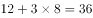。如将池中水排空，4台抽水机需要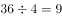小时才能灌满。

故正确答案为D。

---

## 第 3 题　qid 2274471 · 数学运算

2018年父亲年龄是女儿年龄的6倍，是母亲年龄的1.2倍。已知女儿出生当年（按0岁计算）母亲24岁，则哪一年父母年龄之和是女儿的4倍？

- **A**. 2036
- **B**. 2039　✅
- **C**. 2042
- **D**. 2045

**答案**：B

**官方解析**

根据题意，设2018年女儿的年龄为，则女儿、父亲、母亲2018年和年之后的年龄情况如下：

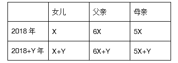

由“女儿出生当年（按0岁计算）母亲24岁”，结合年龄差不变，可知女儿岁时与母亲差24岁，即，解得。若年之后父母年龄之和是女儿的4倍，则有，把代入，解得。2018年的21年之后，是年。

故正确答案为B。

---

## 第 4 题　qid 2274472 · 数学运算

某供货商为X个超市配送一批促销品。如果每个超市分5箱，则有1个超市分不到促销品，另1个超市只能分2箱。如果促销品数量增加，则正好够每个超市分7箱。则在原始基础上至少增加多少箱促销品，才够每个超市分9箱？

- **A**. 84
- **B**. 94
- **C**. 104　✅
- **D**. 114

**答案**：C

**官方解析**

由题意知超市个数为，设原始促销品箱数为，根据题意可得方程组：

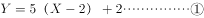

联立①②求解可得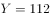，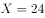。则若要每个超市分9箱促销品，需要箱。在原始基础上至少增加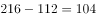箱。

故正确答案为C。

---

## 第 5 题　qid 2274473 · 数学运算

录入员小张和小李需要合作完成一项录入任务，这项任务小李一人需要8小时，小张一人需要10小时。两人在共同工作了3个小时后，小李因故回了趟家，期间小张一直在工作，小李返回后两个人又用了1个小时就完成了任务。在完成这项任务的过程中，小张比小李多工作了几个小时？

- **A**. 1　✅
- **B**. 1.5
- **C**. 2
- **D**. 2.5

**答案**：A

**官方解析**

根据题意，小张比小李多工作的时间即为小李中途回家往返所用时间，设工程总量为40（8和10的最小公倍数），则小李效率为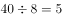，小张效率为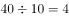，设小李中途回家花费小时，可得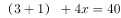，解得。

故正确答案为A。

---

## 第 6 题　qid 2274474 · 数学运算

某单位原拥有高级职称的职工占职工总数的。现又有1名职工评上了高级职称，并调入2名具有高级职称的职工，拥有高级职称的人数占总人数比重上升了7.5个百分点。该单位要想在不调入更多人的前提下，使得拥有高级职称的员工占比超过，则至少还需要有多少人评上高级职称？

- **A**. 4
- **B**. 5　✅
- **C**. 6
- **D**. 7

**答案**：B

**官方解析**

设该单位原有职工总数为，则原拥有高级职称的职工数为，根据题意可得：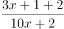，解得，此时拥有高级职称的职工数为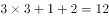人，总职工数为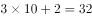人。在不调入更多人的前提下即总职工数不增加的前提下，要想拥有高级职称的员工占比超过，即超过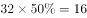人，至少为17人，则题目所求为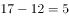人。

故正确答案为B。

---

## 第 7 题　qid 2274475 · 数学运算

小王和小张分别于早上8：00和8：30从甲地出发，匀速骑摩托车前往乙地。10：00小王到达两地的中点丙地，此时小张距丙地尚有5千米。11：00时小张追上小王。则甲、乙两地相距多少千米？

- **A**. 50
- **B**. 75
- **C**. 90
- **D**. 100　✅

**答案**：D

**官方解析**

根据题意，11：00时小张追上小王，两人起点相同，因此路程相同。根据公式：，当路程一定时，速度与时间成反比。小张8：30出发，骑行时间为2.5小时，小王8：00出发，骑行时间为3小时。则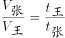。设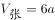，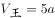。

计算a的数值可以有两种方法：

方法一：10：00时，小王到达丙地，小张距离丙地还有5千米，即小张骑行1.5小时的路程比小王骑行2小时少5千米，因此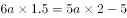，解得千米/小时。

方法二：10：00时，小王到达丙地，小张距离丙地还有5千米，11：00时，小张追上小王。即1小时小张比小王多骑行5千米。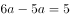，即千米/小时。

小王骑行2小时，走了甲乙两地距离的一半，因此甲乙两地相距：千米。

故正确答案为D。

---

## 第 8 题　qid 2274477 · 数学运算

右图中ABCD为边长10米的正方形路线，E为AD中点，F为与B相距3米的BC上一点，从E点到F点有小路EGHF，小路的每一段都与AB垂直或平行，且GH相距2米。甲经EABF从E点匀速运动到F点用时9秒，则其以相同速度经EGHF从E点匀速运动到F点用时多少秒？

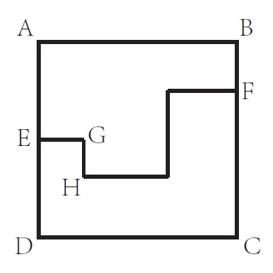

- **A**. 12
- **B**. 10
- **C**. 9
- **D**. 8　✅

**答案**：D

**官方解析**

根据题意可知，正方形边长为10米，E为边AD的中点，因此AE=ED=5 米。甲经EABF从E点匀速运动到F点用时9秒，经过路程=EA+AB+BF=5+10+3=18米，则甲行进速度米/秒。

如图所示，延长EG交NL于点M，因为小路的每一段都与AB垂直或者平行，所以EG+HL+NF=AB=10米，GH=LM=2米,MN=AE-BF=5-3=2米。则甲以相同速度经EGHF从E点匀速运动到F点，所走路程=（EG+HL+NF）+GH+LM+MN=10+2+2+2=16米，所用时间秒。

故正确答案为D。

---

## 第 9 题　qid 2274479 · 数学运算

某工厂有甲、乙、丙3条生产线，每小时均生产整数件产品。其中甲生产线的效率是乙生产线的3倍，且每小时比丙生产线多生产9件产品。已知3条生产线每小时生产的产品之和不到100件且为质数，则乙生产线每小时最多可能生产多少件产品？

- **A**. 14　✅
- **B**. 12
- **C**. 11
- **D**. 8

**答案**：A

**官方解析**

题干告知甲、乙效率关系以及甲、丙效率关系，且问乙生产线每小时最多可能生产多少件产品，考虑从大到小进行代入验证。

代入A项：若乙生产线每小时生产14件，则甲生产线每小时生产，丙生产线每小时生产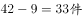，三条生产线每小时生产，89不到100且为质数，满足题意。

单选题代入排除时，确认某项正确则无需验证剩余选项。

故正确答案为A。

---

## 第 10 题　qid 2274481 · 数学运算

某学校有一笔信息化预算，用这笔预算正好可以购买16部台式电脑，或者台式电脑、笔记本电脑和投影机各4台。已知2台笔记本电脑的价格等于1部台式电脑和1部投影机的价格之和，则用这笔预算购买笔记本电脑和投影机且必须全部花完，最多可以买几台投影机？

- **A**. 5
- **B**. 8　✅
- **C**. 10
- **D**. 13

**答案**：B

**官方解析**

设台式电脑价格元，笔记本电脑价格元，投影机元。则有，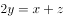，联立方程可得：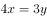，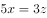。赋值为3，则，。则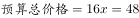。现计划用这笔预算购买笔记本电脑和投影机且必须全部花完，设购买了笔记本电脑台，投影机台，则有。根据奇偶性原则，应为不大于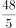的偶数。当时，，符合题意。即最多可以购买8台投影机。

故正确答案为B。

---

## 第 11 题　qid 2274482 · 数学运算

某企业有甲和乙两个研发部门。其中甲部门有的员工有海外留学经历，乙部门有的员工有海外留学经历。已知甲部门员工比乙部门多20人，则两个研发部门最少可能有多少人没有海外留学经历？

- **A**. 132
- **B**. 146　✅
- **C**. 160
- **D**. 174

**答案**：B

**官方解析**

根据“······最少可能有多少人······”可知，甲乙两部门员工数应尽可能的少。甲部门海外留学员工人数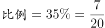，乙部门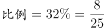，则甲、乙两部门总人数应分别是20、25的倍数。有：

当乙部门人数为25人时，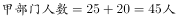，不是20的倍数，排除；

当乙部门人数为50人时，，不是20的倍数，排除；

当乙部门人数为75人时，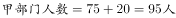，不是20的倍数，排除；

当乙部门人数为100人时，人，是20的倍数，满足。

则甲部门120人，其中海外留学，乙部门100人，其中海外留学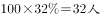，两个研发部门最少有人没有海外留学经历。

故正确答案为B。

---

## 第 12 题　qid 2274487 · 数学运算

有一个六面体如右图所示，六个面上分别写着1、2、3、4、5、6六个数字，其顶面为A，四个侧面分别为B、C、D、E，底面为F。A、B和C上的数字之和为，A、D、E上的数字之和为。已知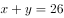，则A面和F面的数字之和为

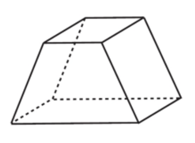

- **A**. 9
- **B**. 8
- **C**. 7　✅
- **D**. 6

**答案**：C

**官方解析**

根据题意，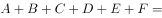，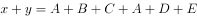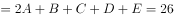，两式相减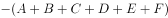，6个数字中两数相减为5的只有符合要求。故A面为6，F面为1，A面和F面数字之和。

故正确答案为C。

---

## 第 13 题　qid 2274488 · 数学运算

机关运动会上，来自3个单位的参赛者正好站成、到共9个方阵，且每个方阵的人都来自同一个单位。已知来自甲单位的人组成了1个方阵，来自乙单位的人组成了6个方阵，且乙单位的参赛者正好是丙单位的2倍。则乙单位有多少名参赛者？

- **A**. 108
- **B**. 136　✅
- **C**. 166
- **D**. 184

**答案**：B

**官方解析**

根据题意，每个方阵人数分别为：1、4、9、16、25、36、49、64、81，丙单位参赛者组成个方阵。乙单位的参赛者正好是丙单位的2倍，代入选项，逐一验证：

A项，若乙单位参赛者108人，则丙为54人，验证可知任何两个方阵的人数和都不是54，排除；

B项，若乙单位136人，则丙为68人，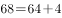，故64人和4人这两个方阵属于丙，甲方阵人数为，满足条件，当选；

C项，若乙单位166人，则丙为83人，验证可知任何两个方阵的人数和都不是83，排除；

D项，若乙单位184人，则丙为92人，验证可知任何两个方阵的人数和都不是92，排除。

故正确答案为B。

---

## 第 14 题　qid 2274489 · 数学运算

某次知识竞赛的决赛有3人参加，共有12道题。规则为每题由1人以抢答方式答题，其余2人不作答。每道题正确得8分，错误扣10分。如所有人均回答了问题，且得分均为正数，则3人得分之和的最小值：

- **A**. 低于10分
- **B**. 在10～15分之间
- **C**. 在16～20分之间
- **D**. 高于20分　✅

**答案**：D

**官方解析**

根据条件，每答对1题得8分，答错1题扣10分，由于每人都答过题，因此要想每人得分为正数，则每人答对的题目数量一定大于答错的数量，即每个人答对的题目数比答错的至少多1道。三个人答对的总数比答错的总数至少多3道，由于一共12题，要求得分之和最少，只可能为答对8题，答错4题。分。

故正确答案为D。

---

## 第 15 题　qid 2274490 · 数学运算

早上7点之前，某小区门口停有100辆共享单车。7点开始，每20秒就有一辆共享单车被骑走。共享单车企业雇佣三轮车从附近的地铁站将无人使用的车辆拉到小区门口，7点拉来第一趟，往后每15分钟拉一趟，每趟拉来30辆共享单车。则下列哪个时间段会出现小区门口没有共享单车的情况？（不存在共享单车损坏和被骑来小区门口的情况）

- **A**. 8点21分至25分
- **B**. 8点36分至40分
- **C**. 8点41分至45分　✅
- **D**. 8点46分至50分

**答案**：C

**官方解析**

根据题意，7点时，小区门口共辆共享单车，每15分钟骑走，拉来30辆，分钟后即8点30分，剩余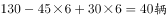，需要分钟全部骑走，此时下一趟车（8点45分）还未拉来，故小区门口没有共享单车的情况出现在8点41分至45分时间段内。

故正确答案为C。

---
