# 2019年四川省公务员录用考试《行测》题（下半年）（网友回忆版）

> 数量关系 · 10 题 · 四川 2019

## 第 1 题　qid 2444678 · 数学运算

某单位乒乓球、羽毛球、篮球三个兴趣小组共有72人参加。已知同时参加3个小组的人数为0，只参加羽毛球小组的人数是只参加乒乓球小组人数的4倍，只参加篮球小组的有11人，同时参加两个小组的人数与只参加1个小组的人数相同，参加乒乓球小组但未参加篮球小组的人中有一半参加羽毛球小组。问参加包括篮球在内的两个小组的有：

- **A**. 32人
- **B**. 31人　✅
- **C**. 25人
- **D**. 24人

**答案**：B

**官方解析**

由题意可知，不存在同时参加三个小组的人，且只参加一个小组的人数与参加两个小组的人数相同，故只参加一个小组参加两个小组，则二者均为36人。设只参加乒乓球小组的人数为x，则只参加羽毛球小组的人数为4x，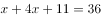，解得人，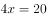人。参加乒乓球但未参加篮球小组的人数，即为只参加乒乓球的人数参加乒乓球羽毛球两个小组的人数，其中一半参加了羽毛球小组，则参加乒乓球羽毛球两个小组的人数也为5人。参加包括篮球在内的两个小组人数为参加两个小组的人数参加乒乓球羽毛球两个小组的人数人。

故正确答案为B。

---

## 第 2 题　qid 2444714 · 数学运算

某知识竞赛共50道单项选择题，小李和小王从中各自随机选择48道题作答。问他们未选的两道题相同的概率是：

- **A**. 
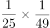
　✅
- **B**. 

- **C**. 
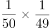

- **D**. 
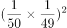

**答案**：A

**官方解析**

50题中选择48题作答，2道未答的情况数为，则小李、小王选择的情况数为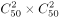。两人未选的两道题相同，此时情况数为，则满足题意的概率为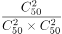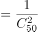。

故正确答案为A。

---

## 第 3 题　qid 2444721 · 数学运算

如图，沙漏计时器由上下两个大小相同、相互连通且底面互相平行的圆锥组成，下面的圆锥内装有细沙。计时开始时，将沙漏倒置，已知上面圆锥中细沙全部流下恰好需要1小时，则细沙高度下降一半所需的时间是：

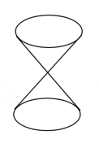

- **A**. 30分钟
- **B**. 45分钟
- **C**. 47.5分钟
- **D**. 52.5分钟　✅

**答案**：D

**官方解析**

细沙高度下降一半时，此时剩余细沙部分的圆锥与整个圆锥的高度之比为1：2，两个圆锥为相似图形，因此，两个圆锥的底面半径之比也为1：2，则底面积之比为1：4。根据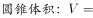，可得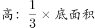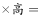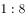。可知已经下降的细沙占所有细沙的比例为，下降需用时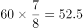分钟。

故正确答案为D。

---

## 第 4 题　qid 2444724 · 数学运算

甲地有一批100吨的装修材料需运到乙地，大卡车载重量为13吨，小货车载重量为5吨，大卡车一次运费为1000元，小货车一次运费为500元。如要求所有货物正好装满整数车，则运费最低为多少元？

- **A**. 8500　✅
- **B**. 9000
- **C**. 9500
- **D**. 10000

**答案**：A

**官方解析**

首先比较两种车运输单位重量材料所需要的运费，大卡车：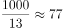元/吨，小货车：元/吨，故用大卡车运输更划算，即在满载货物的前提下多使用大卡车。

设大卡车x辆，小货车y辆。则有：， x、y全部取整。

因5y尾数为0或5，则13x的尾数也应为0或5，则x取0或5，因为要多使用大卡车，故x取最大值为5，此时，最少需要元运费。

故正确答案为A。

---

## 第 5 题　qid 2444727 · 数学运算

AB两点间有一条直线跑道，甲从A点出发，乙从B点出发，两人同时开始匀速在两点之间往返跑步。第一次迎面相遇时离A点1000米，第三次迎面相遇时离B点200米，此时甲到达B点2次，乙到达A点1次，问AB两点间跑道的长度是多少米？

- **A**. 1400
- **B**. 1500
- **C**. 1600　✅
- **D**. 1700

**答案**：C

**官方解析**

设AB两地路程为S。甲从A点出发，乙从B点出发，两人第一次相遇时，甲走了1000米；等到第三次相遇时，相遇点离B点200米，甲到达B点2次，即甲走了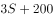米。根据直线两端多次相遇的公式，相遇N次两人一起走了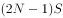，则第一次迎面相遇两人一起走了S，第三次迎面相遇两人一起走了5S，两次总路程之比为1：5。由于速度均保持不变，因此对甲来说，两次相遇走过的路程之比也为1：5，有：，解得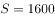米。

故正确答案为C。

---

## 第 6 题　qid 2444728 · 数学运算

某商场做促销活动，一次性购物不超过500元的打九折优惠；超过500元的，其中500元打九折优惠，超过500元部分打八折优惠。小张购买的商品需付款490元，小李购买的商品比原价优惠了120元。如两人一起结账，比分别结账可节省多少元钱？

- **A**. 10
- **B**. 20
- **C**. 30
- **D**. 50　✅

**答案**：D

**官方解析**

若一次性购物500元，则打九折优惠需要元，小张付款490元，即说明购买的商品超过500元。同理，小李购买的商品总价格也超过了500元。当两人一起结账时，小李的商品价格继续比原价优惠了120元，没有变化，而小张的商品超过500元的部分继续打8折，没有变化，但低于500的部分，之前打9折，现在打8折，可以节省元。

故正确答案为D。

---

## 第 7 题　qid 2444729 · 数学运算

一本杂志不超过200页，其中最后一页为广告，往前隔页为连续2页广告，再往前隔页为连续3页广告，以此类推，最后往前隔1页为连续页广告。问这本杂志最多有多少页广告？

- **A**. 91
- **B**. 96
- **C**. 105　✅
- **D**. 120

**答案**：C

**官方解析**

根据题意，从最后一页的广告开始往前查看的话，广告页和非广告页的页数分布如下图：

则这本杂志除最后一页外，共有广告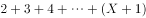页，即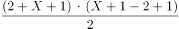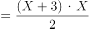页；共有非广告页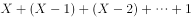页，即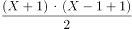页，则这本杂志共有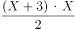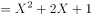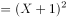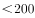页。因杂志页数为整数，且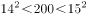，因此，的最大值为13，此时这本杂志的广告页页。

故正确答案为C。

拓展：等差数列的求和公式为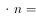。

---

## 第 8 题　qid 2444731 · 数学运算

某场科技论坛有5G、人工智能、区块链、大数据和云计算5个主题，每个主题有2位发言嘉宾。如果要求每个主题的嘉宾发言次序必须相邻，问共有多少种不同的发言次序？

- **A**. 120
- **B**. 240
- **C**. 1200
- **D**. 3840　✅

**答案**：D

**官方解析**

根据题意，要求每个主题的嘉宾发言次序必须相邻，可先对每个主题发言的嘉宾顺序进行排列，再对5个主题的发言顺序进行排列，则总共的发言顺序有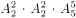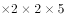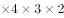种。

故正确答案为D。

---

## 第 9 题　qid 2444737 · 数学运算

小王的汽车每年基础保险费用为4500元，由于购车后从未出险理赔，目前按基础保险费用的收取保费。近日小王停车时撞到其他车辆，自行修理两辆车需元，如果由保险公司全额赔付，则未来3年内保费折扣分别变更为基础保险费用的、和。问在超过多少元时，出险理赔比自行修理更划算？

- **A**. 1350
- **B**. 1800
- **C**. 3375　✅
- **D**. 3825

**答案**：C

**官方解析**

根据题意，当小王选择自行修理时，未来三年的基础保险费用及修车费用共为；当小王选择出险理赔时，未来三年的基础保险费用为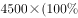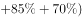。则当时，出险理赔更划算，此时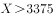，则当超过3375元时，出险理赔比自行修理更划算。

故正确答案为C。

---

## 第 10 题　qid 2444740 · 数学运算

将一块边长为1米的正方体石材挖空制成下图所示的工艺品，其每个棱的宽度都是0.1米。将该工艺品的整个表面进行磨光处理，每平方厘米的磨光费用为1元，问磨光总费用在以下哪个范围内？

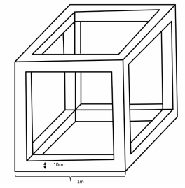

- **A**. 不到3万元
- **B**. 3～3.5万元之间
- **C**. 3.5～4万元之间
- **D**. 4万元以上　✅

**答案**：D

**官方解析**

根据题意，要求总费用需计算该工艺品的表面积，该工艺品共有6个面，每个面外框的表面积为：平方米；每个面内框的表面积为：平方米。则这个工艺品的表面积为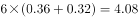平方米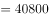平方厘米，磨光总费用为元，为4万元以上。

故正确答案为D。

---
