# 2019年国家公务员录用考试《行测》题（副省级网友回忆版）

> 数量关系 · 15 题 · 国考 2019

## 第 1 题　qid 2264454 · 数学运算

一个圆形的人工湖，直径为50公里，某游船从码头甲出发，匀速直线行驶30公里到码头乙停留36分钟，然后到与码头甲直线距离为50公里的码头丙，共用时2小时。问该游船从码头甲直线行驶到码头丙需用多少时间？

- **A**. 50分钟
- **B**. 1小时　✅
- **C**. 1小时20分
- **D**. 1小时30分

**答案**：B

**官方解析**

如图所示，游船最终到达与甲直线距离为50公里的丙地，因圆形人工湖的直径同为50公里，可得甲丙直线距离即为圆的直径。根据圆周角定理推理，直径所对的圆周角是直角，则为直角三角形。

因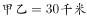，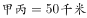，根据勾股定理可得。除去停留时间36分钟，游船由甲至乙再至丙，共用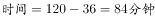。因此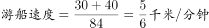，则从甲至丙直线行驶所花，即1小时。

故正确答案为B。

---

## 第 2 题　qid 2264456 · 数学运算

某工厂有4条生产效率不同的生产线，甲、乙生产线效率之和等于丙、丁生产线效率之和。甲生产线月产量比乙生产线多240件，丙生产线月产量比丁生产线少160件，问乙生产线月产量与丙生产线月产量相比：

- **A**. 乙少40件　✅
- **B**. 丙少80件
- **C**. 乙少80件
- **D**. 丙少40件

**答案**：A

**官方解析**

根据题干条件可知，

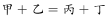······①；

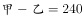，即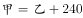······②；

，即······③；

将②式与③式代入到①式当中，可得：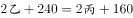，化简得：，即与丙相比，乙少40件。

故正确答案为A。

---

## 第 3 题　qid 2264386 · 数学运算

从A市到B市的机票如果打6折，包含接送机出租车交通费90元、机票税费60元在内的总乘机成本是机票打4折时总乘机成本的1.4倍。问从A市到B市的全价机票价格（不含税费）为多少元？

- **A**. 1200
- **B**. 1250
- **C**. 1500　✅
- **D**. 1600

**答案**：C

**官方解析**

根据题意，乘机总成本包括机票价格（不含税费）、交通费和机票税费。设从A市到B市的全价机票价格（不含税费）为元。根据两次折扣的1.4倍关系可列式：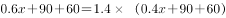，解得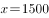元。

故正确答案为C。

---

## 第 4 题　qid 2264405 · 数学运算

甲车上午8点从A地出发匀速开往B地，出发30分钟后乙车从A地出发以甲车2倍的速度前往B地，并在距离B地10千米时追上甲车。如乙车9点10分到达B地，问甲车的速度为多少千米/小时？

- **A**. 30　✅
- **B**. 36
- **C**. 45
- **D**. 60

**答案**：A

**官方解析**

设甲车的速度为千米/小时，乙车的速度为甲车的2倍即千米/小时。甲车出发30分钟即小时后乙车开始追，则两车的路程差为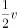千米，由追及公式“”可得，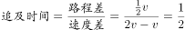小时。乙车在上午8点的30分钟后出发，9点10分到达B地，共用时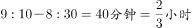。设乙在C点追上甲，则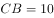千米，乙车从C地到B地用时小时。则乙车的速度=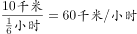，甲车的速度。

故正确答案为A。

---

## 第 5 题　qid 2264383 · 数学运算

有100名员工去年和今年均参加考核，考核结果分为优、良、中、差四个等次。今年考核结果为优的人数是去年的1.2倍，今年考核结果为良及以下的人员占比比去年低15个百分点。问两年考核结果均为优的人数至少为多少人？

- **A**. 55
- **B**. 65　✅
- **C**. 75
- **D**. 85

**答案**：B

**官方解析**

设去年考核结果为优的有人，则今年考核结果为优的为人。根据题意，两年总人数均为100，则今年考核结果为良及以下的人员比去年少了人，即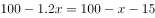。解方程得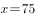，则今年获优的有人。根据两集合容斥原理，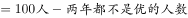，要“两年都为优的人数”最少，则“两年都不是优的人数”取最小数0，此时两年考核结果均为优的人数人。

故正确答案为B。

---

## 第 6 题　qid 2264458 · 数学运算

A和B两家企业2018年共申请专利300多项，其中A企业申请的专利中是发明专利，B企业申请的专利中，发明专利和非发明专利之比为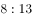。已知B企业申请的专利数量少于A企业，但申请的发明专利数量多于A企业。问两家企业总计最少申请非发明专利多少项？

- **A**. 250
- **B**. 255
- **C**. 237　✅
- **D**. 242

**答案**：C

**官方解析**

已知A企业申请的专利中是发明专利，即，则A企业申请的专利数为100的整数倍。又已知B企业申请的专利数量少于A企业，两者专利数量之和为300多，则A企业申请的专利为200项或300项。分类讨论：

若A企业申请的专利为200项，则此时A企业的发明专利为项。根据B企业申请的发明专利数量多于A企业且B企业，说明B企业发明专利为8的整数倍且多于54，故B企业发明专利至少有56项，此时B企业非发明专利为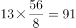项，因此两家企业申请非发明专利项数最少为；

若A企业申请的专利为300项，则此时A企业的发明专利为项。根据B企业申请的发明专利数量多于A企业且B企业，说明B企业发明专利为8的整数倍且多于81，故B企业发明专利至少有88项，相应的B的专利总数为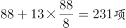，则此时A、B企业的专利总数为531项，不满足总数为300多项，与题意矛盾，错误。

综上所述，两家企业申请非发明专利数最少为237项。

故正确答案为C。

备注：实际考试中只需要算出第一种情况的结果为237项，对比选项发现237已经是选项中最少的结果了，故不可能有更小的情况，无需再讨论第二种情况。

---

## 第 7 题　qid 2264416 · 数学运算

甲和乙两条自动化生产线同时生产相同的产品，甲生产线单位时间的产量是乙生产线的5倍，甲生产线每工作1小时就需要花3小时时间停机冷却而乙生产线可以不间断生产。问以下哪个坐标图能准确表示甲、乙生产线产量之差（纵轴L）与总生产时间（横轴T）之间的关系？

- **A**. 
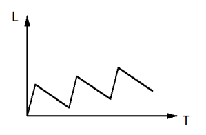
　✅
- **B**. 
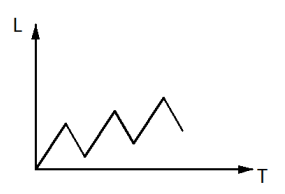

- **C**. 

- **D**. 
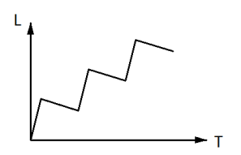

**答案**：A

**官方解析**

根据“甲生产线单位时间的产量是乙生产线的5倍”赋值甲的效率为5，乙的效率为1。根据题意，甲生产线工作1小时，休息3小时，而乙生产线持续工作，可得下表：

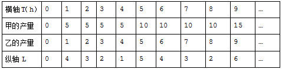

观察表格可知，每4小时为一个变化周期。

先看变化趋势：每个周期前1个小时产量之差不断增大，后3小时产量之差不断减小，排除C项；

再看拐点对应时长（横轴T）：每个周期增加过程所对应时长与下降过程所对应时长之比为1：3，排除B项；

最后看对应高度（纵轴L）：每个周期都是升4再降3，下降值大于上升值的一半，排除D项。

故正确答案为A。

---

## 第 8 题　qid 2264398 · 数学运算

小张和小王在同一个学校读研究生，每天早上从宿舍到学校有6：40、7：00、7：20和7：40发车的4班校车。某星期周一到周三，小张和小王都坐班车去学校，且每个人在3天中乘坐的班车发车时间都不同。问这3天小张和小王每天都乘坐同一趟班车的概率在：

- **A**. 
以下

- **B**. 
之间

- **C**. 
之间
　✅
- **D**. 
以上

**答案**：C

**官方解析**

3天中乘坐的班车发车时间都不同，每人需在四趟班车内依次选三趟乘坐，有种情况。两人在3天中乘坐的班车发车时间都不同的总情况数有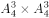种，若要求两人每天都乘坐同一趟班车，则其中一人选定之后，另一人只能与他的选择方式相同，有种情况。故这3天小张和小王每天都乘坐同一趟班车的概率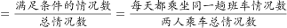。

故正确答案为C。

---

## 第 9 题　qid 2264409 · 数学运算

有甲、乙、丙三个工作组，已知乙组2天的工作量与甲、丙共同工作1天的工作量相同。A工程如由甲、乙组共同工作3天，再由乙、丙组共同工作7天，正好完成。如果三组共同完成，需要整7天。B工程如丙组单独完成正好需要10天，问如由甲、乙组共同完成，需要多少天？

- **A**. 不到6天
- **B**. 6天多
- **C**. 7天多　✅
- **D**. 超过8天

**答案**：C

**官方解析**

根据题意，甲、乙、丙三者的效率满足以下关系：

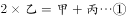

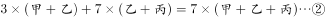

②式整理可得：，即。赋值，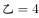，代入①式可得：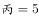。则B工程的工作量为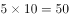，如由甲、乙共同完成需要天，即7天多。

故正确答案为C。

---

## 第 10 题　qid 2264461 · 数学运算

甲、乙两辆卡车运输一批货物，其中甲车每次能运输35箱货物。甲车先满载运输2次后，乙车加入并与甲车共同满载运输10次完成任务，此时乙车比甲车多运输10箱货物。问如果乙车单独执行整个运输任务且每次都尽量装满，最后一次运多少箱货物？

- **A**. 10
- **B**. 30
- **C**. 33　✅
- **D**. 36

**答案**：C

**官方解析**

由题意可知，甲车前两次共运输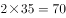箱货物，后乙车加入后，共同满载10次完成任务，此时乙车比甲车多运输10箱货物，因此可得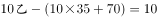，解得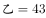箱货物，该批货物总量为，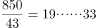，即全部由乙车运输，最后一次运33箱货物。

故正确答案为C。

---

## 第 11 题　qid 2264411 · 数学运算

某单位有2个处室，甲处室有12人，乙处室有20人。现在将甲处室最年轻的4人调入乙处室，则乙处室的平均年龄增加了1岁，甲处室的平均年龄增加了3岁。问在调动之前，两个处室的平均年龄相差多少岁？

- **A**. 8
- **B**. 12　✅
- **C**. 14
- **D**. 15

**答案**：B

**官方解析**

设调动前甲处室的平均年龄为岁，乙处室的平均年龄为岁，则调动后甲处室的平均年龄为岁，乙处室的平均年龄为岁。根据调动前后甲、乙两处室的年龄之和不变，可列式：，解得，所以调动前两个处室的平均年龄差为12岁。

故正确答案为B。

---

## 第 12 题　qid 2264420 · 数学运算

花圃自动浇水装置的规则设置如下：
①每次浇水在中午12:00~12:30之间进行；
②在上次浇水结束后，如连续3日中午12:00气温超过30摄氏度，则在连续第3个气温超过30摄氏度的日子中午12:00开始浇水；
③如在上次浇水开始120小时后仍不满足条件②，则立刻浇水。
已知6月30日12:00~12:30该花圃第一次自动浇水，7月份该花圃共自动浇水8次，问7月至少有几天中午12:00的气温超过30摄氏度？

- **A**. 18
- **B**. 12
- **C**. 20
- **D**. 15　✅

**答案**：D

**官方解析**

根据题意，若要使7月份中午气温超过30摄氏度的天数尽可能少，则应同时满足两个条件：（1）超过30摄氏度的日子均以连续3天的方式出现；（2）未超过30摄氏度的日子均以连续天的方式出现。

题干问“至少”，从最小的选项开始代入。

C项：若超过30摄氏度的日子有12天，则未超过30摄氏度的日子有天。根据规则②可知，12天中浇水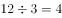次；根据规则③可知，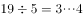，即19天中浇水3次。次，与“浇水8次”矛盾，排除；

D项：若超过30摄氏度的天数为15天，则未超过30摄氏度的天数为天。根据规则②可知，15天中浇水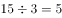次；根据规则③可知，，即16天中浇水3次，次。满足题意，当选。

故正确答案为D。

---

## 第 13 题　qid 2264406 · 数学运算

甲和乙进行5局3胜的乒乓球比赛，甲每局获胜的概率是乙每局获胜概率的1.5倍。问以下哪种情况发生的概率最大？

- **A**. 比赛在3局内结束　✅
- **B**. 乙连胜3局获胜
- **C**. 甲获胜且两人均无连胜
- **D**. 乙用4局获胜

**答案**：A

**官方解析**

根据“甲每局获胜的概率是乙每局获胜概率的1.5倍”，设乙的概率为，则甲的概率为，由，解得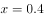，即甲获胜的概率为0.6，乙为0.4。

A项：比赛在3局内结束，有两种情况：①甲连胜3局，概率；②乙连胜3局，概率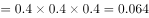。故A项总概率。

B项：乙连胜3局获胜，有三种情况：①乙前3局连胜，概率；②乙第2、3、4局连胜，概率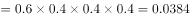；③乙第3、4、5局连胜，概率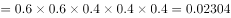；故B项总概率。

C项：甲获胜且两人均无连胜，只有一种情况，即甲获胜三局且分别是第1、3、5局获胜，概率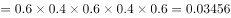。

D项：乙用4局获胜，则第四局必然是乙获胜，且前三局中乙有两局获胜，因此概率。

故正确答案为A。

---

## 第 14 题　qid 2264418 · 数学运算

某单位要求职工参加20课时线上教育课程，其中政治理论10课时，专业技能10课时。可供选择的政治理论课共8门，每门2课时；可供选择的专业技能课共10门，其中2课时的有5门，1课时的有5门。问可选择的课程组合共有多少种？

- **A**. 5656　✅
- **B**. 5600
- **C**. 1848
- **D**. 616

**答案**：A

**官方解析**

根据题意，政治理论课在8门中选5门即可达到10课时，一共有：种情况。专业技能课若要达到10课时，可分为以下3类：①2课时的课5门全选，情况数为1种；②2课时的课选4门，1课时的课选2门，情况数为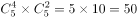种；③2课时的课选3门，1课时的课选4门，情况数为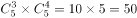种，故选专业技能课的情况数为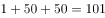种。所以可选择的课程组合共有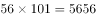种。

故正确答案为A。

---

## 第 15 题　qid 2264463 · 数学运算

园丁将若干同样大小的花盆在平地上摆放为不同的几何图形，发现如果增加5盆，就能摆成实心正三角形。如果减少4盆，就能摆成每边多于1个花盆的实心正方形。问将现有的花盆摆成实心矩形，最外层最少有多少盆花？

- **A**. 28
- **B**. 26
- **C**. 24
- **D**. 22　✅

**答案**：D

**官方解析**

假设组成的实心正三角形每个边有个花盆，则原有花盆数量为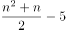。减少4盆后，数量为，可组成一个实心正方形（每个边至少2个花盆），可判定其为平方数。要想最外层花的盆数少，则原有花盆数应尽可能少，即的值应尽可能小，取值验证。

若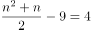，为非整数，排除；

若，为非整数，排除；

若，为非整数，排除；

若，为非整数，排除；

若，为9，满足。此时原有花盆。

当花盆共有40个时，设实心矩形长宽，则。要让最外层的花盆数最少，即长宽和最少。根据数学知识“当为定值时，与越接近，其和越小”，则当、时，其长宽和最小。

对最外层花盆计数时，每个端点的花盆会重复计数，故最外层的。

故正确答案为D。

---
