# 2019年广东省公务员录用考试《行测》题（乡镇卷）（网友回忆版）

> 数量关系 · 15 题 · 广东 2019

## 第 1 题　qid 2374845 · 数学运算

4  7  10  13  （    ）

- **A**. 15
- **B**. 16　✅
- **C**. 17
- **D**. 18

**答案**：B

**官方解析**

观察数列，此数列是公差为3的等差数列，所求项为。

故正确答案为B。

---

## 第 2 题　qid 2374847 · 数学运算

5  9  17  33  （    ）

- **A**. 35
- **B**. 45
- **C**. 65　✅
- **D**. 85

**答案**：C

**官方解析**

数列起伏较小，首先考虑作差。作差后得到新数列：4、8、16、（ ），是公比为2的等比数列，故括号内应为32。题干所求项为。

故正确答案为C。

---

## 第 3 题　qid 2374848 · 数学运算

5  15  45  135  （    ）

- **A**. 185
- **B**. 225
- **C**. 355
- **D**. 405　✅

**答案**：D

**官方解析**

观察数列，此数列是公比为3的等比数列，所求项为。

故正确答案为D。

---

## 第 4 题　qid 2374849 · 数学运算

64  32  16  8  （    ）

- **A**. 4　✅
- **B**. 5
- **C**. 6
- **D**. 7

**答案**：A

**官方解析**

观察数列，此数列是公比为的等比数列，所求项为。

故正确答案为A。

---

## 第 5 题　qid 2374850 · 数学运算

        （    ）

- **A**. 

　✅
- **B**. 

- **C**. 
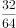

- **D**. 

**答案**：A

**官方解析**

观察数列特征，此数列为分数数列。分别观察分子分母的规律，分子为1、3、5、7，是公差为2的等差数列，下一项为；分母为2、4、8、16，是公比为2的等比数列，下一项为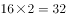。题干所求项为。

故正确答案为A。

---

## 第 6 题　qid 2374851 · 数学运算

乡镇干部小李今天有3项不同的工作要完成，则他今天完成工作的顺序共有（    ）种。

- **A**. 3
- **B**. 4
- **C**. 5
- **D**. 6　✅

**答案**：D

**官方解析**

3项不同的工作进行全排列，则他今天完成工作的顺序有种。

故正确答案为D。

---

## 第 7 题　qid 2374704 · 数学运算

某机构计划在一块边长为18米的正方形空地开展活动，需要在空地四边每隔2米插上一面彩旗，若该空地的四个角都需要插上彩旗，那么一共需要（    ）面彩旗。

- **A**. 32
- **B**. 36　✅
- **C**. 44
- **D**. 48

**答案**：B

**官方解析**

根据植树问题环形植树公式：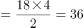。那么一共需要36面彩旗。

故正确答案为B。

注：正方形是一个闭合的图形，可看成环形。

---

## 第 8 题　qid 2374838 · 数学运算

在一次知识竞赛中，甲、乙两单位平均分为85分，甲单位得分比乙单位高10分，则乙单位得分为（    ）分。

- **A**. 88
- **B**. 85
- **C**. 80　✅
- **D**. 75

**答案**：C

**官方解析**

假设乙单位得分为，甲单位得分为，则总分为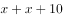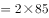，解得分。

故正确答案为C。

---

## 第 9 题　qid 2374840 · 数学运算

某文印室有30袋A4纸和20袋B3纸。由于工作需要，该文印室每天都会用掉6袋A4纸和2袋B3纸，则三天后文印室的B3纸比A4纸多（    ）袋。

- **A**. 1
- **B**. 2　✅
- **C**. 3
- **D**. 4

**答案**：B

**官方解析**

根据题意，三天后，B3纸还剩下袋，A4纸还剩下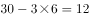袋，题目所求为袋。

故正确答案为B。

---

## 第 10 题　qid 2374841 · 数学运算

某单位男女干部人数相等，男干部中有基层工作经历，女干部中有基层工作经历。则在该单位全体干部中，有基层工作经历的占（    ）。

- **A**. 

　✅
- **B**. 

- **C**. 

- **D**. 

**答案**：A

**官方解析**

假设该单位男女干部人数均为10人，则有基层工作经历的男干部人数为人，有基层工作经历的女干部人数为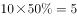人，则在单位全体干部中，有基层工作经历的占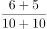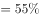。

故正确答案为A。

---

## 第 11 题　qid 2374842 · 数学运算

某商场为了提高销量，以七五折销售笔记本电脑，打折后销售3600元。则该笔记本原价为每台（    ）元。

- **A**. 4200
- **B**. 4500
- **C**. 4800　✅
- **D**. 5100

**答案**：C

**官方解析**

根据题意，笔记本原价元。

故正确答案为C。

---

## 第 12 题　qid 2374734 · 数学运算

某办公室有大、中、小三种型号的文件袋共200个，已知大号文件袋数量是中号文件袋的2倍，小号文件袋的数量为50个，那么大号文件袋有（    ）个。

- **A**. 50
- **B**. 60
- **C**. 80
- **D**. 100　✅

**答案**：D

**官方解析**

设中号文件袋数量为，则大号文件袋数量为。根据题意有：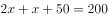，解得，则大号文件袋数量为。

故正确答案为D。

---

## 第 13 题　qid 2374712 · 数学运算

甲乙两人绕着周长为600米的环形跑道跑步，他们从相同的起点同时同向起跑。已知甲的速度为每秒4米，乙的速度为每秒3米，则当甲第一次回到起点时，乙距离起点还有（    ）米。

- **A**. 100
- **B**. 150　✅
- **C**. 200
- **D**. 250

**答案**：B

**官方解析**

根据题意，环形跑道600米，甲的速度为每秒4米，可得当甲第一次回到起点的时间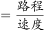秒。乙的速度为每秒3米，乙在150秒时跑的路程米。因此乙距离起点还有米。

故正确答案为B。

---

## 第 14 题　qid 2374844 · 数学运算

小王距离单位1.2公里，每天步行上班。速度为每分钟100米，则他上班需要花（    ）分钟。

- **A**. 12　✅
- **B**. 15
- **C**. 18
- **D**. 20

**答案**：A

**官方解析**

小王距离单位1.2公里即1200米，故他上班需要花的时间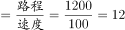分钟。

故正确答案为A。

---

## 第 15 题　qid 2374846 · 数学运算

甲施工队每天能完成某项工程的，乙施工队施工效率是甲施工队的两倍，则甲、乙两队同时施工（    ）天就能完成该工程。

- **A**. 2
- **B**. 3　✅
- **C**. 4
- **D**. 5

**答案**：B

**官方解析**

赋值工作总量为9，则甲队施工效率，乙队施工效率为。甲乙两队同时施工，完成该工程需要的时间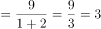天。

故正确答案为B。

---
