# 2019年广东省公务员录用考试《行测》题（县级卷）（网友回忆版）

> 数量关系 · 15 题 · 广东 2019

## 第 1 题　qid 2374677 · 数学运算

120  60  20  5  （    ）

- **A**. 1　✅
- **B**. 2
- **C**. 3
- **D**. 4

**答案**：A

**官方解析**

数列前后两项之间存在明显的倍数关系，前项除以后项得到新数列：2、3、4、（ ），是自然数数列，则新数列括号内应为5，故题干所求项为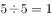。

故正确答案为A。

---

## 第 2 题　qid 2374681 · 数学运算

2  9  11  20  31  （    ）

- **A**. 39
- **B**. 43
- **C**. 47
- **D**. 51　✅

**答案**：D

**官方解析**

数列无明显特征，观察相邻项关系有：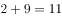、、，即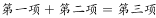。故题干所求项。

故正确答案为D。

---

## 第 3 题　qid 2374684 · 数学运算

24  32  41  51  62  （    ）

- **A**. 72
- **B**. 74　✅
- **C**. 76
- **D**. 78

**答案**：B

**官方解析**

数列无明显特征，优先考虑作差。作差后得到新数列：8、9、10、11、（ ），是自然数数列，则新数列下一项为12，故题干所求项为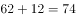。

故正确答案为B。

---

## 第 4 题　qid 2374686 · 数学运算

1  1  2  6  24  （    ）

- **A**. 86
- **B**. 112
- **C**. 120　✅
- **D**. 144

**答案**：C

**官方解析**

数列前后两项之间存在明显的倍数关系，后项除以前项得到新数列：1、2、3、4、（ ），是自然数数列，则新数列括号内应为5，题干所求项应为。

故正确答案为C。

---

## 第 5 题　qid 2374702 · 数学运算

      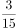  （    ）

- **A**. 

　✅
- **B**. 

- **C**. 

- **D**. 

**答案**：A

**官方解析**

数列均为分数，且多数不是最简分数，考虑对数列进行约分，原数列可转化为：、、、、（ ），分子均为1，分母是连续的自然数，则题干数列括号内分数应等于，只有A项满足。

故正确答案为A。

---

## 第 6 题　qid 2374704 · 数学运算

某机构计划在一块边长为18米的正方形空地开展活动，需要在空地四边每隔2米插上一面彩旗，若该空地的四个角都需要插上彩旗，那么一共需要（    ）面彩旗。

- **A**. 32
- **B**. 36　✅
- **C**. 44
- **D**. 48

**答案**：B

**官方解析**

根据植树问题环形植树公式：。那么一共需要36面彩旗。

故正确答案为B。

注：正方形是一个闭合的图形，可看成环形。

---

## 第 7 题　qid 2374709 · 数学运算

办公室有一些黑色和红色的签字笔，最近由于工作需要，每周都会用掉6支黑色签字笔和3支红色签字笔。3周后整理剩余物资时发现，剩下的红色签字笔的数量是黑色签字笔的2倍。则办公室原有签字笔至少（    ）支。

- **A**. 27
- **B**. 28
- **C**. 29
- **D**. 30　✅

**答案**：D

**官方解析**

根据“每周都会用掉6支黑色签字笔和3支红色签字笔”，即每周用掉支，又“3周后整理剩余物资”，3周用掉支。“剩下的红色签字笔的数量是黑色签字笔的2倍”，设剩下的黑色签字笔为支，则红色签字笔为支，则原有签字笔数量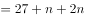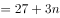，最小等于1，则原有签字笔数量至少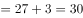，D项符合。

故正确答案为D。

---

## 第 8 题　qid 2374712 · 数学运算

甲乙两人绕着周长为600米的环形跑道跑步，他们从相同的起点同时同向起跑。已知甲的速度为每秒4米，乙的速度为每秒3米，则当甲第一次回到起点时，乙距离起点还有（    ）米。

- **A**. 100
- **B**. 150　✅
- **C**. 200
- **D**. 250

**答案**：B

**官方解析**

根据题意，环形跑道600米，甲的速度为每秒4米，可得当甲第一次回到起点的时间秒。乙的速度为每秒3米，乙在150秒时跑的路程米。因此乙距离起点还有米。

故正确答案为B。

---

## 第 9 题　qid 2374715 · 数学运算

甲、乙、丙三人加工一种零件，三人每小时一共可以加工70个零件。如果甲乙两人每小时加工的零件数之比为2:3，乙丙两人每小时加工的零件数之比为4:5，则丙每小时比甲多加工（    ）个零件。

- **A**. 8
- **B**. 10
- **C**. 14　✅
- **D**. 16

**答案**：C

**官方解析**

根据“甲乙两人每小时加工的零件数之比为2:3，乙丙两人每小时加工的零件数之比为4:5”，则甲乙丙每小时加工零件数之比为8:12:15，设甲、乙、丙三人每小时加工零件数分别为、、。再根据“三人每小时一共可以加工70个零件”得到，，解得。则丙每小时比甲多加工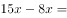个零件。

故正确答案为C。

---

## 第 10 题　qid 2374731 · 数学运算

某企业销售洗碗机，第一季度平均每个月销售800台，上半年平均每个月销售850台。如果4月份和6月份的销售总量是5月份的2倍，那么该企业5月份的洗碗机销售量为（    ）台。

- **A**. 800
- **B**. 900　✅
- **C**. 1000
- **D**. 1100

**答案**：B

**官方解析**

根据“第一季度平均每个月销售800台”，可得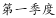；根据“上半年平均每个月销售850台”，可得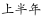。那么，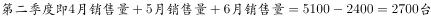。

又“4月份和6月份的销售总量是5月份的2倍”，设5月份销量为1份，则4月和6月销量之和为2份，那么该企业5月份的洗碗机销售量为。

故正确答案为B。

---

## 第 11 题　qid 2374733 · 数学运算

某物业公司规定，小区大门每2天清洁一次，消防设施每3天检查一次，绿化植物每5天养护一次，如果上述3项工作刚好都在本周四完成了，那么下一次3项工作刚好同一天完成是在（    ）。

- **A**. 星期一
- **B**. 星期二
- **C**. 星期六　✅
- **D**. 星期日

**答案**：C

**官方解析**

根据题意可知，3项工作完成的周期分别为2天、3天、5天， 2、3、5的最小公倍数为30，则下一次3项工作刚好同一天完成是在30天后。每周有7天，，星期四往后推2天为星期六。

故正确答案为C。

---

## 第 12 题　qid 2374734 · 数学运算

某办公室有大、中、小三种型号的文件袋共200个，已知大号文件袋数量是中号文件袋的2倍，小号文件袋的数量为50个，那么大号文件袋有（    ）个。

- **A**. 50
- **B**. 60
- **C**. 80
- **D**. 100　✅

**答案**：D

**官方解析**

设中号文件袋数量为，则大号文件袋数量为。根据题意有：，解得，则大号文件袋数量为。

故正确答案为D。

---

## 第 13 题　qid 2374735 · 数学运算

某工厂采购了铜和铁各30吨。假如工厂在生产过程中，每天需要消耗2吨铜和3吨铁，则在（    ）天后，剩余铜的质量将是铁的4倍。

- **A**. 6
- **B**. 7
- **C**. 8
- **D**. 9　✅

**答案**：D

**官方解析**

设x天后，剩余铜的质量将是铁的4倍。根据题意有：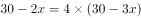，解得。

故正确答案为D。

---

## 第 14 题　qid 2374737 · 数学运算

小李今天上午有a、b、c、d这4项工作要完成，下午有e、f、g这3项工作要完成，每半天内各项工作的顺序可以随意调整，则他今天有（    ）种完成工作的顺序。

- **A**. 30
- **B**. 60
- **C**. 72
- **D**. 144　✅

**答案**：D

**官方解析**

小李上午的工作顺序共有，下午的工作顺序共有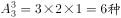，则他今天完成工作的顺序共有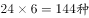。

故正确答案为D。

---

## 第 15 题　qid 2374739 · 数学运算

某小区规划建设一块边长为10米的正方形绿地。如图所示，以绿地的2个顶点为圆心，边长为半径分别作扇形，把绿地划分为不同的区域。小区现准备在图中阴影部分种植杜鹃，则杜鹃种植面积为（    ）平方米。

- **A**. 

　✅
- **B**. 

- **C**. 

- **D**. 

**答案**：A

**官方解析**

做一下割补平移，原图阴影部分面积与下图相同。则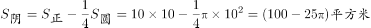。

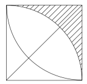

故正确答案为A。

---
