# 2019年新疆生产建设兵团面向社会招录公务员考试《行测》题（网友回忆版）

> 数量关系 · 10 题 · 新疆 2019

## 第 1 题　qid 2434228 · 数学运算

某专卖店耳机本季度进价比上季度低了，但店里仍按上季度售价销售，利润提高了。问该店上季度销售该耳机的利润率为多少？（    ）

- **A**. 

- **B**. 

- **C**. 

- **D**. 

　✅

**答案**：D

**官方解析**

赋值上季度的进价为100，则本季度进价为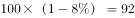。

方法一：设上季度的利润率为，则本季度利润率为。根据，且两个季度售价一样，则有，解得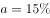。

方法二：设上季度的利润为，则本季度的利润为。根据，且利润提高了，则有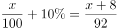，解得。则上季度利润率。

故正确答案为D。

注：本题中“利润提高”只能理解为利润率提高10个百分点，否则无答案。

---

## 第 2 题　qid 2434232 · 数学运算

某单位有两个对口扶贫地，每月需安排10人到两地参与扶贫工作，要求每个对口扶贫地区至少要有4人参与工作。问共有多少种不相同的分配方案？（    ）

- **A**. 210
- **B**. 252
- **C**. 420
- **D**. 672　✅

**答案**：D

**官方解析**

假设两个扶贫地为甲、乙，根据题意，该单位10人在两地的人数情况可分为3类：

①甲地4人、乙地6人，共有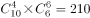种分配方法； 

②甲地5人、乙地5人，共有种分配方法；

③甲地6人，乙地4人，共有种分配方法。

则题干所求为。

故正确答案为D。

---

## 第 3 题　qid 2434236 · 数学运算

甲、乙两车分别以30公里/小时和40公里/小时的速度同时匀速从A地开往B地，丙车以50公里/小时的速度匀速从B地开往A地。A、B两地距离120公里。问丙车遇到乙车后多久会遇到甲车？（    ）

- **A**. 8分钟
- **B**. 10分钟　✅
- **C**. 12分钟
- **D**. 15分钟

**答案**：B

**官方解析**

根据题意，本题有两个相遇过程，在每个过程中两车从两端同时出发再相遇，则两车所走路程和为A、B两地的距离。根据，可得：丙车和乙车的相遇时间小时，丙车与甲车的相遇时间小时。则题干所求为小时分钟。

故正确答案为B。

---

## 第 4 题　qid 2434243 · 数学运算

某单位有四个部门共173人，其中销售部比办公室多25人；客服部比销售部少9人；技术部的人数是客服部的两倍。问客服部有多少人？（    ）

- **A**. 22
- **B**. 36　✅
- **C**. 44
- **D**. 51

**答案**：B

**官方解析**

根据题意，设客服部的人数为，则技术部的人数为、销售部为、办公室为。由于四个部门共173人，则，解得，即客服部有36人。

故正确答案为B。

---

## 第 5 题　qid 2434246 · 数学运算

某健身馆准备将一块周长为100米的长方形区域划为瑜伽场地，将一块周长为160米的长方形区域划为游泳场馆。若瑜伽场地和游泳场馆均是满足周长条件下的最大面积。问两块场地面积之差为多少平方米？（    ）

- **A**. 625
- **B**. 845
- **C**. 975　✅
- **D**. 1150

**答案**：C

**官方解析**

设瑜伽场地的长为，则宽为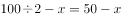，面积为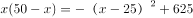，当时，面积最大，最大值为625平方米。同理，设游泳场馆的长为米,则宽为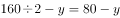，面积为，当时，面积最大，最大值为1600平方米。则题干所求为平方米。

知识扩展：若长方形的周长一定，则当长和宽相等时，面积最大。

故正确答案为C。

---

## 第 6 题　qid 2434250 · 数学运算

某超市购入800斤桃子，第一天售价为进价的1.8倍，销售额为1620元；第二天售价为进价的1.5倍，销售额为900元；第三天售价为进价的1.2倍，第四天以进价的八折销售，两天销售额均为360元；第四天营业结束后发现还剩50斤未卖出。问该超市购买桃子花了多少钱？（    ）

- **A**. 2240元
- **B**. 2400元　✅
- **C**. 2800元
- **D**. 3040元

**答案**：B

**官方解析**

根据题意，设超市购买桃子的单价为元/斤。则第一天售价为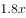元/斤；第二天为元/斤；第三天为元/斤；第四天为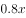元/斤。根据桃子总质量为800斤，可列方程：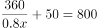，化简得：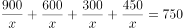，解得，则该超市买桃子共花费元。

故正确答案为B。

---

## 第 7 题　qid 2434256 · 数学运算

某机关开展红色教育月活动，三个时间段分别安排了三场讲座。该机关共有139人，有42人报名参加第一场讲座，51人报名参加第二场讲座，88人报名参加第三场讲座，三场讲座都报名的有12人，只报名参加两场讲座的有30人。问没有报名参加其中任何一场讲座的有多少人？（    ）

- **A**. 12　✅
- **B**. 14
- **C**. 24
- **D**. 28

**答案**：A

**官方解析**

设没有报名参加任何一场讲座的有人。根据三集合容斥原理非标准公式：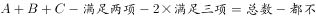，将数据代入公式得：，解得，即没有报名参加任何一场讲座的有12人。

故正确答案为A。

---

## 第 8 题　qid 2434260 · 数学运算

某文艺汇演的舞台为一个边长为10m的正六边形，节目“千手观音”中，演员需排成一列正对观众，为保证演出效果，两个演员之间要保持50cm的距离，问该舞台最多能站多少名“千手观音”的演员？（    ）

- **A**. 31
- **B**. 35　✅
- **C**. 39
- **D**. 41

**答案**：B

**官方解析**

做辅助线如下图所示，连接AC，过B点做BD垂直于AC，垂足为D。根据题意，在直角三角形ABD中，，则，由勾股定理可知，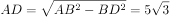，（），即舞台的列宽约为17.32m。由于演员要排成一列且间隔为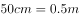，则一列最多可站演员数为，人数为整数，则取整数部分，即为35人。

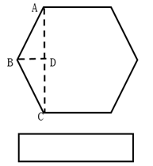

故正确答案为B。

---

## 第 9 题　qid 2434262 · 数学运算

一批药品需要检测，若第一天由甲检测，第二天由乙检测，按此方式交替完成的天数为整数。若第一天由乙检测，第二天由甲检测，按此轮替，那么在按前者轮流方式完工的天数后，还有56个药品未检测。已知甲、乙工作效率之比为。问甲每天检测多少个药品？（    ）

- **A**. 72
- **B**. 99
- **C**. 112
- **D**. 126　✅

**答案**：D

**官方解析**

根据题干中甲乙效率之比，设甲每天检测药品个，则乙每天检测药品个。由于甲乙交替工作和乙甲交替工作在相同时间内完成的总工作量不同，则甲乙交替工作时所用总天数为奇数，故设甲乙交替工作完工时间为天，则甲工作天，乙工作天，工作总量。当按照乙甲交替时，乙工作天，甲工作天，工作总量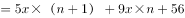，根据工作总量相等列方程：，解得，则甲每天检测药品个。

故正确答案为D。

---

## 第 10 题　qid 2434265 · 数学运算

方阵训练时，教官让40名学生站成一行面向自己。教官喊出某个数字后，该数字倍数的同学要向后转。第一次教官喊了数字3，喊完第二次数字后，他发现面向自己的学生还有24名。教官第二次喊的数字是（    ）。

- **A**. 4
- **B**. 5
- **C**. 6
- **D**. 7　✅

**答案**：D

**官方解析**

根据题意，第一次喊3后，  ，则向后转的同学数为13人，面向教官的学生数为人。代入选项：

A项：，  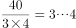，即有10人应该向后转，但其中的3人从后面转回来，另外7人向后转，相当于面向教官的人数人，错误；

B项：，  ，即有8人应该向后转，但其中的2人从后面转回来，另外6人向后转，相当于面向教官的人数人，错误；

C项：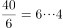，即有6人应该向后转，但这6人都从后面转回来，相当于面向教官的人数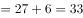人，错误；

D项：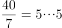， 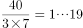，即有5人应该向后转，但其中的1人从后面转回来，另外4人向后转，相当于面向教官的人数人，正确。

故正确答案为D。

---
