# 2019年江苏省公务员录用考试《行测》题（A类）（网友回忆版）

> 数量关系 · 19 题 · 江苏 2019

## 第 1 题　qid 2367905 · 数学运算

2.03，113.06，224.12，335.24，446.48，（    ）

- **A**. 556.96
- **B**. 557.72
- **C**. 557.96　✅
- **D**. 558.72

**答案**：C

**官方解析**

数列为小数数列，优先考虑机械划分。将数列中每一个数字的整数部分和小数部分划分，得到两组新的数列。

小数部分：3、6、12、24、48，是公比为2的等比数列，则所求项的小数部分为。

整数部分：2、113、224、335、446，是公差为111的等差数列，则所求项的整数部分为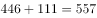。因此题干所求项为557.96。

故正确答案为C。

---

## 第 2 题　qid 2367912 · 数学运算

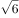，，，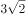，，（    ）

- **A**. 

- **B**. 
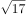
　✅
- **C**. 

- **D**. 

**答案**：B

**官方解析**

将题干统一转化为根式：、、、、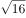、（），观察根号内数字规律。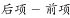，可得16、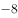、4、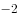、（），是公比为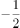的等比数列，则下一项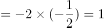。故题干所求项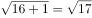。

故正确答案为B。

---

## 第 3 题　qid 2367916 · 数学运算

，，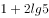，，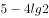，（    ）

- **A**. 

　✅
- **B**. 

- **C**. 

- **D**. 

**答案**：A

**官方解析**

根据对数计算公式：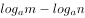，；

又lg是以10为底的对数。则原数列中，

第二项：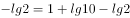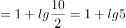，

第五项：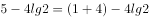；

因此原数列可转换为，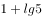，，，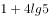，是一个差值为的等差数列，所以下一项应该为。

故正确答案为A。

---

## 第 4 题　qid 2367918 · 数学运算

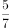，，，，，（    ）

- **A**. 

- **B**. 
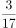

- **C**. 
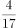
　✅
- **D**. 
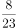

**答案**：C

**官方解析**

数列中全为分数，判定为分数数列。观察分子分母，增减规律不统一，考虑反约分。将原数列化为：，，，，，后项分母前项分子前项分母，则所求项分母为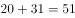；后项分子前项分母前项分子，所求项分子为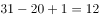。则所求项为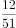。

故正确答案为C。

---

## 第 5 题　qid 2367841 · 数学运算

某银行为一家小微企业提供了年利率分别为、的甲、乙两种贷款，期限均为一年。若两种贷款的合计数额为400万元，企业需付利息总额为25万元，则乙种贷款的数额是

- **A**. 100万元　✅
- **B**. 120万元
- **C**. 130万元
- **D**. 150万元

**答案**：A

**官方解析**

设乙种贷款的数额为万元，则甲种贷款数额为万元。根据题意可列方程：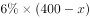，解得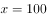万元，则乙种贷款的数额是100万元。

故正确答案为A。

---

## 第 6 题　qid 2367844 · 数学运算

现有浓度为和的盐水各若干克，将其混合后加入50克水，配制成了浓度为的盐水600克，则原和的盐水质量之比是

- **A**. 6：5
- **B**. 1：1
- **C**. 5：6
- **D**. 4：7　✅

**答案**：D

**官方解析**

第二次混合50克水后，配置盐水共600克，则第一次混合配置得到盐水质量为克，溶质质量为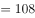克。设第一次混合配置浓度为的盐水有克，则浓度为盐水克，根据溶质的量不变，可得方程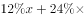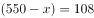，解得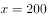克，则浓度为的盐水质量为200克，浓度为盐水质量为克，浓度为与浓度为的溶液质量之比为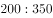。

故正确答案为D。

---

## 第 7 题　qid 2367919 · 数学运算

一群学生分小组在户外活动，如3人一组还多2人，5人一组还多3人，7人一组还多4人，则该群学生的最少人数是

- **A**. 23
- **B**. 53　✅
- **C**. 88
- **D**. 158

**答案**：B

**官方解析**

本题为余数问题，优先用代入排除法。题干所求为这群学生最少有多少人，故从最小选项依次代入。

A项：当学生人数为23时，，并非7的倍数，不满足 “7人一组还多4人”，排除；

B项：当学生人数为53时，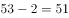，可以被3整除。，可以被5整除。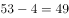，可以被7整除。满足题干所有条件，当选。

故正确答案为B。

---

## 第 8 题　qid 2367854 · 数学运算

已知一个箱子中装有12件产品，其中有2件次品。若从箱子中随机抽取2件产品进行检验，则恰好抽到1件次品的概率是

- **A**. 

- **B**. 
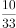
　✅
- **C**. 

- **D**. 

**答案**：B

**官方解析**

若恰好抽到1件次品，则意味抽到1件合格产品和1件次品，共有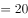种情况。从12件产品抽2件产品检验，共有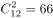种情况，故恰好抽到1件次品的概率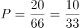。

故正确答案为B。

---

## 第 9 题　qid 2367921 · 数学运算

某工厂生产甲和乙两种产品，已知生产1件甲产品可获利1000元，消耗a和b材料分别为2千克、3千克；生产1件乙产品可获利1700元，消耗a和b材料分别为5千克、4千克。若有a和b材料分别为200千克、240千克，则生产甲、乙两种产品能取得的最大利润是

- **A**. 85200元
- **B**. 86278元
- **C**. 85900元　✅
- **D**. 86600元

**答案**：C

**官方解析**

总利润单个利润数量，由题可知，生产1件乙产品的利润远大于甲，若全部生产乙产品，最多可生产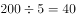件，此时利润为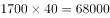元，并非最大利润；生产一件甲产品的耗材比乙产品少，若全部生产甲产品，最多可生产件，此时利润为元，并非最大利润。因此实际生产过程中，甲、乙两种产品均有生产，应统筹考虑。

设最多可生产甲、乙两种产品各、个，最大利润时生产多即耗材多，假设两种材料全部耗尽，则甲、乙消耗的a与b材料可表示为：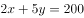···①；···②。联立方程组解得，则乙最大只能取到17。将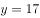代入①式或②式中，解得最大可取到57。即甲最多可生产57个，乙最多可生产17个。则可获得的最大利润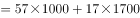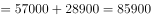元。 

故正确答案为C。

备注：当甲生产57、乙生产17个时，a材料剩余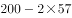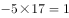千克，b材料剩余千克，材料剩余最少，已经不能再多生产任何产品。

---

## 第 10 题　qid 2367856 · 数学运算

某机关事务处集中采购了一批打印纸，分发给各职能部门。如果按每个部门9包分发，则多6包；如果按每个部门11包分发，则有1个部门只能分到1包。这批打印纸的数量是

- **A**. 87包
- **B**. 78包　✅
- **C**. 69包
- **D**. 67包

**答案**：B

**官方解析**

设职能部门数量为，根据题意，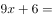，解方程得，。则这批打印纸的数量是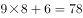包。

故正确答案为B。

---

## 第 11 题　qid 2367922 · 数学运算

市电视台向150位观众调查前一天晚上甲、乙两个频道的收视情况，其中108人看过甲频道，36人看过乙频道，23人既看过甲频道又看过乙频道，则受调查观众中在前一天晚上两个频道均未看过的人数是

- **A**. 17
- **B**. 22
- **C**. 29　✅
- **D**. 38

**答案**：C

**官方解析**

根据题干可判定本题为两集合容斥问题，根据公式：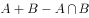，则，，故受调查观众中在前一天晚上两个频道均未看过的人数是29人。

故正确答案为C。

---

## 第 12 题　qid 2367859 · 数学运算

一只密码箱的密码是一个三位数，满足：3个数字之和为19，十位上的数比个位上的数大2。若将百位上的数与个位上的数对调，得到一个新密码，且新密码数比原密码数大99，则原密码数是

- **A**. 397
- **B**. 586　✅
- **C**. 675
- **D**. 964

**答案**：B

**官方解析**

根据题干，密码是一个三位数，此题为多位数问题，依次代入选项验证，

A项，，十位9比个位7大2，对调百位和个位得到793，，错误；

B项，，十位8比个位6大2，对调百位和个位得到685，，符合条件，正确；

C项，，错误；

D项，，十位6比个位4大2，对调百位和个位得到469，，错误。

故正确答案为B。

注：考场上不用验证C、D选项。

---

## 第 13 题　qid 2367924 · 数学运算

一油罐车为三家加油站送油，在第一家加油站卸下车中的油料后整个车重为21吨，在第二家加油站卸下余下油料的后车重18吨，在第三家加油站卸下了剩下的油料。该油罐车本身的重量与所送全部油料重量相比

- **A**. 一样重
- **B**. 重1吨
- **C**. 轻1.5吨　✅
- **D**. 重1.5吨

**答案**：C

**官方解析**

根据题意可知，油罐车在第二家加油站卸油后的重量与在第一家加油站卸油后的重量相差吨，这3吨即为在第二家加油站卸掉的余下油的，故。解得，油重吨。在第一家加油站卸油后，，解得车重吨，吨，故该油罐车本身的重量与所送全部油料重量相比，轻1.5吨。 

故正确答案为C。

---

## 第 14 题　qid 2367842 · 数学运算

某班举行数学测验，试题全部是选择题，共10题，每题1分，得分的部分统计结果如下：

已知，得分至少为3分的，人均分；得分最多为7分的，人均分。这个班级总人数是

- **A**. 

　✅
- **B**. 

- **C**. 

- **D**. 

**答案**：A

**官方解析**

根据题意，所有人的得分得分至少3分的得分之和3分以下的得分之和最多7分的得分之和7分以上的得分之和。设总人数为人，则有，解方程得。

故正确答案为A。

---

## 第 15 题　qid 2367857 · 数学运算

一场大雪过后，某单位需安排员工清理包干区的道路积雪。清理时必须3人一组，其中2人铲雪，1人扫雪。如果安排10人铲雪，3.5小时才能完成。假设每组工作效率相同，若要在100分钟内完成，则需安排的员工人数最少是

- **A**. 21
- **B**. 24
- **C**. 30
- **D**. 33　✅

**答案**：D

**官方解析**

安排10人铲雪，即有组，赋每组工作效率为1，可得总雪量为，若要在100分钟完成，则需要组数组，即至少需要11组，每组3人，则需安排的员工人数最少是。

故正确答案为D。

---

## 第 16 题　qid 2367925 · 数学运算

小李和老张同时在同一点沿同一环形跑道健身锻炼，小李跑步，老张慢走。若同向而行，小李追上老张所需时间是两人相向而行相遇所需时间的倍。假设两人运动均为匀速，且小李跑步是老张慢走速度的倍，则下列能反映与关系的是

- **A**. A
- **B**. B
- **C**. C
- **D**. D　✅

**答案**：D

**官方解析**

方法一：设老张慢走的速度为1，小李跑步的速度为，相向而行相遇时间为，同向而行追上时间为。根据行程问题基本公式，得，则， D项图示最符合。

备注：（），为反比例函数。当时，其图像为在一、三象限的两条双曲线，形如下图所示：

方法二：由于题目中并未给出具体数据，采用赋值法讨论与的关系。设跑道长400米，当小李跑步速度是老张慢跑速度的2倍时,即时，同向而行追上所需时间为，相向而行相遇时间为，；当时，；当时，；当，…可知，取值越大，的值越小，且变化幅度逐渐平缓，与D项一致。

故正确答案为D。

---

## 第 17 题　qid 2367830 · 数学运算

平行四边形ABCD如右图所示，E为AB上的一点，F、G分别为AC与DE、DB的交点。若，则四边形BEFG与ABCD的面积之比是

- **A**. 2∶7
- **B**. 3∶13
- **C**. 4∶19
- **D**. 5∶24　✅

**答案**：D

**官方解析**

因为G是平行四边形对角线的交点，则 平行四边形ABCD，又因为，所以平行四边形ABCD。因为，所以相似，故，即，且与同高，所以，则平行四边形ABCD。S四边形EFGB平行四边形ABCD平行四边形ABCD平行四边形ABCD。

故正确答案为D。

---

## 第 18 题　qid 2367926 · 数学运算

将一根绳子任意分成三段，则此三段能构成一个三角形的概率是

- **A**. 

　✅
- **B**. 

- **C**. 

- **D**. 

**答案**：A

**官方解析**

设绳长为10，三段分别为、、，可知，，，即，，。则取值的区间如下图所示，其表示的图形为（其中AB线段表示）面积为。如要构成三角形需满足，，，，即，，，其表示的图形为，面积为。则能组成三角形的概率为。

故正确答案为A。

---

## 第 19 题　qid 2367836 · 数学运算

某工程队承担一项工程，由于天气原因，工期将延后10天。为了按期完工，需增加施工人员。若增加4人，工期会延后4天；若增加10人，工期将提前2天。假设每人工作效率相同，为确保按期完工，则工程队最少应增加的施工人员数是

- **A**. 6
- **B**. 7
- **C**. 8　✅
- **D**. 9

**答案**：C

**官方解析**

赋值每人工作效率为1，设原来有个人，计划天完成。根据三种安排方式的工作量不变，则有，解方程得，。假设增加个人可以按时完成则有，解得，故至少增加8人，可以按时完成。

故正确答案为C。

---
