# 2019年江苏省公务员录用考试《行测》题（B类）（网友回忆版）

> 数量关系 · 19 题 · 江苏 2019

## 第 1 题　qid 2367787 · 数学运算

，，，，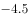，（    ）

- **A**. 
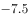

- **B**. 

- **C**. 
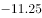
　✅
- **D**. 

**答案**：C

**官方解析**

题干数列相邻两项之间存在明显的倍数关系，优先考虑作商。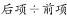，得到新数列：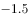、、0.5、1.5、（），为公差是1的等差数列，则下一项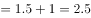。则所求项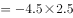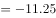。

故正确答案为C。

---

## 第 2 题　qid 2367790 · 数学运算

4.1，9.4，25.9，49.16，121.25，（    ）

- **A**. 169.36　✅
- **B**. 169.49
- **C**. 289.36
- **D**. 289.49

**答案**：A

**官方解析**

题干为小数数列，优先考虑将整数与小数部分分别找规律，原数列可拆分为：

整数部分：4、9、25、49、121、（），所有数字均为平方数，即：、、、、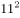、（），底数为连续质数，则下一项应为；

小数部分：1、4、9、16、25、（），所有数字均为平方数，即：、、、、、（），底数为连续自然数，则下一项应为。

将整数与小数部分组合后可得169.36。

故正确答案为A。

---

## 第 3 题　qid 2367835 · 数学运算

，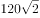，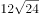，，，（    ）

- **A**. 
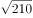

- **B**. 
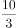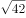

- **C**. 

- **D**. 
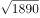
　✅

**答案**：D

**官方解析**

将题干根式转化为最简形式，可得：、、、、。整数部分与根号内部分均分别存在明显倍数关系，故拆成整数与根号两部分之后再作商找规律。

整数部分：720、120、24、6、2、（），，得：6、5、4、3，为公差是的等差数列，则下一项为2，故整数部分所求项；

根号部分：2、2、6、30、210、（），，得：1、3、5、7，为公差是2的等差数列，则下一项为9，故根号内所求项。

将整数部分与根号部分组合后可得。

故正确答案为D。

---

## 第 4 题　qid 2367840 · 数学运算

17，8，5，，，（    ）

- **A**. 

- **B**. 

- **C**. 

　✅
- **D**. 
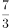

**答案**：C

**官方解析**

题干数列包含整数与分数，将整数转化为分数，且构造分母逐步递增的趋势可得：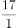、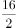、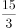、、、（）。分子部分为公差是的等差数列，下一项；分母部分为公差为1的等差数列，下一项为6。则原数列所求项应为。

故正确答案为C。

---

## 第 5 题　qid 2367841 · 数学运算

某银行为一家小微企业提供了年利率分别为、的甲、乙两种贷款，期限均为一年。若两种贷款的合计数额为400万元，企业需付利息总额为25万元，则乙种贷款的数额是

- **A**. 100万元　✅
- **B**. 120万元
- **C**. 130万元
- **D**. 150万元

**答案**：A

**官方解析**

设乙种贷款的数额为万元，则甲种贷款数额为万元。根据题意可列方程：，解得万元，则乙种贷款的数额是100万元。

故正确答案为A。

---

## 第 6 题　qid 2367844 · 数学运算

现有浓度为和的盐水各若干克，将其混合后加入50克水，配制成了浓度为的盐水600克，则原和的盐水质量之比是

- **A**. 6：5
- **B**. 1：1
- **C**. 5：6
- **D**. 4：7　✅

**答案**：D

**官方解析**

第二次混合50克水后，配置盐水共600克，则第一次混合配置得到盐水质量为克，溶质质量为克。设第一次混合配置浓度为的盐水有克，则浓度为盐水克，根据溶质的量不变，可得方程，解得克，则浓度为的盐水质量为200克，浓度为盐水质量为克，浓度为与浓度为的溶液质量之比为。

故正确答案为D。

---

## 第 7 题　qid 2367848 · 数学运算

某地区有甲、乙、丙、丁4个派出所。已知上月甲、乙2个派出所的合计出警次数是95次，乙、丙、丁3个派出所的合计出警次数是140次，乙派出所的出警次数占4个派出所合计出警次数的，则上月甲派出所的出警次数是

- **A**. 55次
- **B**. 60次　✅
- **C**. 68次
- **D**. 75次

**答案**：B

**官方解析**

假设4个派出所合计出警次数为次，则乙派出所出警次数为次。根据题意可知，，解得，则乙派出所出警次数为次，故甲派出所出警次数为次。

故正确答案为B。

---

## 第 8 题　qid 2367854 · 数学运算

已知一个箱子中装有12件产品，其中有2件次品。若从箱子中随机抽取2件产品进行检验，则恰好抽到1件次品的概率是

- **A**. 

- **B**. 

　✅
- **C**. 

- **D**. 

**答案**：B

**官方解析**

若恰好抽到1件次品，则意味抽到1件合格产品和1件次品，共有种情况。从12件产品抽2件产品检验，共有种情况，故恰好抽到1件次品的概率。

故正确答案为B。

---

## 第 9 题　qid 2367855 · 数学运算

甲、乙两人同时从同一地点出发沿同一环形跑道进行健身锻炼，甲跑步，乙走路。若甲追上乙所需时间是两人相向而行相遇所需时间的3倍，则甲、乙的速度之比是

- **A**. 3：1
- **B**. 5：2
- **C**. 2：1　✅
- **D**. 3：2

**答案**：C

**官方解析**

设环形跑道周长为，甲跑步速度为，乙走路速度为。代入追及公式和相遇公式可得，甲追上乙所需时间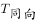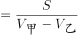，两人相向而行相遇所需时间。根据题意可知，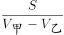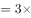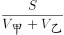，化简可得，则甲、乙速度之比为2:1。

故正确答案为C。

---

## 第 10 题　qid 2367856 · 数学运算

某机关事务处集中采购了一批打印纸，分发给各职能部门。如果按每个部门9包分发，则多6包；如果按每个部门11包分发，则有1个部门只能分到1包。这批打印纸的数量是

- **A**. 87包
- **B**. 78包　✅
- **C**. 69包
- **D**. 67包

**答案**：B

**官方解析**

设职能部门数量为，根据题意，，解方程得，。则这批打印纸的数量是包。

故正确答案为B。

---

## 第 11 题　qid 2367857 · 数学运算

一场大雪过后，某单位需安排员工清理包干区的道路积雪。清理时必须3人一组，其中2人铲雪，1人扫雪。如果安排10人铲雪，3.5小时才能完成。假设每组工作效率相同，若要在100分钟内完成，则需安排的员工人数最少是

- **A**. 21
- **B**. 24
- **C**. 30
- **D**. 33　✅

**答案**：D

**官方解析**

安排10人铲雪，即有组，赋每组工作效率为1，可得总雪量为，若要在100分钟完成，则需要组数组，即至少需要11组，每组3人，则需安排的员工人数最少是。

故正确答案为D。

---

## 第 12 题　qid 2367859 · 数学运算

一只密码箱的密码是一个三位数，满足：3个数字之和为19，十位上的数比个位上的数大2。若将百位上的数与个位上的数对调，得到一个新密码，且新密码数比原密码数大99，则原密码数是

- **A**. 397
- **B**. 586　✅
- **C**. 675
- **D**. 964

**答案**：B

**官方解析**

根据题干，密码是一个三位数，此题为多位数问题，依次代入选项验证，

A项，，十位9比个位7大2，对调百位和个位得到793，，错误；

B项，，十位8比个位6大2，对调百位和个位得到685，，符合条件，正确；

C项，，错误；

D项，，十位6比个位4大2，对调百位和个位得到469，，错误。

故正确答案为B。

注：考场上不用验证C、D选项。

---

## 第 13 题　qid 2367825 · 数学运算

两件快递的重量之比是3：2，去除包装之后的重量之比是9：5。若包装重量都是120克，则两件快递的重量分别是

- **A**. 390克、260克
- **B**. 480克、320克　✅
- **C**. 540克、360克
- **D**. 630克、420克

**答案**：B

**官方解析**

设两件快递重量分别是，，则根据题意，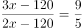，解得。则两件快递的重量分别是，。

故正确答案为B。

---

## 第 14 题　qid 2367828 · 数学运算

警校某班学生分两个小组在甲、乙两地间进行野外负重拉练。已知去程两个小组的速度分别是5千米/小时、4千米/小时，返程两个小组的速度都下降了。若两个小组的出发时间相差54分钟，但同时返回到出发点，则甲、乙两地间的距离是：

- **A**. 20千米
- **B**. 16千米
- **C**. 12千米
- **D**. 8千米　✅

**答案**：D

**官方解析**

根据题意，两个小组返程速度为 ， 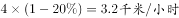。两个小组的出发时间相差54分钟，但同时返回到出发点，可得两个小组的时间相差54分钟，即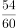小时。

设甲乙两地之间的距离为，根据时间差小时可得方程：，解得。

故正确答案为D。

---

## 第 15 题　qid 2367830 · 数学运算

平行四边形ABCD如右图所示，E为AB上的一点，F、G分别为AC与DE、DB的交点。若，则四边形BEFG与ABCD的面积之比是

- **A**. 2∶7
- **B**. 3∶13
- **C**. 4∶19
- **D**. 5∶24　✅

**答案**：D

**官方解析**

因为G是平行四边形对角线的交点，则 平行四边形ABCD，又因为，所以平行四边形ABCD。因为，所以相似，故，即，且与同高，所以，则平行四边形ABCD。S四边形EFGB平行四边形ABCD平行四边形ABCD平行四边形ABCD。

故正确答案为D。

---

## 第 16 题　qid 2367836 · 数学运算

某工程队承担一项工程，由于天气原因，工期将延后10天。为了按期完工，需增加施工人员。若增加4人，工期会延后4天；若增加10人，工期将提前2天。假设每人工作效率相同，为确保按期完工，则工程队最少应增加的施工人员数是

- **A**. 6
- **B**. 7
- **C**. 8　✅
- **D**. 9

**答案**：C

**官方解析**

赋值每人工作效率为1，设原来有个人，计划天完成。根据三种安排方式的工作量不变，则有，解方程得，。假设增加个人可以按时完成则有，解得，故至少增加8人，可以按时完成。

故正确答案为C。

---

## 第 17 题　qid 2367842 · 数学运算

某班举行数学测验，试题全部是选择题，共10题，每题1分，得分的部分统计结果如下：

已知，得分至少为3分的，人均分；得分最多为7分的，人均分。这个班级总人数是

- **A**. 

　✅
- **B**. 

- **C**. 

- **D**. 

**答案**：A

**官方解析**

根据题意，所有人的得分得分至少3分的得分之和3分以下的得分之和最多7分的得分之和7分以上的得分之和。设总人数为人，则有，解方程得。

故正确答案为A。

---

## 第 18 题　qid 2367846 · 数学运算

某公司年终联欢，准备了52张编号分别为1至52的奖券用于抽奖。如果编号是2、3的倍数的奖券可分别兑换2份、3份奖品，编号同时是2和3的倍数的奖券只可兑换3份奖品，其他编号的奖券只可兑换1份奖品，则所有奖券可兑换的奖品总数是：

- **A**. 99份
- **B**. 100份
- **C**. 102份
- **D**. 104份　✅

**答案**：D

**官方解析**

52个数字中，3的倍数有，取整为个，共发放奖品份；2的倍数个，剔除2和3的公倍数有，取整为8个（已经发过不重复发放）。则发两份奖品的有个，共发份；剩余个，发份。故一共发份。

故正确答案为D。

---

## 第 19 题　qid 2367847 · 数学运算

某景区门票夏季打7折、冬季打3折，对8岁及以下儿童免门票，缆车20元/人次，游乐设施10元/人次。小朱去年夏季和冬季都带4岁的儿子去该景区1次，每次都陪孩子坐缆车1次、让孩子玩游乐设施1次。若他们两人夏季在该景区的游玩费用比冬季多，则该景区门票的全价是

- **A**. 100元　✅
- **B**. 90元
- **C**. 80元
- **D**. 60元

**答案**：A

**官方解析**

设景区门票全价为，则冬季和夏季的门票分别为和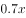。由于儿子小于8岁不需要买门票，总费用打折后门票费用两人缆车费用一人游乐设施费用。根据夏天游玩费用比冬季多，则有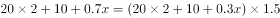，解得元。

故正确答案为A。

---
