# 2019年江苏省公务员录用考试《行测》题（C类）（网友回忆版）

> 数量关系 · 18 题 · 江苏 2019

## 第 1 题　qid 2367977 · 数学运算

51.03，52.06，54.12，57.24，61.48，（    ）

- **A**. 65.96
- **B**. 65.72
- **C**. 66.96　✅
- **D**. 66.72

**答案**：C

**官方解析**

根据题目特点，有小数点，故考虑机械划分数列。以小数点为分界线，小数点前是51，52，54，57，61，后项-前项得到1，2，3，4，是一个公差为1的等差数列，下一个数是5，则原数列小数点前就是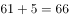；小数点后是03，06，12，24，48，是一个公比为2的等比数列，故小数点后的数字为。则所求项为66.96。

故正确答案为C。

---

## 第 2 题　qid 2367912 · 数学运算

，，，，，（    ）

- **A**. 

- **B**. 

　✅
- **C**. 

- **D**. 

**答案**：B

**官方解析**

将题干统一转化为根式：、、、、、（），观察根号内数字规律。，可得16、、4、、（），是公比为的等比数列，则下一项。故题干所求项。

故正确答案为B。

---

## 第 3 题　qid 2368001 · 数学运算

，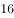，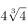，，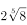，（    ）

- **A**. 

- **B**. 
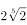

- **C**. 

- **D**. 

　✅

**答案**：D

**官方解析**

观察数列特点，有根号，都放到根号下，原数列可化为：

256、、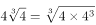、、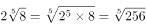。

根号下（被开方数）都是256，根号外（根指数）为1，2，3，4，5，下一项为6，则所求项为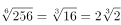。

故正确答案为D。

---

## 第 4 题　qid 2367859 · 数学运算

一只密码箱的密码是一个三位数，满足：3个数字之和为19，十位上的数比个位上的数大2。若将百位上的数与个位上的数对调，得到一个新密码，且新密码数比原密码数大99，则原密码数是

- **A**. 397
- **B**. 586　✅
- **C**. 675
- **D**. 964

**答案**：B

**官方解析**

根据题干，密码是一个三位数，此题为多位数问题，依次代入选项验证，

A项，，十位9比个位7大2，对调百位和个位得到793，，错误；

B项，，十位8比个位6大2，对调百位和个位得到685，，符合条件，正确；

C项，，错误；

D项，，十位6比个位4大2，对调百位和个位得到469，，错误。

故正确答案为B。

注：考场上不用验证C、D选项。

---

## 第 5 题　qid 2367841 · 数学运算

某银行为一家小微企业提供了年利率分别为、的甲、乙两种贷款，期限均为一年。若两种贷款的合计数额为400万元，企业需付利息总额为25万元，则乙种贷款的数额是

- **A**. 100万元　✅
- **B**. 120万元
- **C**. 130万元
- **D**. 150万元

**答案**：A

**官方解析**

设乙种贷款的数额为万元，则甲种贷款数额为万元。根据题意可列方程：，解得万元，则乙种贷款的数额是100万元。

故正确答案为A。

---

## 第 6 题　qid 2367919 · 数学运算

一群学生分小组在户外活动，如3人一组还多2人，5人一组还多3人，7人一组还多4人，则该群学生的最少人数是

- **A**. 23
- **B**. 53　✅
- **C**. 88
- **D**. 158

**答案**：B

**官方解析**

本题为余数问题，优先用代入排除法。题干所求为这群学生最少有多少人，故从最小选项依次代入。

A项：当学生人数为23时，，并非7的倍数，不满足 “7人一组还多4人”，排除；

B项：当学生人数为53时，，可以被3整除。，可以被5整除。，可以被7整除。满足题干所有条件，当选。

故正确答案为B。

---

## 第 7 题　qid 2367844 · 数学运算

现有浓度为和的盐水各若干克，将其混合后加入50克水，配制成了浓度为的盐水600克，则原和的盐水质量之比是

- **A**. 6：5
- **B**. 1：1
- **C**. 5：6
- **D**. 4：7　✅

**答案**：D

**官方解析**

第二次混合50克水后，配置盐水共600克，则第一次混合配置得到盐水质量为克，溶质质量为克。设第一次混合配置浓度为的盐水有克，则浓度为盐水克，根据溶质的量不变，可得方程，解得克，则浓度为的盐水质量为200克，浓度为盐水质量为克，浓度为与浓度为的溶液质量之比为。

故正确答案为D。

---

## 第 8 题　qid 2367922 · 数学运算

市电视台向150位观众调查前一天晚上甲、乙两个频道的收视情况，其中108人看过甲频道，36人看过乙频道，23人既看过甲频道又看过乙频道，则受调查观众中在前一天晚上两个频道均未看过的人数是

- **A**. 17
- **B**. 22
- **C**. 29　✅
- **D**. 38

**答案**：C

**官方解析**

根据题干可判定本题为两集合容斥问题，根据公式：，则，，故受调查观众中在前一天晚上两个频道均未看过的人数是29人。

故正确答案为C。

---

## 第 9 题　qid 2368004 · 数学运算

新疆是我国重要的产棉区。2018年新疆棉花种植面积比上年增加411万亩，增长；2018年全国棉花种植面积为5028万亩，比上年增加236万亩，则2017年新疆棉花种植面积与全国的比值所处的区间是：

- **A**. [0.45，0.55]
- **B**. [0.55，0.65]
- **C**. [0.65，0.75]　✅
- **D**. [0.75，0.85]

**答案**：C

**官方解析**

2018年新疆棉花种植面积比上年增加411万亩，增长，由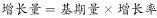可知，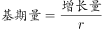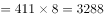万亩。2017年全国棉花种植面积为万亩。，在C项范围之内。

故正确答案为C。

---

## 第 10 题　qid 2368005 · 数学运算

某镇政府有工作人员104人，他们在清明节前去烈士陵园缅怀革命先烈，需全部坐船渡过一条河。已知大船可载客12人，小船可载客5人，大船和小船不论坐满与否，都按满载算。若大船渡一次70元，小船渡一次30元，则他们渡河最节省的方案是：

- **A**. 7只大船和4只小船　✅
- **B**. 2只大船和16只小船
- **C**. 6只大船和2只小船
- **D**. 1只大船和20只小船

**答案**：A

**官方解析**

方法一：代入A项，7只大船和4只小船可坐人，共需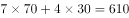元；代入B项，2只大船和16只小船可坐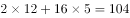人，共需元；代入C项，6只大船和2只小船可坐人，排除；代入D项，1只大船和20只小船可坐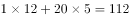人，共需元。比较可知，最节省的方案为7只大船和4只小船。

方法二：大船渡一次70元，可载客12人，即每人需元；小船渡一次30元，可载客5人，每人需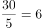元。使用大船时单价更低，若想渡河费用尽量少，应该尽量多的使用大船，且尽量使每艘船都坐满不留空位。代入大船数量最多的A项，7只大船和4只小船可坐人，正好坐满每艘船且能载完全部人员，符合题意条件，无需验证其他选项。

故正确答案为A。

---

## 第 11 题　qid 2367854 · 数学运算

已知一个箱子中装有12件产品，其中有2件次品。若从箱子中随机抽取2件产品进行检验，则恰好抽到1件次品的概率是

- **A**. 

- **B**. 

　✅
- **C**. 

- **D**. 

**答案**：B

**官方解析**

若恰好抽到1件次品，则意味抽到1件合格产品和1件次品，共有种情况。从12件产品抽2件产品检验，共有种情况，故恰好抽到1件次品的概率。

故正确答案为B。

---

## 第 12 题　qid 2367836 · 数学运算

某工程队承担一项工程，由于天气原因，工期将延后10天。为了按期完工，需增加施工人员。若增加4人，工期会延后4天；若增加10人，工期将提前2天。假设每人工作效率相同，为确保按期完工，则工程队最少应增加的施工人员数是

- **A**. 6
- **B**. 7
- **C**. 8　✅
- **D**. 9

**答案**：C

**官方解析**

赋值每人工作效率为1，设原来有个人，计划天完成。根据三种安排方式的工作量不变，则有，解方程得，。假设增加个人可以按时完成则有，解得，故至少增加8人，可以按时完成。

故正确答案为C。

---

## 第 13 题　qid 2368006 · 数学运算

某镇政府办公室集中采购一批打印纸，分发给各个职能部门。如果按每个部门4包分发，则多6包；如果按每个部门5包分发，则有1个部门只能分到3包。这批打印纸的数量是：

- **A**. 38包　✅
- **B**. 36包
- **C**. 40包
- **D**. 42包

**答案**：A

**官方解析**

设职能部门数量为x，根据题意，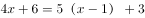，解方程得，。则这批打印纸的数量是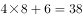包。

故正确答案为A。

---

## 第 14 题　qid 2367842 · 数学运算

某班举行数学测验，试题全部是选择题，共10题，每题1分，得分的部分统计结果如下：

已知，得分至少为3分的，人均分；得分最多为7分的，人均分。这个班级总人数是

- **A**. 

　✅
- **B**. 

- **C**. 

- **D**. 

**答案**：A

**官方解析**

根据题意，所有人的得分得分至少3分的得分之和3分以下的得分之和最多7分的得分之和7分以上的得分之和。设总人数为人，则有，解方程得。

故正确答案为A。

---

## 第 15 题　qid 2367846 · 数学运算

某公司年终联欢，准备了52张编号分别为1至52的奖券用于抽奖。如果编号是2、3的倍数的奖券可分别兑换2份、3份奖品，编号同时是2和3的倍数的奖券只可兑换3份奖品，其他编号的奖券只可兑换1份奖品，则所有奖券可兑换的奖品总数是：

- **A**. 99份
- **B**. 100份
- **C**. 102份
- **D**. 104份　✅

**答案**：D

**官方解析**

52个数字中，3的倍数有，取整为个，共发放奖品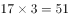份；2的倍数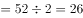个，剔除2和3的公倍数有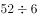，取整为8个（已经发过不重复发放）。则发两份奖品的有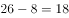个，共发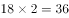份；剩余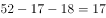个，发份。故一共发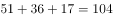份。

故正确答案为D。

---

## 第 16 题　qid 2367848 · 数学运算

某地区有甲、乙、丙、丁4个派出所。已知上月甲、乙2个派出所的合计出警次数是95次，乙、丙、丁3个派出所的合计出警次数是140次，乙派出所的出警次数占4个派出所合计出警次数的，则上月甲派出所的出警次数是

- **A**. 55次
- **B**. 60次　✅
- **C**. 68次
- **D**. 75次

**答案**：B

**官方解析**

假设4个派出所合计出警次数为次，则乙派出所出警次数为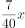次。根据题意可知，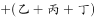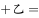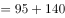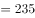，解得，则乙派出所出警次数为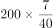次，故甲派出所出警次数为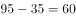次。

故正确答案为B。

---

## 第 17 题　qid 2367857 · 数学运算

一场大雪过后，某单位需安排员工清理包干区的道路积雪。清理时必须3人一组，其中2人铲雪，1人扫雪。如果安排10人铲雪，3.5小时才能完成。假设每组工作效率相同，若要在100分钟内完成，则需安排的员工人数最少是

- **A**. 21
- **B**. 24
- **C**. 30
- **D**. 33　✅

**答案**：D

**官方解析**

安排10人铲雪，即有组，赋每组工作效率为1，可得总雪量为，若要在100分钟完成，则需要组数组，即至少需要11组，每组3人，则需安排的员工人数最少是。

故正确答案为D。

---

## 第 18 题　qid 2368007 · 数学运算

某民营企业新建一个四边形的厂区，按对角线将整个厂区分为四个功能区，如图所示。已知生产、仓储和营销三个功能区的面积分别为26亩、18亩和13亩，若保留休闲区的12亩天然小湖泊，则休闲区可利用的陆地面积是：

- **A**. 36亩
- **B**. 26亩
- **C**. 24亩　✅
- **D**. 23亩

**答案**：C

**官方解析**

如上图所示。△AOB与△COB有公共边BO，两个三角形面积之比为18:13。三角形底相同，高与面积成正比，则高之比为。同理△AOD与△COD有公共边OD，高分别为AG和CH，其底相同，因此面积与高成正比，即。，故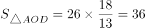亩。休闲区湖泊面积为12亩，故休闲区可利用陆地面积为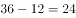亩。

故正确答案为C。

---
