# 2019年江西省法检统一考录公务员笔试《行测》题（网友回忆版）

> 数量关系 · 10 题 · 江西 2019

## 第 1 题　qid 2443975 · 数学运算

王老师一家有5人，父亲、母亲、妻子、女儿和他本人，今年母亲、王老师和女儿年龄之和为135岁，而且他们三人的年龄正好构成等差数列，那么今年王老师多少岁？

- **A**. 42
- **B**. 45　✅
- **C**. 48
- **D**. 50

**答案**：B

**官方解析**

本题考查年龄问题，根据题意，“今年母亲、王老师和女儿年龄之和为135岁，而且他们三人的年龄正好构成等差数列”，结合常识王老师的年龄在母亲和女儿之间，即为等差数列的中项。结合等差数列求和公式，前n项之和，则，故王老师年龄。

故正确答案为B。

---

## 第 2 题　qid 2443976 · 数学运算

甲、乙两公司相距2000米，某日上午8：30小明从甲公司出发到乙公司，小华同时从乙公司出发到甲公司。两人到达对方公司后分别用8分钟时间办事，然后原路返回。假设小明的速度为4km/h，小华的速度为5km/h，则两人第二次相遇的时间是几点？

- **A**. 9：18　✅
- **B**. 9：22
- **C**. 9：24
- **D**. 9：28

**答案**：A

**官方解析**

本题考查行程问题中的相遇问题。根据题意“小明的速度为4km/h，小华的速度为5km/h”即小明的速度是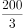米/分钟，小华的速度是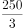米/分钟。题中求二人第二次相遇，若不考虑8分钟办事，则两人所走路程和为，解得两人第二次相遇需要t=40分钟。考虑8分钟办事时间，两人第二次相遇需要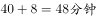，故两人第二次相遇时间为。

故正确答案为A。

---

## 第 3 题　qid 2443977 · 数学运算

现有一条柏油马路需要铺设，甲、乙两施工队合作铺设3天可以完成，而乙施工队单独铺设需要5天完成。如果甲、乙合作铺设1天，乙施工队另有任务，剩余任务由甲单独完成需要多少天？

- **A**. 4
- **B**. 5　✅
- **C**. 5.5
- **D**. 6

**答案**：B

**官方解析**

本题属于给完工时间型工程问题。根据“甲、乙两施工队合作铺设3天可以完成，而乙施工队单独铺设需要5天完成”，设工作总量为3和5的公倍数15。可知甲乙效率和为，乙效率为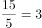，甲效率为。如果甲、乙合作铺设1天，可完成工作量为：，剩余工作量为：，由甲单独完成需要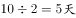。

故正确答案为B。

---

## 第 4 题　qid 2443978 · 数学运算

设袋中装有标着数字为1，2，…，8等8个签，并规定标有数字1，4，7的为中奖号。甲、乙、丙、丁4人依次从袋中随机抽取一个签，已知丙中奖了，则乙不中奖的概率为多少？

- **A**. 5/8
- **B**. 3/7
- **C**. 3/8
- **D**. 5/7　✅

**答案**：D

**官方解析**

本题考查概率问题，不考虑其他人，丙中奖概率为，设此时乙不中奖概率为x，则丙中奖且乙不中奖的概率为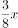；不考虑其他人，由于乙不中奖概率为，对于丙而言，此时可选签还剩7个，可中奖签还剩3个，中奖概率为，则乙不中奖并且丙中奖概率为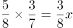，解得。故已知丙中奖了，则乙不中奖的概率为。

故正确答案为D。

---

## 第 5 题　qid 2443979 · 数学运算

某商品的成本比原来增加10%，但是仍保持原售价，致使商品的成本占售价的百分比高达82.5%，那么该商品的利润下降了多少？

- **A**. 20%
- **B**. 25%
- **C**. 30%　✅
- **D**. 35%

**答案**：C

**官方解析**

赋值售价为100，则成本增加10%后成本为82.5，利润为17.5;原成本为，利润为25。故该商品的利润下降了。

故正确答案为C。

---

## 第 6 题　qid 2443989 · 数学运算

设矩形ABCD，长与宽分别为6米和4米，分别以AB的中点E和顶点A为圆心，3米和4米为半径画圆弧，如图所示，那么两阴影部分的面积之差是多少平方米？

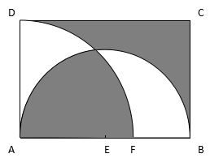

- **A**. 1.87
- **B**. 2.69　✅
- **C**. 3.49
- **D**. 4.42

**答案**：B

**官方解析**

根据上图，矩形ABCD的面积为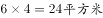，以A点为圆心，4米为半径所画圆弧的面积为，以E点为圆心，3米为半径所画圆弧的面积为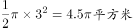。代入两集合容斥原理公式：总数-都不，即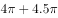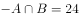-都不，即都不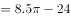，因，都不平方米，则两阴影部分的面积之差为2.69平方米。

故正确答案为B。

---

## 第 7 题　qid 2443990 · 数学运算

假设某班级共有58人，他们的论文答辩成绩分成优、良、中和不合格四档，其中良的人数是优的3倍少2人，中等的人数是优的2倍，优的人数是不合格的1.5倍，那么这个班论文答辩成绩为良的有多少人？

- **A**. 25　✅
- **B**. 26
- **C**. 27
- **D**. 28

**答案**：A

**官方解析**

根据题意，假设成绩为优的人数为，则成绩为良的人数为，中等的人数为，不合格的人数为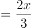，班级共有58人，则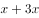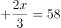，解，成绩为良的有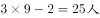。

故正确答案为A。

---

## 第 8 题　qid 2443992 · 数学运算

某园林处计划购进甲、乙两种树苗共1400棵，已知甲树苗每棵4元，乙树苗每棵3元。根据经验可知，甲、乙两种树苗的成活率分别为97%和90%。为了使这批树苗的成活率至少为94%，且购买成本最小，那么购进甲、乙两种树苗的最小费用是多少元？

- **A**. 4850
- **B**. 4800
- **C**. 5050
- **D**. 5000　✅

**答案**：D

**官方解析**

假设购进甲、乙两种树苗数量分别为x、y棵，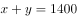，因这批树苗的成活率至少为94%，则，即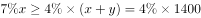，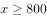。

因甲树苗单价高于乙，在保证成活率至少为94%的前提下，购进甲树苗数量越少，总费用越低。取，，则总费用最少为。

故正确答案为D。

---

## 第 9 题　qid 2443993 · 数学运算

某高校计划招聘81名博士，拟分配到13个不同的院系，假定院系A分得的博士人数比其他院系都多，那么院系A分得的博士人数至少有多少名？

- **A**. 6
- **B**. 7
- **C**. 8　✅
- **D**. 9

**答案**：C

**官方解析**

根据题意，假设院系A分得的博士人数为x，要想x尽可能小，则其他院系分得的人数应尽可能多，最多为。因共有81名博士，则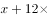，解得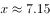，则院系A分得的博士人数至少有8名。

故正确答案为C。

---

## 第 10 题　qid 2443994 · 数学运算

从下列四个选项中选取一项填入括号中，使数列1，3，5，11，21，（  ），85形成一定的规律。

- **A**. 38
- **B**. 40
- **C**. 42
- **D**. 43　✅

**答案**：D

**官方解析**

观察可发现，数列中后一项大约为前一项的2倍，因此考虑前一项2倍之后和后一项的关系。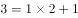，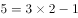，，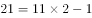，修正项依次为+1，-1，+1，-1，则题目所求项为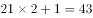，验证可得，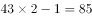，满足。

故正确答案为D。

---
