# 2019年河北省公务员录用考试《行测》题（县级+乡镇）（网友回忆版）

> 数量关系 · 15 题 · 河北 2019

## 第 1 题　qid 2388034 · 数学运算

三个自然数分别是一位数、两位数和三位数，其积为3930，其和最小为多少？

- **A**. 144　✅
- **B**. 146
- **C**. 148
- **D**. 162

**答案**：A

**官方解析**

将3930进行因数分解可得，3930=1×2×3×5×131，组成的一位数、两位数和三位数情况有五种：（2、15、131），（3、10、131），（1、30、131），（1、10、393），（1、15、262）。三者加和最小的情况为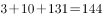。

故正确答案为A。

---

## 第 2 题　qid 2388042 · 数学运算

将300克浓度的酒精与若干浓度的酒精，混合成浓度的酒精，需要浓度的酒精多少克？

- **A**. 225
- **B**. 240
- **C**. 380
- **D**. 400　✅

**答案**：D

**官方解析**

方法一：设需要克浓度60%的酒精，根据混合前后溶质总量不变，可列方程，解得。

方法二： 设需要克浓度的酒精，根据线段法口诀“距离（浓度差）与量（溶液质量）成反比”得，，解得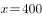。

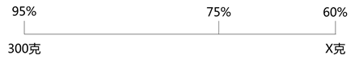

故正确答案为D。

---

## 第 3 题　qid 2388044 · 数学运算

甲、乙、丙三人均每隔一定时间去一次健身房锻炼。甲每隔2天去一次，乙每隔4天去一次，丙每7天去一次。4月10日三人相遇，下一次相遇是哪天？

- **A**. 5月28日
- **B**. 6月5日
- **C**. 7月24日　✅
- **D**. 7月25日

**答案**：C

**官方解析**

甲每隔2天去一次，即每3天去一次；乙每隔4天去一次，即每5天去一次；丙每7天去一次。三人周期的最小公倍数为105天，即每过105天三人再相遇一次。4月10日三人相遇，再过105天下一次相遇，，即7月24日三人相遇。

故正确答案为C。

---

## 第 4 题　qid 2388047 · 数学运算

集贸市场销售苹果5元/个和火龙果3元/个，花光61元最多可购买这两种水果共多少个？

- **A**. 13
- **B**. 16
- **C**. 18
- **D**. 19　✅

**答案**：D

**官方解析**

设买个苹果，个火龙果，则由题意可得。总钱数固定，若想买到水果个数最多，则尽可能多买便宜的水果，即让尽可能大，尽可能小。

当时，不为整数，排除；

当时，，满足。最大值为19。

故正确答案为D。

---

## 第 5 题　qid 2388050 · 数学运算

小贾骑行从起点出发向东骑行3公里后，折向南骑行7公里，又向东骑行5公里后，再向北骑行1公里。现在，小贾距离起点的直线距离是多少公里?

- **A**. 6
- **B**. 8
- **C**. 10　✅
- **D**. 16

**答案**：C

**官方解析**

如图AE为起点与终点之间的直线距离，直角三角形AEF中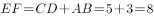公里，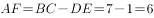公里，则根据勾股定理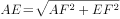公里

故正确答案为C 。

---

## 第 6 题　qid 2388057 · 数学运算

甲、乙两队单独完成某项工程分别需要10天、17天。甲队与乙队按天轮流做这项工程，甲队先做，最后是哪队第几天完工？

- **A**. 甲队第11天
- **B**. 甲队第13天　✅
- **C**. 乙队第12天
- **D**. 乙队第14天

**答案**：B

**官方解析**

根据题意，假设工程总量为17与10的最小公倍数170，则甲队每天干的量为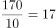；乙队每天干的量为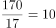，每两天完成的量为，，即经过天后，剩余工程量为8，由甲去完成。故最后是甲队第13天完工。

故正确答案为B。

---

## 第 7 题　qid 2388058 · 数学运算

某新建高速公路中间隔离带绿化时，顺次种植2株蜀桧、3株刺柏、5株小叶女贞、3株大叶黄杨，按此循环，第2019株树木是什么？

- **A**. 蜀桧
- **B**. 刺柏　✅
- **C**. 小叶女贞
- **D**. 大叶黄杨

**答案**：B

**官方解析**

根据题意，种植的周期数为，，即经过155个周期后，剩余4株，这4株中前2株为蜀桧，后2株为刺柏，故第2019株树木是刺柏。

故正确答案为B。

---

## 第 8 题　qid 2388060 · 数学运算

某班参加学科竞赛人数40人，其中参加数学竞赛的有22人，参加物理竞赛的有27人，参加化学竞赛的有25人，只参加两科竞赛的有24人，参加三科竞赛的有多少人？

- **A**. 2
- **B**. 3
- **C**. 5　✅
- **D**. 7

**答案**：C

**官方解析**

设参加三科竞赛的人数为，参加学科竞赛人数为40人，则40人当中都不参加的为0人。根据三集合非标准型公式：，即，解得，故参加三科竞赛的有5人。

故正确答案为C。

---

## 第 9 题　qid 2388061 · 数学运算

小赵从家出发去单位上班要经过多条街道（如右图），假如他只能向西或向南行走，则他上班有多少种不同的走法？

- **A**. 6
- **B**. 24
- **C**. 32
- **D**. 35　✅

**答案**：D

**官方解析**

方法一：小赵从家到单位只能向西或向南（在图中向左或向下走），可依据标1法解题，如图所示：

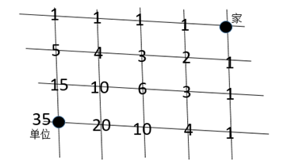

因此一共有35种方法可选择。

故正确答案为D。

方法二：小赵从家到单位必然要经历7条街道，由于只能向西或向南（在图中向左或向下走），所以向西（向左）需要走4条街道，向南（向下）走3条街道，只要在7条街道中选择3条向南走即可，方法数为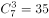。

故正确答案为D。

---

## 第 10 题　qid 2388063 · 数学运算

甲乙二人沿环形跑道从同一地点同时背向开始跑步，35秒后两人相遇。已知甲跑一圈需要60秒，乙跑一圈需要多少秒？

- **A**. 77
- **B**. 84　✅
- **C**. 91
- **D**. 96

**答案**：B

**官方解析**

设甲的速度为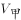，乙的速度为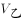，可得，解得，若甲乙分别单独跑一圈，路程相同，时间与速度成反比，即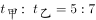，所以秒。

故正确答案为B。

---

## 第 11 题　qid 2388116 · 数学运算

某单位需要搬家，可以使用甲、乙、丙三个搬家公司。单独完成该搬家任务，甲需要3天，乙需要4天，丙需要12天；搬家费用分别为甲1000元/天，乙850元/天，丙350元/天。要求在2天内搬完，最少需要花费多少元？（搬家不足一天按一天计算）

- **A**. 3200　✅
- **B**. 3400
- **C**. 3550
- **D**. 3700

**答案**：A

**官方解析**

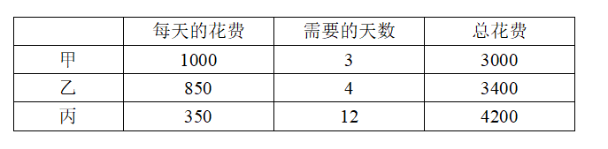

根据上表分析可得，甲单独完成任务所花费的钱数最少。赋值搬家的工作总量为12份，则甲平均完成每份工作量的花费也最少，故应尽可能多用甲，其次为乙和丙。

根据题干条件计算，甲、乙、丙每天可完成的工作量应分别为4份、3份、1份。尽可能多用甲，则两天均用共完成8份任务，剩余4份由乙和丙各工作一天刚好完成。故总花费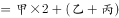元。

故正确答案为A。

---

## 第 12 题　qid 2388117 · 数学运算

某次考试小明全对的概率为，小宁全对的概率为，那么这次考试只有一人全对的概率为多少？

- **A**. 0.24
- **B**. 0.38　✅
- **C**. 0.56
- **D**. 0.94

**答案**：B

**官方解析**

只有一人全对，即要么小明全对，要么小宁全对。可分为两种情况：

（1）小明全对，小宁未全对。其概率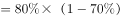；

（2）小宁全对，小明未全对。其概率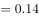；

则只有一人全对的概率。

故正确答案为B。

---

## 第 13 题　qid 2388121 · 数学运算

一个暗箱装有12个编号从1到12的乒乓球，甲、乙、丙三人轮流从暗箱中摸球，每人每次摸一个球且不放回。将所有球摸完后，三人所摸出的球上的编号之和相等，并且甲摸出了1号球和3号球，乙摸出了6号球和11号球。丙摸出的球编号最大为多少？

- **A**. 7
- **B**. 8
- **C**. 9　✅
- **D**. 10

**答案**：C

**官方解析**

球的编号为1-12，根据等差数列求和公式可得，球的编号总和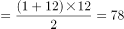。因“所有球摸完后，三人所摸出的球上的编号之和相等”，则平均每人的编号之和。12个球，三人去摸，平均每人摸4个。其中：甲摸出了1号和3号，剩余两球编号之和，只能为10号和12号；乙摸出了6号和11号，剩余两球编号之和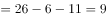，故乙摸出剩余两球中的最大编号不能为9。

综上，甲必然摸走12号和10号，乙摸出11号且一定摸不出9号，故丙摸出的球编号最大应为9号。

故正确答案为C。

---

## 第 14 题　qid 2388124 · 数学运算

将1000个边长为1cm的小正方体组合成一个实心的大正方体后，将该正方体的5个面涂满色后再全部分开，那么至少有一面涂色的小正方体有多少个？

- **A**. 424　✅
- **B**. 488
- **C**. 512
- **D**. 576

**答案**：A

**官方解析**

由题干将1000个边长为1cm的小正方体组合成一个实心的大正方体，设大正方体的棱长为，根据体积不变列式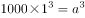，可知大正方体的棱长为10。结合题意将大正方体5个面涂色，如下图所示（右侧未涂色，其余面均涂色）：

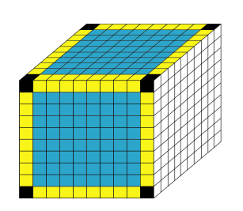

可知有涂色的正方体分为三种情况：

①顶点正方体（图中黑色部分），位于大正方体顶点位置，每个顶点各对应一个，一共有8个；

②棱正方体（图中黄色部分），位于大正方体棱上，每条棱上8个，12条棱一共有个；

③面正方体（图中蓝色部分），位于大正方体每个面的面上，大正方体每个面上有个面正方体，五个面涂色一共有个。

则题目所求至少有一面涂色的小正方体共有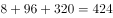个。

故正确答案为A。

---

## 第 15 题　qid 2388127 · 数学运算

长、宽、高分别为12cm、4cm、3cm的长方体上，有一个蚂蚁从A出发沿长方体表面爬行到获取食物，其路程最小值是多少cm？

- **A**. 

- **B**. 

　✅
- **C**. 

- **D**. 

**答案**：B

**官方解析**

由题干蚂蚁从A出发沿长方体表面爬行到 求 最短，画图可知，在长方体中A和不在同一平面，要求最短距离先要把A和 放在同一平面内，则把面翻折，形成面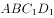，再连接，根据两点之间直线最短求解。如下图：

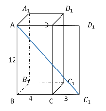

是直角三角形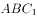的斜边，要让斜边最短，则两直角边的平方和要尽可能小。当，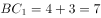时，两直角边的平方和最小。

则所求最短。

故正确答案为B。

---
