# 2019年浙江省公务员录用考试《行测》题（B类）（网友回忆版）

> 数量关系 · 25 题 · 浙江 2019

## 第 1 题　qid 2387672 · 数学运算

1  -1  2  2  25  -9  （  ）

- **A**. 116
- **B**. 124
- **C**. 134　✅
- **D**. 146

**答案**：C

**官方解析**

观察数列变化趋势不大，作差无规律，考虑作和。相邻两项相加得到新数列0,1,4,27,16，即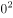，，，，，底数是公差为1的等差数列，指数为2,3,2,3的循环数列，故下一项为。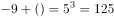，所以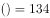。

故正确答案为C。

---

## 第 2 题　qid 2387676 · 数学运算

  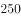    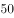  （  ）  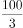

- **A**. 

- **B**. 

　✅
- **C**. 

- **D**. 
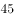

**答案**：B

**官方解析**

观察数列倍数关系明显，考虑作商数列。前一项除以后一项得到新数列3,2.5,2，是公差为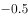的等差数列，那么后两项应为1.5和1。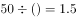，，进行验证，验证成立。

故正确答案为B。

---

## 第 3 题　qid 2387678 · 数学运算

7  12  25  50  91  152  （  ）

- **A**. 237　✅
- **B**. 241
- **C**. 243
- **D**. 255

**答案**：A

**官方解析**

观察数列变化趋势不大，考虑多级数列。后一项减前一项得到新数列5,13,25,41,61，新数列没有明显特征且变化趋势也不大，所以进行第二次作差得到新数列8,12,16,20,是公差为4的等差数列，故下一项为24。，，。

故正确答案为A。

---

## 第 4 题　qid 2387681 · 数学运算

5  3  2  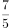  1  （  ）

- **A**. 

- **B**. 

- **C**. 

　✅
- **D**. 

**答案**：C

**官方解析**

根据第四项和选项均为分数可知本题为分数数列，数列逐渐递减且仅有一个分数，可考虑反向约分，则数列可以改写为：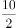,  ，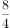，，，（），分母是公差为1的等差数列，分子是公差为-1的等差数列，则括号内应为。

故正确答案为C。

---

## 第 5 题　qid 2387682 · 数学运算

3  2  10  24  （  ）  184

- **A**. 52
- **B**. 58
- **C**. 64
- **D**. 68　✅

**答案**：D

**官方解析**

数列呈现递增趋势且变化较快，考虑递推数列。观察相邻三个数字之间的关系有，即，验证后面：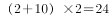，，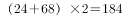，均符合，因此所求项为68。

故正确答案为D。

---

## 第 6 题　qid 2387685 · 数学运算

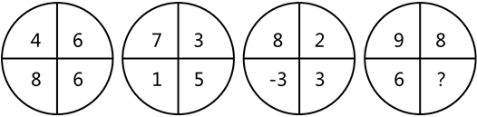

- **A**. 4
- **B**. 5
- **C**. 6
- **D**. 7　✅

**答案**：D

**官方解析**

图形数阵，没有出现中心，优先考虑凑对角线关系。

观察发现：

第一个数阵中，；

第二个数阵中，；

第三个数阵中，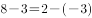；

即，；

故第四个数阵中，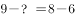，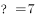。

故正确答案为D。

---

## 第 7 题　qid 2387686 · 数学运算

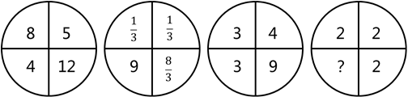

- **A**. 0
- **B**. 1
- **C**. 2　✅
- **D**. 4

**答案**：C

**官方解析**

图形数阵，没有出现中心，优先考虑凑对角线关系。

观察发现：

第一个数阵中，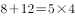；

第二个数阵中，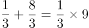；

第三个数阵中，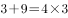；

即，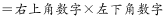；

故第四个数阵中，，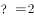。

故正确答案为C。

---

## 第 8 题　qid 2387687 · 数学运算

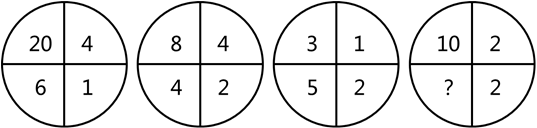

- **A**. 6
- **B**. 7　✅
- **C**. 8
- **D**. 9

**答案**：B

**官方解析**

图形数阵，没有出现中心，优先考虑凑对角线关系，对角线无明显规律，再考虑横向找规律。

观察发现：

第一个数阵中，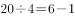；

第二个数阵中，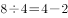；

第三个数阵中，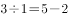；

即，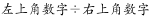；

故第四个数阵中，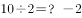，。

故正确答案为B。

---

## 第 9 题　qid 2387688 · 数学运算

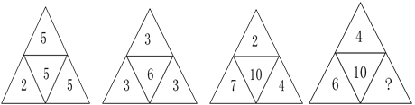

- **A**. 10
- **B**. 12
- **C**. 14　✅
- **D**. 16

**答案**：C

**官方解析**

图形数阵，有中间数字，优先考虑由周围的数字推出中间的数字。

观察发现：

第一个数阵中，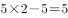；

第二个数阵中，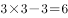；

第三个数阵中，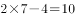；

即，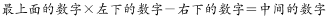；

故第四个数阵中，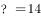。

故正确答案为C。

---

## 第 10 题　qid 2387689 · 数学运算

- **A**. 4
- **B**. 12
- **C**. 16
- **D**. 24　✅

**答案**：D

**官方解析**

图形数阵，有中间数字，考虑由周围的数字推出中间的数字。
观察发现：
第一个数阵中，中间数字15，为周边数字3，3，5的最小公倍数；
第二个数阵中，中间数字28，为周边数字2，7，4的最小公倍数；
第三个数阵中，中间数字12，为周边数字3，12，6的最小公倍数，
即，中间的数字为周边数字的最小公倍数。
故第四个数阵中，中间数字？应该为周边数字1，8，6的最小公倍数为24。
故正确答案为D。

---

## 第 11 题　qid 2387692 · 数学运算

甲、乙两个单位人数相同，甲单位的党员占总人数的，乙单位的党员占总人数的。如果乙单位20名党员与甲单位20名群众互换单位，则两个单位党员占比相同。问两个单位共有党员多少人？

- **A**. 256
- **B**. 288
- **C**. 324
- **D**. 360　✅

**答案**：D

**官方解析**

根据题意，假设甲、乙两个单位总人数均为，则甲单位党员人数为；乙单位党员人数为，因乙单位20名党员与甲单位20名群众互换单位后，两单位党员占比相同，则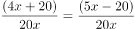，即：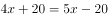，解得人，两个单位共有党员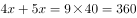人。

故正确答案为D。

---

## 第 12 题　qid 2387698 · 数学运算

小张去年底获得一笔总额不超过5万的奖金，她将其中的用来储蓄，剩下的用来购买理财产品，一年后这笔奖金增值了。已知储蓄的奖金增值了，问购买理财产品的奖金增值了多少？

- **A**. 
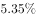

- **B**. 

- **C**. 
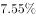
　✅
- **D**. 
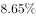

**答案**：C

**官方解析**

方法一：根据题意，假设奖金总额为，则用来储蓄的钱为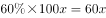，购买理财产品的钱为。一年后奖金增值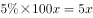，储蓄的奖金增值，购买理财产品的奖金增值，题目所求为。

方法二：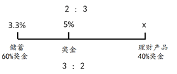

奖金由储蓄和理财产品两部分组成，考虑线段法，如图所示，因用来储蓄的钱占奖金的，所以购买理财产品的钱占奖金的，则储蓄的钱和购买理财产品的钱之比为，根据线段法“距离与量成反比”，则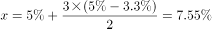，则购买理财产品的奖金增值了。

故正确答案为C。

---

## 第 13 题　qid 2387699 · 数学运算

如下图所示，A、B、C、D为一块梯形田地的4个顶点。已知BC比AD长16米，三角形ACD面积比ABC小200平方米。问AD到BC的距离是多少米？

- **A**. 12.5
- **B**. 18.5
- **C**. 20
- **D**. 25　✅

**答案**：D

**官方解析**

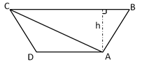

假设AD到BC的距离为，则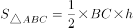，

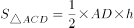，

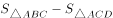

，米。

故正确答案为D。

---

## 第 14 题　qid 2387701 · 数学运算

A、B点和墙的位置如右图所示。现从A点出发以5米/秒的速度跑向墙，接触到墙后再跑到B点。问最少要多少秒到达B点？

- **A**. 30　✅
- **B**. 34
- **C**. 38
- **D**. 42

**答案**：A

**官方解析**

要用最短时间到达B点，在速度一定的情况下，需从A接触到墙后再跑到B点所走的路程最短。如图，由于A和B在墙的同侧，可考虑做其中一个点关于墙的对称点，该对称点与另一个点的连线即为最短路程。假设做A点的对称点C，最短距离为BC。米，米，最短距离米，则秒。

故正确答案为A。

---

## 第 15 题　qid 2387704 · 数学运算

一个山丘的形状如下图所示。甲、乙两人同时从A点出发匀速前往B点，到达B点后立刻返回。甲上坡速度为3米/秒，下坡速度为5米/秒；乙上坡速度为2米/秒，下坡速度为3米/秒。问两人首次相遇时，距A点的路程为多少米？

- **A**. 108
- **B**. 138　✅
- **C**. 150
- **D**. 162

**答案**：B

**官方解析**

结合题意，如图，

甲从A经C到B用时秒，返回时BC段用时秒；而乙速度较小，走完AC段用时秒，由此可知两者在BC段相遇；当乙到达C点时，甲从B返回又走了8秒，到达D点，米，米，根据相遇公式，得，解得：秒，则相遇点距离A点的距离为米。

故正确答案为B。

---

## 第 16 题　qid 2387633 · 数学运算

将一张正方形纸对折成三角形，接着将三角形对折成小三角形，再将这个小三角形对折成更小的三角形。然后如下图所示，剪去三个等腰直角三角形。问将剩下的纸展开，可能是以下哪个图形？

- **A**. 

- **B**. 

- **C**. 

- **D**. 

　✅

**答案**：D

**官方解析**

根据题干所给的图形，白色部分的图形即选项中四周的图形，可排除ABC。ABCD选项中四周图形，如下图所示。

故正确答案为D。

---

## 第 17 题　qid 2387640 · 数学运算

如右图所示，一个正方体木块六个面上分别写着数字，相对面上两个数字的和为20。现在正方体木块的上面是9，正面是13，右面是5。如果先将木块从左向右翻转2018次，再由前向后翻转2019次，这时木块正面数字是：

- **A**. 9
- **B**. 11　✅
- **C**. 13
- **D**. 15

**答案**：B

**官方解析**

根据“相对面上两个数字的和为20”，可知上面9的对面是，正面13的对面是，右面5的对面是。由题意“先将木块从左向右翻转，再由前向后翻转”，可知一个周期翻转的是4个面，则将木块从左向右翻转2018次，，可以等价于第2次从左到右翻转，第1次翻转5为底面，第2次翻转9在底面，上面是11；由前向后翻转2019次，，可以等价于第3次从前向后翻转，即第1次从后向前翻转，上面11从后向前翻转1次即为正面。所以如果先将木块从左向右翻转2018次，再由前向后翻转2019次，这时木块正面数字是11。

故正确答案为B。

---

## 第 18 题　qid 2387643 · 数学运算

一款手机有两个型号，存储容量分别为64G和256G，销售价分别为每台1600元和2000元，其他无区别。已知64G存储器的成本是256G存储器的一半，是单台手机其他成本之和的，而销售一台256G手机的利润比64G手机高150元。问销售64G和256G手机各10万台，利润为多少万元？

- **A**. 3500　✅
- **B**. 5600
- **C**. 6400
- **D**. 7000

**答案**：A

**官方解析**

根据“64G存储器的成本是单台手机其他成本之和的”，设其他成本为5a，则64G存储器成本为a；又“64G存储器的成本是256G存储器的一半”，则256G存储器成本为2a。再根据“销售一台256G手机的利润比64G手机高150元”，所以，解得。可计算出64G手机利润为，256G手机利润。那么销售64G和256G手机各10万台，利润为。

故正确答案为A。

---

## 第 19 题　qid 2387650 · 数学运算

苹果有每盒3个、5个和8个三种不同的包装。如果随机拿4盒，苹果总个数多于20个且为偶数的概率：

- **A**. 
低于

- **B**. 
在之间

- **C**. 
在之间
　✅
- **D**. 
高于

**答案**：C

**官方解析**

从三种不同的包装中随机拿4盒，则总情况数是种。

要满足的条件是“苹果总个数多于20个且为偶数”，分类讨论：

①，只有1种；

②，即从4个位置中选2个出来放8，剩下的两个位置放5，则情况数有种；

③，即从4个位置中选2个出来放8，剩下的两个位置再选一个放5，最后一个位置放3，则情况数有种；

④，即从4个位置中选2个出来放8，剩下的两个位置放3，则情况数有种。

因此，满足条件的情况数种。

所以本题概率。

故正确答案为C。

---

## 第 20 题　qid 2387653 · 数学运算

1、2、3、4、5、6、7、8、9这九个数字各用一次，组成三个能被9整除的三位数，这三个数的和最大是：

- **A**. 2007
- **B**. 2394
- **C**. 2448　✅
- **D**. 2556

**答案**：C

**官方解析**

依据“若一个数能被9整除，则这个数的各个位数之和能被9整除”可知，组成的这三个数的各个位数之和必为9的倍数。因为1到9这九个数字只能各用一次，且1到9的数字之和为45，则三个的数字之和应当分别为9，18和18。题干要求这三个数的和要最大，即每个三位数的百位都尽量取大数。满足数字之和为9的三个数可以是1、2、6或2、3、4或1、3、5，该三位数最大为621；此时，其余两个满足数字之和为18的三位数最大分别是954和873。因此三个数和最大为。

故正确答案为C。

---

## 第 21 题　qid 2387656 · 数学运算

下图前两行分别表示三位数567和648，那么第三行图形表示的数是：

 

- **A**. 647
- **B**. 753　✅
- **C**. 857
- **D**. 947

**答案**：B

**官方解析**

分析前两行图形的中间一列，可以发现，阴影部分刚好构成完整的圆，表示的数字之和。根据阴影部分代表的数字查找规律，每个数字分别代表阴影部分的数字相加。

根据第二行第一幅图可得：右下角数字；

根据第二行第三幅图可得：左下角数字；

根据第三列前两幅图可得：右上角数字；

由于完整的圆数字之和为10，故左上角数字。所以圆中四个数字如图所示：

所求第三行图形表示的数从左到右依次为：，，，合起来即753。

故正确答案为B。

---

## 第 22 题　qid 2387657 · 数学运算

王大妈与李大妈两人分别从小区外围环形道路上A、B两点出发相向而行。走了5分钟两人第一次相遇，接着走了4分钟后，李大妈经过A点继续前行，又过了26分钟两人第二次相遇。问李大妈沿小区外围道路走一圈需要几分钟？

- **A**. 54　✅
- **B**. 59
- **C**. 60
- **D**. 63

**答案**：A

**官方解析**

如图所示，假设两人5分钟后在C点第一次相遇，李大妈接着走了4分钟达到A点，即，则。赋值王大妈的速度为4，李大妈的速度为5。

从C点第一次相遇开始，到第二次相遇，共计用时。环形相遇问题，从同一起点出发，相遇一次即共走一个全程。则环形道路。那么李大妈走完一圈需要的时间。

故正确答案为A。

---

## 第 23 题　qid 2387659 · 数学运算

某研究机构有40名研究人员。上半年发表论文数量最多的人发表了4篇，发表3篇论文的人比发表2篇的多，比发表4篇的少；发表1篇论文的人比发表2篇的少，且所有人都发表了论文。如所有人全年共发表论文205篇，则上半年发表的论文数量至少比下半年多：

- **A**. 9篇　✅
- **B**. 13篇
- **C**. 17篇
- **D**. 21篇

**答案**：A

**官方解析**

方法一：根据问题所求“上半年发表的论文数量至少比下半年多”，则上半年发表的论文数量应尽可能少，那么发表篇数多的人应尽可能少，发表篇数少的人应尽可能多。根据题意可得，设发表4篇的人数至少为人，则发表其它篇数的人数要尽可能多，发表3篇的人数再多也不可能超过发表4篇的人数，即发表3篇的人数最多为人，同理发表2篇的人数最多为人，发表1篇的人数最多为人，因一共有40名研究人员，所以，解得。即发表4篇的人数至少为12人，发表3篇的人数为11人，发表2篇的人数为9人，发表1篇的人数为8人。所以上半年发表的论文数量至少为篇，则下半年至多为篇，即上半年发表的论文数量至少比下半年多篇。

方法二：根据问题所求“上半年发表的论文数量至少比下半年多”，则上半年发表的论文数量应尽可能少，那么发表篇数多的人应尽可能少，发表篇数少的人应尽可能多。梳理条件可得，发表4篇的人数最多，剩余依次为发表3篇、发表2篇、发表1篇的人。故发表4篇的人数最多，应超过人数平均值，至少为11人。发表3篇、2篇、1篇的人数依次至多应为10、9、8人，总计。剩余2人只能平均分到发表4篇与3篇的组中，依此构造发表4篇、3篇、2篇、1篇的人数分别为12、11、9、8人。

则上半年发表的篇数至少应等于，则下半年至多发表。前者比后者至少多。

故正确答案为A。

---

## 第 24 题　qid 2387660 · 数学运算

某公司研发部、市场部和销售部共新招了十几名员工，其中研发部新员工数与市场部和销售部新员工数的总和相同。销售部如果将的新员工调到市场部，则两个部门的新员工数相同。现在要为每名新员工各采购一台电脑，其中研发部的电脑每台不超过1万元，销售部和市场部的电脑每台不超过6千元。问采购这批电脑最多需要多少万元？

- **A**. 14.4
- **B**. 12.8　✅
- **C**. 11.2
- **D**. 9.6

**答案**：B

**官方解析**

题干给出两组等量关系，分别为：

；

；

化简整理可得：

；

；

设市场部新员工数为n，则销售部和研发部分别为3n，4n，三个部门新招总人数为8n（已知共新招十几名员工）。

可知：（n为正整数），所以。

则市场部新员工数为2，则销售部和研发部分别为6，8。

所求采购电脑的费用最多为：。

故正确答案为B。

---

## 第 25 题　qid 2387662 · 数学运算

小刘每连续3天去健身房休息1天，而小张每连续2天去健身房休息3天。今年5月，有11天小张和小刘两人都去了健身房。问以下哪天两人一定都去了健身房？

- **A**. 5月2日
- **B**. 5月4日
- **C**. 5月8日
- **D**. 5月11日　✅

**答案**：D

**官方解析**

题干已知小刘去健身房的周期长度是4天，小张去健身房的周期长度是5天，则可得两人共同出现在健身房的周期长度为20天。又已知5月有11天两人都去了健身房，则符合要求的情况之一，如下图所示：（“1”代表去，“0”代表不去）

这种情况下，5月2日、4日、8日小刘和小张没有同时去健身房，所以不满足题目所求一定都去了健身房，故A、B、C均可以排除。

故正确答案为D。

---
