# 2019年湖北省选调生招录考试《综合知识和行政职业能力测验》题

> 数量关系 · 10 题 · 湖北 2019

## 第 1 题　qid 2365985 · 数学运算

某商店以5元/斤的价格购入一批蔬菜，上午以8元/斤的价格卖出总进货量的，中午以上午售出价的8折卖出总进货量的，下午以中午售出价的一半卖出剩余货量的一半，最后获利210元。则该商店一共购入多少斤蔬菜？

- **A**. 140
- **B**. 150　✅
- **C**. 160
- **D**. 180

**答案**：B

**官方解析**

设一共购入斤蔬菜，可将蔬菜出售情况列表如下：

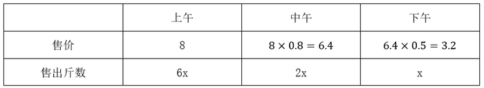

根据，可列方程：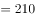，解得，，即一共购入150斤蔬菜。

故正确答案为B。

---

## 第 2 题　qid 2365986 · 数学运算

甲乙两仓库分别有粮食45吨和122吨，现甲仓库第一天运入3吨，往后每天运入的吨数比前一天多2吨，乙仓库每天运出2吨，则至少多少天后甲仓库的粮食比乙仓库多？

- **A**. 6
- **B**. 7
- **C**. 8　✅
- **D**. 9

**答案**：C

**官方解析**

设天后甲仓库的粮食比乙仓库多，根据等差数列求和公式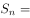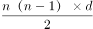，可列式如下：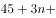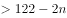，化简为。问至少从最小开始代入，代入A项，，排除；代入B项，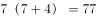，排除；代入C项，，符合题意，无需验证D项。

故正确答案为C。

---

## 第 3 题　qid 2365987 · 数学运算

某足球比赛售出40元、80元、120元门票共2000张，其中80元的门票数是120元的门票数的2倍，比赛门票收入共12万元。则40元门票售出多少张？

- **A**. 1000
- **B**. 1150
- **C**. 1200
- **D**. 1250　✅

**答案**：D

**官方解析**

设120元门票售出张，则80元门票售出张，40元门票售出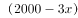张，可列方程：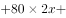，解得，，即40元门票售出1250张。

故正确答案为D。

---

## 第 4 题　qid 2365988 · 数学运算

甲超市某次抽奖活动仅限于情侣参加。活动规则如下：白、蓝、红三色小球分别有4个、3个和2个，情侣两人先后从9个小球中拿1个（每次取出小球后不放回），都拿白球为三等奖，都拿到蓝球为二等奖，都拿到红球为一等奖，其他情形不获奖。则每对情侣一次参加活动中奖的概率为：

- **A**. 

　✅
- **B**. 

- **C**. 

- **D**. 
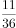

**答案**：A

**官方解析**

根据题意可知，两人先后均取出白球可获得三等奖，概率为，均取出蓝球可获得二等奖，概率为，均取出红球可获得一等奖，概率为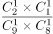。则获奖概率为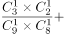。

故正确答案为A。

---

## 第 5 题　qid 2365989 · 数学运算

有一块三角形菜地如下图，现计划将其分为四块区域种植不同蔬菜，如果，，三角形和三角形的面积之差为10平方米，则三角形的面积为：

- **A**. 100平方米
- **B**. 120平方米　✅
- **C**. 140平方米
- **D**. 150平方米

**答案**：B

**官方解析**

因，和此条边上对应的高相等，则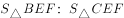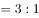，同理， ，可知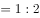，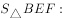，整理得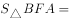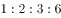。由题干三角形和三角形的面积之差为10平方米，可知平方米，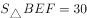平方米，则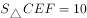平方米，平方米，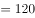平方米。

故正确答案为B。

---

## 第 6 题　qid 2365990 · 数学运算

某商场会员全年购买该商场商品可享8折优惠，近日该商场举行店庆优惠活动。全场商品满199元减50元，满399元减100元，满599元减200元，会员优惠和店庆优惠每次只能享受一项。活动期间会员小兴分三次购买了价值260元、480元、640元商品各一件，则小兴最少需支付：

- **A**. 1024元
- **B**. 1026元
- **C**. 1028元　✅
- **D**. 1030元

**答案**：C

**官方解析**

想要支付的钱数最少，需选择最优惠的活动。260元的商品打八折为元，参加满减为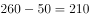元，应选择8折优惠；480元的商品打八折为元，参加满减为元，应选择满减优惠；640元的商品打八折为元，参加满减为元，应选择满减优惠。则最少需支付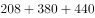元。

故正确答案为C。

---

## 第 7 题　qid 2365991 · 数学运算

某工厂加工零件，每个零件有正反两面，每台机床每次能同时加工两个零件，每次只能加工零件的一面，加工一次需要1.5分钟，则每台机床加工9个零件最少需要多少时间？

- **A**. 13.5分钟　✅
- **B**. 14分钟
- **C**. 14.5分钟
- **D**. 15分钟

**答案**：A

**官方解析**

方法一：每次可以加工2面，耗时1.5分钟。9个零件共有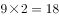面，至少需要加工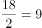次，至少耗时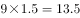分钟。

方法二：本题也可以枚举出所有情况，第1次至第6次分别加工前6个零件的正反两面，第7次加工第7个零件的正面和第8个零件的正面，第8次加工第7个零件的反面和第9个零件的正面，第9次加工第8个零件的反面和第9个零件的反面，一共9次，至少用时分钟。

故正确答案为A。

---

## 第 8 题　qid 2365992 · 数学运算

吕某回乡开办土鸡养殖基地，某天他收获一筐土鸡蛋。每4个一组取出则多2个；每5个一组取出则少1个；每6个一组取出则刚好；每7个一组取出多1个。已知一筐最多能装500个土鸡蛋，如果每6个一组取出，需要多少次刚好取完？

- **A**. 67
- **B**. 69　✅
- **C**. 70
- **D**. 72

**答案**：B

**官方解析**

由题意可知，土鸡蛋每5个一组取出少1个，所以土鸡蛋数量加1是5的倍数。直接代入选项，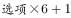，得到的结果分别为403、415、421、433，只有415是5的倍数，故土鸡蛋总数为414个，需要取69次。

故正确答案为B。

---

## 第 9 题　qid 2365993 · 数学运算

因电路改造，电力公司计划未来十天对某小区选择三天停电，要求不能连续两天停电，则共有多少种停电方案？

- **A**. 35
- **B**. 56　✅
- **C**. 84
- **D**. 120

**答案**：B

**官方解析**

10天里面，7天正常供电，3天停电，要求不能连续2天停电，考虑插空法。7天的排布共有8个空，将停电的3天分别插入8个空，则有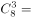种停电方案。

故正确答案为B。

---

## 第 10 题　qid 2365994 · 数学运算

甲、乙、丙三人分别骑自行车同时同地沿同一公路追赶前面的骑车人丁。甲、乙、丙分别用了6分钟、10分钟、15分钟追赶上丁。已知甲每分钟行0.4千米，乙每分钟行0.3千米，则丙每分钟行多少千米？

- **A**. 0.24
- **B**. 0.25　✅
- **C**. 0.26
- **D**. 0.27

**答案**：B

**官方解析**

由题意可知，甲、乙、丙分别跟丁做追及运动。设甲、乙、丙和丁的追及距离为，丁的速度为每分钟行千米。根据追及公式，甲和丁可得方程 ，乙和丁可得方程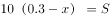，联立方程组解得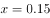，。设丙每分钟行千米，单独考虑丙和丁，代入追及公式可得，解得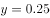。

故正确答案为B。

---
