# 2019年甘肃省公务员录用考试《行测》题（网友回忆版）

> 数量关系 · 10 题 · 甘肃 2019

## 第 1 题　qid 2423384 · 数学运算

某宣传部门为喜迎伟大祖国70华诞，特组织名来自全国各地的党员进行一次红色革命之旅的拓展活动。已知每名参加活动的党员在活动前都互相不认识，且在活动中最少与除自己以外的另1名党员互相认识。问至少能找到多少名党员，他们在活动中新认识的人数相同？

- **A**. 2　✅
- **B**. 3
- **C**. 4
- **D**. 5

**答案**：A

**官方解析**

已知每名参加活动的党员在活动前都互相不认识，且在活动中最少与除自己以外的另1名党员互相认识，求的最小值。问最小考虑从小到大代入，代入A项，当时，2名党员通过参加活动互相认识，各在活动中新认识1人，在活动中新认识的人数相同，符合题意。

故正确答案为A。

---

## 第 2 题　qid 2423385 · 数学运算

某矿业产品公司支付了一批货款，一半用于购进每吨400元的A型石英矿，另一半用于购进每吨600元的B型石英矿，则A、B两种石英矿的平均价格是每吨多少元？

- **A**. 480　✅
- **B**. 490
- **C**. 500
- **D**. 510

**答案**：A

**官方解析**

赋值购买A型石英矿和B型石英矿均为1200元，则总货款为2400元。公司购进A型石英矿的数量为3吨，购进B型石英矿的数量为2吨，则A、B两种石英矿的平均价格元/吨。

故正确答案为A。

---

## 第 3 题　qid 2423386 · 数学运算

有甲乙两个工程队负责某小区主干道维修及墙面粉刷。主干道维修，如果两个工程队合作，30天完成，若乙工程队单独进行，105天完成；粉刷墙面，若两个工程队合作，28天完成，若甲工程队单独做，140天完成。如果两项工作两个工程队共同分工合作，最少需要多少天？

- **A**. 34
- **B**. 35
- **C**. 40　✅
- **D**. 41

**答案**：C

**官方解析**

赋值主干道维修的工程总量为30和105的最小公倍数210，则甲乙合作的效率为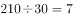，乙的效率为，则甲的效率为；

赋值粉刷墙面的工程总量为28和140的最小公倍数140，则甲乙合作的效率为，甲的效率为，则乙的效率为。

需要两个工程队分工合作以最少的天数完成两项工作，则优先让两个工程队单独完成自己效率较高的工作，即甲优先进行主干道维修，乙优先进行粉刷墙面，先完成的一方去帮助另一方完成剩余的工作。

乙单独完成粉刷墙面的工作需要天，完成后去与甲共同完成主干道维修的工作，此时甲已完成工作量，剩余的工作量为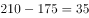，由甲、乙共同完成，需要天。

因此，两项工作两个工程队共同分工合作，最少需要天。

故正确答案为C。

---

## 第 4 题　qid 2423387 · 数学运算

某单位工会会员60人，现在组织会员报名参加兴趣活动小组，其中报名徒步组的有40人，羽毛球组的有38人，乒乓球组的有31人，这三项活动都报名的有18人，问这个单位工会会员中最多有多少人三个小组都没有报名？

- **A**. 14　✅
- **B**. 15
- **C**. 16
- **D**. 18

**答案**：A

**官方解析**

设三个小组都没有报名为人，报名了两个小组为人，根据三集合非标准型公式：，可得：，解得。

要让最多，则让最多，即除了三个小组都报名的会员外，其余会员均报名两个小组，则的最大值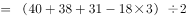，则的最大值为27人，此时最大，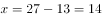人。

故正确答案为A。

---

## 第 5 题　qid 2423388 · 数学运算

甲和乙两个工厂分别生产件某种产品，甲工厂每天比乙工厂多生产20件。甲工厂25天后正好完成自己的生产任务，随后立刻开始帮助乙工厂生产。所有生产任务完成时，甲工厂正好帮乙工厂生产300件产品。问的值为：

- **A**. 1000
- **B**. 1200
- **C**. 1300
- **D**. 1500　✅

**答案**：D

**官方解析**

根据题意可得，任务完成时甲厂生产件、乙厂生产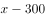件，则甲厂比乙厂多生产件产品，根据公式工作时间可得，完工时间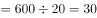天，则甲厂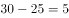天生产300件产品，则甲厂工作效率件，则件。

故正确答案为D。

---

## 第 6 题　qid 2423389 · 数学运算

甲、乙两个单位分别有60和42名职工，共同成立A、B两个业余活动小组，所有职工每人至少参加1个。乙单位职工中仅参加A组的人数是只参加一个小组人数的，乙单位职工中参加B组的人数与参加A组的人数之比为3：4，参加B组的人中，甲单位职工占5/8。问有多少人仅参加A组？

- **A**. 35
- **B**. 42
- **C**. 46　✅
- **D**. 56

**答案**：C

**官方解析**

方法一：两集合容斥原理，根据题意可得乙单位职工中仅参加A组与仅参加B组人数之比为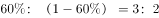，设乙单位中仅参加A组有人、仅参加B组的有人，两组均参加的有人，则乙单位职工中参加B组的人数与参加A组的人数之比为，解得，根据题意可得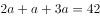，解得，则乙单位参加B组的有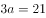人。则两单位参加B组的共有人，仅参加A组的有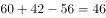人。

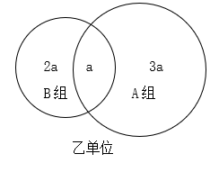

方法二：利用倍数特性代入排除。根据题意“参加B组的人中，甲单位职工占”可得参加B组的人数能被8整除，且参加B组人数。代入A项：，不能被8整除，排除；代入B项：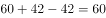，不能被8整除，排除；代入C项：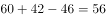，能被8整除，满足；代入D项：，不能被8整除，排除。

故正确答案为C。

---

## 第 7 题　qid 2423390 · 数学运算

某网上商城做促销活动，在该商场购物任意商品每满299元即可减免100元。以下哪个图形最能反映购买货物价格(横坐标轴)与实际支付价格(纵坐标轴)之间的关系？

- **A**. 如上图所示
- **B**. 如上图所示　✅
- **C**. 如上图所示
- **D**. 如上图所示

**答案**：B

**官方解析**

根据题意可得，商品每满299元即可减免100元，则当购买货物价格恰好为299元时，实际支付价格为元，只有B项图形满足。

故正确答案为B。

备注：函数图像中实心圆圈代表可以取值，空心圆圈代表不能取值。

---

## 第 8 题　qid 2423337 · 数学运算

球员小王与球队签订工作合同，有1年期、3年期和5年期三种合同可供选择。如果签3年期合同，月薪比5年期合同低1万元，比1年期高5000元，而5年期合同能获得的总薪水是3年期合同的2.5倍。问小王如果签1年期合同，能获得的总薪水为多少万元？

- **A**. 12
- **B**. 18　✅
- **C**. 24
- **D**. 30

**答案**：B

**官方解析**

设3年期合同月薪为万元，则5年期合同月薪为万元，1年期合同月薪为万元。由于5年期合同总薪水是3年期的2.5倍，则，解得，则1年期合同月薪为万元，故1年期合同总薪水为万元。

故正确答案为B。

---

## 第 9 题　qid 2423291 · 数学运算

甲从邮局出发去图书馆，乙从图书馆出发去邮局。两人12点同时出发，相向而行。12点40分两人相遇并继续以原速度前行。13点12分甲到达图书馆后立刻返回邮局。假定两人速度不变，甲返回邮局时，乙已到邮局多长时间了？

- **A**. 40分钟
- **B**. 50分钟
- **C**. 54分钟　✅
- **D**. 64分钟

**答案**：C

**官方解析**

设甲的速度为，乙的速度为，邮局和图书馆的距离为。甲乙相遇时各行驶40分钟，甲到达图书馆时行驶72分钟，根据题干，可得方程组：

 ①

 ②

解得，路程相同时，速度与时间成反比，则，分钟，则分钟。

当甲返回邮局时，共行驶分钟，此时乙已经到邮局分钟。

故正确答案为C。

---

## 第 10 题　qid 2423296 · 数学运算

某医院内科，今年门诊人数比上一年增加了，平均每位患者的门诊花费比上一年下降了，若上一年该医院内科门诊收入为3000万元，那么今年的门诊收入大约是多少万元？

- **A**. 2600
- **B**. 2880
- **C**. 3120　✅
- **D**. 3640

**答案**：C

**官方解析**

设该医院去年门诊人数为，平均每位患者的门诊花费为，由题干可得：去年该医院内科门诊收入万元。

根据题意，今年门诊人数为，平均每位患者的门诊花费为，则今年该医院内科门诊收入万元。

故正确答案为C。

---
