# 2019年福建省选调生考试《行政职业能力测验》

> 数量关系 · 10 题 · 福建 2019

## 第 1 题　qid 4708122 · 数学运算

求此式的余数是多少？

- **A**. 0　✅
- **B**. 1
- **C**. 2
- **D**. 3

**答案**：A

**官方解析**

根据平方差公式：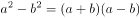，化简分子进行计算，可得原式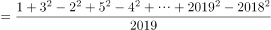，余数为0。

故正确答案为A。

---

## 第 2 题　qid 4708126 · 数学运算

有100名职工投票，从甲、乙、丙三人中选举一人，每人只能投一次，且只能选一个人，得票最多的人当选。统计票数的过程中发现，前50票中，甲得10票，乙得17票，丙得23票。在余下的选票中，丙至少再得几张选票就一定能当选?

- **A**. 22
- **B**. 23　✅
- **C**. 24
- **D**. 25

**答案**：B

**官方解析**

方法一：设丙还要得到x张选票。由题意得，乙和丙票数最接近，则考虑最糟糕的情况，剩余的100-50=50票除了投给丙，其他全投给乙，不投给甲，则有23+x＞17+50-x，解得x＞22，故丙至少再得23张选票就一定能当选。
方法二：前50票中，丙比乙多23-17=6票，则剩余50票中先补6票给乙，使乙和丙票数相等，还剩50-6=44票，此时丙只要再得44÷2+1=23票就一定能当选。
故正确答案为B。

---

## 第 3 题　qid 4708146 · 数学运算

目前我国个人所得税改革，个人税起征点由3500元提至5000元。原来的超额累进税率为：3500-5000元的部分按3％，超过5000元的部分按10％；改革后的超额累进税率为：超过5000元的部分按3％。现有某人月工资是7000元，问此人比改革前节省了多少元？

- **A**. 245
- **B**. 185　✅
- **C**. 60
- **D**. 50

**答案**：B

**官方解析**

已知某人月工资为7000元，改革前我国个税起征点为3500元，3500元以内不需要纳税，3500-5000元的部分按3%，超过5000元的部分按10%，纳税总额=1500×3%+2000×10%=245元；改革后我国个税起征点为5000元，5000元以内不需要纳税，超过5000元的部分按3％，纳税总额=2000×3%=60元。则此人比改革前节省了245-60=185元。
故正确答案为B。

---

## 第 4 题　qid 4708151 · 数学运算

三个人做一批零件，如果让甲来做，每天做4个，最后这批零件余1个；乙来做，每天做5个，最后这批零件余2个；丙来做，每天做6个，最后这批零件余3个。问这批零件甲、乙、丙三个人一起做，最后这批零件余多少个?

- **A**. 11
- **B**. 12　✅
- **C**. 13
- **D**. 14

**答案**：B

**官方解析**

根据题意，这批零件总数除以4余1，除以5余2，除以6余3。根据同余问题口诀：差同减差（即除数余数的差相同，均为3），最小公倍数做周期，可知零件总数可表示为60n-3（4、5、6最小公倍数为60）。则甲、乙、丙三个人一起做这批零件，可列式：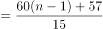，60（n-1）恰好被15整除没有余数，57÷15=3······12，即最后这批零件余12个。

故正确答案为B。

---

## 第 5 题　qid 4708121 · 数学运算

某个社区的肝癌患病率0.04％，现用甲胎蛋白法进行普查，医学研究表明，化验结果是存在错误的。患有肝癌的人其化验结果99％成阳性（有病），而没有患肝癌的人其化验结果99.9％为阴性（没病）。现某人的检查结果为阳性，问他真的患肝癌的概率约是多少？

- **A**. 0.04
- **B**. 0.284　✅
- **C**. 0.716
- **D**. 0.99

**答案**：B

**官方解析**

根据题意，若某人的检查结果为阳性，包含两种情况：①真患有肝癌；②未患有肝癌。真患有肝癌且阳性概率为0.04%×99%，未患有肝癌且阳性概率为（1-0.04%）（1-99.9%）=99.96%×0.1%，故所求为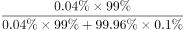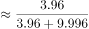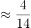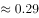，与B项最接近。

故正确答案为B。

---

## 第 6 题　qid 4708141 · 数学运算

某人住在t市，在s市工作，每天下班后乘火车到达t市，然后于下午6时到t市地铁站，他的妻子驾车准时到地铁站接他回家。一日他提前下班，搭早一班车于下午5：30到t市地铁站，随即步行回家，他的妻子像往常一样驾车前来，在地铁站与家的中点B点遇到他，接回家时，发现比往常提前了10分钟，问他步行了多长时间？

- **A**. 10
- **B**. 25　✅
- **C**. 30
- **D**. 40

**答案**：B

**官方解析**

根据题意，若地铁站与家的距离记为一个全程，妻子在正常情况下从家驾车到地铁站再接丈夫回家共行驶了两个全程，而某天妻子驾车到中点B点接到丈夫回家，接回家时发现比往常提前了10分钟，相比往常少走了一个全程，可知妻子驾车行驶一个全程的时间为10分钟。丈夫提前30分钟到达地铁站，若仍乘车回家，则到家时间应该比正常时间提前30分钟，但实际只比往常提前了10分钟，说明丈夫从地铁站到中点B点步行比乘车多花20分钟，妻子驾车从地铁站到中点B点所花时间为5分钟，故丈夫步行从地铁站到中点B点所花时间为25分钟。
故正确答案为B。

---

## 第 7 题　qid 4708145 · 数学运算

管理人员从一池塘中捞出50条鱼做上标记，然后放回池塘，将带标记的鱼完全混合于鱼群中。10天后，再捕上20条，发现其中带标记的鱼有10条。请问根据以上数据可以估计该池塘有多少条鱼？

- **A**. 70
- **B**. 80
- **C**. 90
- **D**. 100　✅

**答案**：D

**官方解析**

设该池塘有x条鱼，根据带标记的鱼占总鱼数的比例不变，可列等式：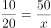，解得x=100，故估计该池塘有100条鱼。

故正确答案为D。

---

## 第 8 题　qid 4708170 · 数学运算

有个水龙头匀速地向下图A、B、C、D四种容器注水，如果用h代表高度，t代表时间，请问下图的坐标曲线代表哪个容器的注水情况？

- **A**. 
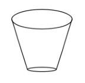

- **B**. 
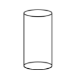

- **C**. 
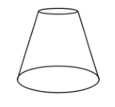
　✅
- **D**. 
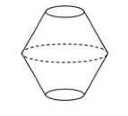

**答案**：C

**官方解析**

观察坐标曲线可知，h（高度）随t（时间）的变化为先慢后快。由于水龙头匀速注水，所以横截面越大，h变化越慢。观察选项，A项容器h随t的变化为先快后慢；B项容器h随t变化速度保持不变；C项容器h随t的变化为先慢后快；D项容器h随t的变化为先快后慢而后又变快。故只有C项符合题意。
故正确答案为C。

---

## 第 9 题　qid 4708128 · 数学运算

现行世界杯比赛规则：48支球队会分成16个小组，每组有3支球队，这3支球队进行3场比赛，小组第一名出线，然后继续进行淘汰决赛、淘汰决赛、半决赛淘汰赛、第3名与第4名决赛、冠亚军决赛。问现行规则下，世界杯一共需要打多少场比赛？

- **A**. 64　✅
- **B**. 63
- **C**. 65
- **D**. 66

**答案**：A

**官方解析**

根据题意，小组赛每组进行3场比赛，16个小组进行48场比赛；小组第一名出线，16支球队进行淘汰决赛，进行8场比赛；获胜的8支球队进行淘汰决赛，进行4场比赛；获胜的4支球队进行半决赛淘汰赛，进行2场比赛；获胜的2支球队进行冠亚军决赛，失败的2支球队进行第3名与第4名决赛。则现行规则下，世界杯一共需要打48+8+4+2+2=64场比赛。

故正确答案为A。

---

## 第 10 题　qid 4708144 · 数学运算

城墙外有A、B两个灯塔，灯塔A在灯塔B的南偏西60度的方向。A、B两灯塔相距20海里，现有一轮船C在灯塔B的正北方向，在灯塔A的北偏东45度方向。问轮船C距离A灯塔多少海里？

- **A**. 

　✅
- **B**. 
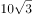

- **C**. 
10

- **D**. 

**答案**：A

**官方解析**

根据题意，灯塔位置如图所示，过A点向南北方向做垂线，交纵轴于D点。根据为直角三角形，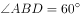，且AB相距20海里，可推出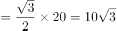海里；根据为直角三角形，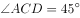，可推出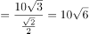海里。

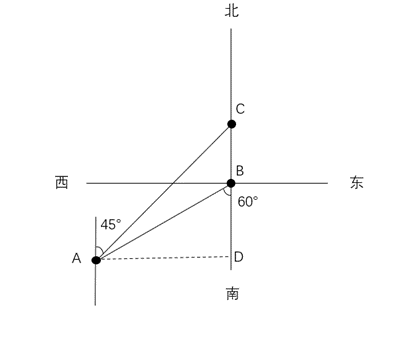

故正确答案为A。

---
