# 2019年辽宁省公务员录用考试《行测》题（网友回忆版）

> 数量关系 · 10 题 · 辽宁 2019

## 第 1 题　qid 2443063 · 数学运算

某农科院准备挑选2男2女4名科技人员分别去市郊的甲乙丙丁4个乡参加科技支农工作，在报名的人员中有3男4女符合要求，在4名女性中有1位是农科院的副院长，考虑到工作的具体需要，这名副院长不去甲乡，且去丁乡的是女性。符合条件的选法有        种。

- **A**. 198　✅
- **B**. 216
- **C**. 378
- **D**. 432

**答案**：A

**官方解析**

（1）假设去甲乡镇的为男性，同时丁乡镇必须为女性，乙丙无要求，则情况数为：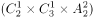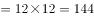种；

（2）假设去甲乡镇的为女性且不能为副院长，丁乡镇必须为女性，乙丙无要求，则情况数为：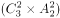种；

则符合条件的选法有种。

故正确答案为A。

---

## 第 2 题　qid 2443065 · 数学运算

某大型相亲类综艺节目举办线下联谊活动，在签到时每人可以抽取一张礼物卡，凡是抽中有编号的礼物卡均有玫瑰花赠送，抽到“谢谢参与”的则赠送一盒面巾纸。带有编号的礼物卡共100张，编号1-100，按礼物卡标签号发放奖品的规则如下：
（1）标签号为2的倍数，领2枝玫瑰
（2）标签号为3的倍数，领3枝玫瑰
（3）标签号既是2的倍数，又是3的倍数可重复领奖
（4）其他标签号均领1枝玫瑰
那么本次联谊活动应准备玫瑰花        枝。

- **A**. 215
- **B**. 232　✅
- **C**. 312
- **D**. 416

**答案**：B

**官方解析**

已知1-100满足编号为2的倍数的有个；编号为3的倍数的有余1，有33个；编号既为2的倍数又为3的倍数即6的倍数有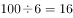余4，有16个。根据二集合容斥原理，则，既非2倍数又非3倍数共有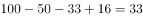个。因此总计需准备枝玫瑰。

故正确答案为B。

---

## 第 3 题　qid 2443068 · 数学运算

中秋假期，小王请同在一个城市的9位大学同学聚餐。10人围坐一桌，敬酒前小王提出一个建议：每个人要同不相邻的同学喝一杯。如果小王的提议被通过，那么一共要准备        杯酒。

- **A**. 70　✅
- **B**. 90
- **C**. 140
- **D**. 210

**答案**：A

**官方解析**

根据题干条件，每个人要和不相邻的同学喝一杯，总计10人，每人除了自己和左右相邻的两位同学外，不相邻的同学共7名，即每个人需同7名同学喝酒，10人总计需喝次。但因每两人只用喝一次，实际只需要喝次，每次互相喝酒的两人各一杯，总共需要准备杯酒。

故正确答案为A。

---

## 第 4 题　qid 2443074 · 数学运算

有两个班的学生从南部校区到北部校区参加活动，但只有一辆车接送，第一班的学生坐车从学校出发的同时，第二班学生开始步行；车到途中某处，让第一班学生下车步行，车立刻返回接第二班学生上车并直接开到北部校区。学生步行速度为每小时4公里，载学生时车速每小时40公里，空车时车速为每小时50公里。问：要使两班学生同时到达北部校区，第二班学生步行全程的        。

- **A**. 1/6
- **B**. 1/7　✅
- **C**. 1/10
- **D**. 1/8

**答案**：B

**官方解析**

由于两个班学生的步行速度均为每小时4公里，坐车速度均为每小时40公里，要想同时到达，则两个班学生的步行距离与乘车距离应分别相等。设一班学生步行的路程为x，乘车的路程为y，则最后步行的时间为；车返回和载着二班学生到达终点总共用的时间应为。两者所用时间相同，则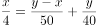，解得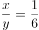。则学生步行路程占全程的比重为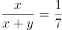。

故正确答案为B。

---

## 第 5 题　qid 2443091 · 数学运算

甲乙丙丁四个建筑队分别承担相同的施工任务。由于设备原因，当甲乙丙同时开工时，丁已经干了若干天。经过一番努力，甲用3天，乙用5天，丙用8天，赶上了丁的进度。已知甲的效率是12，乙的效率是8，则丙的效率是        。

- **A**. 

- **B**. 

- **C**. 
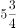
　✅
- **D**. 
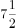

**答案**：C

**官方解析**

设丁提前干了天，根据题干条件，将甲的效率为12、乙的效率为8直接代入，列式可得：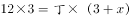，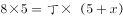，。解得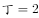，。则丙的效率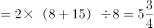。

故正确答案为C。

---

## 第 6 题　qid 2443130 · 数学运算

长为10cm的素菜蛋卷的制作方法是：用一张的蛋皮把长度为10cm的豆芽卷在里面，外形为圆柱状。某日豆芽只有7cm长,于是改变蛋卷的卷法，得到7cm的圆柱。这两种大小的蛋卷在相连接处均重叠了1cm的蛋皮，问10cm长的蛋卷与7cm长的蛋卷的体积比是<u>       </u>。

- **A**. 7:10
- **B**. 20:21
- **C**. 40:63　✅
- **D**. 1:1

**答案**：C

**官方解析**

两种卷的方式如下图所示，由于两种大小的蛋卷在相连接处均重叠了1cm的蛋皮，因此A、B方式的底面周长分别为6、9cm，则底面半径分别为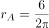、，故A、B方式两个蛋卷形成的圆柱底面积分别为、。根据圆柱体积公式：，则10cm长的蛋卷与7cm长的蛋卷的体积比为。

故正确答案为C。

---

## 第 7 题　qid 2443099 · 数学运算

两只机械手表，一只每天快18分钟，一只每天慢15分钟。现在将两只手表同时调整到标准时间，则它们再次同时显示标准时间要经过        天。

- **A**. 40
- **B**. 88
- **C**. 178
- **D**. 240　✅

**答案**：D

**官方解析**

一只表每天快18分钟，则要想再次显示标准时间，最少需要快出12小时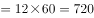分钟，因此需要天；另一只表每天慢15分钟，则要想再次显示标准时间，最少需要慢出12小时分钟，因此需要天。因此要想它们再次同时显示标准时间需要经过的天数为40、48的最小公倍数即240天。

故正确答案为D。

---

## 第 8 题　qid 2443104 · 数学运算

甲乙2艘帆船从A地到B地。无风时，甲需要12小时，乙需要15小时。如果逆风，甲的速度下降，乙的速度下降。两船同时从A地出发，中途遇逆风，但同时到达B地。那么行船过程逆风行驶<u>        </u>小时。

- **A**. 10　✅
- **B**. 8
- **C**. 6
- **D**. 5

**答案**：A

**官方解析**

赋值AB两地的距离为12、15的最小公倍数60，则甲、乙无风时的速度分别为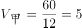，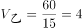。则根据条件，逆风时二者的速度分别为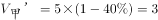，。设从A到B的过程中无风时间为，逆风时间为，则，，联立①②式解得，，故逆风时间为10小时。

故正确答案为A。

---

## 第 9 题　qid 2443108 · 数学运算

在一块草场上老李养了若干头牛和若干只羊。如果只有羊吃草，够吃16天；如果第一天牛吃，第二天羊吃，这样交替，正好整数天吃完；如果第一天羊吃，第二天牛吃，这样交替，那么比上次轮流的做法多吃半天；牛单独吃能够吃        天。

- **A**. 8　✅
- **B**. 7
- **C**. 6
- **D**. 5

**答案**：A

**官方解析**

根据题干条件，方式1：若第一天牛吃，第二天羊吃，这样交替，则按“牛羊牛羊······”依次交替，则每一个周期为2天，每周期效率；方式2：若第一天羊吃，第二天牛吃，这样交替，则按“羊牛羊牛······” 依次交替，则每一个周期为2天，每周期效率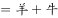，和方式1相同。

若方式1刚好吃了完整的n个周期，则方式2需要吃完整的n个周期加上半天，由于每个周期方式1和方式2的效率相等，则此时两次的量不同，存在矛盾。若方式1前面吃了完整的n个周期后再用1天吃完，则最后一天为牛吃完，此时方式2前面也吃了完整的n个周期，则倒数第二天为羊吃，最后半天为牛吃，则有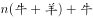，可得：，即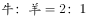。赋值牛吃草效率为2，则羊为1，此时总草量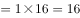，则牛单独吃需要的时间为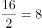天。

故正确答案为A。 

注：1.牛吃草问题会说明草匀速生长，本题没有提到草的生长，因此不考虑草生长。

2.本题若验证会发现若总量看为16份，则方式1牛羊一周期吃草3份，5个周期后还剩1份只需牛吃半天，与整数天矛盾，因此推测可能为命题人在16这里的数据设置存在问题，尽管能解出答案，但数据内部存在矛盾。

---

## 第 10 题　qid 2443112 · 数学运算

有4个盒子装有红白蓝绿四色粉笔各有若干支。任意2个盒子的粉笔的支数和分别为12、23、31、46、54、65，粉笔支数最多的盒子里同一颜色最多的粉笔至少有        支（没有并列）。

- **A**. 14
- **B**. 13　✅
- **C**. 12
- **D**. 11

**答案**：B

**官方解析**

假设四个盒子装的粉笔数分别为a支、b支、c支、d支，且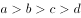，则最大的两盒支数和，第二大的两盒支数和，联立①②式可得，根据和差同性可得为奇数，则只可能是23或31，由于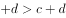，故不能为23，则。联立③④式，解得，代入①式解得，即粉笔支数最多的盒子里粉笔总数为44支。设其中同一颜色最多的粉笔有x支，要想让x尽量小，则其它几种颜色的粉笔应尽量多，构造数列如下：

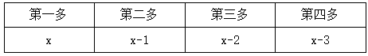

可列式为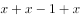，解得，因x至少为12.5，又x为整数，则x至少为13。

故正确答案为B。

---
