# 2019年重庆市法检系统招录考试《行测》题（网友回忆版）

> 数量关系 · 10 题 · 重庆 2019

## 第 1 题　qid 2423297 · 数学运算

甲和乙两个小组共同植树，计划共同花10个小时完成。但实际上甲组先单独开工，2小时后乙组加入，又过1小时后还剩3/4没有完成。已知甲组比乙组每个小时多植树10棵，问两个小组一共要植树多少棵？

- **A**. 200　✅
- **B**. 220
- **C**. 240
- **D**. 300

**答案**：A

**官方解析**

设乙每小时植树棵，则甲每小时植树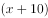棵，植树总棵数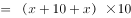。因甲先独自开工2小时，然后两人合作1小时，则甲共干3小时，乙共干1小时，此时完成总量的，则可得：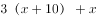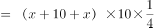，解得。则植树总棵数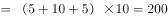棵。

故正确答案为A。

---

## 第 2 题　qid 2423308 · 数学运算

A和B两块农田种植不同品种的粮食，总产量相同。已知A农田亩产为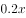吨，B农田亩产为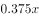吨。问两块农田总体平均亩产多少吨？

- **A**. 
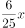

- **B**. 
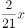

- **C**. 
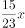

- **D**. 
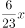
　✅

**答案**：D

**官方解析**

方法一：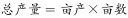，设A、B农田的亩数分别为、，根据总产量相同可得：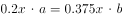，解得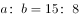。赋值A、B农田的亩数分别为15、8，则每块田地的总产量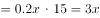。两块农田总体的平均亩产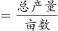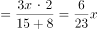。

方法二：将总产量看作总路程，平均亩产看作平均速度，直接套用等距离平均速度公式求解。代入公式：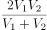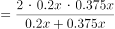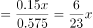。

故正确答案为D。

---

## 第 3 题　qid 2423306 · 数学运算

某网站销售10个不同档次的衬衣，其中最高档的每年销售500件，每件利润为300元。往下每降低1个档次，每年销量增加1000件，每件利润降低30元。问年总利润最高的3个档次的衬衣，全年销量之和为多少万件？

- **A**. 1.05
- **B**. 1.50
- **C**. 1.65　✅
- **D**. 1.80

**答案**：C

**官方解析**

设最高档降低档后利润最高，设利润为，则可得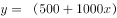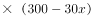，解一元二次函数的两个根得：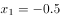，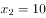。当取函数对称轴上的点时，取最大值，此时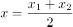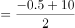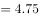。只能取整数，离峰值4.75的距离越近则函数越大，故应依次取值5、4、6，即分别比最高档降低了5、4、6档，则三档总计增加的销量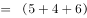，那么利润最高的3个档次的衬衣总计销量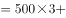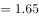万件。

故正确答案为C。

---

## 第 4 题　qid 2423311 · 数学运算

某地区招聘卫生人才，共接到600份不同求职者的简历，其中临床、口腔、公共卫生和护理专业分别有200人、160人、140人和100人。问至少有多少人被录用，才能保证一定有140名被录用的人专业相同？

- **A**. 141
- **B**. 240
- **C**. 379
- **D**. 518　✅

**答案**：D

**官方解析**

根据问法“至少······才能保证······”，可判定本题为最不利构造型最值问题。考虑最不利情况为每个专业均录用139人，但护理专业总计只有100人需要全部录用，则四个专业最不利的情况下共招录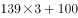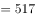人。在此基础上再多录用一人，就可以保证一定有140名被录用的人专业相同。故至少需要录用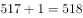人。

故正确答案为D。

---

## 第 5 题　qid 2423321 · 数学运算

地上画有45行、2列的方格阵列，45名运动员在靠左的一列站成纵队，每人站在一个方格内，且所有运动员从前到后按1～45依次编号。当听到第一声哨响时，所有编号为1的倍数的人移动到自己所在位置同一行的另外一个方格中，往后听到第n次哨响时，所有编号为n的倍数的人都要移动到自己所在位置同一行的另外一个方格中。那么哨响4次之后，站在左边一列的人比站在右边一列的人：

- **A**. 少5人
- **B**. 少9人　✅
- **C**. 多5人
- **D**. 多9人

**答案**：B

**官方解析**

方法一：

根据题意，听到第一声哨响时，所有人编号均为1的倍数，因此45人均移动到自己的右侧。

第二声哨响时，所有编号为2倍数的人均移动到自己的另一侧，即左侧，由于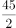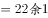，因此编号是2倍数的有22人，他们移动到左侧后，左边一列有22人，右边一列有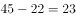人。

第三声哨响时，所有编号为3倍数的人均移动到自己的另一侧，由于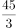，因此编号是3倍数的有15人，其中同时满足是3和2的倍数，即6倍数的有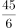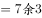，即7人，他们在左侧一列，移动到右侧，其余8人在右侧一列，则移动到左侧，左侧人数为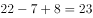人，右侧一列为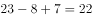人。

第四声哨响时，所有编号为4的倍数的人均移动到自己的另一侧，由于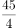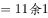，因此编号是4倍数的有11人，其中同时满足是4和6的倍数，即12倍数的有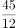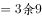，即3人，他们在右侧一列，移动到左侧，其余4倍数编号的人均在左侧，共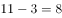人，移动到右侧，此时左侧有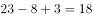人，右侧有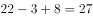人。

故哨响4次后，左侧人数比右侧人数少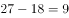人。

方法二：题目所求为哨响4次，因此编号为1、2、3、4倍数的人发生了移动，1、2、3、4的公倍数为12，因此每12个人的移动是一样的，可以按12人为一周期进行分析。前12个人的移动情况见下表：

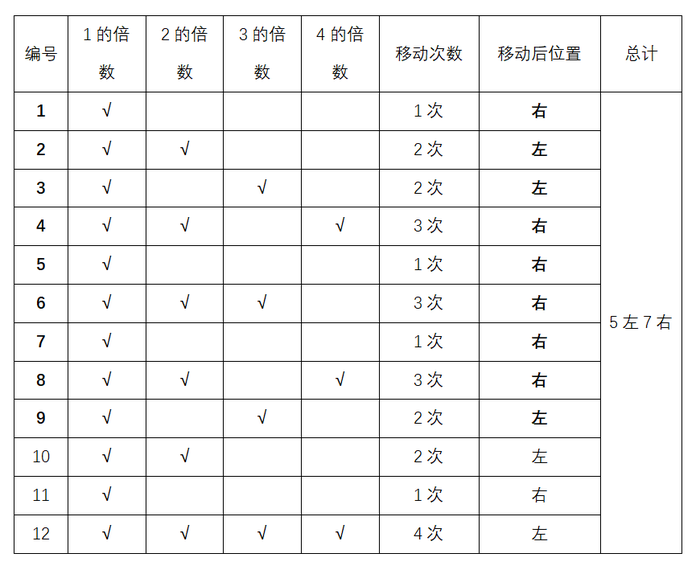

因此，4次哨响后，每12人中均有5人在左，7人在右。总共45人，人，3个周期即前36人中有人在左，人在右。剩余的9人根据上表可知有3人在左，6人在右。

故4次哨响后，共有人在左，人在右。即左侧人数比右侧人数少9人。

故正确答案为B。

---

## 第 6 题　qid 2423337 · 数学运算

球员小王与球队签订工作合同，有1年期、3年期和5年期三种合同可供选择。如果签3年期合同，月薪比5年期合同低1万元，比1年期高5000元，而5年期合同能获得的总薪水是3年期合同的2.5倍。问小王如果签1年期合同，能获得的总薪水为多少万元？

- **A**. 12
- **B**. 18　✅
- **C**. 24
- **D**. 30

**答案**：B

**官方解析**

设3年期合同月薪为万元，则5年期合同月薪为万元，1年期合同月薪为万元。由于5年期合同总薪水是3年期的2.5倍，则，解得，则1年期合同月薪为万元，故1年期合同总薪水为万元。

故正确答案为B。

---

## 第 7 题　qid 2423347 · 数学运算

有两个容器A和B，容器中原有不等量的水。分别放入葡萄糖后，容器A葡萄糖液体质量270克，浓度为；容器B葡萄糖液体质量150克，浓度为。若往两个容器分别倒入等量的水，使两个容器的葡萄糖浓度相同，那么需要分别倒入多少克水？

- **A**. 30
- **B**. 50
- **C**. 70
- **D**. 90　✅

**答案**：D

**官方解析**

容器A中有葡萄糖溶液270克，浓度，则其中含有葡萄糖（溶质）克，容器B中有葡萄糖溶液150克，浓度，则其中含有葡萄糖克。假设加入克水后容器A和容器B中的葡萄糖液体浓度相同，利用公式浓度可得，，解得克。

故正确答案为D。

---

## 第 8 题　qid 2423349 · 数学运算

某点心铺的糕点按每斤24元销售，周六店庆时按每斤20元销售。如果某单位为举办茶话会在周五、周六共买了33斤的糕点，且两次花的钱相等，那么该单位周五买了多少斤糕点？

- **A**. 15　✅
- **B**. 17
- **C**. 19
- **D**. 21

**答案**：A

**官方解析**

设该单位周五买了斤糕点，周六买了斤糕点，根据题干可得方程：，解得。

故正确答案为A。

---

## 第 9 题　qid 2423291 · 数学运算

甲从邮局出发去图书馆，乙从图书馆出发去邮局。两人12点同时出发，相向而行。12点40分两人相遇并继续以原速度前行。13点12分甲到达图书馆后立刻返回邮局。假定两人速度不变，甲返回邮局时，乙已到邮局多长时间了？

- **A**. 40分钟
- **B**. 50分钟
- **C**. 54分钟　✅
- **D**. 64分钟

**答案**：C

**官方解析**

设甲的速度为，乙的速度为，邮局和图书馆的距离为。甲乙相遇时各行驶40分钟，甲到达图书馆时行驶72分钟，根据题干，可得方程组：

 ①

 ②

解得，路程相同时，速度与时间成反比，则，分钟，则分钟。

当甲返回邮局时，共行驶分钟，此时乙已经到邮局分钟。

故正确答案为C。

---

## 第 10 题　qid 2423296 · 数学运算

某医院内科，今年门诊人数比上一年增加了，平均每位患者的门诊花费比上一年下降了，若上一年该医院内科门诊收入为3000万元，那么今年的门诊收入大约是多少万元？

- **A**. 2600
- **B**. 2880
- **C**. 3120　✅
- **D**. 3640

**答案**：C

**官方解析**

设该医院去年门诊人数为，平均每位患者的门诊花费为，由题干可得：去年该医院内科门诊收入万元。

根据题意，今年门诊人数为，平均每位患者的门诊花费为，则今年该医院内科门诊收入万元。

故正确答案为C。

---
