# 2019年重庆市选调优秀大学生到基层工作考试《行测》题

> 数量关系 · 13 题 · 选调 2019

## 第 1 题　qid 2668504 · 数学运算

-2，7，6，19，22，（    ）

- **A**. 33
- **B**. 39　✅
- **C**. 42
- **D**. 54

**答案**：B

**官方解析**

数列无明显特征，且作差无规律，考虑作和。两两作和形成新数列：5、13、25、41、（    ），新数列的后项减去前项可得：8、12、16、（20），是公差为4的等差数列，则新数列的下一项为，所求项为。

故正确答案为B。

---

## 第 2 题　qid 2668510 · 数学运算

-3，，，2，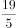，（    ）

- **A**. 

- **B**. 

　✅
- **C**. 
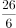

- **D**. 
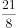

**答案**：B

**官方解析**

题干为分数数列且存在整数，考虑反约分，得到新数列：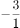、、、、、（    ）。分母是连续自然数列，则所求项的分母为6；分子部分为-3、-1、2、8、19、（    ），后项减去前项得到新数列2、3、6、11、（    ），无明显规律，再次作差得到1、3、5、（7），是公差为2的等差数列，则新数列的下一项为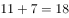，所求项的分子为，故所求项为。

故正确答案为B。

---

## 第 3 题　qid 2668513 · 数学运算

2.58，8.16，24.32，64.64，（    ）

- **A**. 160.28　✅
- **B**. 124.26
- **C**. 180.56
- **D**. 126.88

**答案**：A

**官方解析**

题干都为小数，优先考虑机械划分。整数部分：2、8、24、64、（    ），因式分解可得：、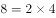、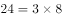、，“”前是连续自然数列，“”后是公比为2的等比数列，则所求项的整数部分为；小数部分为58、16、32、64、（    ），观察可得：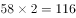，，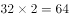，即前一项2的末两位为下一项，则所求项的小数部分为的后两位，即为28。故所求项为160.28。

故正确答案为A。

---

## 第 4 题　qid 2669442 · 数学运算

甲、乙两人分别送材料到对方单位，两人同时出发，各自匀速前进，甲的速度是2米/秒，乙的速度是2.5米/秒，两人到单位交材料的时间忽略不计，到达目的地都立即以原速度返回，两人首次在距离甲单位700米处相遇，后来又在距离乙单位525米处相遇，则甲、乙两个单位相距（    ）米。

- **A**. 1575　✅
- **B**. 1020
- **C**. 1100
- **D**. 720

**答案**：A

**官方解析**

方法一：由题意可知，首次相遇时甲走了700米，用时为秒。则甲、乙两地距离即为相遇距离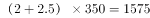米。

方法二：两人同时出发，则首次相遇时，两人所用时间相同，则两人路程与速度成正比。设全程为，甲走了700米，则乙走了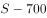米，可得，整理得米。

方法三：由题意可知，，则两人首次相遇时，，则甲、乙两地距离米，选项中大于1400的只有A项。

故正确答案为A。

---

## 第 5 题　qid 2669445 · 数学运算

某牧场长满牧草，牧草每天均匀生长，牧场可供100头牛吃20天，可供150头牛吃10天，则这片牧场可供250头牛吃（    ）天。

- **A**. 5　✅
- **B**. 6
- **C**. 7
- **D**. 8

**答案**：A

**官方解析**

设牧场原有草量为，草每天的生长速度为，根据牛吃草公式，可得：······①，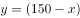······②，联立两式解得，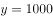。若这片牧场可供250头牛吃天，则有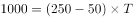，解得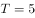天。

故正确答案为A。

---

## 第 6 题　qid 2669446 · 数学运算

某美容美发店有两位理发师，现同时来了5位有不同理发需求的顾客，通常情况下，这5位顾客需要的理发时间分别为10分钟、12分钟、15分钟、20分钟和24分钟，要使顾客理发时间最少并且他们等候的时间之和最少，那么其中一位理发师理发用时至少为（    ）分钟。

- **A**. 27
- **B**. 30
- **C**. 32　✅
- **D**. 35

**答案**：C

**官方解析**

五位顾客理发的时间是固定的，要使等候的时间最少，则让理发时间短的顾客排在前面。

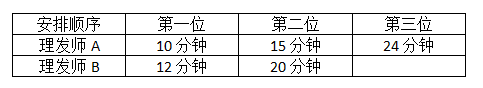

符合题意的一种安排顺序如表格所示，总的等待时间最短为分钟。则其中一位理发师用时至少为分钟。

故正确答案为C。

注意：以下几种安排顺序也符合总的等待时间最短。

但是不符合其中一位理发师理发用时最少。

---

## 第 7 题　qid 4695862 · 数学运算

将1至8这八个数字分别填入下图的圆圈中，已知每个三角形圆圈中的数字之和为13，大正方形四个顶点之一的圆圈中不可能填数字（    ）。

- **A**. 7
- **B**. 6
- **C**. 5　✅
- **D**. 4

**答案**：C

**官方解析**

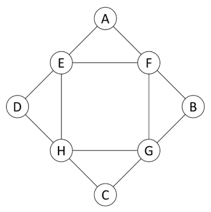

设大正方形四个顶点的数字分别为A、B、C、D，小正方形的四个顶点的数字分别为E、F、G、H。由圆圈中是“1至8这八个数字分别填入”可得：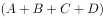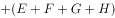······①；由“每个三角形圆圈中的数字之和为13”可得：（A+E+F）+（B+F+G）+（C+G+H）+（D+H+E）=（A+B+C+D）+（E+F+G+H）×2=13×4=52······②。联立①②两式，解得A+B+C+D=20，E+F+G+H=16。由题可得：E+F=13-A，G+H=13-C，两式相加可得：E+F+G+H=26-（A+C）=16，即A+C=10，结合选项数据，若A或C为5，则另一个数也为5，不符合题意。因此，A、C不可能为5，B、D同理，则大正方形四个顶点之一的圆圈中不可能填数字5。

故正确答案为C。

---

## 第 8 题　qid 2669447 · 数学运算

某国际会议需要翻译人员服务，现有翻译人员11人，其中5人只会英语，4人只会日语，另外2人不仅会英语也会日语，现从这11人中选4人当英语翻译，再从其余人中选4人当日语翻译，则不同的安排方法共有（    ）种。

- **A**. 145
- **B**. 160
- **C**. 185　✅
- **D**. 190

**答案**：C

**官方解析**

选择4位英语和4位日语翻译，可分为以下几类情况：

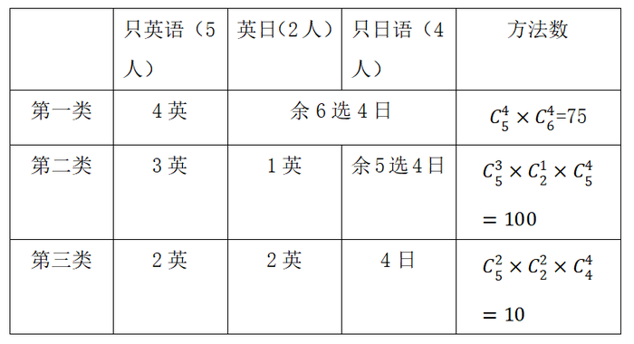

分类相加，则满足题意的安排方法数共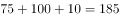种。

故正确答案为C。

---

## 第 9 题　qid 2669448 · 数学运算

某年级有学生100名，在数学考试中62人得满分，在英语考试中34人得满分，有11人两门课程都得满分，那么两门课程都没有得满分的有（    ）人。

- **A**. 26
- **B**. 15　✅
- **C**. 96
- **D**. 89

**答案**：B

**官方解析**

设两门课程都没有得满分的有人，根据两集合容斥原理公式：，可得：，解得。

故正确答案为B。

---

## 第 10 题　qid 2669449 · 数学运算

一咖啡厅实际销售时常将A、B两种咖啡以x：y之比（以质量计）混合，A的原价为50元/千克，B的原价为40元/千克，近来A的价格增加，而B的价格减少，在销售价格不变的情况下，为了成本不变，那么x：y应等于：

- **A**. 2：3
- **B**. 5：6
- **C**. 6：5　✅
- **D**. 3：2

**答案**：C

**官方解析**

方法一：根据前后销售价格不变，可知：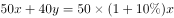，整理可得x：y=6：5。

方法二：选项为一组数，可以尝试代入排除。

代入A项，假如，，则，即，不符合前后销售价格不变，排除。

代入B项，假如，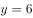，则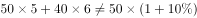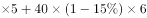，即，不符合前后销售价格不变，排除。

代入C项，假如，，则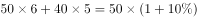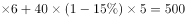，符合前后销售价格不变，当选。

代入D项，假如，，则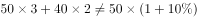，即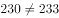，不符合前后销售价格不变，排除。

（注意：考场上A、B两项可用尾数法快速排除，选出C项后，D项不用再代入）

故正确答案为C。

---

## 第 11 题　qid 2669450 · 数学运算

搬运工李强承担了为某公司搬运1000只玻璃瓶的任务，按照约定，安全运到1只可得搬运费0.3元，但打破1只，搬运费为0元并且需赔偿0.5元，运完玻璃瓶后该公司共支付李强260元，那么李强在搬运中一共打碎玻璃瓶（    ）只。

- **A**. 46
- **B**. 48
- **C**. 50　✅
- **D**. 52

**答案**：C

**官方解析**

设李强在搬运中一共打碎玻璃瓶只，则安全运到只，可得：，即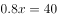，解得。

故正确答案为C。

---

## 第 12 题　qid 2669451 · 数学运算

2019年1月12日是星期六，那么，2040年1月12日是：

- **A**. 星期二
- **B**. 星期三
- **C**. 星期四　✅
- **D**. 星期五

**答案**：C

**官方解析**

一周7天，平年有365天，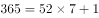，所以，每经历一个平年（365天），星期往后推一天；闰年有366天，，所以，每经历一个闰年（366天），星期往后推两天。

2019年1月12日-2040年1月12日，共21年。根据4年一闰，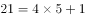，即21年中有5个闰年（2020、2024、2028、2032、2036是闰年，注意不包含2040年），那么剩下的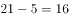年是平年。

2019年1月12日是星期六， 2040年1月12日是：星期六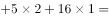星期六，即：星期六，星期六往后推5天是星期四。

故正确答案为C。

---

## 第 13 题　qid 2669452 · 数学运算

把19个棱长为2厘米的正方体重叠起来，拼成一个立体图形，如图所示，则这个立方体的表面积为（    ）平方厘米。

- **A**. 56
- **B**. 54
- **C**. 216　✅
- **D**. 224

**答案**：C

**官方解析**

棱长为2厘米的正方体，每个表面的面积为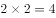平方厘米。如图所示，拼成的立体图形为不规则图形，其表面积上面下面左面右面前面后面，需要数一数每个大面的小正方形个数即可。

上面和下面都是9个正方形，上下面积为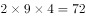平方厘米；

前面和后面都是10个正方形，前后面积为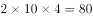平方厘米；

左面和右面都是8个正方形，左右面积为平方厘米。

所以这个立方体的表面积为平方厘米。

故正确答案为C。

---
