# 2019年青海省公务员录用考试《行测》题省市州级（A类）（网友回忆版）

> 数量关系 · 10 题 · 青海 2019

## 第 1 题　qid 2394004 · 数学运算

实验室有A、B、C三个实验试管，分别装有10克、15克、20克的水，小明把含有一定浓度的10克药水倒进A试管中，混合后取出10克倒入B试管中，再次混合后，从B试管中取出10克倒入C试管中，最后用化学仪器检测出C试管中药水浓度为。试计算刚开始倒入A试管中药水的浓度是多少？

- **A**. 

- **B**. 

- **C**. 

　✅
- **D**. 

**答案**：C

**官方解析**

设最初倒入A试管中药水的浓度为，则：

A混合后取出10克的浓度为；

B混合后取出10克浓度为；

C混合后浓度为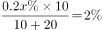，解得。

所以最初倒入A试管中药水的浓度为。

故正确答案为C。

---

## 第 2 题　qid 2394006 · 数学运算

正值毕业季，306宿舍有A、B、C、D四位男同学，他们准备找班主任宋老师合影，若要求宋老师坐正中间，A、B两位同学不能挨着坐，那么总共有多少种坐法？

- **A**. 8种
- **B**. 12种
- **C**. 16种　✅
- **D**. 24种

**答案**：C

**官方解析**

方法一：根据题意，包括老师一共5人，要求老师在中间，则老师左边和右边各两个人。考虑A、B不相邻，则A、B分别在老师左右两边， C、D也分别在老师的左右两边。先安排A、B，在老师左边两个空中挑一个 ，在右边两个空中挑一个 ，考虑A、B顺序，剩下两个空放C、D，考虑顺序，所以共有种。

方法二：本题正面情况较为复杂考虑从反面出发进行求解。总情况老师在中间其余四人共四个位置共种情况。反面情况A、B两同学相邻，先安排AB两人相邻且在老师的左侧或是右侧，有2种情况，再考虑两人的相对位置有种情况，其余两人只能在AB的另一侧考虑相对位置有种情况，则反面情况共有种情况。 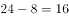 种。

故正确答案为C。 

---

## 第 3 题　qid 2394009 · 数学运算

一个时钟每小时慢4分钟，照这样计算，早上6:00对准标准时间后，当日晚上该时钟指向8:00时，标准时间是多少？

- **A**. 20:56
- **B**. 21:00　✅
- **C**. 21:30
- **D**. 21:56

**答案**：B

**官方解析**

根据题意可知当标准钟走60分钟时，慢钟走56分钟，所以慢钟与标准钟速度之比为56:60。慢钟早上6:00对准标准时间后，到晚上8:00共经过14个小时。假设标准钟经过小时，则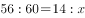，解得小时，所以标准钟从早上6:00开始走了15个小时，即21:00。

故正确答案为B。

---

## 第 4 题　qid 2394013 · 数学运算

陈老师奖励小美、小林、小红各人民币若干元，三人去文具店买学习用品。其中，小美买了6支中性笔，小林买了3支钢笔，小红买了2支钢笔、1支中性笔和2支铅笔。已知三人用去的钱数一样，则3支钢笔的价格是几支铅笔的价格？

- **A**. 4支
- **B**. 8支
- **C**. 10支
- **D**. 12支　✅

**答案**：D

**官方解析**

赋值三人所花钱数均为6元，可得每支中性笔价格为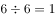元，每支钢笔价格为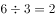元，每支铅笔的价格为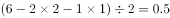元。

则题目所求为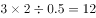支，即3支钢笔的价格等于12支铅笔的价格。

故正确答案为D。

---

## 第 5 题　qid 2394015 · 数学运算

林华全家是阅读爱好者，家里有各种书籍，版本也多。已知他家有五分之三的书是中文版的，六分之一是英文版的，八分之一是中英文互译版的，还有多于11本但少于17本是其它版本的，问他家有多少本英文版书？

- **A**. 72本
- **B**. 20本　✅
- **C**. 15本
- **D**. 13本

**答案**：B

**官方解析**

根据题意可得，林华家其他版本的书占总数的比重为，根据倍数特性可知林华家书的总数是120的倍数，其它版本的书是13的倍数，又因为其它版本多于11本但少于17本，所以其他版本数量刚好为13本，则书的总数为120本。所以题目所求英文版的书数量为本。

故正确答案为B。

---

## 第 6 题　qid 2393944 · 数学运算

某日停电，房间里同时点燃了两支同样长的蜡烛，两支蜡烛的质量不同，一支可以维持4小时，一支可以维持7小时。来电时，发现其中一支剩下的长度是另一支剩下长度的4倍，请问这次停电时间是多久？

- **A**. 2.5小时
- **B**. 3小时
- **C**. 3.5小时　✅
- **D**. 3.8小时

**答案**：C

**官方解析**

假设两支蜡烛总长度均为28，则两支蜡烛每小时燃烧的速度分别为7和4。设停电时间为小时，根据题干条件可列方程：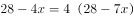，解得小时。

故正确答案为C。

---

## 第 7 题　qid 2393961 · 数学运算

汽车在平直的公路上运动，它先以速度行驶了2/5的路程，接着以的速度驶完余下的3/5路程，若全程平均速度是，则是多少？

- **A**. 
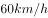

- **B**. 

- **C**. 

　✅
- **D**. 

**答案**：C

**官方解析**

设总路程为5S,则，解得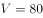。

故正确答案为C。

---

## 第 8 题　qid 2393980 · 数学运算

一个长方体木块恰能切割成五个正方体木块，五个正方体木块表面积之和比原来的长方体木块的表面积增加了。则长方体木块的体积为多少？

- **A**. 

　✅
- **B**. 
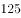

- **C**. 

- **D**. 

**答案**：A

**官方解析**

一个长方体恰好切成五个小正方体，多出的总面积即新生成的8个截面的面积和（一个截面即小正方体一个面），设小正方体棱长为，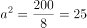，可得，一个小正方体的体积为，那么长方体的体积（即5个小正方体的体积）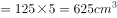。

故正确答案为A。

---

## 第 9 题　qid 2393986 · 数学运算

小王负责甲、乙、丙、丁四个采购基地的采购任务，甲、乙、丙、丁四基地分别需要每隔2天、4天、6天、7天去采购一次。7月1日，小王分别去了四个基地采购，问他整个7月有几天不用去采购基地采购？

- **A**. 10天
- **B**. 11天　✅
- **C**. 12天
- **D**. 13天

**答案**：B

**官方解析**

7月份日期列表如下，已按题意将任务分配在表格中：

由表格中可以看出，2、3、5、12、14、18、20、23、24、27、30日不去，所以7月份不去基地的天数共有11天。

故正确答案为B。

---

## 第 10 题　qid 2393992 · 数学运算

某企业设计了一款工艺品，每件的成本是70元，为了合理定价，投放市场进行试销。据市场调查，销售单价是120元时，每天的销售量是100件，而销售单价每降价1元，每天就可多售出5件，但要求销售单价不得低于成本。则销售单价为多少元时，每天的销售利润最大？

- **A**. 100元
- **B**. 102元
- **C**. 105元　✅
- **D**. 108元

**答案**：C

**官方解析**

设降价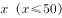元，总利润为，根据，得，令，解得 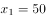， ，当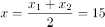时， 取得最大值，即售价为元时，利润最大。

故正确答案为C。

---
