# 2019年青海省法院、检察院录用考试《行测》题

> 数量关系 · 10 题 · 青海 2019

## 第 1 题　qid 2440184 · 数学运算

小明计划到商店为自己购买衣服和鞋子，预算不超过800元，已知衣服每套的售价是99元，每双鞋子的售价是67元，如果小明至少要买4套衣服和3双鞋。那么他有多少种不同的购买方式？

- **A**. 5
- **B**. 7　✅
- **C**. 8
- **D**. 4

**答案**：B

**官方解析**

买4套衣服和3双鞋合计花费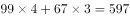元，预算不超过800元，故还剩元，此时接下来的花费不超过203元即可。列表枚举如下：

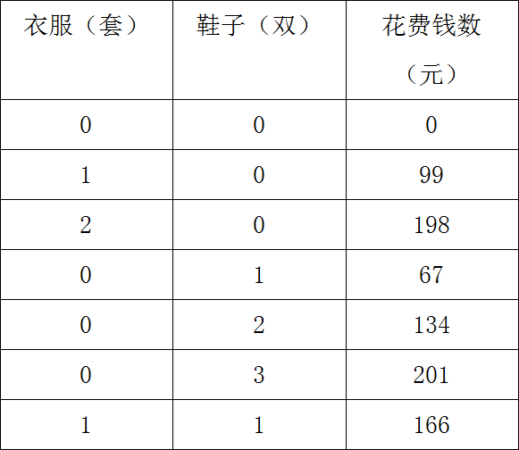

则一共有7种购买方式。

故正确答案为B。

---

## 第 2 题　qid 2440188 · 数学运算

某超市为了增加收入，开展“8个空啤酒瓶换1瓶啤酒”的促销活动，老李在活动期间共购买了127瓶啤酒，期间老李不断用空啤酒瓶去换啤酒，请问老李在活动期间一共喝掉了多少瓶啤酒？

- **A**. 140
- **B**. 142
- **C**. 143
- **D**. 145　✅

**答案**：D

**官方解析**

根据空瓶换酒公式：个酒瓶可以换1瓶酒，个空瓶最多可以喝到瓶酒。8个空酒瓶换1瓶啤酒，老李花钱买了127瓶啤酒，产生的127个空瓶，最多可喝到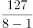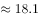瓶酒，因啤酒数一定是整数，故最多可以喝到18瓶酒。加上花钱买到127瓶酒，一共可以喝到瓶。

故正确答案为D。

---

## 第 3 题　qid 2440191 · 数学运算

一次期末考试，某班同学成绩统计如下表：

求：这个班最多有多少人？

- **A**. 45
- **B**. 51　✅
- **C**. 53
- **D**. 55

**答案**：B

**官方解析**

根据三集合标准公式：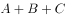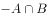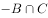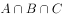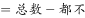，设三门功课均90分以上的人数为，代入公式可得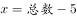，化简得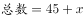。求总数最多则最多，而三门功课均90分以上的人数一定小于或等于数学和语文90分以上的人数，即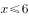。

则当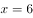时，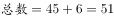人，此时班里人数最多。

故正确答案为B。

---

## 第 4 题　qid 2440192 · 数学运算

A、B二人开车同时从甲地到乙地，A到达乙地后立即返回，在距乙地64千米处与B相遇，已知A每小时行40千米，B每小时行24千米，求甲乙两地相距多少千米？

- **A**. 192
- **B**. 256　✅
- **C**. 320
- **D**. 512

**答案**：B

**官方解析**

设甲乙两地相距千米，则相遇时A所走的路程为千米，B所走的路程为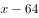千米。A、B二人同时出发，相遇时所用时间相同，因此，路程和速度成正比。可得：，解得千米。

故正确答案为B。

---

## 第 5 题　qid 2440193 · 数学运算

某单位老刘有一个紧急通知要通知到60名同事，假如每通知一位同事需要1分钟，同事接电话后也可以互相通知，要使所有同事都接到通知至少需要几分钟？

- **A**. 6　✅
- **B**. 7
- **C**. 8
- **D**. 9

**答案**：A

**官方解析**

根据题意，每通知一位同事需要1分钟，同事接到电话后可以互相通知，可得：
第一分钟时，老刘可通知到1位同事，共2人接到通知；
第二分钟时，2人可通知到2位同事，共4人接到通知；
第三分钟时，4人可通知到4位同事，共8人接到通知；
第四分钟时，8人可通知到8位同事，共16人接到通知；
第五分钟时，16人可通知到16位同事，共32人接到通知；
第六分钟时，32人可通知到32位同事，能够接到通知的人数可达64人；
因包含老刘在内，总共有61人，则六分钟即可完成。
故正确答案为A。

---

## 第 6 题　qid 2440200 · 数学运算

某环形跑道，两人由同一起点同时出发，异向而行，每隔10分钟相遇一次；如果两人由同一起点同时出发，同向而行，每隔25分钟相遇一次。已知环形跑道的长度是1800米，那么两人的速度分别是多少？

- **A**. 126米/分  54米/分　✅
- **B**. 138米/分  42米/分
- **C**. 110米/分  70米/分
- **D**. 100米/分  80米/分

**答案**：A

**官方解析**

在环形跑道中，由同一起点异向而行，相遇一次时两人共走一个全程，用时10分钟，则：，解得两人速度和为180米/分；由同一起点同向而行，相遇一次时快者比慢者多走一个全程，用时25分钟，则：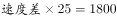，解得两人速度差为72米/分，结合选项只有A项满足。

故正确答案为A。

---

## 第 7 题　qid 2440202 · 数学运算

甲乙丙三人完成同一幅拼图的时间分别需要1小时、1.2小时、1.5小时。现在有两幅拼图需要甲、乙完成，两人同时开始，丙刚开始帮助甲拼拼图，后来又帮助乙拼，最后两个拼图同时完成。问：丙分别帮助甲、乙多长时间？

- **A**. 0.1小时  0.3小时
- **B**. 0.3小时  0.5小时　✅
- **C**. 0.5小时  0.6小时
- **D**. 0.6小时  0.2小时

**答案**：B

**官方解析**

赋值一幅拼图的工作总量为6，则甲、乙、丙的效率分别为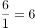、、。由于同时开始，同时结束，因此在两幅拼图完工过程中，甲、乙、丙始终在工作，假设工作时间总计为，则有，解得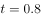小时。甲的工作量为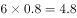，则丙帮甲干的时间为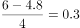小时，则丙帮乙干的时间为小时。

故正确答案为B。

---

## 第 8 题　qid 2440204 · 数学运算

某文具店老板第一次以100元购买了一批铅笔，按每支定价2.8元出售。第二次购买时每支铅笔的批发价比第一次多了0.5元，共花费150元，购买的数量比第一次多10支，当这批铅笔售出时，正好遇到文具店店庆，剩余的铅笔以定价6折售出。那么，该文具店老板第二次批发的铅笔都售出后盈利多少或亏损多少？

- **A**. 盈利26.8元
- **B**. 亏损26.8元
- **C**. 盈利2.16元
- **D**. 亏损2.16元　✅

**答案**：D

**官方解析**

设第一次每支铅笔批发价元，买了支，则第二次每支铅笔批发价为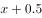元，购买数量为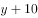支。根据题意有，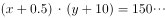，联立、②式，解得两组解元，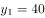支；元，支。则第二次购买量为支或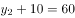支。若第二次购买50支，则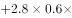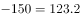元，即亏损26.8元；若第二次购买60支，则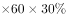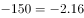元，即亏损2.16元。

B、D选项均能计算出，但若答案为B，则第二次每支铅笔批发价为元，而定价仅为2.8元，最初定价比成本还低，不符合常识，因此倾向于选D。

故正确答案为D。

---

## 第 9 题　qid 2440210 · 数学运算

某品牌月饼进价比上月提高了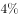，某商场仍按上月售价销售该品牌月饼，利润率比上月下降了5个百分点，那么该商场上月销售该品牌月饼的利润率是多少？

- **A**. 

- **B**. 

- **C**. 

　✅
- **D**. 

**答案**：C

**官方解析**

赋值上月进价为100，则本月进价为，设售价为，根据题意列表如下：

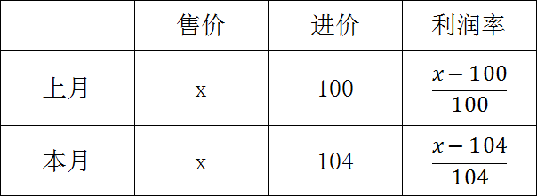

利润率比上月下降了5个百分点，则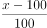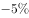，解得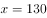，则上月利润率为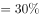。

故正确答案为C。

---

## 第 10 题　qid 2440211 · 数学运算

小李打算买38个梨和苹果，已知苹果每个3元，梨每个2元，现要求苹果的数量不得少于梨的3倍，那么各买多少苹果和梨才能使花费最少？

- **A**. 30  8
- **B**. 28  10
- **C**. 33  5
- **D**. 29  9　✅

**答案**：D

**官方解析**

方法一：设买梨个，则买苹果个。根据苹果数量不少于梨的3倍，可得：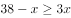，化简得。因为梨便宜，所以总个数38不变的情况下，梨买得越多花费越少，所以当（梨的数量）取最大值9（只能取整数）的时候，花费最少。

方法二：选项信息充分，考虑代入排除法。

A项：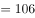元；

B项：28少于10的3倍，不符合题意，直接排除；

C项：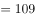元；

D项：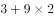元。

故正确答案为D。

---
