# 2019深圳市公务员录用考试《行测》题（网友回忆版）

> 数量关系 · 12 题 · 深圳市考 2019

## 第 1 题　qid 2385183 · 数学运算

1，3，-1，-5，11，（  ）

- **A**. -49
- **B**. -1
- **C**. -61　✅
- **D**. 0

**答案**：C

**官方解析**

数列无任何特征，作差、递推等常规思路均无规律。观察加和后发现，；；。即相邻三项中，三项之和=前两项乘积。依此规律可得：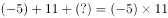，则所求项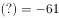。

故正确答案为C。

---

## 第 2 题　qid 2385184 · 数学运算

，，（  ），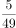，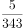

- **A**. 

　✅
- **B**. 

- **C**. 
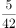

- **D**. 
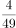

**答案**：A

**官方解析**

数列中最后一项的分母343恰好为，由此考虑将分母部分转化为幂次形式。原数列可转化为：  、   、（）、  、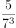 。分子部分均为5，分母部分的底数均为7、指数是公差为1的等差数列，所求项的分母部分指数应为1，即分母为。则题干所求项为。

故正确答案为A。

---

## 第 3 题　qid 2385187 · 数学运算

某工厂生产冶金模具，去年按定价的出售，获得了的利润率；今年由于工厂迁址，使得成本下降，按原定价的出售，可获得的利润率。去年成本与今年成本之比为（  ）。

- **A**. 4：3
- **B**. 10：9　✅
- **C**. 16：9
- **D**. 75：64

**答案**：B

**官方解析**

赋值去年的成本为100，设今年的成本为，根据条件可得：

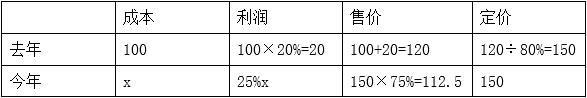

由表格可得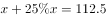,解得：。因此去年与今年成本之比为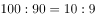。

故正确答案为B。

---

## 第 4 题　qid 2385188 · 数学运算

某公司每月成本比上月增加10万元，收入比上月增加。已知该公司今年1月份亏损10万元，2月份亏损8万元，则该公司在今年（  ）月份可以第一次实现盈利。

- **A**. 3
- **B**. 4　✅
- **C**. 5
- **D**. 6

**答案**：B

**官方解析**

设1月成本为，由于每月成本比上月增加10万元，可得2月成本为。结合条件列表如下：

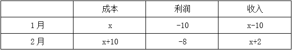

由于收入比上月增加，因此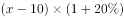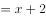，解得。故2月收入为72，成本为80。要想第一次实现盈利，即收入＞成本，从小到大代入选项验证：

代入A项，3月收入为，成本为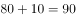，为亏损状态，排除；

代入B项，4月收入为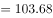，成本为，首次出现盈利。

故正确答案为B。

---

## 第 5 题　qid 2385189 · 数学运算

某市在工作日对本地机动车实行尾号限行，规则为：周一限行“1”“9”，周二限行“2”“8”，周三限行“3”“7”，周四限行“4”“6”，周五限行“5”“0”。已知某年7月份尾号“1”“9”和“5”“0”的限行天数一样多，则该年的7月1日是（  ）。

- **A**. 周六
- **B**. 周日
- **C**. 周一
- **D**. 周二　✅

**答案**：D

**官方解析**

根据题意，某年7月份尾号“1”“9”和“5”“0”的限行天数一样多，即7月中周一和周五的天数一样多。7月共31天，将其拆分为前面3天+后面28天两部分进行分析。
后面连续的28天中一定包含完整的4周，因此周一和周五均各有4天。而前面连续的3天中如果包括周一，则一定不可能包括周五。因此若包括了周一或周五中任意1天，都会导致周一和周五天数不一样多，所以要满足周一周五一样多，则前三天一定不包括周一和周五。故该月的前三天一定为周二、周三、周四，因此该年7月1日为周二。
故正确答案为D。

---

## 第 6 题　qid 2385190 · 数学运算

王某出资10万元投资甲、乙、丙三只股票，且投资乙股、丙股的金额相同。他在甲股上涨、乙股上涨，丙股下跌时将全部股票抛出，共获利12万元（不考虑其他费用）。那么，王某投资甲、乙两只股票的金额比例是（  ）。

- **A**. 8：1
- **B**. 3：1
- **C**. 4：3　✅
- **D**. 6：1

**答案**：C

**官方解析**

由于投资乙、丙股票的成本相同，而乙上涨，丙下跌，说明这两部分的总收益为0，则获利的12万均为甲上涨的收益。

假设甲股票成本为，上涨后的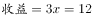万，则甲股票成本万。由于总成本10万，那么万，因此王某投资甲乙两支股票的金额之比为。

故正确答案为C。

---

## 第 7 题　qid 2385089 · 数学运算

某次运动会需组织长宽相等的方阵。组织方安排了一个鲜花方阵和一个彩旗方阵，两个方阵分别入场完毕后又合成一个方阵，鲜花方阵的人恰好组成新方阵的最外圈。已知彩旗方阵比鲜花方阵多28人，则新方阵的总人数为（  ）。

- **A**. 100　✅
- **B**. 144
- **C**. 196
- **D**. 256

**答案**：A

**官方解析**

由于方阵长宽相等，假设彩旗方阵每边人数为，则彩旗方阵总人数为。鲜花方阵和彩旗方阵组成新方阵后，鲜花方阵恰好为最外围，即彩旗方阵再往外拓宽的一层。那么，彩旗方阵每边人，则鲜花方阵边长每边人，故鲜花方阵人数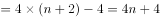。根据彩旗方阵比鲜花方阵多28人可得：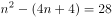，解得，因此新方阵最外层每边人，共人。

故正确答案为A。

---

## 第 8 题　qid 2385090 · 数学运算

小孟驾驶汽车沿一条笔直公路匀速行驶。某一时刻，小孟先看到路边的第一个里程碑，上面刻的公里数X为两位数。半小时后，他又看到第二个里程碑，上面刻的公里数Y恰好由X的十位数和个位数交换位置所成。又过了半小时，他看到第三个里程碑，上面刻的公里数Z恰好由X的两位数中间添一个0所成。再过一小时，小孟自看到第一个里程碑起共驾驶了（  ）公里。

- **A**. 120
- **B**. 150
- **C**. 180　✅
- **D**. 200

**答案**：C

**官方解析**

设第一个里程碑上刻的里程数，则第二个里程碑上刻的里程数,第三个里程碑上刻的里程数。由于从第一个里程碑到第二个里程碑与从第二个里程碑到第三个里程碑经历的时间均为半小时，且车速不变，则走过的路程相同，可得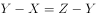即，解得。由于和均为一位数，故，，所以，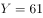，，汽车每半小时走的路程为。经过第三块里程碑后再多走1小时，那么此时的总时间应比经过第一块里程碑时多小时，此时走的路程应比通过第一块里程碑时多走公里。

故正确答案为C。

---

## 第 9 题　qid 2385091 · 数学运算

某类商品按质量分为8个档次，最低档次商品每件可获利8元，每提高一个档次，则每件商品的利润增加2元。最低档次商品每天可产出60件，每提高一个档次，则日产量减少5件。若只生产其中某一档次的商品，则每天能获得的最大利润是（  ）元。

- **A**. 620
- **B**. 630
- **C**. 640　✅
- **D**. 650

**答案**：C

**官方解析**

设产品提高了个档次，每日获得总利润为，则每件的利润为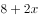元，每日售出的数量为，那么每天获得的利润。当时，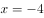或12，若让每天获得的利润最大，此时应取-4与12的平均值4，此时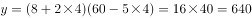。 

故正确答案为C。

---

## 第 10 题　qid 2385092 · 数学运算

某自驾游车队由6辆车组成，车队的行车顺序有如下要求：甲车不能排在第一位，乙车必须排在最后一位，丙车必须排在前两位，且任一车辆均不得超车或并行。该车队的行车顺序共有（  ）种可能。

- **A**. 36
- **B**. 42　✅
- **C**. 48
- **D**. 54

**答案**：B

**官方解析**

对丙车的位置进行分类讨论：①若丙车排在第一位，乙车排在最后一位，则剩下的4辆车可随意排列，情况数为；②若丙车排在第二位，乙车排在最后一位，由于甲车不能排在第一位，那么分步讨论。先从剩下的丁、戊、己三辆车中选一辆排在第一位，有种情况，剩下的最后三辆车任意排列情况数为，故共有种情况。该车队的排序共有24+18=42种情况。

故正确答案为B。

---

## 第 11 题　qid 2385094 · 数学运算

某公司组织所有员工分乘一批大巴去旅游，要求每辆大巴乘坐员工人数不超过35人。若每车坐28人，则有1人坐不上车；若开走1辆空车，则所有员工恰好可平均分乘到各车。该公司共有员工（  ）人。

- **A**. 281
- **B**. 589
- **C**. 841　✅
- **D**. 981

**答案**：C

**官方解析**

利用代入排除法

公司总人数恰好平均分到剩余的车上，则总人数可被剩余车辆数整除，观察数据可知只有841可被29整除。

故正确答案为C。

---

## 第 12 题　qid 2385095 · 数学运算

某家庭有爸爸、妈妈、女儿3人，今年每2人的平均年龄加上余下1人的年龄之和，分别为39、52、53，则3人中最大年龄与最小年龄之差为（  ）。

- **A**. 22
- **B**. 24
- **C**. 26
- **D**. 28　✅

**答案**：D

**官方解析**

设三个人的年龄分别为a、b、c，则有：

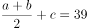······①；

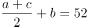······②； 

······③；

将①②③分别乘2可知：a最大，c最小。（）×2可得，故最大年龄与最小年龄之差为28。

故正确答案为D。

---
