# 2020年上海市公务员录用考试《行测》题（A类）（网友回忆版）

> 数量关系 · 23 题 · 上海 2020

## 材料 1

### 第 1 题　qid 2453099 · 数学运算

表中所列10城市2017年末常住人口数量较2012年末约增长了（    ）。

- **A**. 

- **B**. 

- **C**. 

- **D**. 

　✅

**答案**：D

**官方解析**

根据题干“2017年末······较2012年末约增长了”，结合选项“”，判定本题为一般增长率问题。定位表格可知，表中所列10城市2017年末、2012年末常住人口数量分别为14901、13694万人。代入公式：增长率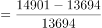。

故正确答案为D。

---

### 第 2 题　qid 2453103 · 数学运算

能够从上述材料中推出的是（    ）。

- **A**. 2013—2017年，天津市常住人口年均增长30万人以上
- **B**. 2015年末全国人口同比增量高于2014年水平
- **C**. 按2017年常住人口同比增量计算，杭州市将在2020年内成为超大城市
- **D**. 2013年末，重庆常住人口同比增量高于10城市常住人口同比增量的平均值　✅

**答案**：D

**官方解析**

A项：定位表格数据可得：2013年和2017年天津市年末常住人口分别为1472万人和1557万人，故题干所求年均增长人数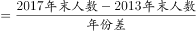万人万人，错误。

B项：定位表格最后一行数据可得：2013年-2015年全国人口年末常住人口分别为136072万人、136782万人和137462万人，则2014年和2015年的人口增长量分别为万人和万人，即2015年增量2014年增量，错误。

C项：定位表格，2016年、2017年杭州市年末常住人口分别为919、947万人，则增长量为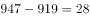万人，按2017年常住人口同比增量计算，杭州市人口将在2019年就达到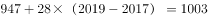万人，成为超大城市，而不是在2020年内才达到超大城市的人数标准，错误。

D项：定位表格可得：重庆2012年末人口和2013年末人口分别为2945万人、2970万人，则2013年增长量为万人；定位表格可得：10城市人口2012年末和2013年末分别为13694万人、13890万人，则2013年增长量为万人，10个城市增量的平均值万人，重庆同比增量高于10城市平均值，正确。

故正确答案为D。

---

## 材料 2

                      表1  2016～2021年我国工业大数据市场规模增长及预测 

                    表2  按不同方式划分的2018年我国工业大数据销售额比例

### 第 3 题　qid 2452985 · 数学运算

2018年我国工业大数据销售额最高的5种产品结构中，销售额最高的类别销售额约是销售额最低类别的            倍。

- **A**. 1.5
- **B**. 2.5
- **C**. 3.3　✅
- **D**. 4.6

**答案**：C

**官方解析**

根据题干“2018年···是···的多少倍”，结合材料为2018年，可判定本题为现期倍数问题。定位表2，在产品结构中，“设备故障诊断”占比最高，则销售额最高，其销售额；“供应链优化”占比最低，则销售额最低，其销售额，则销售额最高的类别销售额是最低的：倍，与C项接近。

故正确答案为C。

---

### 第 4 题　qid 2452986 · 数学运算

关于我国工业大数据市场，能够从上述资料中推出的是                    。

- **A**. 2018年我国工业大数据市场中，大型企业的销售额超过80亿元　✅
- **B**. 2018年我国工业大数据市场中，电力行业销售额是采矿业的3倍多
- **C**. 2017年，我国工业大数据占大数据总体市场规模的比重高于上年水平
- **D**. 2019-2021年，我国工业大数据市场规模将达到2016-2018年的2.5倍以上

**答案**：A

**官方解析**

A项：定位表格1，2018年我国工业大数据市场规模114.2亿元，定位表格2，2018年我国工业大数据市场中，大型企业的销售额占比为，则大型企业销售额亿元，正确；

B项：定位表2，在2018年用户行业结构中，电力行业占比，其销售额；采矿业占比，其销售额。两者倍数倍。错误；

C项：定位表格1，2017年我国工业大数据市场规模同比增速，总体市场规模同比增速。根据两期比重结论：当时，比重下降，即比重低于上年水平。错误；

D项：定位表格1,2019-2021年我国工业大数据市场规模亿元；2016-2018年我国工业大数据市场规模亿元，两者倍数倍，未达到2.5倍。错误。

故正确答案为A。

---

## 材料 3

                             表  2018年全国及京津沪各类型外资企业进出口贸易额及同比增速

### 第 5 题　qid 2452987 · 数学运算

2018年12月，北京市三种类型的外资企业进出口贸易状况为                    。

- **A**. 出口额比进口额高不到100亿元
- **B**. 出口额比进口额高100亿元以上
- **C**. 进口额比出口额高不到100亿元
- **D**. 进口额比出口额高100亿元以上　✅

**答案**：D

**官方解析**

定位表格材料可得，2018年12月，北京市三种类型的外资企业出口额为亿元；进口额为亿元。故进口额比出口额高亿元，即进口额比出口额高100亿元以上。 

故正确答案为D。

---

### 第 6 题　qid 2452989 · 数学运算

京津沪三个直辖市中，2018年外商独资企业进口额占全国外商独资企业进口额比重高于2017年水平的直辖市有            个。

- **A**. 0　✅
- **B**. 1
- **C**. 2
- **D**. 3

**答案**：A

**官方解析**

根据题干“京津沪三个直辖市中，2018年······占······比重高于2017年水平的直辖市有”，可判定此题为两期比重比较问题。由两期比重比较结论可知，若，则现期比重高于基期比重。定位表格材料可知，；京津沪三个直辖市2018年外商独资进口额增速a分别为、、，均小于。故满足条件的有0个。

故正确答案为A。

---

### 第 7 题　qid 2452992 · 数学运算

2018年，京津两地中外合资企业出口额约是两地中外合作企业出口额的            倍。

- **A**. 65
- **B**. 209　✅
- **C**. 326
- **D**. 455

**答案**：B

**官方解析**

根据题干“2018年，京津两地中外合资······是······倍”，可判定此题为现期倍数问题。定位表格材料可知，京津两地中外合资企业出口额为；京津两地中外合作企业出口额为。则所求为。

故正确答案为B。

---

### 第 8 题　qid 2453000 · 数学运算

能够从上述资料中推出的是                    。

- **A**. 
2018年，全国各类型外资企业进出口总额超过15万亿元

- **B**. 
2018年，上海外商独资企业进出口总额占全国同类企业的以上

- **C**. 
2018年12月，上海中外合资企业出口额超过前11个月平均值
　✅
- **D**. 
2017年，北京中外合作企业出口额高于其进口额

**答案**：C

**官方解析**

A项：定位表格材料，2018年全国各类型外资企业进出口总额为万亿元15万亿元。错误；

B项：定位表格材料，2018年上海外商独资企业进出口总额为亿元；全国同类企业进出口总额为亿元，故所求比重为。错误；

C项：若2018年12月上海中外合资企业出口额超过前11个月平均值，则12月出口额，即。定位表格材料可知，2018年12月上海中外合资企业出口额为123.63亿元，全年出口额为1415.02亿元，则。正确；

D项：定位表格材料，由基期量可知，2017年北京中外合作企业出口额亿元；2017年北京中外合作企业进口额亿元，即出口额低于进口额。而非高于，错误。

故正确答案为C。

---

### 第 9 题　qid 2453053 · 数学运算

数列：2，8，4，16，6，32，8，（    ）

- **A**. 16
- **B**. 64　✅
- **C**. 128
- **D**. 256

**答案**：B

**官方解析**

观察数列特征，数列项数较多，考虑多重数列。交叉来看，奇数列2，4，6，8，此数列是公差为2的等差数列；偶数列8，16，32，是公比为2的等比数列，故所求项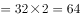。

故正确答案为B。

---

### 第 10 题　qid 2452921 · 数学运算

下表中问号处的数字为<u>        </u>。

- **A**. 378　✅
- **B**. 342
- **C**. 300
- **D**. 228

**答案**：A

**官方解析**

观察数列特征，都是6的倍数。分解因式：

观察每个田字格，，则。

故正确答案为A。

---

### 第 11 题　qid 2453055 · 数学运算

数列：（1，2），（3，4），（7，8），（15，16），（    ，    ）

- **A**. （31，32）　✅
- **B**. （32，33）
- **C**. （33，34）
- **D**. （34，35）

**答案**：A

**官方解析**

观察数列特征，数列项数较多，考虑多重数列。交叉来看，括号中的前项数字为：1，3，7，15，（    ），两两作差得到2，4，8，是公比为2的等比数列，所求项的前项为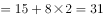。括号中的后项数字为：2，4，8，16，（    ），是公比为2的等比数列，则所求项的后项。

故正确答案为A。

---

### 第 12 题　qid 2452917 · 数学运算

如图，问号处的数字为<u>        </u>。

- **A**. 168
- **B**. 132
- **C**. 96
- **D**. 72　✅

**答案**：D

**官方解析**

观察数列特征，数字处于三角形三个角上，顶角位置数字3，6，9，此数列是公差为3的等差数列，所求位置：；左下角位置数字4，8，24，此数列作商得到2，3，下一项为4，所求位置：；第一个三角形数字加和，第二个三角形数字加和，第三个三角形数字加和。由此可知，第四个三角形数字加和也是180，则。

故正确答案为D。

备注：最后一个是空白三角形，需要根据前面的规律计算出来，再计算出？处的数字。

---

### 第 13 题　qid 2452920 · 数学运算

如图，问号处的数字为<u>        </u>。

- **A**. 1
- **B**. 8
- **C**. 19
- **D**. 31　✅

**答案**：D

**官方解析**

方法一：观察数列特征，没中心凑大数，大数位置不同，考虑单独的四则运算。先考虑加法，第一组，第二组，第三组，可以看出34，44，54，（  ），此数列是公差为10的等差数列，则。第四组，则。

方法二：第一个正方形左上角1，逆时针变动一个位置的数字是2，3，4，此数列是公差为1的等差数列；第一个正方形左下角4，逆时针变动一个位置的数字是6，8，10，此数列是公差为2的等差数列；第一个正方形右下角10，逆时针变动一个位置的数字是13，16，19，此数列是公差为3的等差数列；第一个正方形右上角19，逆时针变动一个位置的数字是23，27，？，此数列是公差为4的等差数列；则。

故正确答案为D。

---

### 第 14 题　qid 2453066 · 数学运算

如图，圆锥高厘米，底面半径为6厘米，一只蚂蚁从A点沿圆锥侧面爬行到B点，则最短的距离为<u>        </u>厘米。

- **A**. 
12

- **B**. 
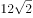
　✅
- **C**. 
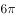

- **D**. 
24

**答案**：B

**官方解析**

由题意，底面半径BC为6厘米，则底面周长。又圆锥高厘米，在直角中，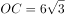，，则。要计算蚂蚁爬行的最短距离，将图形展开，连接AB，AB即最短的距离。圆锥展开图是扇形，该扇形的弧长底面周长，可根据弧长公式，其中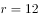，则。展开图如图2所示，在直角中，，则。

故正确答案为B。

---

### 第 15 题　qid 2453070 · 数学运算

某果品公司计划安排6辆汽车运载A、B、C三种水果共32吨进入某市销售，要求每辆车只装同一种水果且必须装满，根据下表提供的信息，则有<u>        </u>种安排车辆方案。

- **A**. 1　✅
- **B**. 2
- **C**. 3
- **D**. 4

**答案**：A

**官方解析**

设运输A水果的车有辆，运输B水果的车有辆，运输C水果的车有辆。根据题意可列式为：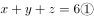，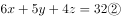，，得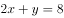。与8均为偶数，则也为偶数，且应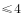，可取值为2、4。当时，，此时没有车辆运输C水果，与题意不符；当时，，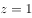，满足要求。即只有3辆车运输A水果，2辆车运输B水果，1辆车运输C水果这一种情况刚好满足题干条件。 

故正确答案为A。

---

### 第 16 题　qid 2453077 · 数学运算

已知三角形一边长为a。甲说：“剩下的两条边只要有一条变长，则三角形面积一定变大。”乙反对说：“不对，必须要剩下的两条边同时变长，三角形的面积才一定变大。”
下列判断正确的是：

- **A**. 甲正确，乙错误
- **B**. 甲错误，乙正确
- **C**. 甲乙都正确
- **D**. 甲乙都错误　✅

**答案**：D

**官方解析**

如图1所示，边长为2的等边三角形，底为2，高为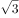，面积为；边长分别为2、2、，顶角为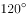等腰三角形，底为，高为1，面积为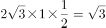。两个三角形有两条边相等，只有一条边变长，但面积没有发生变化，可知甲的说法错误。

如图2所示，将直角三角形其中两条边拉长，使三角形变为钝角三角形，此时三角形的底与高均未发生变化，则面积依然保持不变，可知乙的说法错误。

故正确答案为D。

---

### 第 17 题　qid 2452932 · 数学运算

某游乐园在一个平地中央挖了一个球形下沉广场，广场直径为200米，最深处50米，那么这个球形的直径为        米。

- **A**. 125
- **B**. 200
- **C**. 225
- **D**. 250　✅

**答案**：D

**官方解析**

根据题意，广场的直径为200米，则米；最深处为50米，则米，米。由于是直角三角形，则（OB为球的半径，可用r表示），即，解得，则该球的直径为米。

故正确答案为D。

---

### 第 18 题　qid 2452922 · 数学运算

M小区停车收费，小型车辆每天5元，中型车辆每天8元，大型车辆每天10元。某天小区总共停了20辆车，共收费153元，那么当天大型车辆可能有        辆。

- **A**. 8
- **B**. 9
- **C**. 10　✅
- **D**. 11

**答案**：C

**官方解析**

设小型车辆辆，中型车辆辆，大型车辆辆。根据“总共停了20辆车”，可得；根据“共收费153元”，可得。令，可得。由于、，且、均为整数。代入选项A，解得辆，错误；代入选项B，解得，错误；代入选项C，解得，正确；代入选项D，解得为负数，错误。

故正确答案为C。

---

### 第 19 题　qid 2452924 · 数学运算

甲乙丙丁四人一起去踏青，甲带的钱是另外三个人总和的一半，乙带的钱是另外三个人的，丙带的钱是另外三个人的，丁带了91元，他们一共带了<u>        </u>元。

- **A**. 364
- **B**. 380
- **C**. 420　✅
- **D**. 495

**答案**：C

**官方解析**

根据“甲带的钱是另外三个人总和的一半”，则，；根据“乙带的钱是另外三个人的”，则，；根据“丙带的钱是另外三个人的”，则，。设一共带了元。则甲带了元，乙带了元，丙带了元。所以一共带了，解得，所以一共带了元。

故正确答案为C。

---

### 第 20 题　qid 2452941 · 数学运算

天气预报预测未来2天的天气情况如下：第一天晴天、下雨、下雪；第二天晴天、下雨、下雪，则未来两天天气状况不同的概率为<u>        </u>。

- **A**. 

- **B**. 

- **C**. 

　✅
- **D**. 

**答案**：C

**官方解析**

方法一：未来两天天气状况不同，可分三类：①第一天晴天、第二天非晴天，；②第一天下雨、第二天非下雨，；③第一天下雪、第二天非下雪，。则题干所求。

方法二：未来两天天气状况不同的概率。未来两天天气相同总共分为三类：①都是晴天，概率为；②都是下雨，概率为；③都是下雪，概率为。则题干所求。

故正确答案为C。

---

### 第 21 题　qid 2453079 · 数学运算

小王等6名学生参与了某展览会志愿者活动。他们被安排到两个不同的会场服务。如果要求每个会场都至少有2名志愿者，则对小王等人共有        种不同的安排方式。

- **A**. 20
- **B**. 30
- **C**. 50　✅
- **D**. 360

**答案**：C

**官方解析**

根据题意可分为2种情况：（1）每个会场3人，即从6人中任选3人去一个会场，有种情况；（2）一个会场有2人，另一个会场有4人，即从6人中任选2人有种情况，任选1个会场去2人有种情况，分步用乘法，有种情况。分类用加法，则共有种情况。

故正确答案为C。

---

### 第 22 题　qid 2452936 · 数学运算

一个由若干个单位立方体组成的立体图形，从正面看、左侧面看、下面看都是一个的正方形，那么这个立体图形至少需要<u>        </u>个单位立方体。

- **A**. 17
- **B**. 19　✅
- **C**. 21
- **D**. 22

**答案**：B

**官方解析**

题干要求从正面、左侧面、下面看均为3×3的正方形，先在下面平铺一层，共9个立方体；接下来满足正面和左侧面，需要10个立方体即可，如下图所示，共有9+10=19个立方体。所以至少需要19个单位立方体。

故正确答案为B。

备注：如下图所示，实际可以通过9+6=15个单位立方体摆出满足题目要求的图形，但由于选项最小为17，出题人应该不是考查这种思路，故猜测本题答案为19。

---

### 第 23 题　qid 2453092 · 数学运算

如图所示，则的度数是<u>        </u>。

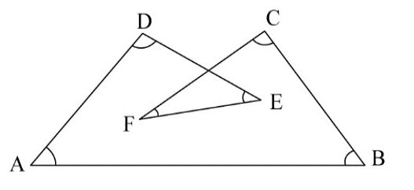

- **A**. 

- **B**. 

- **C**. 

　✅
- **D**. 
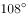

**答案**：C

**官方解析**

如下图，延长直线CF交AB于点G，交DE于点H。则根据三角形两个内角和等于第三个角的外角可得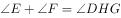，，则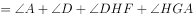，即四边形DHGA内角和为。

故正确答案为C。

---
