# 2020年上海市公务员录用考试《行测》题（B类）（网友回忆版）

> 数量关系 · 25 题 · 上海 2020

## 材料 1

根据下列资料，回答76～80题。

### 第 1 题　qid 2452954 · 数学运算

2019年上半年我国图书零售市场实体店与网店码洋之和比上年高                    。

- **A**. 不到35亿元
- **B**. 35亿至40亿元　✅
- **C**. 40亿至45亿元
- **D**. 超过45亿元

**答案**：B

**官方解析**

根据“2019年上半年······与上年比”，选项中有单位，判定本题为增长量计算问题。定位图形，2019年上半年实体店码洋为39.92亿元，网店码洋为215.31亿元，而2018年上半年实体店码洋为45.22亿元，网店码洋为173.37亿元，则所求为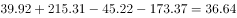亿元，在B项范围之内。

故正确答案为B。

---

### 第 2 题　qid 2452957 · 数学运算

如2019年上半年我国图书零售市场中，网店平均打5.5折销售，实体店平均打9折销售，则同期网店图书实际营业额约是实体店的            倍。

- **A**. 2.5
- **B**. 3.3　✅
- **C**. 4.2
- **D**. 5.4

**答案**：B

**官方解析**

据“······同期网店图书实际营业额约是实体店的多少倍”，判定本题为现期倍数问题。定位图形材料，2019年上半年实体店码洋为39.92亿元，网店码洋为215.31亿元。结合注释，码洋为按图书定价而非实际销售计算的市场规模，则实际营业额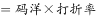，因此所求倍数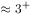，与B选项最接近。

故正确答案为B。

---

### 第 3 题　qid 2452962 · 数学运算

2017年上半年，教辅材料与科技类图书码洋在全国图书零售市场中的占比                  。

- **A**. 
低于

- **B**. 
在之间
　✅
- **C**. 
在之间

- **D**. 
超过

**答案**：B

**官方解析**

根据“2017年上半年，······在······中的占比为多少”，且已知2017年上半年的数据，判定本题为现期比重问题。定位表格，2017年上半年教辅材料码洋为27.34亿元，科技类图书码洋为16.96亿元。定位图形，2017年上半年，实体店码洋为46.59亿元，网店码洋为141.98亿元。结合注释，图书零售市场包括实体店和网店两种销售方式，则全国图书零售市场码洋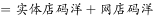。所求比重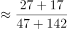。在B项范围之中。

故正确答案为B。

---

### 第 4 题　qid 2452972 · 数学运算

能够从上述资料中推出的是                    。

- **A**. 
2017-2019年，每年上半年实体店码洋同比下降金额逐年递增
　✅
- **B**. 
2017年上半年，少儿类图书码洋是科技类图书的3倍以上

- **C**. 
2017-2019年，文学类图书总码洋在70亿至80亿元之间

- **D**. 
如2019年下半年环比增速达到，则全年网店码洋将超过500亿元

**答案**：A

**官方解析**

A项：定位图形，2016年-2019年，每年上半年实体店码洋分别为47.26、46.59、45.22、39.92亿元。则2017-2019年，每年上半年实体店码洋同比下降金额分别为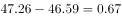亿元、亿元、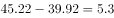亿元，下降金额逐年递增，正确；

B项：定位表格，2017年上半年少儿类图书码洋为48.16亿元，科技类图书码洋为16.96亿元，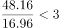，错误；

C项：定位表格，所给数据均为每年上半年的各细分门类码洋数据，并无每年下半年的码洋数据，因此2017年-2019年文学类图书总码洋无法计算，错误；

D项：定位图形，2019年上半年网店码洋为215.31亿元，下半年环比增速为，根据，则2019年下半年网店码洋为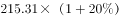亿元，全年网店码洋为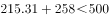亿元，错误。

故正确答案为A。

---

## 材料 2

                      表1  2016～2021年我国工业大数据市场规模增长及预测 

                    表2  按不同方式划分的2018年我国工业大数据销售额比例

### 第 5 题　qid 2452985 · 数学运算

2018年我国工业大数据销售额最高的5种产品结构中，销售额最高的类别销售额约是销售额最低类别的            倍。

- **A**. 1.5
- **B**. 2.5
- **C**. 3.3　✅
- **D**. 4.6

**答案**：C

**官方解析**

根据题干“2018年···是···的多少倍”，结合材料为2018年，可判定本题为现期倍数问题。定位表2，在产品结构中，“设备故障诊断”占比最高，则销售额最高，其销售额；“供应链优化”占比最低，则销售额最低，其销售额，则销售额最高的类别销售额是最低的：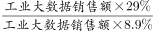倍，与C项接近。

故正确答案为C。

---

### 第 6 题　qid 2452986 · 数学运算

关于我国工业大数据市场，能够从上述资料中推出的是                    。

- **A**. 2018年我国工业大数据市场中，大型企业的销售额超过80亿元　✅
- **B**. 2018年我国工业大数据市场中，电力行业销售额是采矿业的3倍多
- **C**. 2017年，我国工业大数据占大数据总体市场规模的比重高于上年水平
- **D**. 2019-2021年，我国工业大数据市场规模将达到2016-2018年的2.5倍以上

**答案**：A

**官方解析**

A项：定位表格1，2018年我国工业大数据市场规模114.2亿元，定位表格2，2018年我国工业大数据市场中，大型企业的销售额占比为，则大型企业销售额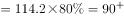亿元，正确；

B项：定位表2，在2018年用户行业结构中，电力行业占比，其销售额；采矿业占比，其销售额。两者倍数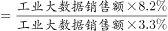倍。错误；

C项：定位表格1，2017年我国工业大数据市场规模同比增速，总体市场规模同比增速。根据两期比重结论：当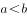时，比重下降，即比重低于上年水平。错误；

D项：定位表格1,2019-2021年我国工业大数据市场规模亿元；2016-2018年我国工业大数据市场规模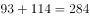亿元，两者倍数倍，未达到2.5倍。错误。

故正确答案为A。

---

## 材料 3

                             表  2018年全国及京津沪各类型外资企业进出口贸易额及同比增速

### 第 7 题　qid 2452987 · 数学运算

2018年12月，北京市三种类型的外资企业进出口贸易状况为                    。

- **A**. 出口额比进口额高不到100亿元
- **B**. 出口额比进口额高100亿元以上
- **C**. 进口额比出口额高不到100亿元
- **D**. 进口额比出口额高100亿元以上　✅

**答案**：D

**官方解析**

定位表格材料可得，2018年12月，北京市三种类型的外资企业出口额为亿元；进口额为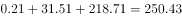亿元。故进口额比出口额高亿元，即进口额比出口额高100亿元以上。 

故正确答案为D。

---

### 第 8 题　qid 2452989 · 数学运算

京津沪三个直辖市中，2018年外商独资企业进口额占全国外商独资企业进口额比重高于2017年水平的直辖市有            个。

- **A**. 0　✅
- **B**. 1
- **C**. 2
- **D**. 3

**答案**：A

**官方解析**

根据题干“京津沪三个直辖市中，2018年······占······比重高于2017年水平的直辖市有”，可判定此题为两期比重比较问题。由两期比重比较结论可知，若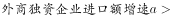，则现期比重高于基期比重。定位表格材料可知，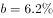；京津沪三个直辖市2018年外商独资进口额增速a分别为、、，均小于。故满足条件的有0个。

故正确答案为A。

---

### 第 9 题　qid 2452992 · 数学运算

2018年，京津两地中外合资企业出口额约是两地中外合作企业出口额的            倍。

- **A**. 65
- **B**. 209　✅
- **C**. 326
- **D**. 455

**答案**：B

**官方解析**

根据题干“2018年，京津两地中外合资······是······倍”，可判定此题为现期倍数问题。定位表格材料可知，京津两地中外合资企业出口额为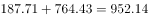；京津两地中外合作企业出口额为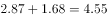。则所求为。

故正确答案为B。

---

### 第 10 题　qid 2453000 · 数学运算

能够从上述资料中推出的是                    。

- **A**. 
2018年，全国各类型外资企业进出口总额超过15万亿元

- **B**. 
2018年，上海外商独资企业进出口总额占全国同类企业的以上

- **C**. 
2018年12月，上海中外合资企业出口额超过前11个月平均值
　✅
- **D**. 
2017年，北京中外合作企业出口额高于其进口额

**答案**：C

**官方解析**

A项：定位表格材料，2018年全国各类型外资企业进出口总额为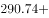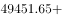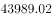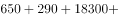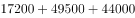万亿元15万亿元。错误；

B项：定位表格材料，2018年上海外商独资企业进出口总额为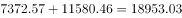亿元；全国同类企业进出口总额为亿元，故所求比重为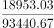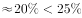。错误；

C项：若2018年12月上海中外合资企业出口额超过前11个月平均值，则12月出口额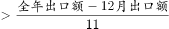，即。定位表格材料可知，2018年12月上海中外合资企业出口额为123.63亿元，全年出口额为1415.02亿元，则。正确；

D项：定位表格材料，由基期量可知，2017年北京中外合作企业出口额亿元；2017年北京中外合作企业进口额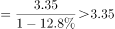亿元，即出口额低于进口额。而非高于，错误。

故正确答案为C。

---

### 第 11 题　qid 2452913 · 数学运算

数列：3，2，0，3，7，2，-4，3，

- **A**. 2
- **B**. 7
- **C**. 11　✅
- **D**. 14

**答案**：C

**官方解析**

观察数列特征，数列项数较多，考虑多重数列。交叉来看，奇数列3，0，7，-4，____，两两加和得到3，7，3，？，此数列为周期数列，，则所求项。偶数列2，3，2，3，此数列为周期数列。奇数项偶数项都有规律。

故正确答案为C。

---

### 第 12 题　qid 2452915 · 数学运算

数列：3，2；5，1；6，4；10，2；12，8；

- **A**. 14，1
- **B**. 16，2
- **C**. 18，3
- **D**. 20，4　✅

**答案**：D

**官方解析**

方法一：观察数列特征，分号分成一组。每组两数倍数关系明显，考虑作商数列。，得到新数列：1.5；5；1.5；5；1.5；？，此数列为周期数列，。选项D的，满足题意。

方法二：观察数列特征，分号分成一组。每两组之间关系为，；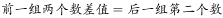。故所求数为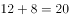，。

故正确答案为D。

---

### 第 13 题　qid 2452917 · 数学运算

如图，问号处的数字为<u>        </u>。

- **A**. 168
- **B**. 132
- **C**. 96
- **D**. 72　✅

**答案**：D

**官方解析**

观察数列特征，数字处于三角形三个角上，顶角位置数字3，6，9，此数列是公差为3的等差数列，所求位置：；左下角位置数字4，8，24，此数列作商得到2，3，下一项为4，所求位置：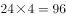；第一个三角形数字加和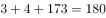，第二个三角形数字加和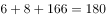，第三个三角形数字加和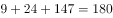。由此可知，第四个三角形数字加和也是180，则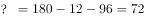。

故正确答案为D。

备注：最后一个是空白三角形，需要根据前面的规律计算出来，再计算出？处的数字。

---

### 第 14 题　qid 2452920 · 数学运算

如图，问号处的数字为<u>        </u>。

- **A**. 1
- **B**. 8
- **C**. 19
- **D**. 31　✅

**答案**：D

**官方解析**

方法一：观察数列特征，没中心凑大数，大数位置不同，考虑单独的四则运算。先考虑加法，第一组，第二组，第三组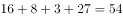，可以看出34，44，54，（  ），此数列是公差为10的等差数列，则。第四组，则。

方法二：第一个正方形左上角1，逆时针变动一个位置的数字是2，3，4，此数列是公差为1的等差数列；第一个正方形左下角4，逆时针变动一个位置的数字是6，8，10，此数列是公差为2的等差数列；第一个正方形右下角10，逆时针变动一个位置的数字是13，16，19，此数列是公差为3的等差数列；第一个正方形右上角19，逆时针变动一个位置的数字是23，27，？，此数列是公差为4的等差数列；则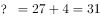。

故正确答案为D。

---

### 第 15 题　qid 2452921 · 数学运算

下表中问号处的数字为<u>        </u>。

- **A**. 378　✅
- **B**. 342
- **C**. 300
- **D**. 228

**答案**：A

**官方解析**

观察数列特征，都是6的倍数。分解因式：

观察每个田字格，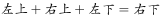，则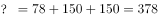。

故正确答案为A。

---

### 第 16 题　qid 2452922 · 数学运算

M小区停车收费，小型车辆每天5元，中型车辆每天8元，大型车辆每天10元。某天小区总共停了20辆车，共收费153元，那么当天大型车辆可能有        辆。

- **A**. 8
- **B**. 9
- **C**. 10　✅
- **D**. 11

**答案**：C

**官方解析**

设小型车辆辆，中型车辆辆，大型车辆辆。根据“总共停了20辆车”，可得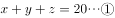；根据“共收费153元”，可得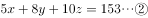。令，可得。由于、，且、均为整数。代入选项A，解得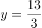辆，错误；代入选项B，解得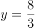，错误；代入选项C，解得，正确；代入选项D，解得为负数，错误。

故正确答案为C。

---

### 第 17 题　qid 2452924 · 数学运算

甲乙丙丁四人一起去踏青，甲带的钱是另外三个人总和的一半，乙带的钱是另外三个人的，丙带的钱是另外三个人的，丁带了91元，他们一共带了<u>        </u>元。

- **A**. 364
- **B**. 380
- **C**. 420　✅
- **D**. 495

**答案**：C

**官方解析**

根据“甲带的钱是另外三个人总和的一半”，则，；根据“乙带的钱是另外三个人的”，则，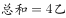；根据“丙带的钱是另外三个人的”，则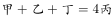，。设一共带了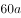元。则甲带了元，乙带了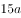元，丙带了元。所以一共带了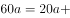，解得，所以一共带了元。

故正确答案为C。

---

### 第 18 题　qid 2452927 · 数学运算

两条公路成十字交叉，甲从十字路口南1200米处向北直行，乙从十字路口处向东直行。甲、乙同时出发10分钟，两人与十字路口的距离相等，出发后100分钟，两人与十字路口的距离再次相等，此时他们距离十字路口        米。

- **A**. 6600
- **B**. 6000
- **C**. 5600
- **D**. 5400　✅

**答案**：D

**官方解析**

根据题意， “出发10分钟，两人与十字路口的距离相等”，可得；“出发100分钟，两人与十字路口的距离再次相等”，可得。联立①②，解得米/分钟，米/分钟。第二次距离相等时，距离十字路口的距离为米。

故正确答案为D。

---

### 第 19 题　qid 2452931 · 数学运算

有甲、乙两个瓶子，甲瓶里装了200毫升清水，乙瓶里装了200毫升纯酒精。第一次把20毫升纯酒精由乙瓶倒入甲瓶，第二次把甲瓶中20毫升溶液倒回乙瓶，此时甲瓶里含有纯酒精的量        乙瓶里含水的量。

- **A**. 大于
- **B**. 小于
- **C**. 等于　✅
- **D**. 不能确定

**答案**：C

**官方解析**

方法一：根据题意列表如下：

第二次后，甲瓶含有纯酒精ml，乙瓶含有水（）ml，两者相等。

方法二：在倾倒之前甲、乙两瓶各有200ml的溶液；倾倒两次后，甲、乙两瓶还是各有200ml的溶液，那么甲瓶中少的水是用来自于乙瓶中的酒精来补充；同理，乙瓶中少的酒精是用来自于甲瓶中的水来补充，故此时甲瓶里含有纯酒精的量等于乙瓶里含水的量。

故正确答案为C。

---

### 第 20 题　qid 2452932 · 数学运算

某游乐园在一个平地中央挖了一个球形下沉广场，广场直径为200米，最深处50米，那么这个球形的直径为        米。

- **A**. 125
- **B**. 200
- **C**. 225
- **D**. 250　✅

**答案**：D

**官方解析**

根据题意，广场的直径为200米，则米；最深处为50米，则米，米。由于是直角三角形，则（OB为球的半径，可用r表示），即，解得，则该球的直径为米。

故正确答案为D。

---

### 第 21 题　qid 2452933 · 数学运算

有A、B两个水壶，分别装有a、b升水。现将B壶中的一半水倒入A壶中，再将A壶中的一半水倒回B壶中。将上述过程记为一次操作，那么两次操作后A、B两壶中的水又回到初始状态，那么<u>        </u>。

- **A**. 

　✅
- **B**. 

- **C**. 

- **D**. 

**答案**：A

**官方解析**

赋值，根据题意，每一次操作后A、B两个水壶中水量如下图所示：

题目说两次操作后A、B两壶回归初始状态，即；。都能解得，则。

故正确答案为A。

---

### 第 22 题　qid 2452936 · 数学运算

一个由若干个单位立方体组成的立体图形，从正面看、左侧面看、下面看都是一个的正方形，那么这个立体图形至少需要<u>        </u>个单位立方体。

- **A**. 17
- **B**. 19　✅
- **C**. 21
- **D**. 22

**答案**：B

**官方解析**

题干要求从正面、左侧面、下面看均为3×3的正方形，先在下面平铺一层，共9个立方体；接下来满足正面和左侧面，需要10个立方体即可，如下图所示，共有9+10=19个立方体。所以至少需要19个单位立方体。

故正确答案为B。

备注：如下图所示，实际可以通过9+6=15个单位立方体摆出满足题目要求的图形，但由于选项最小为17，出题人应该不是考查这种思路，故猜测本题答案为19。

---

### 第 23 题　qid 2452938 · 数学运算

一条东西向的河流，水流自西向东，速度为10公里/小时，现有摆渡船从南岸的A点出发，要开往正北方向的位于北岸的B点，已知船速为20公里/小时，则摆渡船往            方向行驶，可以保证船能够向正北方向航行。

- **A**. 北偏西30度　✅
- **B**. 西偏北45度
- **C**. 东偏北30度
- **D**. 北偏东45度

**答案**：A

**官方解析**

题目如上图所示。

水流自西向东，要想船向正北方行驶，应向西行驶消除水流的影响，故可排除C、D两项。CO为水流动方向，AC为船行驶方向，三角形OAC为直角三角形，题目所求为的度数，相同时间内，，直角三角形中，所对的直角边是斜边的一半，故，即北偏西30度。

故正确答案为A。

备注：题目中所给的船速为船航行时真实速度，不是指静水中的速度，否则此题没有答案。

---

### 第 24 题　qid 2452941 · 数学运算

天气预报预测未来2天的天气情况如下：第一天晴天、下雨、下雪；第二天晴天、下雨、下雪，则未来两天天气状况不同的概率为<u>        </u>。

- **A**. 

- **B**. 

- **C**. 

　✅
- **D**. 

**答案**：C

**官方解析**

方法一：未来两天天气状况不同，可分三类：①第一天晴天、第二天非晴天，；②第一天下雨、第二天非下雨，；③第一天下雪、第二天非下雪，。则题干所求。

方法二：未来两天天气状况不同的概率。未来两天天气相同总共分为三类：①都是晴天，概率为；②都是下雨，概率为；③都是下雪，概率为。则题干所求。

故正确答案为C。

---

### 第 25 题　qid 2452943 · 数学运算

一条街上有90棵树，其中有些树已经挂上了彩灯，这时，要选择在一棵未挂彩灯的树上悬挂红旗，有趣的是，无论将红旗挂在哪棵树上都与挂了彩灯的树相邻，那么至少有        棵树挂了彩灯。

- **A**. 35
- **B**. 30　✅
- **C**. 25
- **D**. 20

**答案**：B

**官方解析**

圆圈和三角形分别表示挂彩灯和没挂彩灯的树，如图所示：

为了满足“无论将红旗挂在哪棵树上都与挂了彩灯的树相邻”，且要使挂彩灯的树尽可能地少，则每两棵挂彩灯的树之间应该隔两棵没挂彩灯的树，且第一棵挂彩灯的树左侧还有一棵树没挂彩灯，最后一棵挂彩灯的树右侧还有一棵没挂彩灯的树。观察发现，相当于每3棵树为一个周期，共有个周期，每个周期有一棵树挂彩灯，则总共有棵树挂彩灯。

故正确答案为B。

---
