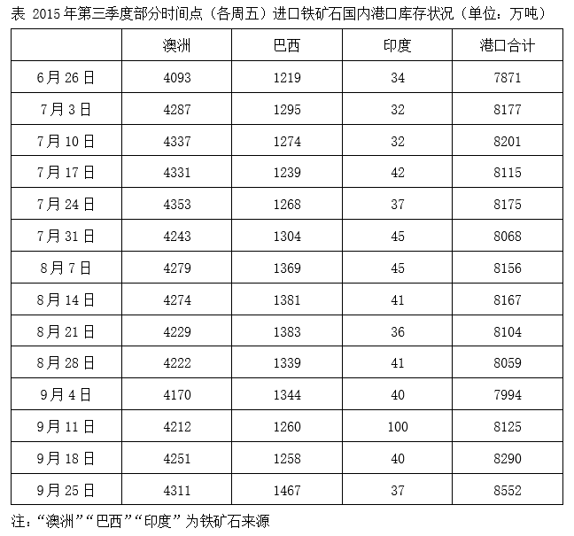
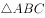
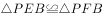
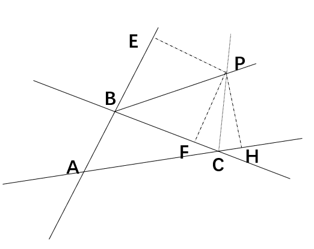

# 2020年上海市行政执法类考试《行测》试题（网友回忆版）

> 数量关系 · 16 题 · 上海 2020

## 材料 1

        2015年全年国内生产总值676708亿元，比上年增长6.9%。全年人均国内生产总值49351元，比上年増加6.3%。

### 第 1 题　qid 5658280 · 数学运算

2015年，第一产业增加值约比上年同期增加了        。

- **A**. 0.2%
- **B**. 2.2%
- **C**. 4.1%　✅
- **D**. 6.7%

**答案**：C

**官方解析**

根据题干“2015年······约比上年同期增加了”，结合选项为百分数，可判定本题为一般增长率问题。定位统计图1可得：2014年、2015年国内生产总值分别为635910亿元、676708亿元，2015年国内生产总值增速为6.9%；定位统计图2可得：2014年、2015年第一产业增加值占国内生产总值的比重分别为9.2%、9.0%。

方法一：根据公式：部分=整体×比重，增长率，则题干所求，与C项最接近。

方法二：根据公式：两期比重差，设2015年第一产业增加值同比增速为x，则，解得，与C项最接近。

故正确答案为C。

---

### 第 2 题　qid 5658295 · 数学运算

关于2011-2015年国内生产总值及三次产业增加值结构，能够从上述资料中推出的是：

- **A**. 每年的第一产业增加值均不高于上年水平
- **B**. 五年国内生产总值总量在300万亿元以上
- **C**. 2012年第二产业增加值略高于25万亿元
- **D**. 2014年第三产业增加值超过第一产业的5倍　✅

**答案**：D

**官方解析**

A项：定位统计图1和图2，可知2011-2015年各年国内生产总值及第一产业占比。但材料中并未给出2010年的相关数据，无法确定2011年第一产业增加值与2010年相比的大小情况，无法推出，错误；

B项：定位统计图1可知，2011-2015年国内生产总值分别为484124亿元、534123亿元、588019亿元、635910亿元、676708亿元。则五年国内生产总值万亿元万亿元，错误；

C项：定位统计图1和图2可知，2012年国内生产总值为534123亿元；第二产业占比为45.0%。根据公式：部分=整体×比重，则2012年第二产业增加值为534123×45.0%&lt;550000×45.0%=247500亿元&lt;25万亿元，错误；

D项：定位统计图1和图2可知，2014年国内生产总值为635910亿元；第一产业占比为9.2%，第三产业占比为48.1%。根据公式：部分=整体×比重，则2014年第三产业増加值是第一产业的倍，超过5倍，正确。

故正确答案为D。

---

## 材料 2

### 第 3 题　qid 5658328 · 数学运算

2015年第三季度，有（    ）个周五进口铁矿石国内港口总库存多于上个周五。

- **A**. 6
- **B**. 7
- **C**. 8　✅
- **D**. 9

**答案**：C

**官方解析**

定位统计表可知2015年第三季度各周五进口铁矿石国内港口总库存。其中多于上个周五的有：7月3日（8177万吨＞7871万吨）、7月10日（8201万吨＞8177万吨）、7月24日（8175万吨＞8115万吨）、8月7日（8156万吨＞8068万吨）、8月14日（8167万吨＞8156万吨）、9月11日（8125万吨＞7994万吨）、9月18日（8290万吨＞8125万吨）、9月25日（8552万吨＞8290万吨），共8个。
故正确答案为C。

---

### 第 4 题　qid 5658329 · 数学运算

2015年第三季度进口铁矿石国内港口总库存最少的周五，三个不同进口来源的铁矿石中库存量高于上周五水平的是（    ）。

- **A**. 澳洲铁矿石
- **B**. 巴西铁矿石　✅
- **C**. 澳洲和印度铁矿石
- **D**. 巴西和印度铁矿石

**答案**：B

**官方解析**

定位统计表可知2015年第三季度（7-9月）各周五自澳洲、巴西、印度进口的铁矿石库存量及进口铁矿石国内港口总库存。其中国内港口总库存最少的周五是9月4日（7994万吨），铁矿石库存量高于上周五水平的是巴西铁矿石（1344万吨＞1339万吨）。
故正确答案为B。

---

### 第 5 题　qid 5658331 · 数学运算

2015年8月各周五中，澳洲铁矿石库存最多是印度铁矿石库存的约        倍。

- **A**. 95
- **B**. 103
- **C**. 117　✅
- **D**. 136

**答案**：C

**官方解析**

根据题干“2015年8月各周五中······是······的约<u>        </u>倍”，可判定本题为现期倍数问题。定位统计表可知2015年8月各周五澳洲和印度的铁矿石库存情况。由此分别求出各周五的倍数：2015年8月7日，倍；2015年8月14日，倍；2015年8月21日，倍；2015年8月28日，倍。比较可知，最大的为117倍（2015年8月21日）。

故正确答案为C。

---

### 第 6 题　qid 5658332 · 数学运算

关于2015年第三季度各个周五的进口铁矿石国内港口库存，能够从上述资料中推出的是        。

- **A**. 每个周五澳洲铁矿石库存均占总库存的一半以上　✅
- **B**. 最后一个周五澳洲铁矿石库存是巴西的3倍以上
- **C**. 有3个周五印度铁矿石的库存量与上个周五相同
- **D**. 每个周五印度铁矿石的库存量均不到总库存的1%

**答案**：A

**官方解析**

A项：定位统计表可知2015年第三季度各个周五澳洲及国内港口铁矿石库存情况。题干所求为：，通过计算、比较可知，每个周五澳洲铁矿石库存均占总库存的一半以上，正确；

B项：定位统计表可知2015年第三季度最后一个周五澳洲铁矿石库存为4311万吨，巴西铁矿石库存为1467万吨，则所求倍数为倍＜3倍，错误；

C项：定位统计表可知2015年第三季度各个周五印度铁矿石库存量，其中与上个周五库存量相同的有2015年7月10日（32万吨）和8月7日（45万吨），共2个，错误；

D项：定位统计表可知2015年第三季度各个周五印度及国内港口铁矿石库存情况。其中2015年9月11日：100＞8125×1%=81.25，错误。

故正确答案为A。

---

### 第 7 题　qid 5657670 · 数学运算

假设一根铁丝环绕地球赤道一周，若它受冷冷缩，长度减少了400米，那它陷进地表平均大约        米。（地球半径约为6370千米，地球近似看成一个球体）

- **A**. 0.06
- **B**. 0.4
- **C**. 64　✅
- **D**. 400

**答案**：C

**官方解析**

设铁丝冷缩前环绕赤道一周的半径为R米，冷缩后半径为r米，则，因此铁丝受冷冷缩后陷进地表米。

故正确答案为C。

---

### 第 8 题　qid 5657671 · 数学运算

一个密码有6个位置，每个位置可以用0~9这十个数中的任意一个或A~Z这26个字母中的任意一个。某人尝试两种方案，方案一：6个位置全都用数字；方案二：数字和字母任意选用。则方案二的密码设置方法数大约是方案一的        倍。

- **A**. 2023
- **B**. 2436
- **C**. 1989
- **D**. 2177　✅

**答案**：D

**官方解析**

根据题意，方案一为6个位置全都用数字，则每个位置有10种可能，共有种情况。方案二为数字和字母任意选用，则每个位置有10+26=36种可能，共有种情况。因此方案二的密码设置方法数是方案一的倍。

故正确答案为D。

---

### 第 9 题　qid 5657678 · 数学运算

如图是一个无盖正方体盒子展开后的平面图，A、B、C是展开图上的三点，则在原正方体盒子中的大小是（    ）。

- **A**. 

- **B**. 

- **C**. 

　✅
- **D**. 

**答案**：C

**官方解析**

如下图所示，是无盖正方体盒子折叠后的立体图，A、B、C分别是正方体的三个顶点。连接AB、AC、BC，可知AB、AC、BC均为正方体面上的对角线，长度相等，则三角形ABC为等边三角形，的大小是。

故正确答案为C。

---

### 第 10 题　qid 5657679 · 数学运算

某人上楼梯，每一步可以跨1个台阶或2个台阶或3个台阶，则上到第5个台阶，有（    ）种方法。

- **A**. 3
- **B**. 6
- **C**. 8
- **D**. 13　✅

**答案**：D

**官方解析**

每一步可以跨1个台阶或2个台阶或3个台阶，分情况列表如下：

综上所述，共有1+4+3+3+2=13种方法。

故正确答案为D。

---

### 第 11 题　qid 5657684 · 数学运算

有两枚形状相同的硬币，将硬币B绕硬币A滚动一圈回到起点（滚动过程中没有滑动），则硬币B自转了        圈。

- **A**. 
1

- **B**. 

- **C**. 
2
　✅
- **D**. 

**答案**：C

**官方解析**

硬币以圆心为基点旋转360度即为自转1圈。设硬币的半径为r，如图所示，硬币B的圆心移动路程应为一个半径为2r的圆的周长。

用硬币B的圆心移动路程，除以硬币B的周长，即为硬币B绕硬币A滚动一圈回到起点时，自身旋转的圈数，即圆心移动路程÷圆周长=圈数。硬币B的圆心移动路程为，硬币B的周长为，则硬币B自转了圈。

故正确答案为C。

备注：若圆的半径为r，圆的半径为R，且满足R=kr，圆沿圆外无滑动地滚动一圈回到原出发点，则圆自转了（k+1）圈。

---

### 第 12 题　qid 5657689 · 数学运算

有一场考试将在12月的某个星期日举行，若11月1日为周三，下列可能的时间是        。

- **A**. 12月7日
- **B**. 12月12日
- **C**. 12月17日　✅
- **D**. 12月21日

**答案**：C

**官方解析**

12月1日与11月1日相差30天，，经过了4个整周期多2天，即12月1日为星期五，则12月的星期日分别为12月3日、12月10日、12月17日、12月24日、12月31日，只有C项满足。

故正确答案为C。

---

### 第 13 题　qid 5657695 · 数学运算

有4个圆柱形杯子甲、乙、丙、丁，乙的高是甲的两倍，杯口宽是甲的一半；丙的高是甲的倍，杯口宽是甲的倍；丁的高是甲的倍，杯口宽是甲的倍，则4个杯子中容积最小的是<u>        </u>。

- **A**. 甲
- **B**. 乙　✅
- **C**. 丙
- **D**. 丁

**答案**：B

**官方解析**

赋值甲杯的高为1、杯子底面直径为4，则底面半径为2。根据，可得：。结合题干条件有：

乙杯的高为2、杯子底面直径为，则底面半径为1，；

丙杯的高为、杯子底面直径为，则底面半径为，；

丁杯的高为、杯子底面直径为，则底面半径为3，。

比较可知，容积最小的是乙杯。

故正确答案为B。

---

### 第 14 题　qid 5657700 · 数学运算

某学生乘坐地铁上学，所搭乘的地铁首班5：31到站，每2分钟一班，每班车停靠时间为30秒，该学生每次到达地铁站台的时间为5：30至5：35之间的任意时刻且等可能，则该学生无需等候就能乘上地铁的概率为        。

- **A**. 

- **B**. 

- **C**. 

　✅
- **D**. 

**答案**：C

**官方解析**

根据题意可知，该学生到达地铁站台时间为5：30至5：35之间的任意时刻且等可能，则总情况为5分钟内的任意时刻到达，即有5×60种情况。已知该地铁每2分钟一班，且第一班地铁到站时间为5：31，则第二班地铁到站时间为5：33，第三班地铁到站时间为5：35。由此可知，在这5分钟内，地铁可停靠两个班次，每班车停靠时间为30秒，共停靠30+30=60秒，该学生若想无需等候就能乘上地铁，到站时间应为地铁停靠时间的任一时刻，则满足题意的情况数有60种。故所求概率。

故正确答案为C。

---

### 第 15 题　qid 5657703 · 数学运算

某旅行社为吸引市民组团去风景区旅游，推出了下图对话中收费标准。某单位组织员工去风景区旅游，共支付给旅行社旅游费用27000元，则该单位这次共有<u>        </u>员工去风景区旅游。

- **A**. 20名
- **B**. 25名
- **C**. 30名　✅
- **D**. 40名

**答案**：C

**官方解析**

根据题干，若旅游人数不超过25人，则该单位应支付的旅游费用最多为25×1000=25000元，故该单位旅游人数超过25人，排除A、B两项。代入C项，可知员工数增加了30-25=5人，人均旅游费用降低为1000-5×20=900元&gt;700元，总费用为30×900=27000元，符合题目要求，当选。
故正确答案为C。

---

### 第 16 题　qid 5657708 · 数学运算

某公司现要建一个货物中转站，如图，直线a，b，c表示三条公路，要求中转站到三条公路的距离相等，则可供选择的地址有<u>        </u>。

- **A**. 一处
- **B**. 两处
- **C**. 三处
- **D**. 四处　✅

**答案**：D

**官方解析**

由三角形内角平分线的交点到三角形三边的距离相等，可得三角形内角平分线的交点满足条件（一处）。如图，三条公路的交点分别为A、B、C，点P为两条外角平分线的交点。过点P作PE垂直AB，作PF垂直BC，又因BP平分，故，则PE=PF，同理，过点P作PH垂直AC，则PF=PH。由此得出结论：三角形两条外角平分线的交点到其三边的距离也相等。该三角形为锐角三角形，两条外角平分线的交点在三条边外各有一个（三处）。故可供选择的地址有四处。

故正确答案为D。

---
