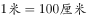
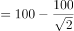

# 2020年云南公务员录用考试《行测》试题（网友回忆版）

> 数量关系 · 10 题 · 云南 2020

## 第 1 题　qid 2616070 · 数学运算

小明每天从家中出发骑自行车经过一段平路，再经过一道斜坡后到达学校上课。某天早上，小明从家中骑车出发，一到校门口就发现忘带课本，马上返回，从离家到赶回家中共用了1个小时，假设小明当天平路骑行速度为9千米/小时，上坡速度为6千米/小时，下坡速度为18千米/小时，那么小明的家距离学校多远？

- **A**. 3.5千米
- **B**. 4.5千米　✅
- **C**. 5.5千米
- **D**. 6.5千米

**答案**：B

**官方解析**

设小明家到学校的距离为，在往返的过程中，上坡和下坡的路程均为斜坡的长度即距离相等，根据等距离平均速度公式，上下坡的平均速度千米/小时，与平路速度相等，故往返全程的平均速度均为9千米/小时，往返一次走了两个全程，千米/小时小时，得千米。

故正确答案为B。

---

## 第 2 题　qid 2616087 · 数学运算

某企业员工组织周末自驾游。集合后发现，如果每辆小车坐5人，则空出4个座位；如果每辆小车少坐1人，则有8人没坐上车。那么，参加自驾游的小车有：

- **A**. 9辆
- **B**. 10辆
- **C**. 11辆
- **D**. 12辆　✅

**答案**：D

**官方解析**

设一共有辆车，根据总人数一定，列方程得：。解得，故参加自驾游的小车有12辆。

故正确答案为D。

---

## 第 3 题　qid 2616069 · 数学运算

某篮球队共有九人，分三组举行三人制篮球赛，他们的球衣号码分别是从1号到9号，分组后发现三组的球衣号码之和不同，且最大和是最小和的两倍。则各组号码之和不可能是下列哪个数？

- **A**. 10
- **B**. 11
- **C**. 12
- **D**. 13　✅

**答案**：D

**官方解析**

根据等差数列求和公式可得，所有球衣号码之和为。

方法一：代入排除法。

A项：假设最小和为10，则最大和为，则中间和为，满足题意，排除；

B项：假设最小和为11，则最大和为，则中间和为满足题意，排除；

C项：根据B项可得，12为可能的号码和，排除；

D项：假设最小和为13，则最大和为，则中间和为，不满足题意；假设中间和为13，则，32不是3的倍数，不满足题意，当选。

方法二：方程法。

根据题意设最小和与最大和分别为、，中间和为，，根据可得，，则，对应A、B两项，当时，，；当时，，，均符合题意，排除；根据倍数特性，中与45均为3的倍数，则必为3的倍数，对应C项，时，，，符合题意，排除。 

本题为选非题，故正确答案为D。

---

## 第 4 题　qid 2616088 · 数学运算

某社区拟对一块梯形活动场地进行扩建，经测算，如果将梯形的上底边增加1米，下底边增加1米，则面积将扩大10平方米；如果将梯形的上底边增加1倍，下底边增加1米，则面积将扩大55平方米；如果将上底边增加1米，下底边增加1倍，则面积将扩大105平方米。现拟将梯形的上底边增加1倍还多2米，下底边增加3倍还多4米，则面积将扩大多少？

- **A**. 280平方米
- **B**. 380平方米　✅
- **C**. 420平方米
- **D**. 480平方米

**答案**：B

**官方解析**

设梯形的上底边为米，下底边为米，高为米。则根据题意有······①，······②，······③。由①解得，，代入②和③，解得，。因此当梯形的上底边增加1倍还多2米，下底边增加3倍还多4米时，面积将扩大平方米。

故正确答案为B。

---

## 第 5 题　qid 2616073 · 数学运算

某城市一条道路上有4个十字路口，每个十字路口至少有1名交通协管员，现将8个协管员名额分配到这4个路口，则每个路口协管员名额的分配方案有：

- **A**. 35种　✅
- **B**. 70种
- **C**. 96种
- **D**. 114种

**答案**：A

**官方解析**

所问为每个路口协管员名额的分配方案有多少种，则只需要考虑每个路口分配的人数是多少，不需要考虑到底分配哪个协管员。根据插板法：m个相同元素分成n组，每组至少1个，则分配情况有种，题干可以理解为8个相同的名额分成4组，每组至少1个名额，则所求为种。

故正确答案为A。

---

## 第 6 题　qid 2616154 · 数学运算

某工厂先从边长为1米的正方形铁皮切割掉一个半径1米、圆心角为直角的扇形，再用剩余材料切割正方形。为充分利用原材料，希望所得正方形越大越好。若不考虑切割损耗，问所切最大的正方形边长约为多少厘米？

- **A**. 22.6
- **B**. 25.6
- **C**. 27.6　✅
- **D**. 31.6

**答案**：C

**官方解析**

边长为1米的正方形铁皮切割掉一个半径为1米、圆心角为直角的扇形，要在剩余材料中切割出最大的正方形，则让正方形内的最长线段即对角线要在剩余材料内部，如图所示。 

，厘米，所求正方形的边长为，，因此厘米。切割的最大的正方形边长为28.6厘米。结合选项，最大的正方形边长可以为27.6厘米。 

故正确答案为C。

---

## 第 7 题　qid 2616158 · 数学运算

某公司职员预约某快递员上午9点30分到10点在公司大楼前取件，假设两人均在这段时间内到达，且在这段时间到达的概率相等。约定先到者等后到者10分钟，过时交易取消。快递员取件成功的概率为：

- **A**. 

- **B**. 

- **C**. 

　✅
- **D**. 

**答案**：C

**官方解析**

设快递员到达的时间为9点分，职员到达的时间为9点分，则只有，两人才能相遇。即直线、、、围成的区域，交点坐标分别为（30,40）、（50,60）、（60,60）、（60,50）、（40,30）、（30,30），如下图所示，只有在阴影部分区域两人才能够相遇，也就是求阴影部分面积占整个正方形面积的比例。由图可以看出，正方形面积，空白部分为两个全等三角形，每个的面积为，则阴影部分面积，占总面积的。

故正确答案为C。

---

## 第 8 题　qid 2616081 · 数学运算

某会展中心布置会场，从花卉市场购买郁金香、月季花、牡丹花三种花卉各20盆，每盆均用纸箱打包好装车运送至会展中心，再由工人搬运至布展区。问至少要搬出多少盆花卉才能保证搬出的鲜花中一定有郁金香？

- **A**. 20盆
- **B**. 21盆
- **C**. 40盆
- **D**. 41盆　✅

**答案**：D

**官方解析**

根据问法“至少······才能保证······”，可判定本题为最不利构造型最值问题。考虑最不利情况为前面搬出的花卉都是月季花和牡丹花，则一共搬出盆花卉。在此基础上再搬1盆花，就可以保证一定是郁金香，则至少需要搬盆花卉。

故正确答案为D。

---

## 第 9 题　qid 2616143 · 数学运算

村民陶某承包一块长方形种植地，他将地分割成如图所示的4个小长方形，在A、B、C、D四块长方形土地上分别种植西瓜、花生、地瓜、水稻。其中长方形A、B、C的周长分别是20米、24米、28米，那么长方形D的最大面积是：

- **A**. 42平方米
- **B**. 49平方米
- **C**. 64平方米　✅
- **D**. 81平方米

**答案**：C

**官方解析**

如下图所示，假设标注的四条边长分别为、、、，已知长方形A、B、C的周长分别是20米、24米、28米，根据长方形周长，可得，化简得，即，解得。而c、d分别代表长方形D的长和宽，和一定时，当且仅当时面积最大，此时米，故长方形D的最大面积平方米。

故正确答案为C。

---

## 第 10 题　qid 2616072 · 数学运算

野外生存需要用一个简易的圆锥型过滤器（如下图所示）装满溪水进行过滤。过滤器的底面直径为20cm，高为6cm。问全部过滤完毕后，在不考虑损耗的情况下，可使底面半径为5cm，高为15cm的圆柱型容器的水面高度达到：

- **A**. 4cm
- **B**. 6cm
- **C**. 8cm　✅
- **D**. 12cm

**答案**：C

**官方解析**

根据圆锥体积公式可知，过滤溪水体积为。根据圆柱体积公式可得，圆柱型容器的水面高度达到cm。

故正确答案为C。

---
