# 2020年北京市公务员录用考试《行测》题（区级及以上卷）（网友回忆版）

> 数量关系 · 15 题 · 北京 2020

## 第 1 题　qid 2453169 · 数学运算

A公园规定，个人票每张10元，团体票每张60元（可供10人参观），无其他票价优惠政策。五年级二班共有58人逛A公园，则最少应付多少元？

- **A**. 350
- **B**. 360　✅
- **C**. 380
- **D**. 390

**答案**：B

**官方解析**

每张团体票可供10人参观，若58人均使用团体票，共需6张团体票，需花费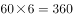元。若50人使用团体票，8人使用个人票，需花费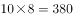元。可知最少需花费360元，购买6张团体票。

故正确答案为B。

---

## 第 2 题　qid 2453171 · 数学运算

一个长方体零件的长、宽和高分别为、和厘米，其所有棱长之和为168厘米，则该长方体零件的体积为多少立方厘米？

- **A**. 1680
- **B**. 2184
- **C**. 2688　✅
- **D**. 2744

**答案**：C

**官方解析**

长方体的棱长总和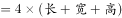，即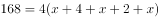，解得厘米。则长方体的长宽高分别为16、14、12厘米，体积为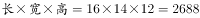立方厘米。

故正确答案为C。

---

## 第 3 题　qid 2453178 · 数学运算

某单位实行弹性工作制，不严格规定上下班时间，但是上班打卡时间与下班打卡时间差应不少于9小时。某天上午小刘到单位打卡时，从镜子里看到时钟显示如右图。则小刘当天最早的下班打卡时间为？

- **A**. 18：05
- **B**. 18：35
- **C**. 12：05
- **D**. 17：55　✅

**答案**：D

**官方解析**

将钟表左右翻转后得到实际时间如下图所示，可知此时为上午8:55，则最早下班打卡时间为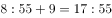。

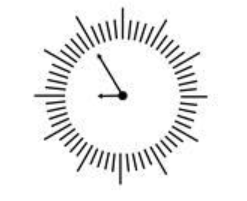

故正确答案为D。

---

## 第 4 题　qid 2453179 · 数学运算

某单位随机安排张、王、刘、李、陈5名职工去甲、乙、丙三个地方开展调研。要求甲、乙两地各去2人，且张、王两人不能同组，刘、陈二人必须同组，则共有多少种不同的安排方式？

- **A**. 4　✅
- **B**. 6
- **C**. 12
- **D**. 24

**答案**：A

**官方解析**

刘、陈二人必须同组，且甲乙两地各需两人，则刘陈二人组成的队伍可在甲乙两地中选择一个，情况数为；张、王二人不能同组，则在二人中选择一人前往丙地，此时剩余二人自动组成小组，情况数为。则不同的安排方式共有种。

故正确答案为A。

---

## 第 5 题　qid 2453181 · 数学运算

劳务费计税方式为总额不高于4000元时，应纳税额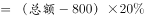；高于4000元时，应纳税额。某单位甲、乙两部门在同一月份要为某专家发放劳务费，金额均不超过4000元，如果两笔劳务费分别计税，应纳税额之和为780元，但按照规定，两笔劳务费应合并计税，则该专家实际应纳税额为

- **A**. 780元
- **B**. 815元
- **C**. 880元　✅
- **D**. 940元

**答案**：C

**官方解析**

设两笔劳务费分别为、元，根据题意可列式为：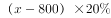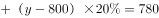，化简可得，。则合并纳税时，应缴税额为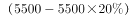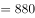元。

故正确答案为C。

---

## 第 6 题　qid 2453184 · 数学运算

甲、乙两个学校的在校生人数之比为5：3，甲学校如果转入30名学生，再将85名学生转到乙学校，则两个学校在校生人数相同。则此时乙学校学生人数在以下哪个范围内？

- **A**. 不到200人
- **B**. 在200～240人之间
- **C**. 在241～280人之间
- **D**. 超过280人　✅

**答案**：D

**官方解析**

设甲学校的在校生人数为，乙学校的在校生人数为。当“甲学校转入30名学生，再将85名学生转到乙学校”后，甲学校的在校生人数变为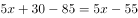人，乙学校的在校生人数变为人。根据“两个学校在校生人数相同”，可得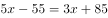，解得，此时乙学校的在校生人数为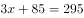人，对应D项。

故正确答案为D。

---

## 第 7 题　qid 2453188 · 数学运算

以下为4款银行理财产品：

注：年化收益率按365天计算。产品未到投资期限赎回，不享受收益。

如果希望在1年内投资10万元资金，那么投资哪款产品能获得最大收益?

- **A**. 1号
- **B**. 2号
- **C**. 3号
- **D**. 4号　✅

**答案**：D

**官方解析**

投资各产品的收益情况如下：

投资1号产品：，故一年内可以投资1次，最多可以收益万元。

投资2号产品：不够起购金额；

投资3号产品：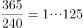，故一年内可以投资1次，最多可以收益万元。

投资4号产品：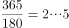，故一年内可以投资2次，假设第二次投资仍以本金投资，而且以最低收益率计算，可以收益万元。

综上，4号产品的最小收益大于其他3号产品。所以投资4号产品能够获得最大收益。

故正确答案为D。 

---

## 第 8 题　qid 2453180 · 数学运算

某家电维修公司的职工每人每天最多完成5次修理任务。维修工小张上个月工作了20天，总计完成修理任务98次。则他上个月每天完成的修理任务次数有多少种不同的可能？

- **A**. 190
- **B**. 210　✅
- **C**. 380
- **D**. 400

**答案**：B

**官方解析**

若小张工作时每天都完成5次维修任务，则上个月应完成次维修任务，而上个月实际共完成98次维修任务，说明有以下两种情况：

一、某一天完成3次维修任务，其余的工作时间每天完成5次维修任务：从工作的20天中选出1天，有种情况；

二、某两天是每天完成4次维修任务，其余的工作时间每天完成5次维修任务：从工作的20天中选出2天，有种情况。

所以他上个月每天完成的维修任务次数有种情况，对应B项。

故正确答案为B。

---

## 第 9 题　qid 2453187 · 数学运算

某商品成本为200元，售价为292元，公司根据市场情况调整了销售方案，将售价调整为268元，预计日销量将上涨。现欲通过改进生产线降低成本，以保持降价前的单日利润，则单件产品的生产成本至少需要降低

- **A**. 

- **B**. 

- **C**. 

　✅
- **D**. 

**答案**：C

**官方解析**

赋值销量为100，上涨后销量变为115。设改进生产线之后，单件产品的生产成本降低了x。根据题意可得表格：

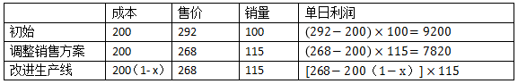

根据要“保持降价前的单日利润”，可得，解得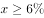，单件产品的生产成本至少需要降低，对应C项。

故正确答案为C。

---

## 第 10 题　qid 2453189 · 数学运算

一辆汽车在高速公路上以60公里小时的速度匀速行驶，此时司机开始以固定的加速度进行加速，加速后50秒内，汽车行驶了1公里。则汽车从开始加速，到加速至高速公路的速度上限120公里小时需要多长时间？

- **A**. 100秒
- **B**. 125秒　✅
- **C**. 150秒
- **D**. 180秒

**答案**：B

**官方解析**

匀加速直线运动的位移公式为：，初始速度为60km/h，即km/s；速度上限120 km/h，即km/s。根据“加速后50秒内，汽车行驶了1公里”，代入公式，即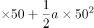，解得加速度a为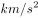。汽车从开始加速到加速至高速公路的速度上限120 km/h，需要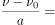秒，对应B项。

故正确答案为B。

---

## 第 11 题　qid 2453190 · 数学运算

某网店的甲商品定价为300元，乙商品定价为500元。小张以七折购买了甲商品，购买乙商品时参加了每满199元减50元的活动。小赵购买甲商品时在9折基础上又参加了每满100元减10元活动，则小赵通过以下哪种促销活动购买乙商品，其购买甲、乙两件商品总花销与小张一样？

- **A**. 减50元后打八折　✅
- **B**. 直接打七折
- **C**. 打九折后减120元
- **D**. 直接减120元

**答案**：A

**官方解析**

小张7折购买甲商品即元；乙商品定价500，购买乙商品时参加每满199元减50元的活动，500元包含两个199元，即一共减100元，故乙商品最终购买价格为元；小张两件商品总花销为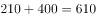元。

现小赵购买甲商品，先打9折，即元，然后在其基础上每满100元减10元，270元包含两个100元，即一共减20元，故最终购买甲商品的价格为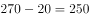元。要使小张和小赵购买两件商品花销一样，则小赵购买乙商品的价格必须是元。代入A项，500元减50元为450元，再打8折即是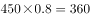元，符合条件。

故正确答案为A。

---

## 第 12 题　qid 2453193 · 数学运算

某单位的一个科室从10名职工中随机挑选2人去听报告，要求女职工人数不得少于1人。已知该科室女职工比男职工多2人，小张和小刘都是该科室的女性职工，则她们同时被选上的概率在以下哪个范围内？

- **A**. 
到之间

- **B**. 
小于

- **C**. 
到之间
　✅
- **D**. 
大于

**答案**：C

**官方解析**

假设男职工x人，女职工则是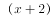人，根据题意可得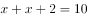，解得。故该科室男职工4人，女职工6人。随机选2人听报告，女职工人数不得少于1人，则有两种情况：

①女职工1人，男职工1人，则是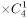种情况；

②女职工2人，则是种情况。

故总情况数是种。

现要小张和小刘同时选上，一共只选择两个人，故同时选上的情况数只有1种。

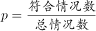。

故正确答案为C。

---

## 第 13 题　qid 2453194 · 数学运算

某单位有不到100人参加远足活动，如将该单位人员平均分成N组（且每组人数），则每组的人数有且仅有6种不同的可能性。则该单位参加活动的人数可能的最小值和最大值之间相差多少人？

- **A**. 32
- **B**. 48
- **C**. 56
- **D**. 64　✅

**答案**：D

**官方解析**

每组的人数有且仅有6种不同的可能性，说明此数字除了1和本身，有且仅有6个约数，加上1和本身，说明有8个约数。根据约数个数理论：如果一个合数分解质因数形式为，···则该合数的约数个数···。本题中约数个数为或者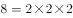，说明，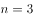或者。

若，，则要让人数最小，此时a，b要尽可能小（同时须为质数），故a取2，b取3，人数或者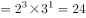，24更小，此种情况下最小值取24；

若，则要让人数最小，此时a，b，c尽可能小，故分别取2、3、5，此时人数。与上一种情况综合可知，最小为24。

现要使最大值最大，则其差值也应最大，故从选项最大值开始代入验算。D项：假设差值为64，则最大值为，88分解质因数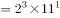，其约数个数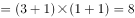，去掉1和本身，还剩6个约数，完全满足题意。

故正确答案为D。

---

## 第 14 题　qid 2453195 · 数学运算

甲、乙两船分别从上游的A地和下游的B地同时出发相向匀速行驶。甲船2小时后到达B地，随后立刻返航以原功率行驶，在3小时后与乙船同时到达A地。则两船如果同时从A地出发前往B地，甲船比乙船提前到达的时间在以下哪个范围内？

- **A**. 低于半小时
- **B**. 半小时～1小时之间　✅
- **C**. 1小时～1个半小时之间
- **D**. 高于1个半小时

**答案**：B

**官方解析**

根据题意可知，甲从A到B顺流花了2小时，从B到A逆流花了3小时，乙从B到A逆流花了5小时。赋值两地AB距离（2，3，5的公倍数），则甲顺流的速度为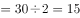···①，甲逆流的速度···②；联立①②，可得，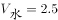；乙逆流速度，得。

现两船同时从A到B，甲船时间为2小时（已知），乙船时间小时，则甲船比乙船提前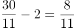小时，即在半小时~1小时之间。

故正确答案为B。

---

## 第 15 题　qid 2453196 · 数学运算

一个7层楼的酒店，每层有20间客房。酒店的房间号为一个3位数字，其中第一位为楼层，第二、三位为从01到20的房间编号。相邻的房间房号也相邻。某个楼层三个相邻房间的房号之和为一个各位数字均不相同、且各位数字之和为6的四位数。则这三个相邻房间的房号组合有多少种不同的可能？

- **A**. 2　✅
- **B**. 1
- **C**. 6
- **D**. 4

**答案**：A

**官方解析**

房号之和为一个各位数字均不同，且各位数字之和为6的四位数。故这四个数字只能是0、1、2、3。同时，房号的后两位最大为20，故后两位相加不可能产生进位。因此，三个百位数字相加（即百位数字3）必须要产生进位至千位才能得到一个四位数。故百位数字必须4，分情况讨论：

（1）若百位数字为4，则和的前两位为12，故后两位只能是03或者30，但是不可能有三个连续的数和为3，故后两位不能为03，只能是30。此时30只能由09、10、11三个连续的房号加和而成。因此，此时三个房号分别为409、410、411。

（2）若百位数字为5和6，则和的前两位分别为15和18，不符合。

（3）若百位数字为7，则和的前两位为21，则后两位只能是03或者30，与情况（1）同理可得，此时房号为709、710、711。

所以三间连续的房间为409、410、411或者709、710、711两种情况。

故正确答案为A。

---
