# 2020年四川下半年公务员录用考试《行测》试题（网友回忆版）

> 数量关系 · 10 题 · 四川 2020

## 第 1 题　qid 2725439 · 数学运算

某支部的每名党员均以5天为周期，在每个周期的最后1天内提交1篇学习心得。某年的1月1日是周日，在1月1日—5日的5天内，支部分别收到2篇、3篇、3篇、1篇和1篇学习心得。问当年前12周（每周从周日开始计算）内，支部共收到多少篇学习心得？

- **A**. 170
- **B**. 169　✅
- **C**. 120
- **D**. 119

**答案**：B

**官方解析**

根据题意可知，5天为一个周期，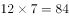天共循环个周期······4天。每个周期内共收到篇学习心得，剩余4天收到的学习心得与1月1日—4日相同。因此，共收到篇。

故正确答案为B。

---

## 第 2 题　qid 2725441 · 数学运算

一批相同的17件产品，交给甲、乙、丙三人生产。已知甲、乙、丙三人生产一件产品所需时间相同，每个人至少分到四件产品的生产任务，三人同时开始生产且完成各自的任务之前不休息。问完成所有工作所需时长有多少不同的可能性？

- **A**. 9
- **B**. 8
- **C**. 4　✅
- **D**. 3

**答案**：C

**官方解析**

根据题意可知，甲、乙、丙三人效率相同，即完成所有工作所需时长取决于工作量最大者所需时长。每人先分配四件产品，所需时间相同，总时长取决于件产品的分配情况。将最大工作量分类讨论如下：①分到2件产品（分配方案2、2、1）；②分到3件产品（分配方案3、2、0或3、1、1）；③分到4件产品（分配方案4、1、0）；④分到5件产品（分配方案5、0、0）。即完成所有工作所需时长共有4种可能。

故正确答案为C。

---

## 第 3 题　qid 2725447 · 数学运算

甲、乙、丙3种商品的库存分别为300件、300件和400件，单价分别为300元、500元、400元。销售出总库存量一半的商品后，剩余商品打5折销售。问总销售额最高为多少万元？

- **A**. 28.5
- **B**. 30
- **C**. 31.5　✅
- **D**. 33

**答案**：C

**官方解析**

根据题干可知，总库存量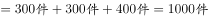，销售出总库存量一半的商品即已销售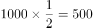件。总销售额销售单价销量，若要总销售额尽量高，则单价高的商品尽量以原价销售，故所求前500件销售额后500件销售额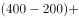万元。

故正确答案为C。

---

## 第 4 题　qid 2725453 · 数学运算

某公园修一个梯形的草坪ABCD，如下图所示，游客只能沿实线行走，其中AB长40米，DC长80米，AD长40米，BC长60米，E、F点为AD和BC的中点。后为了方便游客，拟修一条木质栈道EF穿过草坪，则该栈道至少可以让游客从入口E点到出口C点少走多少米？

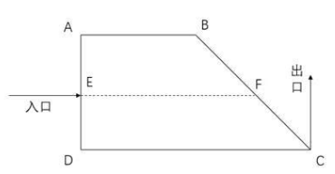

- **A**. 10　✅
- **B**. 15
- **C**. 20
- **D**. 25

**答案**：A

**官方解析**

路径E-F-C长度一定，要使少走的距离数最少，则应让游客走的实线距离更少，分情况讨论游客所走实线情况：

E-A-B-C：米；

E-D-C：米；

则路径E-D-C距离更少。

根据题意可知，EF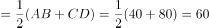米，则游客通过栈道到C点的距离为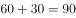米，则该栈道至少可以让游客从入口E点到出口C点少走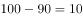米。

故正确答案为A。

---

## 第 5 题　qid 2725460 · 数学运算

一次长跑活动中，某人跑了比全程的多2000米的路程后，发现其已跑过的路程长度恰好是未跑路程的，问他还剩多少米的路程未跑？

- **A**. 5000
- **B**. 5300
- **C**. 6000　✅
- **D**. 6400

**答案**：C

**官方解析**

设全程为米，则已跑的路程米，未跑的路程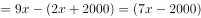米，根据题意列方程得：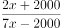，解得，则未跑的路程米。

故正确答案为C。

---

## 第 6 题　qid 2725391 · 数学运算

某企业生产一批产品，计划在42天内完成，先由甲、乙车间共同生产，12天后甲车间完成总任务的，乙车间完成总任务的。乙车间因设备整修，此后只能以的效率工作，为按时完成任务，丙车间此时新加入工作，问其产能至少应是甲车间的：

- **A**. 1
- **B**. 0.8　✅
- **C**. 0.6
- **D**. 0.5

**答案**：B

**官方解析**

由题干条件“12天后甲车间完成总任务的，乙车间完成总任务”可知，甲、乙车间的效率之比为10：15，赋值甲的效率为10，乙的效率为15，则总的工作量为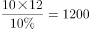，乙车间设备整修时的效率为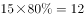。设丙车间的工作效率为，若恰好按时完成任务可列方程：，解得，因此丙车间产能至少应是甲车间的。

故正确答案为B。

---

## 第 7 题　qid 2725451 · 数学运算

桌上有20张正面向上的卡片，每次任选其中的3张翻面后放置于原位。问操作2次后，任一张卡片正面向上的概率为：

- **A**. 0.7225
- **B**. 0.745　✅
- **C**. 0.825
- **D**. 0.85

**答案**：B

**官方解析**

要使经过2轮翻转之后卡片正面向上，包括两类情况：1.该张卡片2轮均被选中（从正到反，再翻回正）；2.该张卡片2轮均未被选中（一直保持正面）。

1.该张卡片2轮均被选中。每次被选中概率为在20张卡片中任选3张，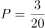，两轮均被选中，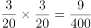；

2.该张卡片2轮均未被选中。每次未被选中概率为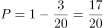，两轮均未被选中，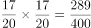；

总概率为两类情况概率之和，则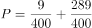。

故正确答案为B。

---

## 第 8 题　qid 2725468 · 数学运算

某企业有三个分公司，已知华北分公司的党员人数比华东分公司多1人，比华南分公司少4人。现将三个分公司的销售部门进行轮换，将华北分公司的销售部调入华东分公司，华东分公司的销售部调入华南分公司，华南分公司的销售部调入华北分公司，则三个分公司的党员人数相等。如华东分公司销售部原有名党员。问华北分公司销售部原有多少名党员？

- **A**. 

- **B**. 

- **C**. 
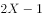

- **D**. 
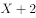
　✅

**答案**：D

**官方解析**

设华北分公司调换前党员总人数为人，由题可知华东分公司调换前党员总人数为人，华南分公司调换前党员总人数为人，调换后党员总人数不变，共人，因销售部轮换后三个分公司党员人数相等，则华东分公司党员人数为人，比调换前多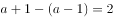人，由题意可知这2人由华北分公司销售部调入，若华东分公司销售部原有名党员，那么华北分公司销售部原有党员人数为人。 

故正确答案为D。

---

## 第 9 题　qid 2725488 · 数学运算

如图所示，在直线L上依次摆放着5个正方形。已知斜放置的2个正方形的面积分别是3和2。正放置的3个正方形的面积依次是、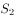、，且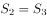。问的值为？

- **A**. 4　✅
- **B**. 5
- **C**. 11
- **D**. 13

**答案**：A

**官方解析**

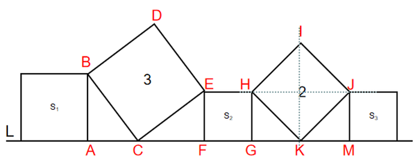

根据正方形HIJK和正方形BCED的面积分别为2和3，可得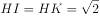，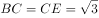，由勾股定理可得，，又因为HJ平分IK，故，正方形与的面积为1，由勾股定理可得，。由于，，，根据“两角及其夹边对应相等的三角形全等”，可得三角形与三角形全等，故，正方形的面积为2，故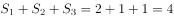。

故正确答案为A。

---

## 第 10 题　qid 2725489 · 数学运算

某人花400元购买了若干盒樱桃。已知甲、乙、丙三个品种的樱桃单价分别为28元/盒、32元/盒和33元/盒，问他最多购买了多少盒丙品种的樱桃？

- **A**. 3
- **B**. 4　✅
- **C**. 5
- **D**. 6

**答案**：B

**官方解析**

方法一：设分别购买了甲、乙、丙三个品种的樱桃盒、盒、盒，由题意可列式：，问最多购买了多少盒丙品种的樱桃，即的最大解，考虑从大到小代入排除：

将D项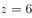代入方程得：，化简得：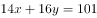，14、16均为偶数，但101为奇数，故、无法同时取到整数解，排除；

将C项代入方程得：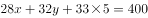，化简得：，28、32均为偶数，但235为奇数，故、无法同时取到整数解，排除；

将B项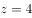代入方程得：，化简得：，7和8一奇一偶，67为奇数，故一定为奇数，当时，为非整数；当时，为非整数；当时，，满足要求。则的最大正整数解为4。

方法二：设分别购买了甲、乙、丙三个品种的樱桃盒、盒、盒，由题意可列式：，因、、均为正整数，28、32、400均为4的整数倍，故为4的整数倍，为4的整数倍，B项满足。

故正确答案为B。

---
