# 2020年四川省公务员考试《行测》试题（网友回忆版）

> 数量关系 · 10 题 · 四川 2020

## 第 1 题　qid 2578696 · 数学运算

工厂有两条效率相同的生产线A和B。现有件产品的订单乙和件相同产品的订单甲。两条生产线先合作天完成甲订单的部分生产任务，之后两条生产线分别负责不同订单的生产任务，又过天后乙订单完成，此时两条生产线继续合作天，完成全部甲订单的生产任务。问和的关系为：

- **A**. 
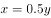

- **B**. 

　✅
- **C**. 
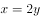

- **D**. 

**答案**：B

**官方解析**

设两条生产线的生产效率均为1，已知乙订单由其中一条生产线经天完成，则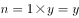。又已知甲订单先由两条生产线合作天，再由一条生产线生产天，最终再由两条生产线继续合作天，则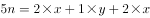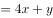。联立两式，可得：，化简得：。

故正确答案为B。

---

## 第 2 题　qid 2578710 · 数学运算

甲、乙两辆小车从相距100米的轨道两端同时出发相向而行，甲车以2米/秒的速度匀速行驶，乙车从静止状态开始以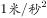的加速度均匀加速行驶，到达终点后停下。问以下哪个图能准确描述甲乙各自到达终点前，两车之间的距离与时间的关系（横轴为时间，纵轴为直线距离）？

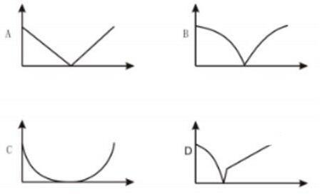

- **A**. A
- **B**. B
- **C**. C
- **D**. D　✅

**答案**：D

**官方解析**

方法一：离开起点后，两车之间的距离分阶段讨论如下：

①在相遇前，他们的距离随着时间变大逐渐变小；

②相遇后，两车背道而驰，两车之间的距离随着时间变大逐渐变大，增加距离由两车的路程和决定；

③加速度行驶的乙车到达终点后停下，之后只有甲车在行驶，故两车之间增加的距离取决于甲车。

因此两车之间的距离与时间的关系由三段组成，只有D项满足。

方法二：设甲、乙两车各自到达终点前，两车之间的距离为米，经过时间为秒。甲车速度匀速为2米/秒，乙车初速度为0，加速度为1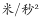，则甲车在秒里走过的路程为米；根据公式，路程，则乙车在秒里走过的路程为。把全程分三段讨论：

①在相遇之前：两车越来越接近，距离变小且为轨道总长减去他们各自已经走过的路程和，则从两车出发到相遇，两车之间的距离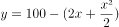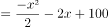，为一元二次函数，且由于前的系数为负值，在坐标轴中表示为开口向下的抛物线，排除A、C两项；

②在相遇之后直到其中一辆车率先到达终点：两车逐渐远离，距离变大且为他们各自已经走过的路程和减去轨道总长，两车之间的距离，为一元二次函数，且由于前的系数为正值，在坐标轴中表示为开口向上的抛物线，排除B项；（考场上据此即可选出正确答案，不用继续讨论第三段）

③其中一辆车到达终点后直到另一辆车到达终点：到达终点的车不动，由还在行驶的车决定两车之间的距离。甲车走完全程需用时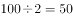秒，此时乙车走过路程为米，因此乙车远早于甲车到达终点并且停止行驶，此时他们的距离就是甲车和起点的距离也就是甲车走过的路程，两车之间的距离，在坐标轴中表示为一次线性函数。

所以最终的函数图形应当由三段组成，并且由于乙加速非常快，甲、乙相遇后乙到达终点的时间非常短，所以最后的函数图形为：一半段较长的开口向下的抛物线，加一小半段开口向上的抛物线，再加一段较长的直线。

故正确答案为D。

---

## 第 3 题　qid 2578698 · 数学运算

甲、乙两个箱子中分别装有不同数量的某种商品，总数不到100件。如果从甲或乙箱子中随机拿出1件这种商品，拿到次品的概率分别为和。如果将两箱内的商品混合后再随机拿出1件，则拿到次品的概率为，从乙箱中随机拿出3件这种商品，均不为次品的概率在以下哪个范围内？

- **A**. 

　✅
- **B**. 

- **C**. 
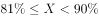

- **D**. 

**答案**：A

**官方解析**

设甲、乙两个箱子中的次品分别有、件，则甲的商品数量为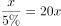件，乙的商品数量为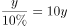件。根据混合后拿到次品的概率为，有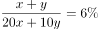，化简可得，则甲、乙两个箱子中的商品数量为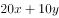。根据题意，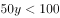，则只能取值为1，即乙有10件商品，其中有1件是次品、9件正品。从乙箱中随机拿出3件这种商品，均不为次品的概率为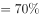，在A项的取值范围内。

故正确答案为A。

---

## 第 4 题　qid 2578700 · 数学运算

高校某教研室某年承接部级科研项目5个，经费总额为500万元，且每个项目经费都是整数万元。已知经费最多的两个项目平均经费与经费最少的两个项目经费之和相同，问经费排名第三的项目可能的最低经费金额为多少万元？

- **A**. 145
- **B**. 142
- **C**. 74　✅
- **D**. 71

**答案**：C

**官方解析**

方法一：设排名第三的项目经费为万元，经费最多的两个项目的平均经费为万元。则经费最多的两个项目经费之和为万元，经费最少的两个项目经费之和为万元。根据经费总额为500万元，有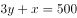。要值最小，则从最小的选项开始代入：

代入D项，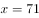，则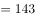万元，经费最少的两个项目必然有一个高于71万元，不符合题意，排除；

代入C项，，则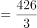万元，经费最少的两个项目平均有71万元，小于74万元，符合题意，当选。

方法二：设经费最多的两个项目的平均经费为万元，推出经费最多的两个项目经费之和为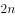万元，经费最少的两个项目经费之和为万元，则经费最多的两个项目和经费最少的两个项目经费之和为万元，一定是3的倍数，因此500减去选项是3的倍数。A项：，不是3的倍数，排除；B项：，不是3的倍数，排除；C项：，是3的倍数，保留；D项：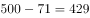，是3的倍数，保留。

剩余C、D两项，题目问最低，从最小的开始代入，代入D项，排名第三的项目经费为71万元，那么其他四个之和为万元，429是3的倍数，说明经费最少的两个项目经费之和为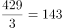万元，其中一项明显会大于71万元，不符合71万元排名第三，排除。

故正确答案为C。

---

## 第 5 题　qid 2578686 · 数学运算

某种圆珠笔单支购买1.7元/支，另有5元/3支和15元/10支两种包装供购买，办公室购买这种圆珠笔支，最低可能的购买总价为元，问可能的最大值为：

- **A**. 19　✅
- **B**. 21
- **C**. 29
- **D**. 31

**答案**：A

**官方解析**

根据题意，如果购买5元/3支的包装，则每3支圆珠笔比原价便宜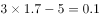元；如果购买15元/10支的包装，则每10支圆珠笔比原价便宜元。如果购买总价为元，则相比原价便宜了2.3元。

方法一：由于购买总价最低，则其中必然包含了1个10支的包装和3个3支的包装，则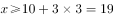，且如果买到20支则可以享受更为优惠的折扣（两个2元），所以最大仅能取到19。

方法二：结合选项，如果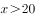支，则一定可以购买2个15元/10支的包装，最低可能的购买总价至少可以便宜4元，元不可能为最低可能的购买总价，排除B、C、D三项。

故正确答案为A。 

---

## 第 6 题　qid 2578692 · 数学运算

某超市出售1.5升装和4升装两种规格的矿泉水，1.5升装的每瓶进价3元，售价4.5元；4升装的每瓶进价7元，售价9元，三月份该超市共出售1000升矿泉水，利润（总售价总进价）为800元。问出售1.5升装矿泉水的瓶数是4升装的几倍？

- **A**. 4　✅
- **B**. 3
- **C**. 2
- **D**. 1.5

**答案**：A

**官方解析**

设超市售出1.5升装矿泉水瓶，4升装矿泉水瓶。售出1瓶1.5升装矿泉水的利润为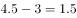元，售出1瓶4升装矿泉水的利润为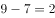元。根据条件可得：

······①，

······②；

联立①②，解得，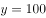，则所求倍数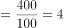倍。

故正确答案为A。

---

## 第 7 题　qid 2578687 · 数学运算

某工程由甲、乙两家企业共同参与，甲企业的实际出资额是乙企业的3倍，乙企业投入的人力资源是甲企业的2倍，如将两家企业投入的人力资源按一定价格折算为出资额并依折算后的出资额分配利润。则甲企业分配的利润是乙企业的1.2倍，问如乙企业的出资额增加，而其他条件不变，其分配的利润是甲企业的多少倍？

- **A**. 0.90
- **B**. 0.95　✅
- **C**. 1.00
- **D**. 1.05

**答案**：B

**官方解析**

赋值甲企业实际出资额为3，乙企业实际出资额为1，甲、乙人力资源之比为1：2，按照一定价格折算为出资额分配利润，则人力资源折算的出资额分配利润为1：2，设甲企业人力资源折算后的出资额为，乙企业人力资源折算后的出资额为。则甲企业折算后的出资额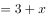，乙企业折算后的出资额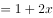。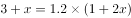，解得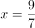。则甲企业折算后分配利润，乙企业出资额增加后，其分配利润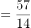，所求倍数倍。

故正确答案为B。

---

## 第 8 题　qid 2578694 · 数学运算

某单位举办兵乓球比赛，经过初赛之后最终只有甲、乙、丙、丁四人进入半决赛，半决赛随机抽签决定对手，胜者进入决赛，按平时练习情况，甲对乙的胜率是，甲对丙的胜率是，甲对丁的胜率是，乙对丙的胜率是，乙对丁的胜率是，丙对丁的胜率是，则下列判断正确的是？

- **A**. 
一定存在一种分组方式，丁比丙夺冠的几率更大

- **B**. 
一定存在一种分组方式，乙夺冠的几率能超过

- **C**. 
当甲和丁，乙和丙进行半决赛时，甲夺冠的可能性最大

- **D**. 
甲和乙进行半决赛时，甲夺冠可能性大于甲和丙进行半决赛的情况
　✅

**答案**：D

**官方解析**

由题意，可以将半决赛的分组结果分为以下几种：

第一种情况：

第二种情况：

第三种情况：

代入各个选项：

A项：三种情况，丁和丙的夺冠概率分别为（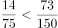）、（）、（），错误；

B项：三种情况，乙的夺冠概率分别为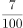、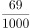、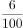，错误；

C项：由第三种情况可得，丙的夺冠概率最大，错误；

D项：由第一种情况可得，甲夺冠的概率为；由第二种情况可得，甲夺冠的概率为，正确。

故正确答案为D。

---

## 第 9 题　qid 2578688 · 数学运算

一个重量为千克的圆台形容器如下图所示，其口部半径是底面半径的2倍。在容器中装满水，总重量为9千克。从中倒出部分水使得液面高度为装满时的一半，总重量下降到4.5千克。问的值在以下哪个范围内？

- **A**. 
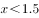

- **B**. 
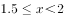

- **C**. 

　✅
- **D**. 
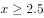

**答案**：C

**官方解析**

根据题意，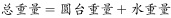，设底面半径为，则口部半径为，装满水时的液面高度为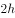，因为倒出部分水后液面高度为装满时的一半，则倒出水后的液面高度和倒出部分水的液面高度均为，倒出水后的水面半径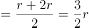。赋值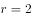，则倒出水后的水面半径，口部半径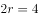。根据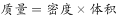，且容器中的液体不变，密度相同，可得水的质量比即为体积比；根据圆台体积公式（为上底半径、为下底半径、为高），则倒出部分水的体积与剩余部分水的体积之比。设倒出部分的水的质量为，剩余部分的水的质量为。倒出部分的水的质量千克，则，剩余部分的水的质量，此时总重量，。

故正确答案为C。

---

## 第 10 题　qid 2578689 · 数学运算

一个容器由一个长方体和一个半圆柱体如下图组合而成，长方体的长为1米，宽为0.5米，高为2米。在这个容器表面涂漆花费200元，问平均每平方米的涂漆成本在哪个范围内？

- **A**. 不超过20元
- **B**. 超过20元但不超过25元　✅
- **C**. 超过25元但不超过30元
- **D**. 超过30元

**答案**：B

**官方解析**

容器是由一个长方体和一个半圆柱体组合而成的，根据长方体的表面积公式和圆柱表面积公式，可得：容器表面积长方体表面积圆柱表面积长方体和半圆柱重合面面积平方米，则平均每平方米的涂漆成本元/平方米。

故正确答案为B。

---
