# 2020年国家公务员录用考试《行测》题（副省级网友回忆版）

> 数量关系 · 15 题 · 国考 2020

## 第 1 题　qid 2448379 · 数学运算

扶贫干部某日需要走访村内6个贫困户甲、乙、丙、丁、戊和己。已知甲和乙的走访次序要相邻，丙要在丁之前走访，戊要在丙之前走访，己只能在第一个或最后一个走访。问走访顺序有多少种不同的安排方式？

- **A**. 24
- **B**. 16　✅
- **C**. 48
- **D**. 32

**答案**：B

**官方解析**

由题干“甲和乙的走访次序要相邻”，即将甲、乙捆绑，甲、乙排序有种情况。根据“丙要在丁之前走访，戊要在丙之前走访”，即此三人只能按照戊、丙、丁顺序排列，故考虑将捆绑后的甲、乙和己插入到戊、丙、丁形成的a、b、c、d四个空位当中。如图：

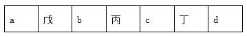

将捆绑后的甲、乙随机放入剩余的4个空位当中，即4种可能；最后再将己放入第一个或最后一个位置，即2种可能。所以总情况数为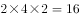种情况。

故正确答案为B。

---

## 第 2 题　qid 2448532 · 数学运算

高架桥12：00～14：00每分钟车流量比9：00～11：00少，9：00～11：00、12：00～14：00、17：00～19：00三个时间段的平均每分钟车流量比9：00～11：00多。问17：00～19：00每分钟的车流量比9：00～11：00多：

- **A**. 

- **B**. 

　✅
- **C**. 

- **D**. 

**答案**：B

**官方解析**

根据题意，假设9：00～11：00每分钟车流量为10，则12：00～14：00每分钟车流量为，9：00～11：00、12：00～14：00、17：00～19：00三个时间段的平均每分钟车流量为，则17：00～19：00每分钟车流量为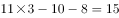，，则17：00～19：00每分钟的车流量比9：00～11：00多。

故正确答案为B。

---

## 第 3 题　qid 2448394 · 数学运算

某种糖果的进价为12元/千克，现购进这种糖果若干千克，每天销售10千克，且从第二天起每天都比前一天降价2元/千克。已知以6元/千克的价格销售的那天正好卖完最后10千克，且总销售额是总进货成本的2倍。问总共进了多少千克这种糖果？

- **A**. 180
- **B**. 190　✅
- **C**. 160
- **D**. 170

**答案**：B

**官方解析**

由题干“总销售额是总进货成本的2倍”，即平均每千克糖果售价为元。因为从第二天起每天都比前一天降价2元/千克，即判定糖果价格为公差为的等差数列，故平均价格，即，解得第一天售价为42元。根据等差数列第n项公式“”，代入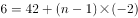，解得天。因为每天卖10千克，故总量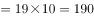千克。

故正确答案为B。

---

## 第 4 题　qid 2448380 · 数学运算

环保局某科室需要对四种水样进行检测，四种水样依次有5、3、2、4份。检测设备完成四种水样每一份的检测时间依次为8分钟、4分钟、6分钟、7分钟。已知该科室本日最多可使用检测设备38分钟，如今天之内要完成尽可能多数量样本的检测，问有多少种不同的检测组合方式？

- **A**. 6　✅
- **B**. 10
- **C**. 16
- **D**. 20

**答案**：A

**官方解析**

由题干“今天之内要完成尽可能多数量样本的检测”，即先从每一份花费时间少的水样开始检测，这样可以保证在38分钟内完成的数量最多。如下表所示：

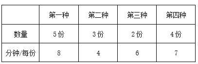

故按照第二种、第三种、第四种、第一种顺序检测，凑够38分钟。

检测第二种水需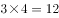分钟，检测第三种水需分钟，再从第四种水的四份中随机选2份，所需时间为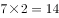分钟，刚好凑够38分钟，且保证了检测数量最多。因题干问“问有多少种不同的检测组合方式”，即考虑组合情况数（不需考虑顺序），故第二种、第三种水全选，均为1种情况；第四种水4份中随机选2份有种组合方式，所以总组合数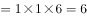种。

故正确答案为A。

---

## 第 5 题　qid 2448396 · 数学运算

一条圆形跑道长500米，甲、乙两人从不同起点同时出发，均沿顺时针方向匀速跑步。已知甲跑了600米后第一次追上乙，此后甲加速继续前进，又跑了1200米后第二次追上乙。问甲出发后多少米第一次到达乙的出发点？

- **A**. 180　✅
- **B**. 150
- **C**. 120
- **D**. 100

**答案**：A

**官方解析**

条件和问题均只给出了距离，未给出速度和时间的具体值，考虑赋值。赋值甲速度为100米/分，第一次追及，甲跑了600米，用时为6分；第二次追及，甲加速，速度为120米/分，又跑了1200米，用时为10分。

根据行程问题追及公式，从第一次追上，到第二次追上时，两人的路程差为1圈，即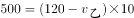，解得乙速度米/分。

再分析第一次追及过程，甲比乙多走的距离即为甲出发点到乙出发点距离，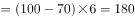米。

故正确答案为A。

---

## 第 6 题　qid 2448571 · 数学运算

将一个圆盘形零件匀速向下浸入水中。问以下哪个坐标图能准确反映浸入深度AO及圆盘与水面的接触部位长度CD之间的关系？

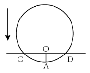

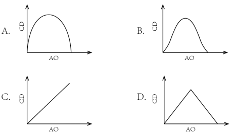

- **A**. A　✅
- **B**. B
- **C**. C
- **D**. D

**答案**：A

**官方解析**

如下图所示，假设圆盘形零件的圆心为B，半径为10，浸水速度为1。在开始浸入到浸入半个圆盘过程中，假设浸入时间为，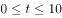，则浸入深度，，在直角三角形BOD中，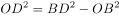，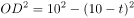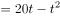，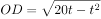，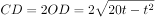，，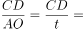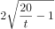，可知CD与AO并非线性关系，排除C项与D项。

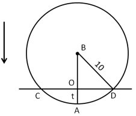

当时，；当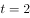时，；当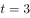时，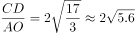；

当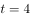时，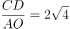；当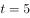时，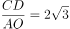······

观察可得随着越来越大，的数值越来越小，根号下数值越来越小，且下降速度逐渐变缓。即随着AO长度变大，CD长度变大的速度逐渐变缓，排除B项。

当时，CD取得最大值为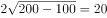，为圆盘的直径。当大于10时，CD长度逐渐变小，图形与前半部分对称。

故正确答案为A。

---

## 第 7 题　qid 2448572 · 数学运算

丙地为甲、乙两地之间高速公路上的一个测速点，其与甲地之间的距离是与乙地之间距离的一半。A、B两车分别从甲地和乙地同时出发匀速相向而行，第一次迎面相遇的位置距离丙地500米。两车到达对方出发地后立刻原路返回，第二次两车相遇也为迎面相遇，问第二次相遇的位置一定：

- **A**. 距离甲地1500米
- **B**. 距离乙地1500米　✅
- **C**. 距离丙地1500米
- **D**. 距离乙、丙中点1500米

**答案**：B

**官方解析**

第一次相遇地点距离丙地500米分为两种情况，分别为相遇点在甲丙之间和在乙丙之间。如果相遇点在甲丙之间，说明此时B车路程超过A车的2倍，也就意味着速度超过2倍，此时第二次相遇应为追上相遇，与题目中第二次两车相遇也为迎面相遇矛盾，所以第一次相遇点一定在乙丙之间。

设甲丙为米，则乙丙为米、甲乙为米，第一次相遇时A车路程为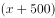米。从出发到第一次相遇，两车路程和为米；从出发到第二次相遇，两车路程和为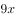米。速度和不变，两个过程的路程和之比为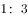，可知两个过程的时间之比也为。对A车而言，速度不变，时间之比为，可推出两个过程中A车的路程之比也为，即第二次相遇时A车路程为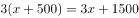米。综上可知，A车从甲地到达乙地之后返回又走了1500米，因此，第二次相遇的位置距离乙地1500米。

故正确答案为B。

---

## 第 8 题　qid 2448404 · 数学运算

某个项目由甲、乙两人共同投资，约定总利润10万元以内的部分甲得，10万元～20万元的部分甲得，20万元以上的部分乙得。最终乙分得的利润是甲的1.2倍。问如果总利润减半，甲分得的利润比乙：

- **A**. 少1万元
- **B**. 多1万元　✅
- **C**. 少2万元
- **D**. 多2万元

**答案**：B

**官方解析**

设总利润为（）万元，则甲获得利润为（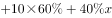）万元，乙获得利润为（）万元，根据题意，（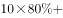），解得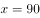。

如果总利润减半，则总利润变为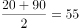万元，此时甲获得利润万元，乙获得利润万元，甲分得的利润比乙多1万元。

故正确答案为B。

---

## 第 9 题　qid 2448429 · 数学运算

甲、乙两条生产线生产A和B两种产品。其中甲生产线生产A、B产品的效率分别是乙生产线的2倍和3倍。现有2种产品各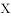件的生产任务，企业安排甲和乙生产线合作尽快完成任务，最终甲总共生产了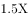件产品。问乙在单位时间内生产A的件数是生产B件数的多少倍？

- **A**. 

　✅
- **B**. 
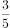

- **C**. 
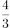

- **D**. 
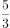

**答案**：A

**官方解析**

如下表所示，假设乙生产线生产A产品的效率为，生产B产品的效率为，则甲生产线生产A产品的效率为，生产B产品的效率为。

A产品甲的效率是乙的2倍，B产品甲的效率是乙的3倍，因此相对而言甲做B产品优势更明显，要想二者合作时间短，则让甲生产线生产B产品，乙生产线生产A产品。根据题意甲总共生产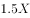件产品可知甲生产了B产品件，A产品件，则乙生产了剩余的A产品件。根据甲乙两条生产线工作时间相同，可列方程: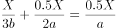，解得，即乙在单位时间内生产A的件数是生产B件数的倍。

故正确答案为A。

---

## 第 10 题　qid 2448574 · 数学运算

销售员小刘为客户准备了A、B、C三个方案。已知客户接受方案A的概率为。如果接受方案A，则接受方案B的概率为，反之为。客户如果A或B方案都不接受，则接受C方案的概率为，反之为。问将3个方案按照客户接受概率从高到低排列，以下正确的是：

- **A**. 
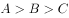

- **B**. 
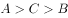

- **C**. 

- **D**. 
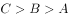
　✅

**答案**：D

**官方解析**

A方案接受概率为。

B方案接受概率分为两种：

①接受A接受B：，

②不接受A接受B：，则接受B方案的概率为；

C方案的接受概率分为两种：

①不接受A也不接受B且接受C：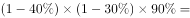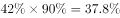，

②AB没有都不接受且接受C：，则C方案的接受概率为。

所以三者从高到低排列为：。

故正确答案为D。

---

## 第 11 题　qid 2448387 · 数学运算

某种产品每箱48个。小李制作这种产品，第1天制作了1个，以后每天都比前一天多制作1个。X天后总共制作了整数箱产品。问X的最小值在以下哪个范围内？

- **A**. 在41～60之间
- **B**. 超过60
- **C**. 不到20
- **D**. 在20～40之间　✅

**答案**：D

**官方解析**

第1天制作了1个，以后每天都比前一天多制作1个，所以每天制作的产品数量为公差为1的等差数列，产品总数为。设总共制作了N箱，则，化简得。

分析该式可知，能被96整除且和必然一奇一偶，而96的大于1的奇数因子只有3，故将96因式分解为，故和其中必有一个能被32整除、另一个能被3整除。（详见备注）

要让最小，不妨令，此时，两个倍数均满足，代入解得，不违反题意，故。

故正确答案为D。

备注：①如果将因式分解为，之类的情况，会造成和都是偶数，违反题意。故只能因式分解为，即一个能被32整除，另一个能被3整除。②若令的倍数，则需要是32的倍数，会造成X的最小值等于63，比解析中讨论的32更大，违反题意。

---

## 第 12 题　qid 2448415 · 数学运算

某单位从理工大学、政法大学和财经大学总计招聘应届毕业生三百多人。其中从理工大学招聘人数是政法大学和财经大学之和的，从政法大学招聘的人数比财经大学多。问该单位至少再多招聘多少人，就能将从这三所大学招聘的应届生平均分配到7个部门？

- **A**. 6　✅
- **B**. 5
- **C**. 4
- **D**. 3

**答案**：A

**官方解析**

根据条件“理工大学招聘人数是政法大学和财经大学之和的”，则；“政法大学招聘的人数比财经大学多”，则。设政法与财经大学的总招聘人数为，则三所大学的总招聘人数为。根据“总计招聘应届毕业生三百多人”，则只能取值为3，此时总计招聘了人。

若想将招聘的应届生平均分配到7个部门，大于351且能够被7整除的数最小为357，则还需要至少招聘人。

故正确答案为A。

---

## 第 13 题　qid 2448405 · 数学运算

从一个装有水的水池中向外排水，规定每周二、四、六每天排出剩余水量的，其余日期每天排出剩余水量的。如此连续操作6天后，水池中剩余相当于总容量的水。问最开始时水池中的水量最多相当于总容量的：

- **A**. 

- **B**. 

- **C**. 

　✅
- **D**. 

**答案**：C

**官方解析**

若想开始时的水量占比尽可能大，则最开始时的水量应尽可能多，由于最后剩余水量的占比一定，则每天排出的水要尽可能多。

根据题意，每周二、四、六排水后剩余水量为前一天的；其余日期（周日、周一、周三、周五）每天剩余水量为前一天的。若要每日排出的水尽量多，则其余日期应尽量多。假设从周日开始计算，连续六天后，剩余水量为开始水量的：。则最开始水池中的水量相当于总容量的。

故正确答案为C。

---

## 第 14 题　qid 2448449 · 数学运算

部队前哨站的雷达监测范围为100千米。某日前哨站侦测到正东偏北千米处，一架可疑无人机正匀速向正西方向飞行。前哨站通知正南方向150千米处的部队立即向正北方向发射无人机拦截，匀速飞行一段时间后，正好在某点与可疑无人机相遇。问我方无人机速度是可疑无人机的多少倍？

- **A**. 

- **B**. 

- **C**. 

　✅
- **D**. 

**答案**：C

**官方解析**

根据题意可得我方无人机与可疑无人机运动轨迹如上图所示，二者最终在C点相遇，。

已知千米，，则在直角三角形中，，千米，千米，又已知千米，则千米。

相同时间，我方无人机从B点飞行到C点，可疑无人机从A点飞行到C点，速度之比等于路程之比，，则我方无人机速度是可疑无人机的倍。

故正确答案为C。

---

## 第 15 题　qid 2448535 · 数学运算

一个无盖长方体饮料盒如下图所示，其底面为正方形，高为23厘米。若插入一根足够细的不可弯折的吸管与底部接触，已知插入饮料盒内的吸管长度最大为27厘米，问饮料盒底面边长为多少厘米？

- **A**. 

- **B**. 

- **C**. 

　✅
- **D**. 

**答案**：C

**官方解析**

设底面边长为。要使插入的吸管最长，则需吸管沿着长方体对角线按如下图所示插入。和均为直角三角形，且和分别是直角，则有, ，联立两个式子得：，解得。

 

故正确答案为C。

---
