# 2020年山东省公务员录用考试《行测》试题（网友回忆版）

> 数量关系 · 10 题 · 山东 2020

## 第 1 题　qid 2571727 · 数学运算

甲、乙两人在一条400米的环形跑道上从相距200米的位置出发，同向匀速跑步。当甲第三次追上乙的时候，乙跑了2000米。问甲的速度是乙的多少倍？

- **A**. 1.2
- **B**. 1.5　✅
- **C**. 1.6
- **D**. 2.0

**答案**：B

**官方解析**

环形跑道异地同向出发，两人的初始距离为200米，则第一次追上时，甲、乙的路程差为200米。追上后再次出发，相当于同时同地同向出发，追上一次，两人的路程差为一圈，则从第一次追上到第三次追上，又追上两次，则路程差为两圈，即米。从出发到第三次追上，甲、乙的路程差即甲比乙多走的路程为米，乙的路程：米，则甲的路程：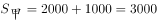米。从出发到第三次追上，两人的时间相同，根据“时间相同，路程与速度成正比”，则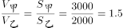。

故正确答案为B。

---

## 第 2 题　qid 2571736 · 数学运算

已知1立方米可燃冰可转化为164立方米的天然气和0.8立方米的水。现完成一定量的可燃冰转化后，产生的水比可燃冰体积减小了22立方米。问转化过程总共产生多少立方米天然气？

- **A**. 少于1.6万
- **B**. 1.6万～1.7万之间
- **C**. 1.7万～1.8万之间
- **D**. 多于1.8万　✅

**答案**：D

**官方解析**

方法一：1立方米可燃冰可产生水的体积比可燃冰的体积少立方米，现产生的水比可燃冰体积减小了22立方米，则所用可燃冰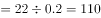立方米。110立方米可燃冰产生的天然气万立方米，在D项范围内。

方法二：1立方米可燃冰可产生0.8立方米的水，则可燃冰和水的体积之比为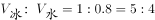，现产生的水比可燃冰体积减小了22立方米，可燃冰体积与水的体积比仍是5：4，体积相差1份，1份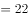立方米，可燃冰体积5份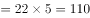立方米，则产生的天然气体积万立方米，在D项范围内。

故正确答案为D。

---

## 第 3 题　qid 2571739 · 数学运算

某集团旗下有量贩式超市和便民小超市两种门店，集团统一采购的A商品在量贩式超市和便民小超市的单件售价分别为12元和13.5元。4月份A商品在两种门店分别售出了600件和400件，共获利5000元，问该商品进价为多少元？

- **A**. 7.2
- **B**. 7.6　✅
- **C**. 8.0
- **D**. 8.4

**答案**：B

**官方解析**

方法一：设该商品进价为元，则量贩式超市每件的利润为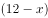元，便民小超市每件的利润为元，4月份分别卖出600件和400件，共获利5000元，则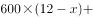，解得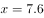。

方法二：极端思维解题。便民小超市比量贩式超市每件多赚元，所以400件多赚元。假设便民超市每件也按12元出售，则1000件的总利润应为元，每件商品的利润是元，则进价元。

故正确答案为B。

---

## 第 4 题　qid 2571747 · 数学运算

马拉松组委会在赛道中设置18个水站，将赛道平均分为19段。送水车下午14：00从起点出发匀速行驶，每到一个站点停1分钟时间卸下瓶装水，到达终点之后原速返回起点且不再停站。已知14：27，送水车卸完第9个站的瓶装水，问如果其到达终点后立刻返回，什么时间能重新回到起点？

- **A**. 15：30
- **B**. 15：32
- **C**. 15：34　✅
- **D**. 15：36

**答案**：C

**官方解析**

根据题目信息可知从14：00到14：27总共走过9段并且卸水9次，共耗时27分钟。因每次卸水时间都是1分钟，卸水9次共9分钟，可知走一段的时间应该是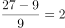分钟。因“到达终点之后原速返回起点且不再停站”，即总共需要走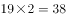段，并且卸水18次，所以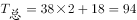分钟1小时34分钟。因下午14：00出发，经过1小时34分钟，可知15：34重新回到起点。

故正确答案为C。

---

## 第 5 题　qid 2571759 · 数学运算

由于改良了种植技术，农场2017年种植的A和B两种作物，产量分别增加了和。已知2017年两种作物总产量增加了，问2017年A和B两种作物的产量比为：

- **A**. 7：8
- **B**. 8：7
- **C**. 176：175
- **D**. 77：100　✅

**答案**：D

**官方解析**

方法1：设2016年A、B作物的产量分别为和，根据题意可知，2017年A作物产量为，B作物产量为，两种作物总产量为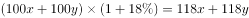；则，化简可得，所以，则2017年A、B作物产量之比为。

方法2：根据2017年A、B作物产量分别增加和，而总产量增加，可以考虑使用线段法进行解答。设2016年A、B作物的产量分别为和，根据距离和量成反比，可知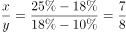，可得2016年A、B作物产量之比为7：8，则2017年A、B作物产量之比为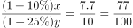。

故正确答案为D。

---

## 第 6 题　qid 2571768 · 数学运算

一个半圆形拱门的宽和高分别为8米和4米，一辆货车拉着宽4.8米、每层高20厘米的泡沫板通过该拱门。如果车斗底部与地面的垂直距离为1.1米，问要通过拱门，每次最多可以装载几层泡沫板?

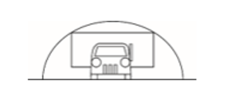

- **A**. 9
- **B**. 10　✅
- **C**. 11
- **D**. 12

**答案**：B

**官方解析**

货物与拱门接触时承载层数最多，此时如图所示，记拱门圆心为O点。A点为货车与拱门接触点，过A点作地面的垂线，垂足为C点，则三角形OAC为直角三角形。，米。根据勾股定理得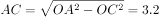米。那么货物最高为米。最多可承载层数，因此最多可载层数为10。

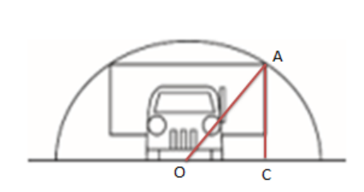

故正确答案为B。

---

## 第 7 题　qid 2571773 · 数学运算

公司2017年每个月的销售额都比上个月高万元。其9月的销售额是1月的2倍，11月的销售额为900万元。问该公司2017年全年的销售额是多少万元?

- **A**. 7200
- **B**. 7650
- **C**. 8100　✅
- **D**. 8550

**答案**：C

**官方解析**

根据“某公司2017年每个月的销售额都比上个月高万元。”可知每个月的销售额成等差数列，公差为。设首项为，根据等差数列公式。得

，

，

解得，。

根据等差数列求和公式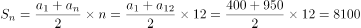。

则公司2017年全年的销售额是8100万元。

故正确答案为C。

---

## 第 8 题　qid 2571791 · 数学运算

在ATM机上输入银行卡密码时，若连续三次输入错误则会吞卡，老李忘了银行卡密码的末两位数，只记得是两个不相同的奇数，若他在末两位上随意输入两个不同奇数，能在吞卡前猜中正确密码的概率是：

- **A**. 

　✅
- **B**. 

- **C**. 

- **D**. 

**答案**：A

**官方解析**

奇数为1、3、5、7、9，共五个，总情况数为从5个奇数中选择两个不同奇数，共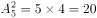种。三次尝试有一次猜中即可。分类讨论：第一次猜中的概率为；第一次猜错第二次猜中的概率为；前两次均错第三次猜中的概率为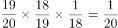。则能在吞卡前猜中的概率为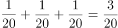。

故正确答案为A。

---

## 第 9 题　qid 2571800 · 数学运算

有2张的正方形红纸，3张的正方形黄纸，2张的长方形绿纸，所有的纸均颜色均匀。现在将这些纸全部不重叠地贴到一张的正方形白纸上，要求最后的图案为轴对称图形。问总共能贴出多少种满足要求的图案（旋转后重合的图案视为同一种）?

- **A**. 11
- **B**. 10　✅
- **C**. 5
- **D**. 4

**答案**：B

**官方解析**

（1）两个长方形关于正方形横轴或竖轴对称：共4种。（先贴两个的长方形绿纸横轴或竖轴对称，再贴两个的正方形红纸横轴或竖轴对称，有4种，最后贴黄纸即可。）

注：因为旋转后重合的图案视为同一种，此处可视作竖轴对称，也可认为是横轴对称。

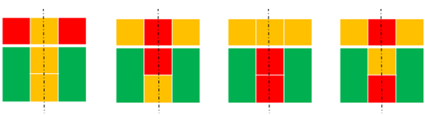

（2）两个长方形关于正方形对角线对称但不相邻：共4种。（先贴两个的长方形绿纸关于正方形对角线对称但不相邻，再贴两个的正方形红纸对角线对称，有4种，最后贴黄纸即可。）

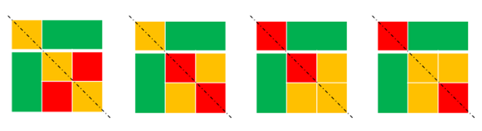

（3）两个长方形关于正方形对角线对称且相邻：共2种。（先贴两个的长方形绿纸关于正方形相邻对角线对称，再贴两个的正方形红纸对角线对称，有2种，最后贴黄纸即可。）

一共10种情况。

故正确答案为B。

---

## 第 10 题　qid 2571802 · 数学运算

甲、乙两个工程队共同完成某项工程需要12天，其中甲单独完成需要20天。现8月15日开始施工，由甲工程队先单独做5天，然后甲、乙两个工程队合作3天，剩下的由乙工程队单独完成，问工程完成的日期是：

- **A**. 9月5日
- **B**. 9月6日　✅
- **C**. 9月7日
- **D**. 9月8日

**答案**：B

**官方解析**

甲、乙共同完成需要12天，甲单独完成需要20天，赋值总的工程量为60，甲、乙的效率和为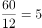，甲的效率为，故乙的效率为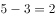，甲先做5天完成了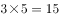的工作量，甲、乙合作3天完成了的工作量，剩余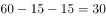的工作量，乙单独完成剩余工作量需要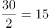天，完成此项工程一共需要天，8月15日开始，8月干了天，故9月还需要6天，完工日期为9月6日。

故正确答案为B。

---
