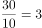
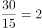
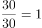
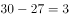

# 2020年山东省选拔录用选调生笔试综合测试（节选）（网友回忆版）

> 数量关系 · 3 题 · 选调 2020

## 第 1 题　qid 2668119 · 数学运算

已知某零件的生产需要依次经过4道工序，分别由甲、乙、丙、丁4人完成，其中每一道工序均需花费30分钟才能完成。请问如果生产10个这样的零件，至少需要多少分钟才能完成？（    ）

- **A**. 300
- **B**. 390　✅
- **C**. 480
- **D**. 570

**答案**：B

**官方解析**

由甲开头，生产第一个零件。接着交给乙，甲继续去做第二个零件；接着乙交给丙，此时乙开始做第二个，甲开始做第三个；然后丙交给丁，可知当丁开始做第一个的时候，甲开始做第四个，两人之间差了3个。以此类推，当甲做完10个零件，用了分钟，此时丁还差3个，需要再做分钟，故最后所需的总时间至少为分钟。

故正确答案为B。

---

## 第 2 题　qid 2668120 · 数学运算

某一个专业共有100名学生，在第一次考试中有52人得90分以上（含90分），在第二次考试中有42人得90分以上（含90分）。已知这两次考试都没得90分以上（含90分）的有34人，那么这两次考试都得90分以上（含90分）的有多少人？（    ）

- **A**. 14
- **B**. 28　✅
- **C**. 8
- **D**. 4

**答案**：B

**官方解析**

根据两集合容斥原理公式：，可得到关系：第一次得90分以上第二次得90分以上两次都得90分以上总人数两次都没得90分以上。设两次考试都得90分以上的有人，可得：，解得。

故正确答案为B。

---

## 第 3 题　qid 2668122 · 数学运算

某单位职工食堂需要装修，可以使用甲、乙、丙三个装修队，甲队单独工作需10天完成，乙队单独工作需15天完成，丙队单独工作需30天完成。甲队装修一天需要1200元，乙队装修一天需要1000元，丙队装修一天需要800元。若该单位要求在9天内完成装修，则该单位至少需要付多少元装修费？（不足一天按一天算）（    ）

- **A**. 12000
- **B**. 12600　✅
- **C**. 15000
- **D**. 18600

**答案**：B

**官方解析**

赋值工作总量为10、15和30的最小公倍数30，则甲队的效率为，乙队的效率为，丙队的效率为。根据支付条件可知，甲、乙、丙每天平均完成一份工作量需要的装修费分别为元、元、元，甲最少，故应尽可能多用甲，其次为乙和丙。已知“要求在9天内完成装修”，甲队工作9天的工作量为，剩余工作量为，在9天中任选1天加入乙、丙合作恰好完成。此时总装修费最少，为元。

故正确答案为B。

---
