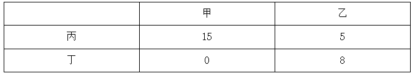
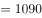
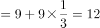
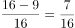
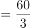
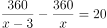
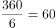
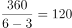

# 2020年广东省公务员录用考试《行测》试题（乡镇卷）（网友回忆版）

> 数量关系 · 12 题 · 广东 2020

## 第 1 题　qid 2604259 · 数学运算

9.19，4.27，5.35，2.43，（    ）

- **A**. 3.51
- **B**. 5.51　✅
- **C**. 5.60
- **D**. 8.60

**答案**：B

**官方解析**

题干有特殊符号“.”，故考虑小数点前后的机械划分。小数点后数列19，27，35，43，（    ），是公差为8的等差数列，下一项为；小数点前数列观察无明显特征，作差作和亦无规律，考虑与小数部分的关系，，，，，发现小数部分两数乘积取个位数是整数部分，即，取9；，取4；，取5；，取2，则所求项整数部分为，取5，故所求项为5.51。

故正确答案为B。

---

## 第 2 题　qid 2604267 · 数学运算

- **A**. 16
- **B**. 27
- **C**. 38　✅
- **D**. 49

**答案**：C

**官方解析**

图形数阵，优先考虑横向和竖向规律。第一行；第二行；第三行，发现各行数字之和组成的数列16，32，48，（    ），是公差为16的等差数列，下一项为，则所求项。

故正确答案为C。

---

## 第 3 题　qid 2604230 · 数学运算

甲、乙两地稻谷同时成熟，分别需要15台和13台大型收割机进行收割，计划从丙、丁两地分别调配20台和8台收割机进行支援。若从丙地调配一台收割机到甲、乙两地分别需要油费40元、50元；从丁地到甲、乙两地分别需要50元、30元，则完成所有的收割机调配至少需要油费（    ）元。

- **A**. 1000
- **B**. 1090　✅
- **C**. 1180
- **D**. 1270

**答案**：B

**官方解析**

根据题意可知，从丙地向甲地调配收割机油费较低，从丁地向乙地调配收割机油费较低，则油费最低调配方案如下表：

最低油费为元。

故正确答案为B。

---

## 第 4 题　qid 2604239 · 数学运算

为加强治安防控，现计划在一段L形的围墙（如下图）上安装治安摄像头，其中A点到B点长度为750米，B点到C点长度为1350米。按要求ABC三个位置必须安装一个摄像头，且相邻两个摄像头之间的距离要保持一致，则整段围墙至少需要安装（    ）个摄像头。

- **A**. 14
- **B**. 15　✅
- **C**. 16
- **D**. 17

**答案**：B

**官方解析**

根据“ABC三个位置必须安装一个摄像头”可知为两端植树问题。根据公式：。根据“相邻两个摄像头之间的距离要保持一致”可得，间隔距离需为AB、BC长度的公约数。总长一定，间隔距离越大，摄像头的个数就越少，则间隔距离最大为AB（750米）、BC（1350米）的最大公约数，即150米，则至少需要安装个摄像头。

故正确答案为B。

---

## 第 5 题　qid 2604252 · 数学运算

现有浓度为的食盐水250克，若向该食盐水添加10克食盐，再蒸发掉160克水，则新获得的食盐水的浓度为（    ）。

- **A**. 

- **B**. 

- **C**. 

　✅
- **D**. 

**答案**：C

**官方解析**

由，则。原来浓度为的250克食盐水中食盐的含量为克；添加10克食盐，再蒸发掉160克水，则此时食盐含量为克，溶液为克，则。

故正确答案为C。

---

## 第 6 题　qid 2604260 · 数学运算

某单位的两个部门计划订阅报纸。每个部门需要在指定的5种报纸中选择其中的3种，且这两个部门在选择时应做好沟通，做到5种报纸都有部门订阅，则订阅报纸的方案共有（    ）种。

- **A**. 20
- **B**. 30　✅
- **C**. 60
- **D**. 100

**答案**：B

**官方解析**

第一个选择的部门从5种报纸中任意选择3种，有种选择；此时要保证5种报纸都有人选择，第二个部门必须要选择剩余的2种报纸，且再从第一个部门选择的3种报纸中任选一种即可，则第二个部门有种，则订阅报纸的方案共有种。

故正确答案为B。

---

## 第 7 题　qid 2604271 · 数学运算

一个纸箱里装有大小及材质完全相同的10个小球，其中3个黑色，2个白色，1个红色，2个黄色，1个绿色，1个紫色。如果不放回地依次随机取出3个小球，则取出的小球依次是黑色，红色，白色的概率为（    ）。

- **A**. 

　✅
- **B**. 

- **C**. 

- **D**. 

**答案**：A

**官方解析**

概率。不放回的依次随机取出3个小球，总的情况数为种；要求取出的小球依次是黑色、红色、白色的情况数为种，则取出的小球依次是黑色，红色，白色的概率为。

故正确答案为A。

---

## 第 8 题　qid 2604354 · 数学运算

某企业四月的营业额比三月的营业额多三分之一，五月的营业额比四月多三分之一，则三月的营业额比五月的营业额少（    ）。

- **A**. 

- **B**. 

- **C**. 

- **D**. 

　✅

**答案**：D

**官方解析**

根据题意赋值三月营业额为9，则四月的营业额，五月的营业额，因此三月的营业额比五月的营业额少。

故正确答案为D。

---

## 第 9 题　qid 2604355 · 数学运算

三个书架共放有60本书，如果从第一个书架取出10本书放入第二个书架，再从第二个书架取出5本书放入第三个书架，则此时三个书架的书就会一样多。那么第二个书架最初存放了（    ）本书。

- **A**. 15　✅
- **B**. 20
- **C**. 25
- **D**. 30

**答案**：A

**官方解析**

由题意可知最后三个书架的书一样多，即最后第二个书架的书本。设第二个书架原来的书有本，则，解得。

故正确答案为A。

---

## 第 10 题　qid 2604356 · 数学运算

办公室按零售价花费360元购买了一批笔记本。如果按批发价购买，则每个笔记本能便宜3元，且恰好能多购买20个。则该笔记本零售价为（    ）元。

- **A**. 3
- **B**. 4
- **C**. 6
- **D**. 9　✅

**答案**：D

**官方解析**

设笔记本零售价为每本元，可列式为：，解题过程较为繁琐，可将选项代入验证。由题意可知，零售单价比批发单价高3元，则零售单价应大于3元，可排除A项。

代入B项：，，差不是20，排除；

代入C项：，，差不是20，排除；

代入D项：，，，符合题意，当选。

故正确答案为D。

---

## 第 11 题　qid 2604357 · 数学运算

某部门正在准备会议材料，共有153份相同的文件，需要装到大小两种文件袋里送至会场，大的每个能装24份文件，小的每个能装15份文件。如果要使每个文件袋都正好装满，则需要大文件袋（    ）个。

- **A**. 2　✅
- **B**. 3
- **C**. 5
- **D**. 7

**答案**：A

**官方解析**

设需要大文件袋个，小文件袋个，由题意可列式为：，化简可得。为偶数，51为奇数，则为奇数，可知的尾数为5，的尾数为6，选项中满足条件的取值为A、D两项。，可知取值不能为7，排除D项。

故正确答案为A。

---

## 第 12 题　qid 2604358 · 数学运算

A、B两座港口相距300公里且仅有1条固定航道，在某一时刻甲船从A港顺流而下前往B港，同时乙船从B港逆流而上前往A港，甲船在5小时之后抵达了B港，停留1小时后开始返回A港，又过了6小时追上了乙船。则乙船在静水中的时速为（    ）公里。

- **A**. 20
- **B**. 25
- **C**. 30　✅
- **D**. 40

**答案**：C

**官方解析**

由题意可知，甲顺水需用5小时走完全程，可得：公里/时。甲返程追上乙时，乙已逆流行驶了小时，同样的逆流路程甲走了6小时，可得：，化简得千米/时，则千米/时。

故正确答案为C。

---
