# 2020年广东省公务员录用考试《行测》试题（县级卷）（网友回忆版）

> 数量关系 · 12 题 · 广东 2020

## 第 1 题　qid 2604259 · 数学运算

9.19，4.27，5.35，2.43，（    ）

- **A**. 3.51
- **B**. 5.51　✅
- **C**. 5.60
- **D**. 8.60

**答案**：B

**官方解析**

题干有特殊符号“.”，故考虑小数点前后的机械划分。小数点后数列19，27，35，43，（    ），是公差为8的等差数列，下一项为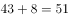；小数点前数列观察无明显特征，作差作和亦无规律，考虑与小数部分的关系，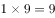，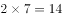，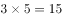，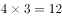，发现小数部分两数乘积取个位数是整数部分，即，取9；，取4；，取5；，取2，则所求项整数部分为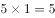，取5，故所求项为5.51。

故正确答案为B。

---

## 第 2 题　qid 2604267 · 数学运算

- **A**. 16
- **B**. 27
- **C**. 38　✅
- **D**. 49

**答案**：C

**官方解析**

图形数阵，优先考虑横向和竖向规律。第一行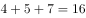；第二行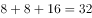；第三行，发现各行数字之和组成的数列16，32，48，（    ），是公差为16的等差数列，下一项为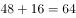，则所求项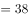。

故正确答案为C。

---

## 第 3 题　qid 2605816 · 数学运算

中秋节前夕，某商场采购了一批月饼礼盒，此后第一周售出了总数的一半多10份，第二周售出了剩下的一半多5份，若此时还剩下20份月饼礼盒，则商场最初采购了（    ）份月饼礼盒。

- **A**. 60
- **B**. 80
- **C**. 100
- **D**. 120　✅

**答案**：D

**官方解析**

方法一：余数问题可优先考虑代入排除。

A项：月饼总量为60，第一周售出一半多10份为40份，剩余20份；第二周售出一半多5份为15份，剩余5份，不符合题意，排除；

B项：月饼总量为80，第一周售出一半多10份为50份，剩余30份；第二周售出一半多5份为20份，剩余10份，不符合题意，排除；

C项：月饼总量为100，第一周售出一半多10份为60份，剩余40份；第二周售出一半多5份为25份，剩余15份，不符合题意，排除；

D项：月饼总量为120，第一周售出一半多10份为70份，剩余50份；第二周售出一半多5份为30份，剩余20份，符合题意，当选。 

方法二：根据题意，设商场最初采购份月饼礼盒，则第一周剩下总数的一半少10份，即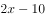，第二周售出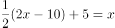份，则第二周剩下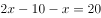，解得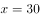，故商场最初采购礼盒数为份。

故正确答案为D。

---

## 第 4 题　qid 2605829 · 数学运算

某文具厂计划每周生产A、B两款文件夹共9000个，其中A款文件夹每个生产成本为1.6元，售价为2.3元，B款文件夹每个生产成本为2元，售价为3元。假设该厂每周在两款文件夹上投入的生产成本不高于15000元，则要使利润最大化，该厂每周应生产A款文件夹（    ）个。

- **A**. 0
- **B**. 6000
- **C**. 7500　✅
- **D**. 9000

**答案**：C

**官方解析**

利润率，由题意可知，A款文件夹利润率为，B款利润率为，A款利润率B款利润率，要使利润最大化，应尽可能多的生产B款文件夹，A款文件夹数量要尽量少。设文具厂每周生产A、B款文件夹数量分别为个、个，由题意可列式为，①，②。将①式代入②式可得，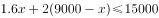，解得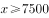，即A款文件夹最少生产7500个。

故正确答案为C。

---

## 第 5 题　qid 2605836 · 数学运算

某单位食堂后勤部门采购了一批大米，并将其平均分给了甲、乙两个饭堂。5周后，甲饭堂只剩余大米7千克；又过了1周，乙饭堂也只剩余大米6千克，已知甲乙饭堂的就餐人数固定，前往甲饭堂就餐的人数比乙饭堂多1人。如果每人每周消耗大米1千克，则这批大米共有（    ）千克。

- **A**. 72
- **B**. 84　✅
- **C**. 96
- **D**. 108

**答案**：B

**官方解析**

设前往乙饭堂就餐的有人，前往甲饭堂就餐的有人，由题意可列式为，解得，则大米总量为千克。

故正确答案为B。

---

## 第 6 题　qid 2605831 · 数学运算

某政务服务大厅开始办理业务前，已经有部分人在排队等候领取证书，且每分钟新增的人数一样多。从开始办理业务到排队等候的人全部领到证书，若同时开5个发证窗口就需要1个小时，若同时开6个发证窗口就需要40分钟。按照每个窗口给每个人发证书需要1分钟计算，如果想要在20分钟内将排队等候的人的证书全部发完，则需同时开（    ）个发证窗口。

- **A**. 7
- **B**. 8
- **C**. 9　✅
- **D**. 10

**答案**：C

**官方解析**

设开始办理业务前排队人数为，每分钟新增人数为。则代入牛吃草公式可得，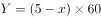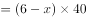，解得，。设需同时开放个发证窗口，才能在20分钟以内发完证书，即为，解得，需同时开放9个发证窗口。

故正确答案为C。

---

## 第 7 题　qid 2605834 · 数学运算

在针对一家小型超市的调查中发现，某生鲜商品的售价与销量之间呈现以下规律：售价每降低1元，销量便会增加2千克，对应的表格如下：

若该商品的成本是15元/千克，售价不得高于25元且必须为整数，如果某天该商品的销售利润为200元，则售价是（    ）元/千克。

- **A**. 22
- **B**. 20　✅
- **C**. 18
- **D**. 16

**答案**：B

**官方解析**

当天利润为200元，总利润单件利润销量，利润售价成本，由题意可知售价为整数，成本为15元/千克，则单件利润应是200的约数，代入选项验证。

A项：售价为22元/千克，单件利润为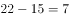元，不是200的约数，排除；

B项：售价为20元/千克，单件利润为元，是200的约数，销量为千克，总利润为元，符合题意所有条件，无需验证剩余选项。

故正确答案为B。

---

## 第 8 题　qid 2604239 · 数学运算

为加强治安防控，现计划在一段L形的围墙（如下图）上安装治安摄像头，其中A点到B点长度为750米，B点到C点长度为1350米。按要求ABC三个位置必须安装一个摄像头，且相邻两个摄像头之间的距离要保持一致，则整段围墙至少需要安装（    ）个摄像头。

- **A**. 14
- **B**. 15　✅
- **C**. 16
- **D**. 17

**答案**：B

**官方解析**

根据“ABC三个位置必须安装一个摄像头”可知为两端植树问题。根据公式：。根据“相邻两个摄像头之间的距离要保持一致”可得，间隔距离需为AB、BC长度的公约数。总长一定，间隔距离越大，摄像头的个数就越少，则间隔距离最大为AB（750米）、BC（1350米）的最大公约数，即150米，则至少需要安装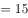个摄像头。

故正确答案为B。

---

## 第 9 题　qid 2604260 · 数学运算

某单位的两个部门计划订阅报纸。每个部门需要在指定的5种报纸中选择其中的3种，且这两个部门在选择时应做好沟通，做到5种报纸都有部门订阅，则订阅报纸的方案共有（    ）种。

- **A**. 20
- **B**. 30　✅
- **C**. 60
- **D**. 100

**答案**：B

**官方解析**

第一个选择的部门从5种报纸中任意选择3种，有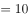种选择；此时要保证5种报纸都有人选择，第二个部门必须要选择剩余的2种报纸，且再从第一个部门选择的3种报纸中任选一种即可，则第二个部门有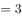种，则订阅报纸的方案共有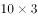种。

故正确答案为B。

---

## 第 10 题　qid 2604271 · 数学运算

一个纸箱里装有大小及材质完全相同的10个小球，其中3个黑色，2个白色，1个红色，2个黄色，1个绿色，1个紫色。如果不放回地依次随机取出3个小球，则取出的小球依次是黑色，红色，白色的概率为（    ）。

- **A**. 

　✅
- **B**. 
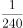

- **C**. 

- **D**. 
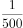

**答案**：A

**官方解析**

概率。不放回的依次随机取出3个小球，总的情况数为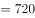种；要求取出的小球依次是黑色、红色、白色的情况数为种，则取出的小球依次是黑色，红色，白色的概率为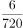。

故正确答案为A。

---

## 第 11 题　qid 2604357 · 数学运算

某部门正在准备会议材料，共有153份相同的文件，需要装到大小两种文件袋里送至会场，大的每个能装24份文件，小的每个能装15份文件。如果要使每个文件袋都正好装满，则需要大文件袋（    ）个。

- **A**. 2　✅
- **B**. 3
- **C**. 5
- **D**. 7

**答案**：A

**官方解析**

设需要大文件袋个，小文件袋个，由题意可列式为：，化简可得。为偶数，51为奇数，则为奇数，可知的尾数为5，的尾数为6，选项中满足条件的取值为A、D两项。，可知取值不能为7，排除D项。

故正确答案为A。

---

## 第 12 题　qid 2604358 · 数学运算

A、B两座港口相距300公里且仅有1条固定航道，在某一时刻甲船从A港顺流而下前往B港，同时乙船从B港逆流而上前往A港，甲船在5小时之后抵达了B港，停留1小时后开始返回A港，又过了6小时追上了乙船。则乙船在静水中的时速为（    ）公里。

- **A**. 20
- **B**. 25
- **C**. 30　✅
- **D**. 40

**答案**：C

**官方解析**

由题意可知，甲顺水需用5小时走完全程，可得：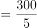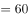公里/时。甲返程追上乙时，乙已逆流行驶了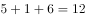小时，同样的逆流路程甲走了6小时，可得：，化简得千米/时，则千米/时。

故正确答案为C。

---
