# 2020年度浙江省党政机关选调应届优秀大学毕业生《行测》题（网友回忆版）

> 数量关系 · 20 题 · 浙江 2020

## 第 1 题　qid 2456369 · 数学运算

小芳驾车往返于甲、乙两地，两地之间只有上坡和下坡，已知上坡时的行驶速度为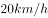，下坡时的行驶速度为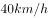。小芳7时30分从甲地出发，到达乙地后停留了一个小时，而后返程，回到甲地的时间为11时。若返程时间比去程时间多半个小时，那么从甲地到乙地上坡路比下坡路：

- **A**. 少20千米　✅
- **B**. 少10千米
- **C**. 多10千米
- **D**. 多20千米

**答案**：A

**官方解析**

令甲地到乙地上坡路为，下坡路为，则返程上坡路为，下坡路为。结合返程时间比去程时间多半个小时，可建立方程：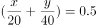，解得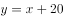。即甲地到乙地上坡路比下坡路少20千米。

故正确答案为A。

---

## 第 2 题　qid 2456374 · 数学运算

箱子内有标号分别为1、2、3······25的25个乒乓球，问至少需要取出多少个乒乓球才能保证有两个的标号之差为6的倍数？

- **A**. 6
- **B**. 7　✅
- **C**. 9
- **D**. 10

**答案**：B

**官方解析**

要保证有两个乒乓球的标号差为6的倍数，考虑最不利情况。若拿出来的球是六个连续的标号，在此情况下不会产生标号差为6的倍数。故至少需拿出个乒乓球，才能保证有两个的标号差为6的倍数。

故正确答案为B。

---

## 第 3 题　qid 2456384 · 数学运算

某停车场的收费标准如下：7:00—21:00，每小时6元，不足一小时按一小时计算；21:00—次日7:00，每两小时1元，不足两小时按两小时计算；每日零时为新的计费周期，重新开始计时。小刘某天上午10时将车驶入停车场，待其驶出时缴费70元，则小刘停车时长的范围是：

- **A**. 
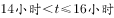

- **B**. 

- **C**. 

　✅
- **D**. 
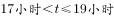

**答案**：C

**官方解析**

小刘上午10:00将车驶入停车场，则10:00—21:00时段产生停车费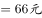。结合21:00—次日7:00每两小时1元，不足两小时按两小时计算的收费标准，以及每日凌晨为新的计费周期，重新开始计时。则21:00-24:00，共3小时，收费2元。驶出时缴费70元，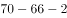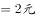，根据收费标准次日停车时长大于2小时小于等于4小时。则停车时长范围大于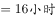；小于等于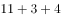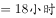。

故正确答案为C。

---

## 第 4 题　qid 2456388 · 数学运算

王先生花30000元买入A、B两只股票若干，两个交易日后，A股票上涨，B股票下跌。王先生将股票卖出，共盈利1300元，那么王先生在买入A、B两只股票时的投资比例为：

- **A**. 5：4
- **B**. 4：3
- **C**. 3：2
- **D**. 2：1　✅

**答案**：D

**官方解析**

令买入A股元，买入B股元。根据题意可建立方程组：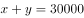；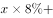。解得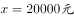，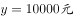，故A、B两股的投资比例为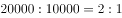。

故正确答案为D。

---

## 第 5 题　qid 2456394 · 数学运算

实验室内有浓度分别为和的盐酸各500毫升，从两种溶液中分别倒出一部分配成浓度为的盐酸600毫升。如果将剩余的盐酸混合，则该溶液的浓度为：

- **A**. 

- **B**. 

- **C**. 

- **D**. 

　✅

**答案**：D

**官方解析**

的盐酸500毫升，溶质量为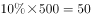毫升；的盐酸500毫升，溶质量为毫升；的盐酸600毫升，溶质量为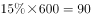毫升。故剩余溶液量为毫升，剩余溶质质量为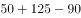毫升，则剩余溶液混合后浓度为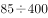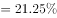。

故正确答案为D。

---

## 第 6 题　qid 2456397 · 数学运算

9个人按1到9的顺序编号围坐在一起玩“数7”的游戏，从第1号开始依次报数，凡是报到7的倍数或者含有7的数字时，轮到的人都说“过”。当大家从1报到100时，几号说的“过”最少？

- **A**. 5号　✅
- **B**. 6号
- **C**. 7号
- **D**. 8号

**答案**：A

**官方解析**

9个人依次轮流报数，则每报数一轮的周期为9。
5号在第一轮时所报数字为5，再次报数时应每轮+9，则报数分别为14、23、32、41、50、59、68、77、86、95，满足7的倍数或者含有7的数字的共有（14、77）两个；
6号在第一轮时所报数字为6，再次报数时应每轮+9，报数分别为：15、24、33、42、51、60、69、78、87、96，满足7的倍数或者含有7的数字的共有（42、78、87）三个；
7号在第一轮时所报数字为7，再次报数时应每轮+9，报数分别为：16、25、34、43、52、61、70、79、88、97，满足7的倍数或者含有7的数字的共有（7、70、79、97）四个；
8号在第一轮时所报数字为8，再次报数时应每轮+9，报数分别为：17、26、35、44、53、62、71、80、89、98，满足7的倍数或者含有7的数字的共有（17、35、71、98）四个；
报数中报到7的倍数或者含有7的数字最少的是5号，则5号说的“过”最少。
故正确答案为A。

---

## 第 7 题　qid 2456398 · 数学运算

500家公司的年收入都在6300万元到8500万元之间。由于失误，把其中一家公司的年收入8500万元记为85000万元输入计算机。那么输入的错误数据的500家公司年收入平均值与准确数据的平均值相差多少万元？

- **A**. 76.5
- **B**. 78.48
- **C**. 153　✅
- **D**. 382.5

**答案**：C

**官方解析**

设未输入错误的499家公司年收入总和为，则可得输入错误的500家公司年均收入与准确数据相差：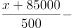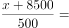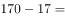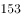万元。

故正确答案为C。

---

## 第 8 题　qid 2456401 · 数学运算

甲、乙两地间的车程是40分钟，每天早上6点起，每隔7分钟两地都会发出一班公交车。早上6点35分从甲地出发的公交车，在去乙地的路上，会遇到多少辆从乙地开出的公交车？

- **A**. 9
- **B**. 10
- **C**. 11　✅
- **D**. 12

**答案**：C

**官方解析**

方法一：因每天早上6点起，甲、乙两地每隔7分钟都会发出一班公交车，则6点35分时，从乙地发出的第一班公交车距离甲地还有5分钟的车程。此时从甲地发出的公交车只需分钟即可与之相遇。在剩余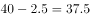分钟的车程里，6点35分从甲地发出的公交车每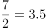分钟就会与一班乙地发出的公交车相遇，还可以遇到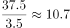辆，取整为10辆。故一共可以遇到辆从乙地开出的公交车。

方法二：6点35分时，从乙地6点及以后发出的公交车都未到达甲地，而此时从甲地发出的公交车，经过40分钟，7点15分才能到达乙地。因此在7点15分之前从乙地发出的公交车都会与之相遇。6点至7点15分，共计75分钟，每7分钟发出一班，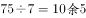，加上6点整发出的一班，一共可以遇到11辆从乙地开出的公交车。

故正确答案为C。

---

## 第 9 题　qid 2456406 · 数学运算

扶贫干部小张和小李计划在周一到周五完成8个村的调研工作，每人每天只能去一个村，每个村只能去1人次。其中小张必须去甲村和乙村，小李必须去丙村，且丙、丁、戊、己四个村只能在周一和周二去。问共有多少种不同的安排方式？

- **A**. 超过1000种
- **B**. 501～1000种之间　✅
- **C**. 200～500种之间
- **D**. 不到200种

**答案**：B

**官方解析**

根据题意，因丙、丁、戊、己只能在周一和周二去，同时丙必须由小李去，则除了丙外，小李可从剩余三个村中抽选一个，然后小张去剩余两村，总共有：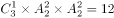种情况。剩余四个村子，可分为以下两种情况：

（1）若小张剩余三天每天均去一个村，则除了必须去的甲和乙外，还需从剩余2个村中抽选一个。此时小李只要在剩余三天中去一个村即可。总情况数为：种情况；

（2）若小张剩余三天中只去了甲、乙，则小李在剩余三天中需要去两个村。总情况数为：种情况；

则总共的安排方式有：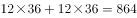种，B项满足。

故正确答案为B。

---

## 第 10 题　qid 2456359 · 数学运算

正三角形跑道ABC边长为120米，甲和乙从A点同时出发，甲沿AB、乙沿AC方向匀速跑步。已知甲的速度是，且乙离开C点10秒后，两人在BC间第一次相遇。问甲的速度是乙的多少倍？

- **A**. 不到1.25倍
- **B**. 1.25～1.5倍之间
- **C**. 1.5～1.75倍之间　✅
- **D**. 1.75倍以上

**答案**：C

**官方解析**

设乙的速度为，则乙跑完AC用时秒，从出发到相遇总计用时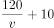秒。两人同时出发，所用时间相同，到相遇共跑完跑道的一圈，则可得：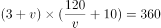，化简得：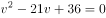。根据一元二次方程求根公式“”，求得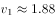，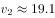。根据条件可得1.88满足。则甲的速度是乙的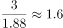倍。

猜题技巧：设未知数求解，计算会过于复杂，考虑结合选项代入验证求解。

若甲的速度是乙的1.5倍，则乙的速度为。则相遇时乙所走的时间为秒，所走路程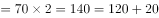米；此时甲所走的路程米。因，不足120米，则此时乙的速度应略小于2。因为只有小于2时，与甲相遇花费的时间才能更多，两人才能够将BC的路程走完。则甲的速度是乙的倍，应略大于1.5倍，C项满足。

故正确答案为C。

---

## 第 11 题　qid 2456361 · 数学运算

足球小组赛时，5个足球队A、B、C、D、E分到同一个小组，进行单循环赛（每两队赛一场，胜、平、负分别积3、1、0分），结果A、B、C、D队总分分别是1、4、7、8，那么E队最多可能得多少分？

- **A**. 5
- **B**. 6
- **C**. 7　✅
- **D**. 8

**答案**：C

**官方解析**

分析A、B、C、D四队得分：

A队：得1分，只能为赢0场、平1场、输3场；

B队：得4分，可能为赢1场、平1场、输2场，或赢0场、平4场、输0场；

C队：得7分，只能为赢2场、平1场、输1场；

D队：得8分，只能为赢2场、平2场、输0场。

A、C、D三队输赢场次已确定，共赢4场、平4场、输4场。因各队的胜场数总和应等于负场数总和，且平局场次数为偶数，要想E队得分赢尽可能高，则确定B队为赢1场、平1场、输2场。A、B、C、D四队共赢了场、输了场，平了场。则E队赢的场次数比输的场次数大1，且平的场次数为奇数。已知E队共比了4场比赛，则E队可能为赢2场、平1场、输1场，或赢1场、平3场、输0场，得分分别为分，或分，则E队得分最多为7分。

故正确答案为C。

---

## 第 12 题　qid 2456372 · 数学运算

如下图所示，在直角三角形ABC中，MN是中位线。已知四边形ABMN与三角形MNC的周长比为28：15，则AC与BC的长度比是：

- **A**. 5：12　✅
- **B**. 5：7
- **C**. 3：4
- **D**. 6：7

**答案**：A

**官方解析**

假设三角形MNC的长度为15，四边形ABMN的长度为28，因MN为中位线，则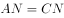，，则两个周长之差为，因三角形ABC为直角三角形，5、12、13为一组勾股数，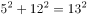，A项满足。

故正确答案为A。

---

## 第 13 题　qid 2456381 · 数学运算

下图中，阴影部分的面积大还是条纹部分的面积大？

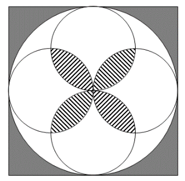

- **A**. 阴影部分面积大　✅
- **B**. 条纹部分面积大
- **C**. 两个部分一样大
- **D**. 不能确定

**答案**：A

**官方解析**

假设正方形的边长为4，则正方形的面积为，内切于正方形的圆直径为4，半径为2，每个小圆的直径为2，则阴影部分面积为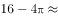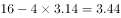。

按照如下图所示作辅助线，箭头所指区域面积即为题目所求条纹部分面积。

每个小圆面积减去其内接小正方形面积等于4个箭头所指区域面积之和，也等于题目所求条纹部分面积的一半。因小圆的直径为2，半径为1，小圆的面积为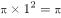，其内接小正方形对角线长度为2，小正方形的面积为对角线乘积的一半，为，则题目所求条纹部分面积为。

综上，阴影部分面积较大。

故正确答案为A。

---

## 第 14 题　qid 2456386 · 数学运算

数表如下图所示，根据规律，第20行所有数的和是：

- **A**. 6850
- **B**. 7239
- **C**. 7610
- **D**. 7620　✅

**答案**：D

**官方解析**

如图所示，第1行有1个数，第2行有2个数，第3行有3个数······，则第20行有20个数，且从第2行开始，每一行中后项均比前项大2，构成公差为2的等差数列。

且观察发现，每一行最后一个数均为平方数，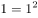，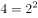，，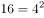······，则第20行的最后一个数为第，第20行的第一个数为，则第20行所有数的和为。

故正确答案为D。

---

## 第 15 题　qid 2456389 · 数学运算

王明家与李兰家相距3.42千米，李兰家与张红家相距10.8千米，张红家与周珊家相距5.85千米，周珊家与王明家相距1.53千米。问王明家与张红家相距多少千米？

- **A**. 4.95
- **B**. 7.38　✅
- **C**. 9.27
- **D**. 10.8

**答案**：B

**官方解析**

根据题意，张红家与周珊家相距5.85千米，周珊家与王明家相距1.53千米。

若周珊家在王明家与张红家连线构成的直线上，则王明家与张红家的距离为千米，或千米；

若周珊家不在王明家与张红家连线构成的直线上，结合三角形性质：两边之差小于第三边，两边之和大于第三边，则王明家与张红家的距离为：大于千米，小于千米。

则王明家与张红家的距离为：大于等于4.32千米，小于等于7.38千米。

同理，若李兰家在王明家与张红家连线构成的直线上，则王明家与张红家的距离为千米，或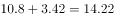千米；

若李兰家不在王明家与张红家连线构成的直线上，则王明家与张红家的距离为：大于千米，小于千米；

则王明家与张红家的距离为：大于等于7.38千米，小于等于14.22千米。

综上，王明家与张红家的距离只能为7.38千米。

故正确答案为B。

---

## 第 16 题　qid 2456390 · 数学运算

某服装商场限时促销100件衣服，买一件打九折，买两件打八折，买三件打七折，每人限购3件。活动结束后发现，100件衣服刚好分50单卖出，且平均每件衣服相当于原价的售出。那么，买三件衣服的顾客有多少人？

- **A**. 20
- **B**. 25　✅
- **C**. 28
- **D**. 30

**答案**：B

**官方解析**

设购买一件、两件、三件衣服的顾客分别有a、b、c人，每件衣服原价为元。根据刚好分50单卖出，可列式：①；根据一共售出100件，可列式：②；根据平均每件衣服相当于原价的售出，可列式：，化简得：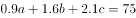③。可得：，代入①式可得：④，代入③式可得：⑤，可得：。

故正确答案为B。

---

## 第 17 题　qid 2456393 · 数学运算

甲、乙、丙三人出同样多的钱购买了一大袋单价为的面粉。本来想三人平分，后来丙觉得不需要那么多面粉，就以的价格转让给甲、乙一部分面粉。最后，甲、乙都比丙多分到9千克面粉，那么甲、乙各要给丙多少元钱？

- **A**. 15　✅
- **B**. 18
- **C**. 22.5
- **D**. 45

**答案**：A

**官方解析**

由题可知，丙转让部分面粉后，甲、乙都比丙多分到9千克面粉，即甲、乙多分到的面粉重量相同。设三人平分后每人面粉重量为千克，甲多分到的面粉重量为a千克，丙转让出的面粉重量为2a千克，根据最后甲比丙多分到9千克面粉，可列式：，解得千克。丙以的价格转让，甲需要付给丙的钱数元，同理乙也需要付给丙15元。

故正确答案为A。

---

## 第 18 题　qid 2456396 · 数学运算

甲、乙、丙三艘轮船同时从A地出发去B地，甲、乙到达B地后调头回A地，因为逆水的关系速度都减少到原来各自的一半。甲第一个到达B地，调头后与乙在C处相遇，接着又与丙在AB的中点D处相遇，乙调头后与丙也在C处相遇。已知AB两地相距4880米，那么当甲、乙相遇时，丙行驶了多少米？

- **A**. 1580
- **B**. 1830　✅
- **C**. 2050
- **D**. 2240

**答案**：B

**官方解析**

设甲最初速度为a，乙最初速度为b，丙速度为c，路程如下图所示：

根据甲、乙相遇于C点，可列式：，化简得：；根据，又因为D是AB中点，所以，化简得：；根据乙、丙相遇于C点，可列式：，化简得：。

令，则，，化简得：，即。将代入，，化简得：，即。当甲、乙相遇于C点时，丙行驶的距离千米。

故正确答案为B。

---

## 第 19 题　qid 2456377 · 数学运算

某书店从图书批发商那里以图书定价的四折购进一批图书，又以定价的八折售出这批图书的，剩下的图书以六折的价格售完。那么这批图书的利润率是多少？

- **A**. 

- **B**. 

- **C**. 

- **D**. 

　✅

**答案**：D

**官方解析**

赋值这批图书定价为100元，总共购进。则进价元，八折售出价格元，此时利润元，六折售出价格元，此时利润元。。

故正确答案为D。

---

## 第 20 题　qid 2456385 · 数学运算

小刘从家到单位，有2路、9路两路公共汽车可乘。已知2路车过去3分钟就来9路车，9路车过去7分钟才来2路车。小刘每次到车站等车，哪路先到就上哪路。那么，小刘坐2路车的概率是多少？

- **A**. 

- **B**. 

- **C**. 

- **D**. 

　✅

**答案**：D

**官方解析**

由题可知，2路车过去3分钟就来9路车，9路车过去7分钟来2路车，公交车到站情况如下图所示：

公交车到站时间以10分钟为一个周期，其中红色线段3分钟内小刘将乘坐9路车，蓝色线段7分钟内小刘将乘坐2路车，则小刘乘坐2路车的概率。

故正确答案为D。

---
