# 2020年新疆公务员录用考试《行测》试题（网友回忆版）

> 数量关系 · 15 题 · 新疆 2020

## 第 1 题　qid 2662166 · 数学运算

某阶梯会议室有16排座位，后一排比前一排多2个，最后一排有40个座位。这个阶梯会议室共有多少个座位？

- **A**. 300
- **B**. 350
- **C**. 400　✅
- **D**. 440

**答案**：C

**官方解析**

根据题意可知，16排座位数是公差为2的等差数列。根据，则第一排座位数个，再根据等差数列求和公式：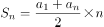，可得会议室座位数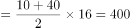个。

故正确答案为C。

---

## 第 2 题　qid 2662169 · 数学运算

某美术馆计划展出12幅不同的画，其中有3幅油画、4幅国画、5幅水彩画，排成一行陈列，要求同一种类的画必须连在一起，并且油画不放在两端，问有多少种不同的陈列方式？

- **A**. 不到1万种
- **B**. 1万—2万种之间
- **C**. 2万—3万种之间
- **D**. 超过3万种　✅

**答案**：D

**官方解析**

由题干“同一种类的画必须连在一起” ，即3幅油画捆绑在一起，有种情况，4幅国画捆绑在一起，有种情况，5幅水彩画捆绑在一起，有种情况。由于油画不放在两端，只能摆在中间，则国画和水彩画排在两端，有种情况。所以总情况数为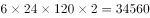种，超过3万种。

故正确答案为D。

---

## 第 3 题　qid 2662173 · 数学运算

某新型建材生产车间计划生产480个建材，当生产任务完成一半时，暂时停止生产，对器械进行维修清理，用时20分钟。恢复生产后工作效率提高了三分之一，结果完成任务时间比原计划提前了40分钟，问对器械进行维修清理后每小时生产多少个建材？

- **A**. 80　✅
- **B**. 87
- **C**. 94
- **D**. 102

**答案**：A

**官方解析**

方法一：设器械进行维修清理前效率为个/小时，则维修清理后效率为个/小时。当生产任务完成一半时进行维修清理，则清理前后都完成了任务的一半，即240个建材。维修清理用时20分钟，最后完成任务时间比原计划提前40分钟，即效率提高后，完成后一半的任务时间比维修清理前用时少1小时，根据时间的等量关系可列方程：，解得，则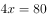，即维修清理后每小时生产80个建材。

方法二：恢复生产后工作效率提高了三分之一，即前后工作效率之比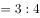，维修清理后的效率是4的倍数，观察选项，只有A项符合。

故正确答案为A。

---

## 第 4 题　qid 2662176 · 数学运算

某地居民生活使用天然气每月标准立方数的基本价格为4元/立方，若每月使用天然气超过标准立方数，超出部分按其基本价格的收费。某用户2月份使用天然气100立方，共交天然气费380元，则该市每月使用天然气标准立方数为多少立方？

- **A**. 60
- **B**. 65
- **C**. 70
- **D**. 75　✅

**答案**：D

**官方解析**

若该用户在标准立方数以内使用100立方，则需要交天然气费元，实际只交天然气费380元，说明使用的天然气超过标准立方数。设每月使用天然气标准立方数为立方，根据总收费为两部分的和，可得方程，解方程得，即该市每月使用天然气标准立方数为75立方。

故正确答案为D。

---

## 第 5 题　qid 2662181 · 数学运算

某单位共有240名员工，其中订阅A期刊的有125人，订阅B期刊的有126人，订阅C期刊的有135人，订阅A、B期刊的有57人，订阅A、C期刊的有73人，订阅3种期刊的有31人，此外，还有17人没有订阅这三种期刊中的任何一种。问订阅B、C期刊的有多少人？

- **A**. 57
- **B**. 64　✅
- **C**. 69
- **D**. 78

**答案**：B

**官方解析**

设订阅B、C期刊的有人。根据三集合容斥原理标准型公式：，代入数据得：，解得，即订阅B、C期刊的有64人。

故正确答案为B。

---

## 第 6 题　qid 2662186 · 数学运算

56人参加户外拓展训练，将22人安排在A营地，34人安排在B营地。从12:01开始，每逢整点A营地派出12人前往B营地，B营地派出8人前往A营地。已知两个营地之间的单程用时为30分钟，问以下哪个时间点，位于B营地的人数正好是A营地的3倍？

- **A**. 13:20
- **B**. 13:40
- **C**. 14:20
- **D**. 14:40　✅

**答案**：D

**官方解析**

方法一：设当派出次且到达营地后，B营地的人数正好是A营地的3倍。由于每次整点A营派出12人，B营派出8人，可知每次到达营地后，A营地总人数少4人，B营地多4人，则列方程为：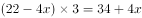，解得，即当派出两次且到达营地后，B营地的人数是A营地的3倍。根据题意每整点派出，每半点到达营地，因为12:01开始，故第一次派出时间是13:00，第二次派出时间是14:00，则第二次到达营地时间为14:30，直至下次15:00派出前人数保持不变，结合选项，只有D项满足。

方法二：结合选项发现，间隔时间较短，可以利用枚举法解决。由题意可知，整点派出，半点到达，故可列表为：

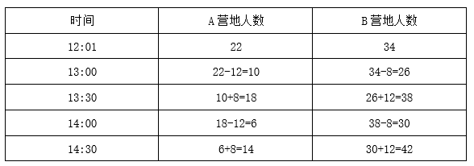

由于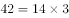，双方人数正好呈三倍关系。下次派出时间为15:00，故14:30-15:00之间人数保持三倍关系不变，结合选项，只有D项满足。

故正确答案为D。

---

## 第 7 题　qid 2662191 · 数学运算

A、B两地相距600千米，甲车上午9时从A地开往B地，乙车上午10时从B地开往A地，到中午13时，两辆车恰好在A、B两地的中点相遇。如果甲、乙两辆车都从上午9时由两地相向开出，速度不变，到上午11时，两车还相距多少千米？

- **A**. 100
- **B**. 150
- **C**. 200
- **D**. 250　✅

**答案**：D

**官方解析**

由题意可知，到中午13时，甲车花费4个小时，乙车花费3个小时，因为在中点相遇，则两车均走了300千米，则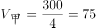千米/时，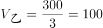千米/时。当两车从上午9时到11时，共行驶2小时，则走了千米，则两车还相距千米。

故正确答案为D。

---

## 第 8 题　qid 2662205 · 数学运算

为了实现营养的合理搭配，某营养师拟推出适合不同人群的甲、乙两个品种的饮食。其中，1份甲品种中有3千克A食物、1千克B食物、1千克C食物；1份乙品种中有1千克A食物、2千克B食物、2千克C食物。甲、乙两个品种的成本价分别为A、B、C三种食物的成本价之和。已知A食物每千克的成本价为6元。甲品种每份售价为58.5元，利润为成本的，乙品种的利润为成本的。问如果两品种的总销售利润率至少要达到总成本的，销售甲、乙两个品种饮食的份数之比不应低于多少？

- **A**. 5：7
- **B**. 6：8
- **C**. 7：9
- **D**. 8：9　✅

**答案**：D

**官方解析**

根据公式，成本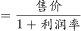，可得甲品种成本元，则甲品种的利润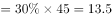元；计算甲品种的成本情况，分别设1千克B食物的成本价为元，1千克C食物的成本价为元，可得：，解得，则每份乙品种的成本价为元，利润元；

设甲、乙两个品种饮食的份数分别为、，根据公式，利润率，且要求甲、乙两品种的总销售利润率至少要达到总成本的，可得利润率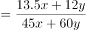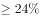，解得，即甲、乙两个品种饮食的份数之比不应低于8：9。

故正确答案为D。

---

## 第 9 题　qid 2662231 · 数学运算

甲、乙两名运动员参加射箭比赛，每一箭的环数是不超过10的自然数，甲、乙两名运动员各射了5箭，每人5箭的环数乘积均为1764，但乙的总环数比甲的少4环，则甲、乙两名运动员的总环数各是多少？

- **A**. 26、22
- **B**. 27、23
- **C**. 28、24　✅
- **D**. 32、28

**答案**：C

**官方解析**

分解1764的因数，可得，因为“每一箭的环数是不超过10的自然数”，所以7不能再和其他因数相乘，甲、乙两名运动员一定均有两箭的环数为7，剩余三箭的环数的乘积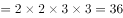，则一共有五种情况：

其中只有当环数和为28和24的时候，可以满足“乙的总环数比甲的少4环”的条件。

故正确答案为C。

---

## 第 10 题　qid 2662232 · 数学运算

一艘轮船顺流而行，从甲地到乙地需要6天；逆流而行，从乙地到甲地需要8天。若不考虑其他因素，一个漂流瓶从甲地到乙地需要多少天？

- **A**. 24
- **B**. 36
- **C**. 48　✅
- **D**. 56

**答案**：C

**官方解析**

设两地间的距离为24，则顺流速度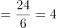，逆流速度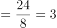，根据顺流速度流水速度逆流速度流水速度，则有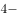流水速度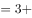流水速度，解得流水速度，因此一个漂流瓶从甲地到乙地需要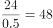天。

故正确答案为C。

---

## 第 11 题　qid 2662235 · 数学运算

某商业小区计划打造两个娱乐广场，其中一个为正方形广场，面积为320平方米，另一个为圆形广场，其直径比正方形广场的边长短，问，圆形广场的面积是多少平方米？

- **A**. 203　✅
- **B**. 307
- **C**. 452
- **D**. 824

**答案**：A

**官方解析**

方法一：根据正方形面积为320平方米，可求出正方形的边长为米，因为圆形广场的直径比正方形广场的边长短，可知圆形广场的半径为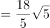米，因此圆形广场的面积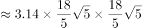平方米，A项最接近。

方法二：当圆的直径和正方形的边长相等时，  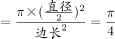，因为题干中的圆形广场的直径比正方形广场的边长短，因此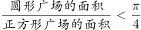。根据正方形广场的面积为320平方米，则圆形广场的面积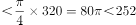平方米，只有A项符合。

故正确答案为A。

---

## 第 12 题　qid 2662236 · 数学运算

某演播大厅的地面形状是边长为100米的正三角形，现要用边长为2米的正三角形砖铺满（如图所示）。问，需要用多少块砖？

- **A**. 2763
- **B**. 2500　✅
- **C**. 2340
- **D**. 2300

**答案**：B

**官方解析**

从演播大厅大三角形顶角开始铺设，小三角形和大三角形相似，根据边长比例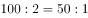可知，需要铺设50层。如图所示：第一层铺设1块瓷砖，前二层铺设4块，前三层铺设9块，以此类推，前n层铺设块，故前50层共铺设块瓷砖。

方法二：由题意可知，小瓷砖可以恰好铺满演播厅，根据几何相似特性，面积之比边长平方之比，可得：演播厅面积（大正三角形）：瓷砖面积（小正三角形）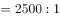，故需要2500块瓷砖可以铺满演播厅。

故正确答案为B。

---

## 第 13 题　qid 2662237 · 数学运算

某高校组织召开教职工代表大会，配备了A、B两个会务组成员，因工作需要，先将A组三分之一的工作人员调到B组去帮忙。后来因为工作程序的改变又把B组工作人员中的12人调到A组，这时A组有26人，B组有14人。问，最初A组的工作人员比B组的工作人员：

- **A**. 多2人　✅
- **B**. 少2人
- **C**. 多12人
- **D**. 少12人

**答案**：A

**官方解析**

设A会务组最初配备了名成员，B会务组最初配备了名成员，调整如下：

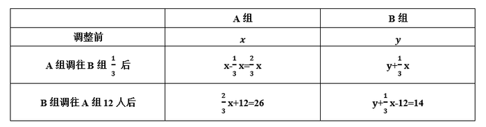

联立方程组：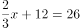······①；······②，解得，，则最初A组的工作人员比B组的工作人员多人。

故正确答案为A。

---

## 第 14 题　qid 2662239 · 数学运算

甲烧杯装有浓度为的酒精200克，乙烧杯装有浓度为的酒精100克。现向两个烧杯各加入克水后，两个烧杯中酒精浓度相同。问的值为：

- **A**. 350
- **B**. 400
- **C**. 550
- **D**. 600　✅

**答案**：D

**官方解析**

根据，且加入克水后酒精浓度相同，根据等量关系列方程：，解得。

故正确答案为D。

---

## 第 15 题　qid 2662242 · 数学运算

如图所示，边长为4米和2米的两个正方形，开始在左边重合，大正方形不动，小正方形自左向右平移至出大正方形外停止。设小正方形移动的距离为，两个正方形重叠的面积为，则关于的函数关系用图像表示正确的是：

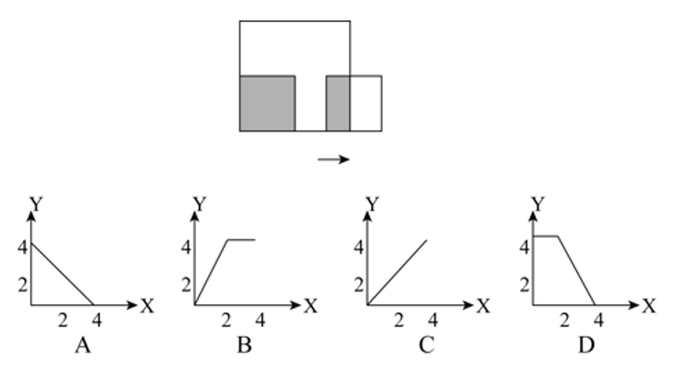

- **A**. A
- **B**. B
- **C**. C
- **D**. D　✅

**答案**：D

**官方解析**

根据题意可知，开始最左边重合，当移动距离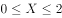时，此时整个小正方形全部在大正方形中，重叠面积小正方形面积；当时，此时小正方形与大正方形重叠的面积越来越小，且， D项符合。

故正确答案为D。

备注：考场上判定出时，重叠面积为4不变，即可排除A、B、C三项，选出正确答案，不必进行后续分析。

---
