# 2020年江苏省公务员录用考试《行测》题（A类）（网友回忆版）

> 数量关系 · 19 题 · 江苏 2020

## 第 1 题　qid 2452604 · 数学运算

7.003，13.009，19.027，25.081，31.243，（    ）

- **A**. 36.568
- **B**. 36.729
- **C**. 37.568
- **D**. 37.729　✅

**答案**：D

**官方解析**

观察数列特征，有小数点且数字位数较多，考虑机械拆分。小数点前的数字7，13，19，25，31，可以看出此数列是公差为6的等差数列，（  ）里应是；小数点后的数字003，009，027，081，243，可以看出此数列是公比为3的等比数列，（  ）里应是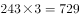。故所求项是37.729。

故正确答案为D。

---

## 第 2 题　qid 2452608 · 数学运算

2，，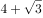，10，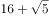，（    ）

- **A**. 

- **B**. 

- **C**. 

　✅
- **D**. 
28

**答案**：C

**官方解析**

观察数列特征，有特殊符号“”，考虑机械拆分。原数列可转化为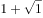,,,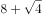,，“”前是1，2，4，8，16，此数列是公比为2的等比数列，（  ）中“+”前应是；“”后是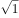，，，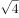，，根号下的数列是公差为1的等差数列，（  ）中“+”后根号下的数应是。故所求项是。

故正确答案为C。

---

## 第 3 题　qid 2452614 · 数学运算

23：30，23：45，0：20，1：20，2：50，（    ）

- **A**. 3：20
- **B**. 4：55　✅
- **C**. 5：45
- **D**. 6：50

**答案**：B

**官方解析**

观察数列无特征，考虑作差。该数列为时间表示形式，后项前项分别为15分钟，35分钟，60分钟，90分钟，？，此数列无特征，继续作差，后项前项分别为20，25，30，是公差为5的等差数列，故下一项，则？。因此所求项。

故正确答案为B。

---

## 第 4 题　qid 2452632 · 数学运算

，， 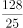，， 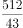，（    ）

- **A**. 

- **B**. 
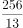
　✅
- **C**. 
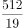

- **D**. 

**答案**：B

**官方解析**

观察数列特征，大多数是分数，考虑分数数列。观察分子分母无明显规律，考虑反约分。原数列可转化为，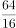，，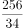，，分子，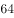，，，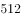，此数列是公比为的等比数列，所求分子为；分母，，，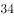，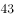，此数列是公差为的等差数列，所求分母为。故所求项=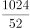=。

故正确答案为B。

---

## 第 5 题　qid 2452558 · 数学运算

台风过后，某单位发起救灾捐款活动，甲、乙两部门的员工人数之比是，捐款总额之比是。若甲部门的人均捐款是元，则乙部门的人均捐款是

- **A**. 270元
- **B**. 290元
- **C**. 320元　✅
- **D**. 350元

**答案**：C

**官方解析**

设乙部门人均捐款元，甲、乙两部门员工人数分别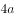、。捐款总额人均捐款部门人数，则根据条件可得：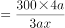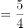，解得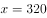元。则部门的人均捐款是元。

故正确答案为C。

---

## 第 6 题　qid 2452563 · 数学运算

某网店零售月季花，每束成本39元、售价99元，月销量800束。现推出团购活动，购买10束及以上，每束售价59元，预计零售销量减半，团购销量激增。若使原销售利润不减，则月团购销量至少应是

- **A**. 800束
- **B**. 1000束
- **C**. 1200束　✅
- **D**. 1500束

**答案**：C

**官方解析**

设团购销量至少束，则根据题意，单束花利润单束售价单束成本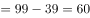元，则推出团购之前总利润单束利润销量元；推出团购活动后零售销量变为束，团购单束花利润元。根据题意，推出团购活动后总利润零售利润团购利润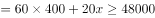，解得束，则团购销量至少束。

故正确答案为C。

---

## 第 7 题　qid 2452565 · 数学运算

某装配式建筑企业接到一个生产1033套楼板的订单。甲班组生产5天后，乙班组再生产4天，刚好完成任务。若甲班组比乙班组每天多生产23套，则甲班组生产楼板的套数是

- **A**. 625套　✅
- **B**. 645套
- **C**. 535套
- **D**. 515套

**答案**：A

**官方解析**

设乙班组每天生产楼板套，则甲班组每天生产套。根据题意，甲班组5天产量甲生产效率甲生产时间套；乙班组4天产量乙生产效率乙生产时间套，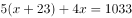，解得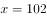套，则甲班组产量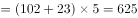套。

故正确答案为A。

---

## 第 8 题　qid 2452577 · 数学运算

使用浓度为的硫酸溶液克和浓度为的硫酸溶液若干克，配制浓度为的硫酸溶液克，需要加水的质量是：

- **A**. 10克　✅
- **B**. 12克
- **C**. 15克
- **D**. 18克

**答案**：A

**官方解析**

设需的硫酸克，根据公式：，且混合前后溶质的质量相等，混合后溶质混合前溶质，即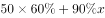，则解得，则需加水克。

故正确答案为A。

---

## 第 9 题　qid 2452584 · 数学运算

长方形花坛的周长为20米，若长与宽各增加3米，则增加的面积是

- **A**. 42平方米
- **B**. 24平方米
- **C**. 28平方米
- **D**. 39平方米　✅

**答案**：D

**官方解析**

设长方形花坛长为，宽为，则花坛周长为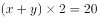米，解得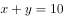米。

根据图形可知，增加的面积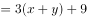平方米。

故正确答案为D。

---

## 第 10 题　qid 2452552 · 数学运算

小张下班回家乘地铁18:45之前到家的概率为0.8，乘公交为0.7。已知小张下班回家要么乘地铁，要么乘公交，且选择乘地铁的概率为0.6，则他下班回家18:45之前到家的概率是

- **A**. 0.73
- **B**. 0.74
- **C**. 0.75
- **D**. 0.76　✅

**答案**：D

**官方解析**

乘地铁概率为0.6，乘地铁18:45之前到家的概率为0.8，则选择乘地铁且18:45之前到家的概率为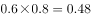；小张要么乘地铁，要么乘公交，则乘公交的概率为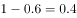，乘公交18:45之前到家的概率为0.7，则选择乘公交且18:45之前到家的概率为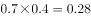。则小张18:45之前到家的概率为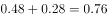。

故正确答案为D。

---

## 第 11 题　qid 2452561 · 数学运算

某企业预计今年营业收入增长，营业支出增长，营业利润增加600万元。已知该企业去年的营业利润为1000万元，则其今年的预计营业支出是

- **A**. 9000万元
- **B**. 9900万元　✅
- **C**. 10800万元
- **D**. 11500万元

**答案**：B

**官方解析**

设去年收入为万元，则今年预计收入为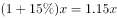万元；去年支出为万元，则今年预计支出为万元。去年营业利润为1000万元，则有；今年营业利润增加600万元，则今年利润为万元，则有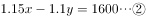。联立①②方程，解得，。则今年的预计支出为万元。

故正确答案为B。

---

## 第 12 题　qid 2452569 · 数学运算

甲、乙两人分别从A、B两地同时出发相向而行。当两人合计走完两地间路程的时，甲距A地的路程是500米；当两人合计走完两地间路程的时，乙距B地的路程是2400米。若两人的速度始终不变，则当速度较快者走完全程时，速度较慢者距走完全程还剩的路程是

- **A**. 1350米
- **B**. 1600米
- **C**. 1800米
- **D**. 1950米　✅

**答案**：D

**官方解析**

两人走完全程的时，甲走的路程是500米；现两人走完全程的，因速度一直不变，则甲此时走的路程是米，乙走的路程为2400米，时间相同，速度与路程成正比，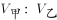，乙的速度较快，全程一共是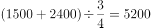米，当乙走完全程5200米，因时间相同，甲、乙的路程之比即为速度之比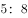，则甲走了米，还剩米。

故正确答案为D。 

---

## 第 13 题　qid 2452573 · 数学运算

某便民超市将薏米、红豆和小黄米按2：3：5混合后出售，每千克成本13.3元。若薏米每千克成本23.6元，红豆每千克成本9.8元，则小黄米每千克的成本是

- **A**. 10.36元
- **B**. 10.18元
- **C**. 11.45元
- **D**. 11.28元　✅

**答案**：D

**官方解析**

假设混合后薏米2千克，红豆3千克、小黄米5千克。设小黄米每千克成本为元，则有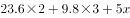，解得。

故正确答案为D。

---

## 第 14 题　qid 2452580 · 数学运算

某区财政局年度考核，办公室与国库科平均得分90分，预算科与政府采购科平均得分84分，办公室与政府采购科平均得分86分，政府采购科比预算科多10分，国库科的得分比综合科多5分，那么办公室、预算科、国库科、政府采购科、综合科的平均得分是

- **A**. 84分
- **B**. 86分
- **C**. 88分　✅
- **D**. 90分

**答案**：C

**官方解析**

根据题意可得：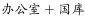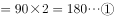；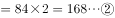；；；。联立②④，解得采购分，预算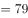分，则办公室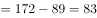分，国库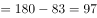分，综合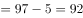分。五个部门的平均得分则分。

故正确答案为C。

---

## 第 15 题　qid 2452587 · 数学运算

某食品厂速冻饺子的包装有大盒和小盒两种规格，现生产了11000只饺子，恰好装满100个大盒和200个小盒。若3个大盒与5个小盒装的饺子数量相等，则每个小盒与每个大盒装入的饺子数量分别是

- **A**. 24只、40只
- **B**. 30只、50只　✅
- **C**. 36只、60只
- **D**. 27只、45只

**答案**：B

**官方解析**

“3个大盒与5个小盒装的饺子数量相等”，即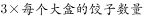，化简为：每个大盒的饺子数量：每个小盒的饺子数量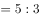。设大盒可以装只饺子，小盒可以装只饺子。根据“现生产了11000只饺子，恰好装满100个大盒和200个小盒”，可得，解得，则每个小盒的饺子数量为30只，每个大盒的饺子数量为50只，对应B项。

故正确答案为B。

---

## 第 16 题　qid 2452592 · 数学运算

在统计某高校运动会参赛人数时，第一次汇总的结果是1742人，复核的结果是1796人，检查发现是第一次计算有误，将某学院参赛人数的个位数字与十位数字颠倒了。已知该学院参赛人数的个位数字与十位数字之和是10，则该学院的参赛人数可能是：

- **A**. 64人
- **B**. 73人
- **C**. 82人　✅
- **D**. 91人

**答案**：C

**官方解析**

根据题意，实际的参赛人数为1796人，“将某学院参赛人数的个位数字与十位数字颠倒”后，汇总的结果为1742人，即该学院颠倒后的参赛人数比实际参赛人数少人。选项A、B、C、D颠倒后为46、37、28、19，与原数作差后分别少18、36、54、72，只有C项符合。

故正确答案为C。

---

## 第 17 题　qid 2452594 · 数学运算

某商品的进货单价为80元，销售单价为100元，每天可售出120件。已知销售单价每降低1元，每天可多售出20件。若要实现该商品的销售利润最大化，则销售单价应降低的金额是

- **A**. 5元
- **B**. 6元
- **C**. 7元　✅
- **D**. 8元

**答案**：C

**官方解析**

设降价x元，已知“销售单价每降低1元，每天可多售出20件”，调价后销售单价为元，进货单价为80元，则降价后单个利润为元；降价后的销量为件。总利润单个利润数量。令总利润为0，即令和都等于0，解得，。当时，总利润最大，即销售单价应降低的金额是7元，对应C项。

故正确答案为C。

---

## 第 18 题　qid 2452596 · 数学运算

某企业按三个等级给员工发放奖金，一、二、三等奖的获奖人数之比为1：3：10，奖金总额之比为2：3：1。已知获奖员工总数126人，发放奖金总额16.2万元，则三等奖的奖金是

- **A**. 250元
- **B**. 300元　✅
- **C**. 350元
- **D**. 400元

**答案**：B

**官方解析**

设一、二、三等奖的获奖人数为、、，因为“获奖员工总数126人”，即，解得，即一、二、三等奖的获奖人数分别为9、27、90人。设一、二、三等奖的奖金总额分别为、、。因为“发放奖金总额16.2万元”，即，解得元，即三等奖的奖金总额为27000元，故三等奖奖金为元。

故正确答案为B。

---

## 第 19 题　qid 2452598 · 数学运算

某单位要抽调若干人员下乡扶贫，小王、小李、小张都报了名，但因工作需要，若选小李或小张，就不能选小王。已知三人入选的概率都是0.2，但小李、小张同时入选的概率是0.1，则三人中有人入选的概率是

- **A**. 0.3
- **B**. 0.4
- **C**. 0.5　✅
- **D**. 0.6

**答案**：C

**官方解析**

根据题意“若选小李或小张，就不能选小王”，即小李或小张入选时，小王一定不入选，小王入选时，小李和小张都不入选。“三人中有人入选”有以下四种情况：

①小李和小张同时入选，此时小王一定不入选：概率为0.1；

②小李入选、小张不入选，此时小王一定不入选：当小李入选时有两类情况：小李单独入选和小李和小张共同入选，所以小李单独入选的概率为“小李入选的概率小李和小张共同入选的概率”。

③小张入选、小李不入选，此时小王一定不入选：当小张入选时有两类情况：小张单独入选和小李和小张共同入选，所以小张单独入选的概率为“小张入选的概率小李和小张共同入选的概率”。

④小李与小张都未入选，小王单独入选：概率为0.2。

故“三人中有人入选” 的概率是，对应C项。

故正确答案为C。

---
