# 2020年江苏省公务员录用考试《行测》题（B类）（网友回忆版）

> 数量关系 · 19 题 · 江苏 2020

## 第 1 题　qid 2452724 · 数学运算

-32.16，48.23，-72.30，108.37，-162.44，（    ）

- **A**. 230.51
- **B**. 230.62
- **C**. 243.51　✅
- **D**. 243.62

**答案**：C

**官方解析**

观察数列，有小数点，故考虑机械划分。以小数点为分隔符，小数点前是-32、48、-72、108、-162，构成公比为-1.5的等比数列，故原数列小数点前数字为；小数点后是16、23、30、37、44，构成公差为7的等差数列，故小数点后的数字为。则所求项为243.51。

故正确答案为C。

---

## 第 2 题　qid 2452727 · 数学运算

1，，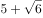，10，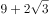，（    ）

- **A**. 

- **B**. 

- **C**. 
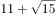
　✅
- **D**. 
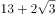

**答案**：C

**官方解析**

观察数列，有整数和无理数，将数列化为同一形式，为，，，，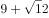，以“”为分隔符，“”前是1、3、5、7、9，构成以2为公差的等差数列，则下一项为11；“”后是、、、、，根号内的数字构成公差为3的等差数列，则下一项根号内为15。故所求项为。

故正确答案为C。

---

## 第 3 题　qid 2452729 · 数学运算

1， ， ， ， ，（    ）

- **A**. 

　✅
- **B**. 

- **C**. 

- **D**. 

**答案**：A

**官方解析**

观察数列大部分都是分数，选项也都是分数，考虑分数数列。分母呈现递增趋势，优先考虑反约分。原数列可化为： 、 、、、，发现分母是公比为4的等比数列，则下一项为；分子是公差为5的等差数列，则下一项为。故所求项为。

故正确答案为A。

---

## 第 4 题　qid 2452730 · 数学运算

，，，，，(    )

- **A**. 

- **B**. 

　✅
- **C**. 

- **D**. 

**答案**：B

**官方解析**

观察数列没有明显特征，可以把数列中的数字看成是时间。每个时间间隔的分钟数分别是5、15、30、50分钟，后减前为10、15、20分钟，构成公差为5的等差数列，新数列的下一项为25分钟，往回推为分钟，故所求项是经过75分钟后的时间，为。

故正确答案为B。

---

## 第 5 题　qid 2452732 · 数学运算

梳理甲、乙两个案件的资料，张警官单独完成，分别需要2小时、8小时；王警官单独完成，分别需要1小时、6小时。若两人合作完成，则需要的时间至少是

- **A**. 3小时
- **B**. 4小时　✅
- **C**. 5小时
- **D**. 6小时

**答案**：B

**官方解析**

要想时间最少，需要找到两人更擅长哪个案件。对于张警官来说，梳理甲、乙案件所用时间之比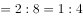，对于王警官来说，梳理甲、乙案件所用时间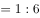，王警官梳理甲案件更有优势，因此优先让王警官梳理甲案件，张警官梳理乙案件，1小时后王警官梳理完甲案件再和张警官一起梳理乙案件；

赋值乙案件工作总量为24，则张警官完成乙案件的效率是，王警官完成乙案件的效率是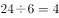。1小时之后两个人合作还需要的时间为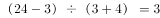小时。因此完成两项工作共需要小时。

故正确答案为B。

---

## 第 6 题　qid 2452734 · 数学运算

在统计某高校运动会参赛人数时，第一次汇总的结果是1742人，复核的结果是1796人，检查发现是第一次计算有误，将某学院参赛人数的个位数字与十位数字颠倒了。已知该学院参赛人数的个位数字与十位数字之和是10，则该学院的参赛人数可能是

- **A**. 164人
- **B**. 173人
- **C**. 182人　✅
- **D**. 191人

**答案**：C

**官方解析**

第一次人数与第二次人数相差人，也就是；又已知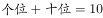，代入选项验证：

A选项：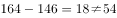，排除；

B选项：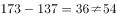，排除；

C选项：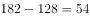，，符合条件，当选；

D选项：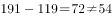，排除。

故正确答案为C。

---

## 第 7 题　qid 2452563 · 数学运算

某网店零售月季花，每束成本39元、售价99元，月销量800束。现推出团购活动，购买10束及以上，每束售价59元，预计零售销量减半，团购销量激增。若使原销售利润不减，则月团购销量至少应是

- **A**. 800束
- **B**. 1000束
- **C**. 1200束　✅
- **D**. 1500束

**答案**：C

**官方解析**

设团购销量至少束，则根据题意，单束花利润单束售价单束成本元，则推出团购之前总利润单束利润销量元；推出团购活动后零售销量变为束，团购单束花利润元。根据题意，推出团购活动后总利润零售利润团购利润，解得束，则团购销量至少束。

故正确答案为C。

---

## 第 8 题　qid 2452565 · 数学运算

某装配式建筑企业接到一个生产1033套楼板的订单。甲班组生产5天后，乙班组再生产4天，刚好完成任务。若甲班组比乙班组每天多生产23套，则甲班组生产楼板的套数是

- **A**. 625套　✅
- **B**. 645套
- **C**. 535套
- **D**. 515套

**答案**：A

**官方解析**

设乙班组每天生产楼板套，则甲班组每天生产套。根据题意，甲班组5天产量甲生产效率甲生产时间套；乙班组4天产量乙生产效率乙生产时间套，，解得套，则甲班组产量套。

故正确答案为A。

---

## 第 9 题　qid 2452587 · 数学运算

某食品厂速冻饺子的包装有大盒和小盒两种规格，现生产了11000只饺子，恰好装满100个大盒和200个小盒。若3个大盒与5个小盒装的饺子数量相等，则每个小盒与每个大盒装入的饺子数量分别是

- **A**. 24只、40只
- **B**. 30只、50只　✅
- **C**. 36只、60只
- **D**. 27只、45只

**答案**：B

**官方解析**

“3个大盒与5个小盒装的饺子数量相等”，即，化简为：每个大盒的饺子数量：每个小盒的饺子数量。设大盒可以装只饺子，小盒可以装只饺子。根据“现生产了11000只饺子，恰好装满100个大盒和200个小盒”，可得，解得，则每个小盒的饺子数量为30只，每个大盒的饺子数量为50只，对应B项。

故正确答案为B。

---

## 第 10 题　qid 2452706 · 数学运算

某社区组织了一次助学捐款活动，在场的老王、老李和老张均积极捐款。若老王捐款的是老李捐款的、老张捐款的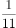，且老张比老王多捐192元，则他们的捐款总额是：

- **A**. 418元
- **B**. 456元　✅
- **C**. 494元
- **D**. 532元

**答案**：B

**官方解析**

根据题意，设老王捐款总额是，老李捐款总额是，老张捐款总额是。由“老张比老王多捐192元”可得：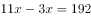，解得元。因此三人的捐款总额为元。

故正确答案为B。

---

## 第 11 题　qid 2452594 · 数学运算

某商品的进货单价为80元，销售单价为100元，每天可售出120件。已知销售单价每降低1元，每天可多售出20件。若要实现该商品的销售利润最大化，则销售单价应降低的金额是

- **A**. 5元
- **B**. 6元
- **C**. 7元　✅
- **D**. 8元

**答案**：C

**官方解析**

设降价x元，已知“销售单价每降低1元，每天可多售出20件”，调价后销售单价为元，进货单价为80元，则降价后单个利润为元；降价后的销量为件。总利润单个利润数量。令总利润为0，即令和都等于0，解得，。当时，总利润最大，即销售单价应降低的金额是7元，对应C项。

故正确答案为C。

---

## 第 12 题　qid 2452708 · 数学运算

若将一个长方形的长缩短1厘米，宽加长8厘米，所得新长方形的周长和面积分别是原长方形的2倍和4倍，则原长方形的长是：

- **A**. 4厘米
- **B**. 5厘米　✅
- **C**. 6厘米
- **D**. 7厘米

**答案**：B

**官方解析**

设原长方形长为厘米，宽为厘米，根据题意，可得两者周长关系为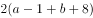，化简得①；可得两者面积关系为②，直接求解较为复杂，考虑代入排除，满足①②即为正确答案。

代入A项：，根据①式，，代入②式，左边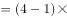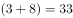，右边，两边不相等，A项错误；

代入B项：，根据①式，，代入②式，左边，右边，两边相等，此时B项满足题干所有条件，B项正确，当选，C、D两项无需代入。

故正确答案为B。

---

## 第 13 题　qid 2452577 · 数学运算

使用浓度为的硫酸溶液克和浓度为的硫酸溶液若干克，配制浓度为的硫酸溶液克，需要加水的质量是：

- **A**. 10克　✅
- **B**. 12克
- **C**. 15克
- **D**. 18克

**答案**：A

**官方解析**

设需的硫酸克，根据公式：，且混合前后溶质的质量相等，混合后溶质混合前溶质，即，则解得，则需加水克。

故正确答案为A。

---

## 第 14 题　qid 2452569 · 数学运算

甲、乙两人分别从A、B两地同时出发相向而行。当两人合计走完两地间路程的时，甲距A地的路程是500米；当两人合计走完两地间路程的时，乙距B地的路程是2400米。若两人的速度始终不变，则当速度较快者走完全程时，速度较慢者距走完全程还剩的路程是

- **A**. 1350米
- **B**. 1600米
- **C**. 1800米
- **D**. 1950米　✅

**答案**：D

**官方解析**

两人走完全程的时，甲走的路程是500米；现两人走完全程的，因速度一直不变，则甲此时走的路程是米，乙走的路程为2400米，时间相同，速度与路程成正比，，乙的速度较快，全程一共是米，当乙走完全程5200米，因时间相同，甲、乙的路程之比即为速度之比，则甲走了米，还剩米。

故正确答案为D。 

---

## 第 15 题　qid 2452573 · 数学运算

某便民超市将薏米、红豆和小黄米按2：3：5混合后出售，每千克成本13.3元。若薏米每千克成本23.6元，红豆每千克成本9.8元，则小黄米每千克的成本是

- **A**. 10.36元
- **B**. 10.18元
- **C**. 11.45元
- **D**. 11.28元　✅

**答案**：D

**官方解析**

假设混合后薏米2千克，红豆3千克、小黄米5千克。设小黄米每千克成本为元，则有，解得。

故正确答案为D。

---

## 第 16 题　qid 2452710 · 数学运算

某训练基地的一块三角形场地的面积是1920平方米。已知该三角形场地的三边长度之比是，则其周长是：

- **A**. 218米
- **B**. 240米　✅
- **C**. 306米
- **D**. 360米

**答案**：B

**官方解析**

已知三角形三边长度之比为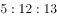，因，说明此三角形为直角三角形。设此三角形三边长度分别为米，米，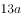米，则三角形面积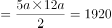平方米，解得，即。三角形周长为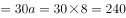米。

故正确答案为B。

---

## 第 17 题　qid 2452598 · 数学运算

某单位要抽调若干人员下乡扶贫，小王、小李、小张都报了名，但因工作需要，若选小李或小张，就不能选小王。已知三人入选的概率都是0.2，但小李、小张同时入选的概率是0.1，则三人中有人入选的概率是

- **A**. 0.3
- **B**. 0.4
- **C**. 0.5　✅
- **D**. 0.6

**答案**：C

**官方解析**

根据题意“若选小李或小张，就不能选小王”，即小李或小张入选时，小王一定不入选，小王入选时，小李和小张都不入选。“三人中有人入选”有以下四种情况：

①小李和小张同时入选，此时小王一定不入选：概率为0.1；

②小李入选、小张不入选，此时小王一定不入选：当小李入选时有两类情况：小李单独入选和小李和小张共同入选，所以小李单独入选的概率为“小李入选的概率小李和小张共同入选的概率”。

③小张入选、小李不入选，此时小王一定不入选：当小张入选时有两类情况：小张单独入选和小李和小张共同入选，所以小张单独入选的概率为“小张入选的概率小李和小张共同入选的概率”。

④小李与小张都未入选，小王单独入选：概率为0.2。

故“三人中有人入选” 的概率是，对应C项。

故正确答案为C。

---

## 第 18 题　qid 2452712 · 数学运算

下图为某市一段地下水管道的分布图，箭线表示管道中水的流向，数值表示箭线的长度(单位：千米)。水从S点流到T点最短的距离是：

- **A**. 20千米
- **B**. 22千米　✅
- **C**. 23千米
- **D**. 24千米

**答案**：B

**官方解析**

 

求S点到T点的最短距离，可以先分两部分考虑，如图所示，即S点到A点，再由A点到T点。从S点到A点，共有4条路线，显然最短距离为千米，从A点到T点，共有2条路线，显然最短距离为千米，此时最短距离为千米。虽然从S点出发不经过A点，也有其他路线到达T点，但均大于22千米，即水从S点流到T点最短的距离为22千米。

故正确答案为B。

---

## 第 19 题　qid 2452596 · 数学运算

某企业按三个等级给员工发放奖金，一、二、三等奖的获奖人数之比为1：3：10，奖金总额之比为2：3：1。已知获奖员工总数126人，发放奖金总额16.2万元，则三等奖的奖金是

- **A**. 250元
- **B**. 300元　✅
- **C**. 350元
- **D**. 400元

**答案**：B

**官方解析**

设一、二、三等奖的获奖人数为、、，因为“获奖员工总数126人”，即，解得，即一、二、三等奖的获奖人数分别为9、27、90人。设一、二、三等奖的奖金总额分别为、、。因为“发放奖金总额16.2万元”，即，解得元，即三等奖的奖金总额为27000元，故三等奖奖金为元。

故正确答案为B。

---
