# 2020年江苏省公务员录用考试《行测》题（C类）（网友回忆版）

> 数量关系 · 19 题 · 江苏 2020

## 第 1 题　qid 2452604 · 数学运算

7.003，13.009，19.027，25.081，31.243，（    ）

- **A**. 36.568
- **B**. 36.729
- **C**. 37.568
- **D**. 37.729　✅

**答案**：D

**官方解析**

观察数列特征，有小数点且数字位数较多，考虑机械拆分。小数点前的数字7，13，19，25，31，可以看出此数列是公差为6的等差数列，（  ）里应是；小数点后的数字003，009，027，081，243，可以看出此数列是公比为3的等比数列，（  ）里应是。故所求项是37.729。

故正确答案为D。

---

## 第 2 题　qid 2452739 · 数学运算

2，，，10，，（    ）

- **A**. 

- **B**. 

- **C**. 

　✅
- **D**. 
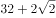

**答案**：C

**官方解析**

原数列：2，，，10，，？

反推为：，，，，，？

则加号前的数字为1，2，4，8，16，易知是公比为2的等比数列，下一项应为；

根号内的数字为1，2，3，4，5，易知是公差为1的等差数列，下一项应为，即所求为。

故正确答案为C。

---

## 第 3 题　qid 2452729 · 数学运算

1， ， ， ， 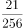，（    ）

- **A**. 

　✅
- **B**. 

- **C**. 

- **D**. 

**答案**：A

**官方解析**

观察数列大部分都是分数，选项也都是分数，考虑分数数列。分母呈现递增趋势，优先考虑反约分。原数列可化为： 、 、、、，发现分母是公比为4的等比数列，则下一项为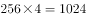；分子是公差为5的等差数列，则下一项为。故所求项为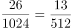。

故正确答案为A。

---

## 第 4 题　qid 2452730 · 数学运算

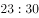，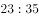，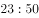，，，(    )

- **A**. 

- **B**. 
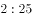
　✅
- **C**. 
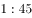

- **D**. 

**答案**：B

**官方解析**

观察数列没有明显特征，可以把数列中的数字看成是时间。每个时间间隔的分钟数分别是5、15、30、50分钟，后减前为10、15、20分钟，构成公差为5的等差数列，新数列的下一项为25分钟，往回推为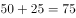分钟，故所求项是经过75分钟后的时间，为。

故正确答案为B。

---

## 第 5 题　qid 2452587 · 数学运算

某食品厂速冻饺子的包装有大盒和小盒两种规格，现生产了11000只饺子，恰好装满100个大盒和200个小盒。若3个大盒与5个小盒装的饺子数量相等，则每个小盒与每个大盒装入的饺子数量分别是

- **A**. 24只、40只
- **B**. 30只、50只　✅
- **C**. 36只、60只
- **D**. 27只、45只

**答案**：B

**官方解析**

“3个大盒与5个小盒装的饺子数量相等”，即，化简为：每个大盒的饺子数量：每个小盒的饺子数量。设大盒可以装只饺子，小盒可以装只饺子。根据“现生产了11000只饺子，恰好装满100个大盒和200个小盒”，可得，解得，则每个小盒的饺子数量为30只，每个大盒的饺子数量为50只，对应B项。

故正确答案为B。

---

## 第 6 题　qid 2452584 · 数学运算

长方形花坛的周长为20米，若长与宽各增加3米，则增加的面积是

- **A**. 42平方米
- **B**. 24平方米
- **C**. 28平方米
- **D**. 39平方米　✅

**答案**：D

**官方解析**

设长方形花坛长为，宽为，则花坛周长为米，解得米。

根据图形可知，增加的面积平方米。

故正确答案为D。

---

## 第 7 题　qid 2452740 · 数学运算

一项工程由甲、乙工程队单独完成，分别需50天和80天。若甲、乙工程队合作20天后，剩余工程量由乙、丙工程队合作需12天完成，则丙工程队单独完成此项工程所需的时间是

- **A**. 40天
- **B**. 45天
- **C**. 50天
- **D**. 60天　✅

**答案**：D

**官方解析**

设该工程的工作总量为时间50天、80天的公倍数400，则甲工程队的效率，乙工程队的效率，由甲、乙工程队合作20天后，乙、丙工程队继续合作12天完成工程可知：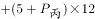，推得，则丙工程队单独完成此项工程需要时间天。

故正确答案为D。

---

## 第 8 题　qid 2452563 · 数学运算

某网店零售月季花，每束成本39元、售价99元，月销量800束。现推出团购活动，购买10束及以上，每束售价59元，预计零售销量减半，团购销量激增。若使原销售利润不减，则月团购销量至少应是

- **A**. 800束
- **B**. 1000束
- **C**. 1200束　✅
- **D**. 1500束

**答案**：C

**官方解析**

设团购销量至少束，则根据题意，单束花利润单束售价单束成本元，则推出团购之前总利润单束利润销量元；推出团购活动后零售销量变为束，团购单束花利润元。根据题意，推出团购活动后总利润零售利润团购利润，解得束，则团购销量至少束。

故正确答案为C。

---

## 第 9 题　qid 2452580 · 数学运算

某区财政局年度考核，办公室与国库科平均得分90分，预算科与政府采购科平均得分84分，办公室与政府采购科平均得分86分，政府采购科比预算科多10分，国库科的得分比综合科多5分，那么办公室、预算科、国库科、政府采购科、综合科的平均得分是

- **A**. 84分
- **B**. 86分
- **C**. 88分　✅
- **D**. 90分

**答案**：C

**官方解析**

根据题意可得：；；；；。联立②④，解得采购分，预算分，则办公室分，国库分，综合分。五个部门的平均得分则分。

故正确答案为C。

---

## 第 10 题　qid 2452741 · 数学运算

一个三位数的个位数字比十位数字小1，百位数字是十位数字的3倍。若将个位与百位数字对调，所得新三位数比原三位数小693，则原三位数个位、十位、百位的数字之和是

- **A**. 12
- **B**. 14　✅
- **C**. 13
- **D**. 15

**答案**：B

**官方解析**

根据题意，设原三位数百位、十位、个位的数字分别为、、，则可得方程组：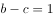；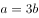；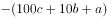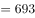。解得，，，则原三位数百位、十位、个位的数字之和。

故正确答案为B。

---

## 第 11 题　qid 2452712 · 数学运算

下图为某市一段地下水管道的分布图，箭线表示管道中水的流向，数值表示箭线的长度(单位：千米)。水从S点流到T点最短的距离是：

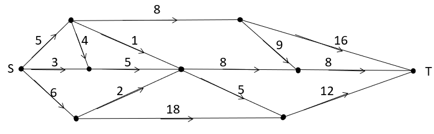

- **A**. 20千米
- **B**. 22千米　✅
- **C**. 23千米
- **D**. 24千米

**答案**：B

**官方解析**

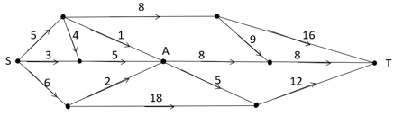 

求S点到T点的最短距离，可以先分两部分考虑，如图所示，即S点到A点，再由A点到T点。从S点到A点，共有4条路线，显然最短距离为千米，从A点到T点，共有2条路线，显然最短距离为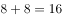千米，此时最短距离为千米。虽然从S点出发不经过A点，也有其他路线到达T点，但均大于22千米，即水从S点流到T点最短的距离为22千米。

故正确答案为B。

---

## 第 12 题　qid 2452594 · 数学运算

某商品的进货单价为80元，销售单价为100元，每天可售出120件。已知销售单价每降低1元，每天可多售出20件。若要实现该商品的销售利润最大化，则销售单价应降低的金额是

- **A**. 5元
- **B**. 6元
- **C**. 7元　✅
- **D**. 8元

**答案**：C

**官方解析**

设降价x元，已知“销售单价每降低1元，每天可多售出20件”，调价后销售单价为元，进货单价为80元，则降价后单个利润为元；降价后的销量为件。总利润单个利润数量。令总利润为0，即令和都等于0，解得，。当时，总利润最大，即销售单价应降低的金额是7元，对应C项。

故正确答案为C。

---

## 第 13 题　qid 2452573 · 数学运算

某便民超市将薏米、红豆和小黄米按2：3：5混合后出售，每千克成本13.3元。若薏米每千克成本23.6元，红豆每千克成本9.8元，则小黄米每千克的成本是

- **A**. 10.36元
- **B**. 10.18元
- **C**. 11.45元
- **D**. 11.28元　✅

**答案**：D

**官方解析**

假设混合后薏米2千克，红豆3千克、小黄米5千克。设小黄米每千克成本为元，则有，解得。

故正确答案为D。

---

## 第 14 题　qid 2452577 · 数学运算

使用浓度为的硫酸溶液克和浓度为的硫酸溶液若干克，配制浓度为的硫酸溶液克，需要加水的质量是：

- **A**. 10克　✅
- **B**. 12克
- **C**. 15克
- **D**. 18克

**答案**：A

**官方解析**

设需的硫酸克，根据公式：，且混合前后溶质的质量相等，混合后溶质混合前溶质，即，则解得，则需加水克。

故正确答案为A。

---

## 第 15 题　qid 2452598 · 数学运算

某单位要抽调若干人员下乡扶贫，小王、小李、小张都报了名，但因工作需要，若选小李或小张，就不能选小王。已知三人入选的概率都是0.2，但小李、小张同时入选的概率是0.1，则三人中有人入选的概率是

- **A**. 0.3
- **B**. 0.4
- **C**. 0.5　✅
- **D**. 0.6

**答案**：C

**官方解析**

根据题意“若选小李或小张，就不能选小王”，即小李或小张入选时，小王一定不入选，小王入选时，小李和小张都不入选。“三人中有人入选”有以下四种情况：

①小李和小张同时入选，此时小王一定不入选：概率为0.1；

②小李入选、小张不入选，此时小王一定不入选：当小李入选时有两类情况：小李单独入选和小李和小张共同入选，所以小李单独入选的概率为“小李入选的概率小李和小张共同入选的概率”。

③小张入选、小李不入选，此时小王一定不入选：当小张入选时有两类情况：小张单独入选和小李和小张共同入选，所以小张单独入选的概率为“小张入选的概率小李和小张共同入选的概率”。

④小李与小张都未入选，小王单独入选：概率为0.2。

故“三人中有人入选” 的概率是，对应C项。

故正确答案为C。

---

## 第 16 题　qid 2452771 · 数学运算

某企业按三个等级给员工发放奖金，一、二、三等奖的获奖人数之比为，奖金总额之比为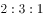。已知获奖员工总数126人，发放奖金总额16.2万元，则三等奖的奖金是

- **A**. 200元
- **B**. 300元　✅
- **C**. 350元
- **D**. 400元

**答案**：B

**官方解析**

根据“获奖员工总数126人”和“一、二、三等奖的获奖人数之比”，可求三等奖获奖人数为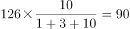人；同理可求三等奖奖金总额为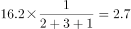万元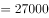元。则三等奖的奖金是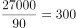元。

故正确答案为B。

---

## 第 17 题　qid 2452773 · 数学运算

两人在环形跑道上匀速跑步，同向跑每3分钟相遇一次，相向跑每1分钟相遇一次。若速度较快者每圈用时1.5分钟，则速度较慢者每圈用时是

- **A**. 3分钟　✅
- **B**. 4分钟
- **C**. 5分钟
- **D**. 2分钟

**答案**：A

**官方解析**

题干中只给出时间，没有具体的速度和路程，可以用赋值法。赋值环形跑道全程长度为3，在环形跑道中，由同一起点同向而行，相遇一次时快者比慢者多走一个全程，用时3分钟，则：，解得；在环形跑道中，由同一起点相向而行，相遇一次时快者和慢者一共走一个全程，用时1分钟，则：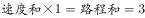，解得。由、可求，。则较慢者每圈用时分钟。

故正确答案为A。

---

## 第 18 题　qid 2452558 · 数学运算

台风过后，某单位发起救灾捐款活动，甲、乙两部门的员工人数之比是，捐款总额之比是。若甲部门的人均捐款是元，则乙部门的人均捐款是

- **A**. 270元
- **B**. 290元
- **C**. 320元　✅
- **D**. 350元

**答案**：C

**官方解析**

设乙部门人均捐款元，甲、乙两部门员工人数分别、。捐款总额人均捐款部门人数，则根据条件可得：，解得元。则部门的人均捐款是元。

故正确答案为C。

---

## 第 19 题　qid 2452774 · 数学运算

某小微企业接到三个相同的订单，赵、钱、孙、李四位师傅单独完成一个，分别需20小时、20小时、15小时和12小时。现钱、孙、李各负责一个订单，赵根据需要协助他们完成任务。若要三个订单同时完工且用时最短，则赵协助钱的时间是

- **A**. 8小时　✅
- **B**. 7小时
- **C**. 6小时
- **D**. 9小时

**答案**：A

**官方解析**

赋值一个订单的工作量为60，则赵师傅效率为、钱师傅效率为、孙师傅效率为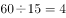、李师傅效率为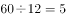。由于同时开始，同时结束，因此在三个订单完工过程中，四个人始终在工作，则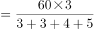小时。设赵协助钱师傅小时，根据钱负责的订单工作进程可列方程为，解得。

故正确答案为A。

---
