# 2020年河北省公务员录用考试《行测》试题（网友回忆版）

> 数量关系 · 15 题 · 河北 2020

## 第 1 题　qid 2616149 · 数学运算

三个自然数成等差数列，公差为20，其和为4095。这三个数中最大的是：

- **A**. 1345
- **B**. 1365
- **C**. 1385　✅
- **D**. 1405

**答案**：C

**官方解析**

方法一：设等差数列的三个自然数分别为、、，根据奇数项的等差数列前n项和公式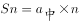，则这个等差数列的和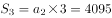，解得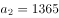，所以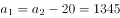，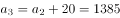，那么这个等差数列为1345、1365、1385，即这三个数中最大的是1385。

方法二：利用代入排除法，求三个数的最大值，先代入D项，若三个数中最大数为1405，那么这个等差数列为1365、1385、1405，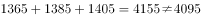，排除D项；代入C项，若三个数中最大数为1385，那么这个等差数列为1345、1365、1385，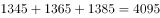，满足题目所有条件。

故正确答案为C。

---

## 第 2 题　qid 2616158 · 数学运算

某公司职员预约某快递员上午9点30分到10点在公司大楼前取件，假设两人均在这段时间内到达，且在这段时间到达的概率相等。约定先到者等后到者10分钟，过时交易取消。快递员取件成功的概率为：

- **A**. 

- **B**. 

- **C**. 

　✅
- **D**. 

**答案**：C

**官方解析**

设快递员到达的时间为9点分，职员到达的时间为9点分，则只有，两人才能相遇。即直线、、、围成的区域，交点坐标分别为（30,40）、（50,60）、（60,60）、（60,50）、（40,30）、（30,30），如下图所示，只有在阴影部分区域两人才能够相遇，也就是求阴影部分面积占整个正方形面积的比例。由图可以看出，正方形面积，空白部分为两个全等三角形，每个的面积为，则阴影部分面积，占总面积的。

故正确答案为C。

---

## 第 3 题　qid 2616087 · 数学运算

某企业员工组织周末自驾游。集合后发现，如果每辆小车坐5人，则空出4个座位；如果每辆小车少坐1人，则有8人没坐上车。那么，参加自驾游的小车有：

- **A**. 9辆
- **B**. 10辆
- **C**. 11辆
- **D**. 12辆　✅

**答案**：D

**官方解析**

设一共有辆车，根据总人数一定，列方程得：。解得，故参加自驾游的小车有12辆。

故正确答案为D。

---

## 第 4 题　qid 2616083 · 数学运算

某公司现有6箱不同的水果，安排三个配送员送到A、B、C三个不同的仓储点，其中A地1箱，B地2箱，C地3箱，问配送方式有：

- **A**. 60种
- **B**. 180种
- **C**. 360种　✅
- **D**. 420种

**答案**：C

**官方解析**

根据分步原理，选择一个配送员给A地送1箱的情况数为：种；选择一个剩下的配送员给B地送2箱的情况数为：种；最后剩下的一个配送员将剩下的3箱送给C地，情况数为1种，分步用乘法，则所求情况数为种。

故正确答案为C。

---

## 第 5 题　qid 2616151 · 数学运算

某种蔬菜进价5元/斤，售价10元/斤，当天卖不完的蔬菜不再出售。过去7天里，菜商每天购进该种蔬菜100斤，其中有4天卖完，有2天各剩余20斤，有1天剩余10斤，这7天菜商共赚了多少元钱？

- **A**. 2950
- **B**. 3000　✅
- **C**. 3250
- **D**. 3500

**答案**：B

**官方解析**

假设这7天菜商卖出的蔬菜量分别为：前4天共卖出斤，第5天和第6天各卖出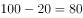斤，第7天卖出斤，这批蔬菜的总售价为：元，这批蔬菜的总成本为：元，根据总利润，则这7天菜商共赚了元。

故正确答案为B。

---

## 第 6 题　qid 2616152 · 数学运算

某市出租车价格为：2公里以内8元，超过2公里不足5公里的部分，每公里2元；超过5公里不足8公里的部分，每公里3元；8公里以上的部分，每公里4元；不足1公里按1公里计算。某位乘客乘坐出租车花了20元，该出租车最多行驶了多少公里？

- **A**. 7　✅
- **B**. 8
- **C**. 9
- **D**. 10

**答案**：A

**官方解析**

根据题意可得，刚好行驶5公里时花费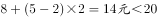元；刚好行驶8公里时花费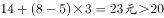元，即20元车费行驶的路程大于5公里小于8公里，结合选项只有A项满足。

故正确答案为A。

---

## 第 7 题　qid 2616153 · 数学运算

甲乙两人在相距1200米的直线道路上相向而行，一条狗与甲同时出发跑向乙，遇到乙后立即调头跑向甲，遇到甲后再跑向乙，如此反复，已知甲的速度为40米/分钟，乙为60米/分钟，狗为80米/分钟。不考虑狗调头所耗时间，当甲乙相距100米时狗跑了多少米？

- **A**. 1100
- **B**. 1000
- **C**. 960
- **D**. 880　✅

**答案**：D

**官方解析**

甲、乙两人从出发至相距100米一共跑了米，根据相遇公式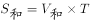，则经过的时间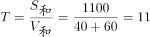分钟。因为狗与甲同时出发，一直奔跑到甲、乙相距100米为止，故狗也跑了11分钟，狗的速度为80米/分钟。根据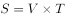可得狗跑过的距离为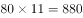米。

故正确答案为D。

---

## 第 8 题　qid 2616143 · 数学运算

村民陶某承包一块长方形种植地，他将地分割成如图所示的4个小长方形，在A、B、C、D四块长方形土地上分别种植西瓜、花生、地瓜、水稻。其中长方形A、B、C的周长分别是20米、24米、28米，那么长方形D的最大面积是：

- **A**. 42平方米
- **B**. 49平方米
- **C**. 64平方米　✅
- **D**. 81平方米

**答案**：C

**官方解析**

如下图所示，假设标注的四条边长分别为、、、，已知长方形A、B、C的周长分别是20米、24米、28米，根据长方形周长，可得，化简得，即，解得。而c、d分别代表长方形D的长和宽，和一定时，当且仅当时面积最大，此时米，故长方形D的最大面积平方米。

故正确答案为C。

---

## 第 9 题　qid 2616072 · 数学运算

野外生存需要用一个简易的圆锥型过滤器（如下图所示）装满溪水进行过滤。过滤器的底面直径为20cm，高为6cm。问全部过滤完毕后，在不考虑损耗的情况下，可使底面半径为5cm，高为15cm的圆柱型容器的水面高度达到：

- **A**. 4cm
- **B**. 6cm
- **C**. 8cm　✅
- **D**. 12cm

**答案**：C

**官方解析**

根据圆锥体积公式可知，过滤溪水体积为。根据圆柱体积公式可得，圆柱型容器的水面高度达到cm。

故正确答案为C。

---

## 第 10 题　qid 2616155 · 数学运算

某手机厂商生产甲、乙、丙三种机型，其中甲产量的2倍与乙产量的5倍之和等于丙产量的4倍，丙产量与甲产量的2倍之和等于乙产量的5倍。甲、乙、丙产量之比为：

- **A**. 2：1：3
- **B**. 2：3：4
- **C**. 3：2：1
- **D**. 3：2：4　✅

**答案**：D

**官方解析**

方法一：根据题干条件可得，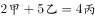 ①，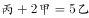 ②，将②代入①可得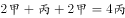，化简得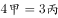，即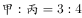，将、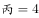代入②可得，则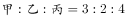。

（或结合选项满足只有D项。）

方法二：选项为一组数，信息充分，考虑代入排除。根据题干条件可得， ①， ②。

A项：若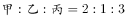，则令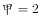，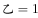，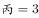，代入①得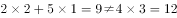，排除A项；

B项：若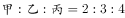，则令，，，代入①得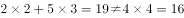，排除B项；

C项：若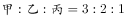，则令，，，代入①得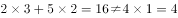，排除C项；

故正确答案为D。

---

## 第 11 题　qid 2616081 · 数学运算

某会展中心布置会场，从花卉市场购买郁金香、月季花、牡丹花三种花卉各20盆，每盆均用纸箱打包好装车运送至会展中心，再由工人搬运至布展区。问至少要搬出多少盆花卉才能保证搬出的鲜花中一定有郁金香？

- **A**. 20盆
- **B**. 21盆
- **C**. 40盆
- **D**. 41盆　✅

**答案**：D

**官方解析**

根据问法“至少······才能保证······”，可判定本题为最不利构造型最值问题。考虑最不利情况为前面搬出的花卉都是月季花和牡丹花，则一共搬出盆花卉。在此基础上再搬1盆花，就可以保证一定是郁金香，则至少需要搬盆花卉。

故正确答案为D。

---

## 第 12 题　qid 2616079 · 数学运算

某电商平台每隔5千米有一座仓库，共有A、B、C、D四座仓库，图中数字表示各仓库库存货物的吨数。现需要把所有的货物集中存放在其中某一个仓库中，如果每吨货物运输1千米需要运费3元，要使运费最少，则需将货物集中到哪座仓库？

- **A**. 仓库A
- **B**. 仓库B
- **C**. 仓库C　✅
- **D**. 仓库D

**答案**：C

**官方解析**

方法一：根据题意直接代入选项计算总运费。

若将货物集中到仓库A，则运费为元;

若将货物集中到仓库B，则运费为元；

若将货物集中到仓库C，则运费为元；

若将货物集中到仓库D，则运费为元；

则运费最少的是将货物集中到仓库C。

方法二：货物集中问题，只与各个仓库的存放量有关，与距离及运费无关。先考虑AB打包，CD打包，显然前者存放量（30吨）不如后者（40吨）多，因此AB的货物均需要向CD方向移动，先移到仓库C中。此时仓库C共有货物吨，仓库D有25吨，则仓库D向仓库C移动，最后货物都集中到仓库C中。

故正确答案为C。

---

## 第 13 题　qid 2616070 · 数学运算

小明每天从家中出发骑自行车经过一段平路，再经过一道斜坡后到达学校上课。某天早上，小明从家中骑车出发，一到校门口就发现忘带课本，马上返回，从离家到赶回家中共用了1个小时，假设小明当天平路骑行速度为9千米/小时，上坡速度为6千米/小时，下坡速度为18千米/小时，那么小明的家距离学校多远？

- **A**. 3.5千米
- **B**. 4.5千米　✅
- **C**. 5.5千米
- **D**. 6.5千米

**答案**：B

**官方解析**

设小明家到学校的距离为，在往返的过程中，上坡和下坡的路程均为斜坡的长度即距离相等，根据等距离平均速度公式，上下坡的平均速度千米/小时，与平路速度相等，故往返全程的平均速度均为9千米/小时，往返一次走了两个全程，千米/小时小时，得千米。

故正确答案为B。

---

## 第 14 题　qid 2616076 · 数学运算

甲乙丙丁四人通过手机的位置共享，发现乙在甲正南方向2公里处，丙在乙北偏西方向2公里处，丁在甲北偏西方向。若丁与甲、丙的距离相等，则该距离为：

- **A**. 
1公里

- **B**. 
公里
　✅
- **C**. 
公里

- **D**. 
2公里

**答案**：B

**官方解析**

根据题意，四人的位置关系如下图所示：

因为丙在乙北偏西方向，且乙与甲、丙的距离均为2公里，所以甲乙丙三人的位置构成等边三角形，则甲到丙的距离为2公里。丁在甲北偏西方向，则丁-甲-丙构成的角度为，且丁与甲、丙的距离相等，则甲丁丙三人的位置构成等腰直角三角形，因此所求的距离为公里。

故正确答案为B。

---

## 第 15 题　qid 2616086 · 数学运算

甲、乙、丙三人去超市买了100元的商品，如果甲付钱，那么甲剩下的钱是乙、丙两人钱数之和的；如果乙付钱，则乙剩下的钱是甲、丙两人钱数之和的；如果丙付钱，丙用他的会员卡可享受9折优惠，结果丙剩下的钱是甲、乙两人钱数之和的；那么，甲、乙、丙三人开始时一共带了多少钱？

- **A**. 850元　✅
- **B**. 900元
- **C**. 950元
- **D**. 1000元

**答案**：A

**官方解析**

方法一：设开始时甲带了元，乙带了元，丙带了元，则由题意可得：······①，······②，······③，联立方程组，解得，，。故甲、乙、丙三人开始时一共带了元。

方法二：题干出现比例，虽然钱数不一定是整数，但选项均为整数，说明总钱数一定为整数，故优先考虑利用倍数特性解题。由题意可知，，即为2份，为13份，则为15份，即三人总钱数减去100是15的倍数，观察选项，排除B、C两项；丙用会员卡需支付元，则，即为1份，为3份，则为4份，即是4的倍数，排除D项，只有A项符合。

故正确答案为A。

备注：本题考场上应该选择倍数特性法，如果用方程法则太浪费时间。

---
