# 2020年浙江公务员考试《行测》（A类）试题（网友回忆版）

> 数量关系 · 13 题 · 浙江 2020

## 第 1 题　qid 2579707 · 数学运算

某会务组租了20多辆车将2220名参会者从酒店接到活动现场。大车每次能送50人，小车每次能送36人，所有车辆送2趟，且所有车辆均满员，正好送完，则大车比小车（    ）。

- **A**. 多5辆　✅
- **B**. 多2辆
- **C**. 少2辆
- **D**. 少5辆

**答案**：A

**官方解析**

设大车有辆，小车有辆，根据题意可列式为：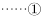，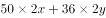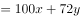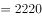。在②式中，的尾数为0，2220的尾数为0，说明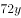的尾数也为0，必为5的倍数，可能的解为：5、10、15······。代入验证，若，则，为非整数，排除；若，则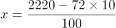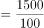，此时满足，符合，因此大车比小车多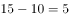辆。

故正确答案为A。

---

## 第 2 题　qid 2579735 · 数学运算

用边长为0.2m的正三角形地砖铺满一块边长为1m的正六边形地面，需要多少块地砖？

- **A**. 30
- **B**. 60
- **C**. 150　✅
- **D**. 180

**答案**：C

**官方解析**

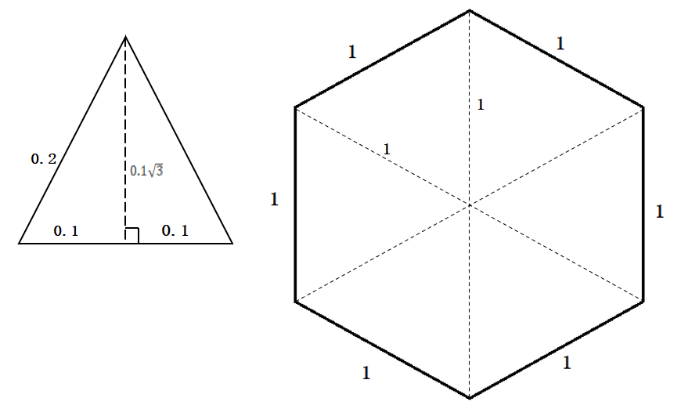

如图所示，单块正三角形地砖边长为0.2m，则高为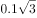m，单块正三角形地砖面积。正六边形地面总面积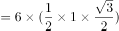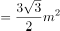，则共需要地砖数量正六边形地面总面积单块正三角形地砖面积块。

故正确答案为C。

---

## 第 3 题　qid 2579747 · 数学运算

一套试卷有若干道题，每题答对得10分，答错扣5分，不答扣3分。小郑答对、答错、不答的题目数量依次成等差数列，最后总分为95分，问这套试卷共有多少道题？

- **A**. 15
- **B**. 30
- **C**. 36
- **D**. 45　✅

**答案**：D

**官方解析**

根据答对、答错、不答的题目数量为等差数列，设答错的题目有道，则答对与不答的题目为道、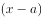道，其中为等差数列的公差。则总题量为。由题意可列式为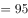，化简可得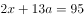，正面求解繁琐，可代入选项进行验证。

代入A项，试卷共有15题，则答错的题目有道，，为非整数，不符合题意要求，排除；

代入B项，试卷共有30题，则答错的题目有道，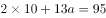，为非整数，不符合题意要求，排除；

代入C项，试卷共有36题，则答错的题目有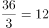道，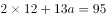，为非整数，不符合题意要求，排除；

代入D项，试卷共有45题，则答错的题目有道，，解得，则答对的题目为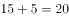道，不答的题目为道，总分为分，符合题意。

故正确答案为D。

---

## 第 4 题　qid 2579708 · 数学运算

一辆汽车第一天和第二天的行驶时间之比为3：4，第二天与第三天行驶路程相同，第三天行驶5小时，第一天行驶400千米，三天全程的平均速度为80千米/小时。问第二天的平均速度是多少千米/小时？

- **A**. 70　✅
- **B**. 75
- **C**. 80
- **D**. 85

**答案**：A

**官方解析**

根据题意，设第一天与第二天行驶时间分别为、，设第二天、第三天行驶路程均为。则这三天的路程、时间关系如下表所示：

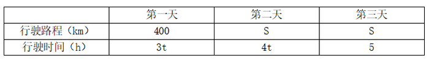

根据公式：平均速度，可列方程，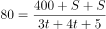，解得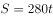，则第二天平均速度为千米/小时。

故正确答案为A。

---

## 第 5 题　qid 2579724 · 数学运算

某公司对10个创新项目进行评选，选出最优秀的3个项目投入运行。小张随机预测3个项目将会入选。问他至少猜对1个入选项目的概率在以下哪个范围内？

- **A**. 
不到

- **B**. 
~

- **C**. 
~

- **D**. 
超过
　✅

**答案**：D

**官方解析**

给情况求概率，考虑公式：概率。总情况为从10个项目随机选3个，有种情况。满足情况为至少有1个项目入选，情况数较多，正难则反，考虑反面情况：3个项目均未入选，即从剩下7个项目中选3个项目，有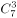种情况。则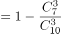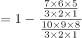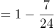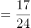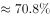，在D项范围内，D项当选。

故正确答案为D。

---

## 第 6 题　qid 2579729 · 数学运算

超市销售某种圆珠笔，单盒装的售价10元，5盒装的售价40元，10盒装的售价70元，20盒装的售价120元。现有两家企业来采购这种圆珠笔，甲企业的预算最多正好买92盒，乙企业的预算最多正好买103盒。问，两家企业如果合买最多比分开买多采购多少盒？

- **A**. 3
- **B**. 5　✅
- **C**. 8
- **D**. 10

**答案**：B

**官方解析**

根据题意，各种规格的圆珠笔每盒的售价分别为：单盒装10元、5盒装元、10盒装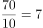元、20盒装元。在预算一定的情况下，要使采购数量最多，则尽量优先选择单价低的盒装采购。

甲企业的预算最多正好买92盒，为4个20盒装、1个10盒装、2个1盒装；乙企业的预算最多正好买103盒，为5个20盒装、3个1盒装。合买最多的情况为：分开买10盒装与1盒装的预算全部用于采购20盒装，共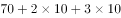元，可买1个20盒装。因此，合买最多比分开买多采购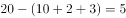盒，B项当选。

故正确答案为B。

---

## 第 7 题　qid 2579737 · 数学运算

从分别写着1-9数字的9张卡中选出4张并排列为一个四位数，其结果能被75整除的数字：

- **A**. 不到15个
- **B**. 15-20个
- **C**. 21-25个
- **D**. 超过25个　✅

**答案**：D

**官方解析**

四位数能被75整除，因式分解后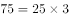，即同时是25和3的倍数。

根据整除判定法则，25的倍数看后两位，根据题意，四位数字各不相同，符合条件的有25、75；3的倍数看各位数字之和为3的倍数，当后两位为25时，，则前两位之和只能为5、8、11、14、17，有（1，4）、（1，7）、（3，8）、（4，7）、（6，8）、（8，9）6种组合，数字可以交换顺序，则有个；当后两位为75时，，则前两位之和也是3的倍数，有（1，2）、（1，8）、（2，4）、（3，6）、（3，9）、（4，8）、（6，9）7种组合，数字可以交换顺序，则有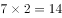个。因此共个。

故正确答案为D。

---

## 第 8 题　qid 2579744 · 数学运算

火车站售票窗口一开始有若干乘客排队购票，且之后每分钟增加排队购票的乘客人数相同。从开始办理购票手续到没有乘客排队，若开放3个窗口，需耗时90分钟，若开放5个窗口，则需耗时45分钟。问如果开放6个窗口，需耗时多少分钟？

- **A**. 36　✅
- **B**. 38
- **C**. 40
- **D**. 42

**答案**：A

**官方解析**

设每个窗口办理购票手续的效率为1人/分钟，每分钟增加排队购票的乘客人数为人。由题意，原有人数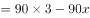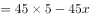，解得，原有人数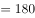人。设若开放6个窗口，需耗时分钟，则有：，解得，A项当选。

故正确答案为A。

---

## 第 9 题　qid 2579731 · 数学运算

某学校要将全体运动员排成方阵，老师按人数粗略估计进行第一次排列，发现多出99人，于是又将每行和每列多加了4人进行排列，发现缺少37人。问学校共有运动员多少人？

- **A**. 256
- **B**. 289
- **C**. 324　✅
- **D**. 361

**答案**：C

**官方解析**

方法一：设第一次排列为一个行列的方阵，第二次为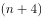行列的方阵。由题意可得，总人数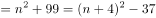，整理得：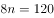，解得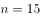。故总人数为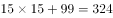人。

方法二：由题意可知，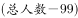人恰好可排成一个方阵，则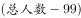应为一个平方数，依次代入选项，只有C项符合条件。

故正确答案为C。

---

## 第 10 题　qid 2579758 · 数学运算

某公园雇佣一名小丑表演骑独轮车。独轮车车轮直径为50厘米，小丑沿如图所示8字形轨迹骑行。轨迹为相切的两个圆，两个圆面积比是16：9，小圆直径为15米。问小丑沿8字形轨迹骑行一圈，车轮转动了多少圈？

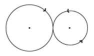

- **A**. 50
- **B**. 60
- **C**. 70　✅
- **D**. 90

**答案**：C

**官方解析**

小丑沿8字形轨迹骑行一圈，所走路程刚好是两个圆的周长，两个圆的面积比是16：9，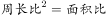，则两个圆的周长比4：3，根据圆的周长公式，可得小圆的周长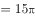米，大圆的周长米，两个圆的周长和米，独轮车车轮直径为50厘米，则独轮车车轮的周长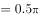米，故小丑沿8字形轨迹骑行一圈，车轮转动了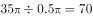圈。

故正确答案为C。

---

## 第 11 题　qid 2579767 · 数学运算

甲、乙两企业合作完成某订单需要天。如果甲企业产能增加而乙企业不变，可提前2天完成；如果乙企业产能增加而甲企业不变，可提前4天完成。问的值是：

- **A**. 6
- **B**. 8　✅
- **C**. 10
- **D**. 12

**答案**：B

**官方解析**

设甲、乙两企业的产能分别为、，根据题意列出等式，总量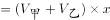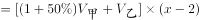，化简等式得：

总量······ ；

总量······；

总量 ······；

方程比较复杂，选择代入选项验证。

代入A项，当时，根据，，解得，不符合题意，错误；

代入B项，当时，根据，，解得，总量，代入，满足题意，正确；

代入C项，当时，根据，，解得，总量，代入，，错误；

代入D项，当时，根据，，解得，总量，代入，，错误。

故正确答案为B。

---

## 第 12 题　qid 2579771 · 数学运算

有两排各6个连续的空车位，包含甲车、乙车在内的6辆车随机停入这12个车位中，则以下哪种情况发生的概率最低？

- **A**. 有一排正好停了2辆车
- **B**. 甲车和乙车停在同一排的不相邻车位　✅
- **C**. 甲车停在某一排的中间两个车位之一
- **D**. 甲车和乙车中至少有1辆停在靠边的车位

**答案**：B

**官方解析**

分别计算四个选项的概率：

A项：分步考虑，第一步先选择其中2辆车，为；第二步选择其中一排，停入这2辆车，为；第三步在另外一排停入其他4辆车，为。根据乘法原理，分步相乘，情况数为。

总情况数为：6辆车随机停12个车位的情况数为。

概率；

B项：分步考虑，第一步从两排中先挑一排，为；第二步，要求甲乙不相邻使用插空法，除了甲乙停放的两个车位还剩下四个车位，四个车位有5个空，挑两个空停甲和乙，为；第三步排其他4辆车，剩余10个空车位任选，为。根据乘法原理，分步相乘，情况数为。

总情况数为：6辆车随机停12个车位的情况数为。

概率；

C项：分步考虑，第一步排甲车，中间四个位置任选，为；第二步排其他5辆车，剩余11个空车位任选，为。根据乘法原理，分步相乘，情况数为。

总情况数为：6辆车随机停12个车位的情况数为。

概率；

D项：从反面思考，当甲乙两车停在中间时不符合条件：

分步考虑，第一步先排甲乙两车，8个不靠边车位任选，为；第二步排其他4辆车，剩余10个位置任选，为。根据乘法原理，分步相乘，情况数为。

总情况数为：6辆车随机停12个车位的情况数为。

概率不满足情况概率。

综合以上，概率最低的为B项。

故正确答案为B。

---

## 第 13 题　qid 2579774 · 数学运算

企业对25名应聘者进行面试。已知所有应聘者的能力都不相同，面试采取5人一组的无领导小组讨论形式，每次面试都能对小组内5个人的能力进行排名。问至少要进行多少次面试才能保证选出能力最强的4个人？

- **A**. 7
- **B**. 8　✅
- **C**. 9
- **D**. 10

**答案**：B

**官方解析**

第1-6次无领导小组面试确定成绩表：先把所有人分成5组进行5次无领导小组面试，可以得到5组的组内排名，标记为数字1-5；之后把各组的第一名再并成一组进行第6次无领导小组面试，可以得到每组第一名的组间排名，标记为字母A-E。之后按照分数排名把各组成绩列表如下：

由于A1应聘者既是组内第一也是组间第一可以确定为第一名，并且前四名在表格中的位置必然距离他最近，在表中标记每个位置最高可能名次分别为①、②、③、④。（例如：A2A1，最高可能第二名，标记为②；B2B1A1，最高可能第三名，标记为③；C2C1B1A1，最高可能第四名，标记为④。每个人的最高可能名次其实就是从A1出发的最短格数。）

第7次无领导小组面试确定第二、第三名：把最高名次可能为②和③的A2、A3、B1、B2、C1五人并为一组进行第7次无领导小组面试。之后可能出现两种情况：

（1）A2、B1为组内前两名，则可以确定能力最强的前三名，剩余的三位中最强的为第四名，因为前四名已经产生，无需再验证剩余那四位第四名候选人。

（2）A2、B1中有一人不在组内前两名，也就是A3、B2、C1中产生了组内第二名，也就是总体第三名，拿到了自己能拿到的最高名次，那么表格横列中紧邻第三名的第四名候选人要与组内第三名一起参与到下一轮竞争中（例如组内第一、第二为A2、A3，则无法知道紧邻他的A4是否比组内第三名B1要强，所以要加试。），通过第8次无领导小组面试决定第四名。

因此至少要进行8次无领导小组面试才能保证选出能力最强的4个人。

故正确答案为B。

---
