# 2020年海南公务员录用考试《行测》试题（网友回忆版）

> 数量关系 · 10 题 · 海南 2020

## 第 1 题　qid 2616154 · 数学运算

某工厂先从边长为1米的正方形铁皮切割掉一个半径1米、圆心角为直角的扇形，再用剩余材料切割正方形。为充分利用原材料，希望所得正方形越大越好。若不考虑切割损耗，问所切最大的正方形边长约为多少厘米？

- **A**. 22.6
- **B**. 25.6
- **C**. 27.6　✅
- **D**. 31.6

**答案**：C

**官方解析**

边长为1米的正方形铁皮切割掉一个半径为1米、圆心角为直角的扇形，要在剩余材料中切割出最大的正方形，则让正方形内的最长线段即对角线要在剩余材料内部，如图所示。 

，厘米，所求正方形的边长为，，因此厘米。切割的最大的正方形边长为28.6厘米。结合选项，最大的正方形边长可以为27.6厘米。 

故正确答案为C。

---

## 第 2 题　qid 2616087 · 数学运算

某企业员工组织周末自驾游。集合后发现，如果每辆小车坐5人，则空出4个座位；如果每辆小车少坐1人，则有8人没坐上车。那么，参加自驾游的小车有：

- **A**. 9辆
- **B**. 10辆
- **C**. 11辆
- **D**. 12辆　✅

**答案**：D

**官方解析**

设一共有辆车，根据总人数一定，列方程得：。解得，故参加自驾游的小车有12辆。

故正确答案为D。

---

## 第 3 题　qid 2616070 · 数学运算

小明每天从家中出发骑自行车经过一段平路，再经过一道斜坡后到达学校上课。某天早上，小明从家中骑车出发，一到校门口就发现忘带课本，马上返回，从离家到赶回家中共用了1个小时，假设小明当天平路骑行速度为9千米/小时，上坡速度为6千米/小时，下坡速度为18千米/小时，那么小明的家距离学校多远？

- **A**. 3.5千米
- **B**. 4.5千米　✅
- **C**. 5.5千米
- **D**. 6.5千米

**答案**：B

**官方解析**

设小明家到学校的距离为，在往返的过程中，上坡和下坡的路程均为斜坡的长度即距离相等，根据等距离平均速度公式，上下坡的平均速度千米/小时，与平路速度相等，故往返全程的平均速度均为9千米/小时，往返一次走了两个全程，千米/小时小时，得千米。

故正确答案为B。

---

## 第 4 题　qid 2616085 · 数学运算

南部某战区一个10人小分队里有6人是特种兵，某次突击任务需派出5人参战，若抽到3名或3名以上特种兵可成功完成突击任务，那么成功完成突击任务的概率有多大？

- **A**. 

- **B**. 

- **C**. 

- **D**. 

　✅

**答案**：D

**官方解析**

10人小分队里有6人是特种兵，则另外4人是非特种兵，派出5人参战，共有种组合情况。

若不能成功完成突击任务，则5名参战队员中只有1名特种兵或2名特种兵，共有种组合情况。

则成功完成突击任务的概率。

故正确答案为D。

---

## 第 5 题　qid 2616083 · 数学运算

某公司现有6箱不同的水果，安排三个配送员送到A、B、C三个不同的仓储点，其中A地1箱，B地2箱，C地3箱，问配送方式有：

- **A**. 60种
- **B**. 180种
- **C**. 360种　✅
- **D**. 420种

**答案**：C

**官方解析**

根据分步原理，选择一个配送员给A地送1箱的情况数为：种；选择一个剩下的配送员给B地送2箱的情况数为：种；最后剩下的一个配送员将剩下的3箱送给C地，情况数为1种，分步用乘法，则所求情况数为种。

故正确答案为C。

---

## 第 6 题　qid 2616068 · 数学运算

某学习平台的学习内容由观看视频、阅读文章、收藏分享、论坛交流、考试答题五个部分组成。某学员要先后学完这五个部分，若观看视频和阅读文章不能连续进行，该学员学习顺序的选择有：

- **A**. 24种
- **B**. 72种　✅
- **C**. 96种
- **D**. 120种

**答案**：B

**官方解析**

根据题意，观看视频和阅读文章不连续，可用插空法，先安排其它三部分学习内容，顺序有种，这三部分学习内容共形成四个空，再插入不能连续进行的观看视频和阅读文章这两部分，有种，因此总的学习顺序的选择有种。

故正确答案为B。

---

## 第 7 题　qid 2616081 · 数学运算

某会展中心布置会场，从花卉市场购买郁金香、月季花、牡丹花三种花卉各20盆，每盆均用纸箱打包好装车运送至会展中心，再由工人搬运至布展区。问至少要搬出多少盆花卉才能保证搬出的鲜花中一定有郁金香？

- **A**. 20盆
- **B**. 21盆
- **C**. 40盆
- **D**. 41盆　✅

**答案**：D

**官方解析**

根据问法“至少······才能保证······”，可判定本题为最不利构造型最值问题。考虑最不利情况为前面搬出的花卉都是月季花和牡丹花，则一共搬出盆花卉。在此基础上再搬1盆花，就可以保证一定是郁金香，则至少需要搬盆花卉。

故正确答案为D。

---

## 第 8 题　qid 2616079 · 数学运算

某电商平台每隔5千米有一座仓库，共有A、B、C、D四座仓库，图中数字表示各仓库库存货物的吨数。现需要把所有的货物集中存放在其中某一个仓库中，如果每吨货物运输1千米需要运费3元，要使运费最少，则需将货物集中到哪座仓库？

- **A**. 仓库A
- **B**. 仓库B
- **C**. 仓库C　✅
- **D**. 仓库D

**答案**：C

**官方解析**

方法一：根据题意直接代入选项计算总运费。

若将货物集中到仓库A，则运费为元;

若将货物集中到仓库B，则运费为元；

若将货物集中到仓库C，则运费为元；

若将货物集中到仓库D，则运费为元；

则运费最少的是将货物集中到仓库C。

方法二：货物集中问题，只与各个仓库的存放量有关，与距离及运费无关。先考虑AB打包，CD打包，显然前者存放量（30吨）不如后者（40吨）多，因此AB的货物均需要向CD方向移动，先移到仓库C中。此时仓库C共有货物吨，仓库D有25吨，则仓库D向仓库C移动，最后货物都集中到仓库C中。

故正确答案为C。

---

## 第 9 题　qid 2616072 · 数学运算

野外生存需要用一个简易的圆锥型过滤器（如下图所示）装满溪水进行过滤。过滤器的底面直径为20cm，高为6cm。问全部过滤完毕后，在不考虑损耗的情况下，可使底面半径为5cm，高为15cm的圆柱型容器的水面高度达到：

- **A**. 4cm
- **B**. 6cm
- **C**. 8cm　✅
- **D**. 12cm

**答案**：C

**官方解析**

根据圆锥体积公式可知，过滤溪水体积为。根据圆柱体积公式可得，圆柱型容器的水面高度达到cm。

故正确答案为C。

---

## 第 10 题　qid 2616164 · 数学运算

小王在荡秋千，当秋千摆角为时，它摆到最高位置与最低位置的高度差为0.45米。小王为寻求更大的刺激感，将秋千摆角增加，则秋千能摆到的最高位置约上升了多少米？（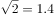，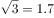）

- **A**. 0.15米
- **B**. 0.24米
- **C**. 0.37米
- **D**. 0.41米　✅

**答案**：D

**官方解析**

如下图1所示，OA为秋千在最低位置时的情况，OB为摆角是时秋千位置的情况，即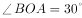，所以，CA是摆角为时，最高位置与最低位置的高度差，即0.45米。设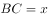，则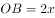、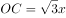，根据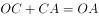，即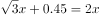，解得，则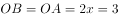。当摆角为时，如下图2所示，OA为秋千在最低位置时的情况，OE为摆角是时秋千位置的情况，即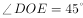，所以为等腰直角三角形，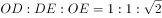，若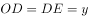，则，解得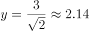，此时高度差为米，比原来的0.45米上升了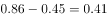米。

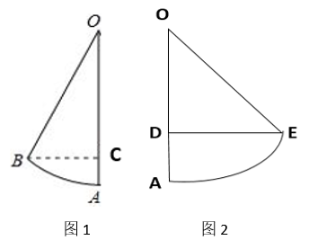

故正确答案为D。

---
