# 2020年深圳市考公务员录用考试《思维能力测验》试题（网友回忆版）

> 数量关系 · 19 题 · 深圳市考 2020

## 第 1 题　qid 2730437 · 数学运算

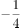，，，2，（    ）

- **A**. 
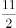

- **B**. 

- **C**. 
3

- **D**. 
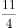
　✅

**答案**：D

**官方解析**

观察数列，大部分为分数，考虑分数数列。数列中存在整数，考虑反约分。原数列可转化为、、、，发现分母均为4，分子为公差是3的等差数列，则数列的下一项分母为4，分子为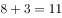，故所求项为。

故正确答案为D。

---

## 第 2 题　qid 2730438 · 数学运算

-1，4，-3，-4，-9，4，（    ），（    ）

- **A**. -27，-4　✅
- **B**. 27，-4
- **C**. -27，4
- **D**. 27，4

**答案**：A

**官方解析**

数列项数较多，且有两项未知，考虑多重数列，优先交叉找规律。交叉后得到，奇数项数列：-1，-3，-9，（    ），是公比为3的等比数列，则所求项为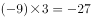；偶数项数列：4，-4，4，（    ），是公比为-1的等比数列，则所求项为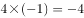。

故正确答案为A。

---

## 第 3 题　qid 2730441 · 数学运算

6，，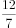，，（    ）

- **A**. 
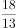
　✅
- **B**. 
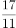

- **C**. 
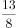

- **D**. 

**答案**：A

**官方解析**

观察数列大部分都是分数，选项也都是分数，考虑分数数列。观察分子分母不是单调变化，考虑反约分。原数列可转化为：，，，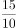，（    ）。观察发现，分子部分为公差是3的等差数列，下一项分子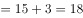；分母部分也为公差是3的等差数列，下一项分母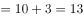。则原数列所求项应为。

故正确答案为A。

---

## 第 4 题　qid 2730442 · 数学运算

0，，，1，1，（    ）

- **A**. 

- **B**. 

- **C**. 

- **D**. 

　✅

**答案**：D

**官方解析**

题干数列包含整数与分数，选项均为分数，优先考虑分数数列，但将整数转化为分数后无规律。考虑作积找规律，前项后项依次得到：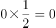，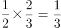，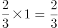，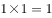，故相邻两项相乘得到新数列：0，，，1，观察发现，是公差为的等差数列。因此1所求项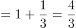，解得所求项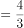。

故正确答案为D。

备注：原数列相邻两项作和可得：，，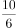，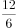，作和后的数列分子作差可得：4，3，2，（1），即作和后数列的下一项为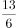，原数列下一项为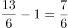，B项也有规律。按照数字推理规律就简原则，小粉笔认为相邻两项乘积解析更合适，推荐答案为D。

---

## 第 5 题　qid 2730432 · 数学运算

某市徒步协会组织了一项“清洁海岸线”公益活动。志愿者早上7点从市区集合出发。徒步前往市郊海岸线起点，然后沿海岸线捡拾垃圾。到达海岸线终点后立即沿原路折返。下午1点到达集合点一起收垃圾，已知志愿者正常的徒步速度为8km/h，捡拾垃圾的徒步速度为4km/h，返程负重的徒步速度为6km/h。去程与返程所用时间相同，则该段海岸线长（    ）km。

- **A**. 4
- **B**. 6　✅
- **C**. 12
- **D**. 18

**答案**：B

**官方解析**

由题意可知，志愿者早上7点从市区集合点出发，下午1点返回到达集合点，来回共花费了6个小时。因为去程与返程所用时间相同，所以去程和返程各用了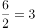小时，则单程长度为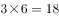km。设从海岸线起点到海岸线终点用了小时，则从市区集合点到海岸线起点用了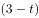小时， 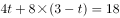，解得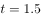，因此该段海岸线长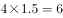km。

故正确答案为B。

---

## 第 6 题　qid 2730445 · 数学运算

王老师的日历如下图所示。他每天清晨撕下前一天的那页日历，某天下午，王老师将最近撕下的10页日历中的阿拉伯数字相加，算得总和为244。则当天该日历展示为（    ）日。

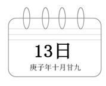

- **A**. 29
- **B**. 30
- **C**. 1
- **D**. 2　✅

**答案**：D

**官方解析**

方法一：根据选项可知，本题并非常规的等差数列问题，考虑代入排除。

A项：撕下10页日期为19-28日，根据等差数列求和公式可得总和为：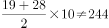，排除；

B项：撕下10页日期为20-29日，总和为：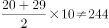，排除；

C项：撕下10页日期为21-30日或22-31日，总和为：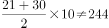或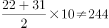，排除；

A、B、C三项均不满足条件，直接锁定D项，考场不用验证。

方法二：若前面10个日期为连续的数，则根据等差数列求和公式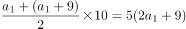，结果应为5的倍数，244不满足。故前面10个数不连续，由此排除A、B、C三项，D项当选。

故正确答案为D。

---

## 第 7 题　qid 2730446 · 数学运算

某日，小爱去文具店按原价购买了20本练习册；几日后，小爱再次经过文具店发现降价了0.5元，于是她用同样多的钱比上次多买了5本。该练习册的原价为（    ）。

- **A**. 2
- **B**. 2.5　✅
- **C**. 3
- **D**. 3.5

**答案**：B

**官方解析**

根据题意，设练习册的原价为元，则降价之后的价格为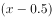元。根据两次花费的钱数同样多可得：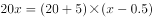，解得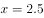。

故正确答案为B。

---

## 第 8 题　qid 2730447 · 数学运算

某对新婚夫妻买了一套“月月骄”系列毛巾礼盒，内装12条，分别编号为1-12的毛巾。夫妻二人从礼盒中各选一条毛巾自用，其毛巾所选数字大小至少相差3的情形共有（    ）种。

- **A**. 56
- **B**. 72
- **C**. 90　✅
- **D**. 111

**答案**：C

**官方解析**

方法一：由题意可知，若1-12内所选数字大小相差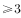，则被减数只能取4-12，可从大到小依次枚举，具体情况如下所示：

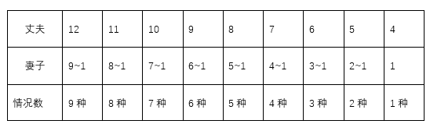

由于丈夫与妻子任意选择毛巾数字，故内部存在顺序，因此所选毛巾数字大小至少相差3的总情况数为：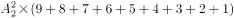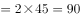种。

方法二：由题意可知，1-12数字内相差的情况数较多，因此可考虑反面情况：满足条件情况数总情况数数字相差小于3的情况数，由于丈夫与妻子随机选择毛巾数字，故考虑内部顺序，则夫妻任意选择两数差值的总情况数为，数字差值小于3的情况共两种：

①数字差值为2时：有（12，10）、（11，9）、(10，8)、（9，7）、（8，6）、（7，5）、（6，4）、（5，3）、（4，2）、（3，1）共10种情况； 

②数字差值为1时：1-12内相邻两个数字作差，差值为1，共有11种情况。

则所选毛巾数字大小至少相差3的总情况数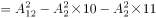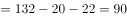种。

故正确答案为C。

---

## 第 9 题　qid 2730444 · 数学运算

某快递集散点有一批包裹，由甲、乙、丙三名快递员各自独立完成送达。其中有93件不是甲派送的，92件不是乙派送的，91件不是丙派送的，则甲派送了（    ）件。

- **A**. 44
- **B**. 45　✅
- **C**. 46
- **D**. 47

**答案**：B

**官方解析**

设甲、乙、丙分别派送了、、件包裹，由题意可知，有93件不是甲派送的，即由乙和丙共派送93件；同理有92件不是乙派送的，即由甲和丙共派送92件；有91件不是丙派送的，即由甲和乙共派送91件。则可列方程组为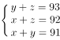，解得。

故正确答案为B。

---

## 第 10 题　qid 2730454 · 数学运算

某地方性体育彩票“10选4”的投注规则如下：投注者可以从01-10（共10个号码）中投选1-4个号码合成一组，称为“一注”（号码不区分排列顺序，如02 06 03和02 03 06是由该3个号码组成的同一注）。当投注了（    ）注时，会出现至少5注相同号码。

- **A**. 1255
- **B**. 1361
- **C**. 1401
- **D**. 1541　✅

**答案**：D

**官方解析**

根据问法“······会出现至少······”，可判定本题为最不利构造型最值问题。从10个号码中投选1-4个号码为“一注”，共有4种情况，分别为投选1个、2个、3个以及4个，总情况数为种；要求至少5注相同，最不利的情况是每种情况都投了4注，此时再投1注，必定有5注相同，则总注数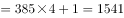注。

故正确答案为D。

---

## 第 11 题　qid 2730459 · 数学运算

某公园举办春节花展，在周长400米的中心区布置了环形花槽，并在花槽上每隔16米挂一只灯笼，不久后元宵灯会临近，公园决定增加并挪动一些灯笼，但仍保持灯笼间距相等。已知加入新灯笼后，共有5只旧灯笼没有移动，则调整后的灯笼间距最大为（    ）米。

- **A**. 12
- **B**. 10　✅
- **C**. 8
- **D**. 5

**答案**：B

**官方解析**

环形植树的棵数。题中5只旧灯笼没有移动，即一共分隔出5段，每段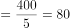米。在被分隔出的80米内，原来是16米一个小段，现在被修改成另外一个长度，两种情况下，前后两端的灯笼都没动，中间全部被移动，那代表与16的最小公倍数为80。代入选项，B、D两项符合要求，但题目求最大值，B项当选。

故正确答案为B。

---

## 第 12 题　qid 2730456 · 数学运算

烧瓶中装有浓度为的盐水1000g，先向瓶中倒入甲盐水200g，再倒入乙盐水400g，然后进行加热蒸干。已知甲盐水的浓度是乙盐水的3倍，水分蒸干后总重量减轻至加热前的四分之一，则甲盐水的浓度为（    ）。

- **A**. 

　✅
- **B**. 

- **C**. 

- **D**. 

**答案**：A

**官方解析**

设乙盐水的浓度为，甲盐水的浓度为。加热至水分蒸干后总重量减轻至加热前的，即盐（溶质）占加热前总溶液的。根据溶质不变，可判断出加热前溶液浓度为。根据浓度，可得：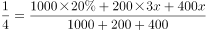，解得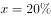，则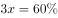，即甲盐水的浓度为。

故正确答案为A。

---

## 第 13 题　qid 2730457 · 数学运算

已知一级技工每小时可加工24个零件，二级技工每小时可加工20个零件。某生产组共有一、二级技工56名，实行八小时工作制，每天最多可加工10624个零件，则该生产组有二级技工（    ）名。

- **A**. 4　✅
- **B**. 5
- **C**. 24
- **D**. 25

**答案**：A

**官方解析**

设二级技工有名，则一级技工有名。根据题干可得方程：，解得。

故正确答案为A。

---

## 第 14 题　qid 2730455 · 数学运算

某翻译团队中，每名译员都擅长英语、日语、俄语中的至少一门语言。经统计，擅长英语的有17人，擅长日语的有21人，擅长俄语的有23人；擅长英语和日语的有7人，擅长英语和俄语的有6人，擅长日语和俄语的有6人；擅长三门语言的仅占总人数的十五分之一，则仅擅长英语的译员有（    ）人。

- **A**. 4
- **B**. 5
- **C**. 6
- **D**. 7　✅

**答案**：D

**官方解析**

设总人数为人，则擅长三门语言的有人。每名译员擅长至少一门语言，则都不为0。根据三集合容斥标准型公式：总数都不，可得：，解得，即擅长三门语言的有3人，故仅擅长英语的译员有人。

故正确答案为D。

---

## 第 15 题　qid 2730473 · 数学运算

某商场进行安全评估，进出该商场共设6道门，其中4道正门大小相同，2道侧门大小也相同，当同时打开3道正门、1道侧门时，2分钟可以通过600名顾客；当同时打开1道正门、2道侧门时，4分钟可以通过800名顾客。已知当发生紧急情况时因人员拥挤，通行效率将降低，若紧急情况下6道门全部打开，5分钟内能疏散顾客（    ）名。

- **A**. 1650
- **B**. 1870　✅
- **C**. 1980
- **D**. 2020

**答案**：B

**官方解析**

设正门每分钟能通过名顾客，侧门每分钟能通过名顾客；根据题意可列方程组：······①，······②，联立方程组，解得：，。根据题意“通行效率将降低”，则效率降低后，正门每分钟通过顾客为名，侧门每分钟通过顾客为名。因此紧急情况下6道门全部打开，5分钟内能疏散顾客名。

故正确答案为B。

---

## 第 16 题　qid 2730474 · 数学运算

小王和小李从甲地去往相距15km的乙地调研。两人同时出发且速度相同。15分钟后，小王发现遗漏了重要文件遂立即原路原速返回，小李则继续前行；小王取到文件后提速追赶小李，在小李到达乙地时刚好追上，假设小王取文件的时间忽略不计，则小李的速度为（    ）km/h。

- **A**. 4
- **B**. 4.5
- **C**. 5　✅
- **D**. 6

**答案**：C

**官方解析**

设小王和小李出发时的速度均为千米/小时，小王发现遗漏了重要文件并立即原路原速返回共用时分钟小时，此时小王和小李之间的距离为千米。设小王提速后追上小李的时间为，小王取到文件后的速度为千米/小时，根据追及公式可得：，解得小时，则小李的行驶总时间为小时，因此小李的速度千米/小时。

故正确答案为C。

---

## 第 17 题　qid 2730475 · 数学运算

某日上午8点多，朱博士外出考察并在中午12点前返回办公室。已知，朱博士出门时办公室挂钟的时针与分针成160度角，回来时成30度角，则在朱博士外出考察期间，时针与分针成90度角的次数最多有（    ）次。

- **A**. 7　✅
- **B**. 6
- **C**. 5
- **D**. 4

**答案**：A

**官方解析**

若使时针与分针成90度角的次数最多，则出发时间尽可能早，返回时间尽可能晚。上午8点多出门时时针与分针成160度角，此时的时间最早在8点10分左右，中午12点前返回办公室时时针与分针成30度角，最晚归来的时间在11点50分左右。则在8点10分~11点50分间时针与分针呈90度角的情况有：8点25分左右1次、9点整1次、9点30分左右1次，10点~11点间2次，11点~12点间2次，共有7次。
故正确答案为A。

---

## 第 18 题　qid 2730476 · 数学运算

某市计划在一条笔直公路的两侧每隔8米种一棵木棉树，并把植树任务交由甲、乙两组工人完成，若甲组先做3天，余下的任务由两组合作，则再做4天恰好完成。若乙组先做10天，余下的任务交由甲组，则再做2天恰好完成。已知甲组比乙组每天多种5棵树，则这条公路长（    ）米。

- **A**. 1224
- **B**. 1232　✅
- **C**. 1240
- **D**. 1248

**答案**：B

**官方解析**

根据题干“甲组比乙组每天多种5棵树”，设乙组每天种棵树，则甲组每天种棵树，根据两种工作方式的种树总量一样，可列方程：，解得，因此种树总量为棵。因此每侧种植棵，那么155棵树对应是段，则这条公路长度为米。

故正确答案为B。

---

## 第 19 题　qid 2730477 · 数学运算

营养专家提出，鉴别奶粉优劣，主要看OPO结构脂、乳铁蛋白、叶黄素、牛磺酸、酪蛋白磷酸肽等几项指标，符合三项及以上指标要求的奶粉品牌可以认定为合格。某次对一批奶粉品牌进行抽检发现，符合上述各项指标要求的品牌数量分别占抽检总量的、、、、，那么此次抽检的奶粉品牌的合格率至少是（    ）。

- **A**. 

- **B**. 

- **C**. 

　✅
- **D**. 

**答案**：C

**官方解析**

假设有100个奶粉品牌，每品牌抽检1个，则符合要求的指标总数个。根据“符合三项及以上指标要求的奶粉品牌可以认定为合格”，且要满足奶粉品牌的合格率尽量少，则应使不合格品牌符合两项指标，使合格品牌符合的指标数尽可能多。因此给100个品牌奶粉每个先分2项合格指标，即分出个合格指标，还剩个合格指标。

要使合格品牌符合的指标数尽可能多，最多可以同时符合五项指标。根据各项指标抽检符合要求的比例中最低的是，可得同时符合五项指标要求的品牌最多有个。即又分出个合格指标，还剩个合格指标。

除了这57个五项合格的品牌，其余品牌最多可以同时符合四项指标。合格指标，即有4个品牌同时符合四项指标，总共还余1个合格指标。则还可以有1个品牌同时符合三项指标。

综上所述，有57个品牌符合五项指标要求、4个品牌符合四项指标要求、1个品牌符合三项指标要求，此时合格数最少，合格率为。

故正确答案为C。

---
