# 2020年深圳市考公务员录用考试《行测1》试题（网友回忆版）

> 数量关系 · 13 题 · 深圳市考 2020

## 第 1 题　qid 2730451 · 数学运算

11，22，34，（    ）

- **A**. 50
- **B**. 48　✅
- **C**. 46
- **D**. 44

**答案**：B

**官方解析**

观察数列，无明显特征，项数少，作差作和不成规律，考虑数位之间的机械划分。将数列中每一个数的十位部分和个位部分划分后，十位部分形成新数列：1，2，3，是公差为1的等差数列，则下一项的十位部分为4；个位部分形成新数列：1，2，4，是公比为2的等比数列，则下一项的个位部分为8，故所求项为48。
故正确答案为B。

---

## 第 2 题　qid 2730461 · 数学运算

-1，7，34，98，223，（    ）

- **A**. 461
- **B**. 441
- **C**. 440
- **D**. 439　✅

**答案**：D

**官方解析**

方法一：观察数列，无明显特征，优先考虑作差。作差后得到新数列：8，27，64，125，（    ）。新数列的各项均为立方数，分别为：，，，。则新数列的下一项应为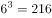，即原数列所求项为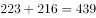。

方法二：数列中各个数字均位于幂次数附近，考虑幂次数列。；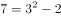；；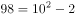；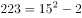。数列的底数为：1，3，6，10，15。两两作差为2，3，4，5，为公差是1的等差数列，所求项底数为；指数均为2；修正项均为-2，故所求项为。

故正确答案为D。

---

## 第 3 题　qid 2730450 · 数学运算

2，3， ，，（    ）

- **A**. 
1

- **B**. 

- **C**. 

- **D**. 
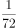
　✅

**答案**：D

**官方解析**

题干数列包含整数与分数，选项大多为分数，优先考虑分数数列，但将整数转化为分数后无规律。作差作和作积后均无规律，尝试作商，前项÷后项依次得到：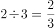，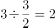，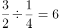，即相邻两项作商得到新数列为，2，6，是公比为3的等比数列。因此所求项，故所求项。

故正确答案为D。

---

## 第 4 题　qid 2730462 · 数学运算

小成下午2点有课，出门前他发现寝室的挂钟因电池耗尽停在12点，于是匆匆换了新电池但是忘了校准时间就离开寝室，到达教室时发现离上课还有15分钟，课后小成在教室自习到晚上9点才动身离开，到达寝室时发现挂钟显示为7点45分，若小成在寝室与教室之间往返用时相同，则其离开寝室的实际时间为下午（    ）。

- **A**. 1点15分
- **B**. 1点26分
- **C**. 1点30分　✅
- **D**. 1点36分

**答案**：C

**官方解析**

方法一：根据题意可知，小成到达教室的实际时间为下午1：45，离开教室的实际时间为晚上9：00，故小成在教室共待了7小时15分钟；又因为，小成从寝室出发时挂钟显示12：00，小成回到寝室时挂钟显示为7：45，故小成从寝室出发到回到寝室的总时间为7小时45分钟，则小成往返于寝室和教室的总时间为7小时45分钟7小时15分钟分钟，即单程时间分钟，则其离开寝室的实际时间为下午1：30。

方法二：考虑代入排除，先代入便于运算的。

代入C项：“下午1点30分”，即离开寝室的实际时间为下午1：30，而此时挂钟显示12：00，则挂钟比实际时间慢1小时30分钟。由题意可知，小成到达教室的实际时间为下午1：45，则从寝室到教室路上所用时间为15分钟。小成上完晚自习离开教室的实际时间为晚上9：00，且小成在寝室与教室之间往返用时相同，故小成到达寝室的实际时间为晚上9：15，此时挂钟显示7：45，恰好挂钟比实际时间慢1小时30分钟，符合题意，无需验证其他选项。

故正确答案为C。

---

## 第 5 题　qid 2730470 · 数学运算

某喷绘机每次同时单面印刷2张广告布，每印1面需要1分钟，广告布印后需晾干2分钟，现需双面印刷15张广告布，则至少需（    ）分钟的印刷时间。

- **A**. 15　✅
- **B**. 16
- **C**. 17
- **D**. 19

**答案**：A

**官方解析**

15张广告布共有个面，每分钟可以印刷2面，则印刷机印刷完所有广告布需要的时间为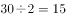分钟。

故正确答案为A。

备注：本题对于题干的理解存在争议，粉笔倾向于认为题目所问为“印刷时间”不包含最后一次印刷后的晾干时间。

---

## 第 6 题　qid 2730449 · 数学运算

深圳市民老李周末去郊游，他从家出发匀速骑行2小时到达梧桐山，游玩4小时后沿原路以原速返回，已知老李离开家5.5小时后，其子小李驾车以30公里/小时的速度从家出发沿同一路线接老李，两人在距离梧桐山10公里路程处相遇，则老李的骑行速度是（    ）公里/小时。

- **A**. 20　✅
- **B**. 18
- **C**. 16
- **D**. 15

**答案**：A

**官方解析**

设老李的骑行速度为公里/小时，则老李家到梧桐山的距离为公里。由题意可知，老李从梧桐山返回时，小李已经驾车行驶了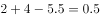小时，行驶了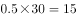公里。根据老李和小李的路程和为公里，可列式：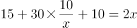，化简得：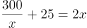，代入A项，符合。

故正确答案为A。

---

## 第 7 题　qid 2730453 · 数学运算

“数艺杯”绘画比赛的决赛规则如下：由3位评委对11件作品进行投票，每位评委对每件作品可以投一票或者不投票；得3票的作品为一等奖，得2票的作品为二等奖；得1票的作品为三等奖，不得票的作品为鼓励奖。已知三位评委分别投出了6票、7票、8票。且有3件作品为鼓励奖，那么（    ）。

- **A**. 一等奖作品比三等奖作品多5件　✅
- **B**. 一等奖作品比二等奖作品多2件
- **C**. 二等奖作品比一等奖作品多5件
- **D**. 二等奖作品比三等奖作品多3件

**答案**：A

**官方解析**

根据题意，设一等奖作品件，二等奖作品件，三等奖作品件，根据作品总数可得：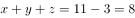······①；根据得票情况可得：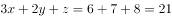······②。联立两式，可得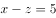，即一等奖作品比三等奖作品多5件。

故正确答案为A。

---

## 第 8 题　qid 2730458 · 数学运算

某演唱会主办方为观众准备了白红橙黄绿蓝紫7种颜色的荧光棒各若干只，每名观众可在入口处任意选取2只，若每种颜色的荧光棒都足够多，那么至少（    ）名观众中，一定有两人选取的荧光棒颜色完全相同。

- **A**. 14
- **B**. 22
- **C**. 28
- **D**. 29　✅

**答案**：D

**官方解析**

由题意可知，观众选取2只颜色相同的荧光棒共有7种方式；选取2只颜色不同的荧光棒共有种方式，共有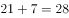种，根据最不利原则，至少名观众中，一定有两人选取的荧光棒颜色完全相同。

故正确答案为D。

---

## 第 9 题　qid 2730828 · 数学运算

社区工作人员小吴在统计辖区人口的年龄时，不小心将某人年龄的十位数字与个位数字交换了位置，则以下可能为其错误年龄与实际年龄的差值的是（    ）。

- **A**. 45　✅
- **B**. 46
- **C**. 47
- **D**. 48

**答案**：A

**官方解析**

设十位数字为，个位数字为，根据题意可得，错误年龄与实际年龄的差值。因为、为整数，故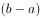为整数，则差值必定为9的倍数，只有A项满足。

故正确答案为A。

---

## 第 10 题　qid 2730832 · 数学运算

某班级开展素质拓展游戏，20名同学围成一个圆圈，以任意一名同学为起点从1开始依次报数，若所报数字含7或为7的倍数，则该同学需表演节目。表演后即退出圆圈，余下的同学继续报数，那么当圆圈内只剩5名同学时，报数次数最多的同学报过（    ）次。

- **A**. 4
- **B**. 5
- **C**. 6　✅
- **D**. 7

**答案**：C

**官方解析**

根据题意，报如下数字需表演节目：7、14、17、21、27、28、35、37、42、47、49、56、57、63、67、70······

第一轮报数为1-20，报数为7、14、17的3个人表演节目，还剩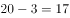人；

第二轮报数为21-37，报数为21、27、28、35、37的5个人表演节目，还剩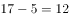人；

第三轮报数为38-49，报数为42、47、49的3个人表演节目，还剩人；

第四轮报数为50-58，报数为56、57的2个人表演节目，还剩人；

第五轮报数为59-65，报数为63的人表演节目，还剩人；

第六轮报数为66-71，报数为67的人表演节目，还剩人；

此时，报数次数最多的同学共参加6轮报数，即报过6次。

故正确答案为C。

---

## 第 11 题　qid 2730833 · 数学运算

港口仓库有4个不同重量的集装箱（均为整数吨），管理员将集装箱重量两两求和，并将得到的6个数都登记在册，后因保管不当，数据中的最大值被污渍遮盖。已知其余5个数据分别是23吨、27吨、30吨、31吨、34吨，则4个集装箱中最重的为（    ）吨。

- **A**. 17
- **B**. 18
- **C**. 21　✅
- **D**. 23

**答案**：C

**官方解析**

将4个集装箱按重量由大到小分别表示为、、、，则被污渍遮盖的数据为，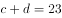。将两两求和的6个数相加，可得：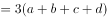，将代入，解得：。因此一定大于19，排除A、B两项；代入C项，若，则，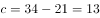，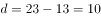，满足且均为整数。

故正确答案为C。

---

## 第 12 题　qid 2730842 · 数学运算

某科学家做了一项实验，通过向若干只狒狒提供不限量的香蕉和香肠以研究其食性。结果表明，的狒狒有进食，其中吃香蕉的狒狒是吃香肠的狒狒数量的3倍，而两种食物都吃的狒狒是只吃香肠的狒狒数量的，则未进食的狒狒是只吃香蕉的狒狒数量的（    ）。

- **A**. 

- **B**. 

- **C**. 

　✅
- **D**. 

**答案**：C

**官方解析**

赋值只吃香肠的狒狒数量为3，根据题意可得：两种食物都吃的狒狒数量为，吃香肠的狒狒数量为，吃香蕉的狒狒数量为，只吃香蕉的狒狒数量为，如下图所示。因此有进食的狒狒数量为，则狒狒总数为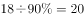，未进食的狒狒数量为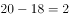，故未进食的狒狒是只吃香蕉的狒狒数量的。

故正确答案为C。

---

## 第 13 题　qid 2730851 · 数学运算

某款游戏共有7名英雄供玩家选择，7名英雄的能力值恰好为1-7的不同整数。每局游戏开始前，玩家需要任选3名英雄进行组队。玩家阿坤在进行了无数次的组队尝试后发现，不能一味选择能力值高的英雄组队，只有当3名英雄的能力值平均数大于3且小于5时才能获胜。则阿坤在组队尝试过程中的胜率是（    ）。

- **A**. 

- **B**. 

- **C**. 

- **D**. 

　✅

**答案**：D

**官方解析**

从7名英雄中选出3名英雄的总情况数为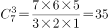。

当3名英雄的能力值平均数大于3且小于5时才能获胜，则获胜的能力总值在9到15之间，满足该要求的情况如下：

总值为10，（1、2、7），（1、3、6），（1、4、5），（2、3、5），共4种情况；

总值为11，（1、3、7），（1、4、6），（2、3、6），（2、4、5），共4种情况；

总值为12，（1、4、7），（1、5、6），（2、3、7），（2、4、6），（3、4、5），共5种情况；

总值为13，（1、5、7），（2、4、7），（2、5、6），（3、4、6），共4种情况；

总值为14，（1、6、7），（2、5、7），（3、4、7），（3、5、6），共4种情况。

则获胜的情况数为种。

因此获胜的概率。

故正确答案为D。

---
