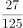
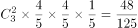
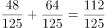

# 2020年甘肃公务员录用考试《行测》试题（网友回忆版）

> 数量关系 · 10 题 · 甘肃 2020

## 第 1 题　qid 2616082 · 数学运算

在屋内墙角处堆放稻谷（如图，谷堆为一个圆锥的四分之一），谷堆底部的弧长为6米，高为2米，经过一夜发现谷堆在重力作用下底部的弧长变为8米，若谷堆的谷量不变，那么此时谷堆的高为：

- **A**. 
米
　✅
- **B**. 
米

- **C**. 
米

- **D**. 
米

**答案**：A

**官方解析**

根据图示，谷堆的体积恰好是四分之一圆锥，则圆锥的底面圆周长为米。根据周长公式，，米。经过一夜之后，底部弧长变为8米，则新的四分之一圆锥底部圆的半径为米。谷堆为四分之一圆锥，体积。谷堆的谷量不变，有，整理得米。

故正确答案为A。

---

## 第 2 题　qid 2616087 · 数学运算

某企业员工组织周末自驾游。集合后发现，如果每辆小车坐5人，则空出4个座位；如果每辆小车少坐1人，则有8人没坐上车。那么，参加自驾游的小车有：

- **A**. 9辆
- **B**. 10辆
- **C**. 11辆
- **D**. 12辆　✅

**答案**：D

**官方解析**

设一共有辆车，根据总人数一定，列方程得：。解得，故参加自驾游的小车有12辆。

故正确答案为D。

---

## 第 3 题　qid 2616079 · 数学运算

某电商平台每隔5千米有一座仓库，共有A、B、C、D四座仓库，图中数字表示各仓库库存货物的吨数。现需要把所有的货物集中存放在其中某一个仓库中，如果每吨货物运输1千米需要运费3元，要使运费最少，则需将货物集中到哪座仓库？

- **A**. 仓库A
- **B**. 仓库B
- **C**. 仓库C　✅
- **D**. 仓库D

**答案**：C

**官方解析**

方法一：根据题意直接代入选项计算总运费。

若将货物集中到仓库A，则运费为元;

若将货物集中到仓库B，则运费为元；

若将货物集中到仓库C，则运费为元；

若将货物集中到仓库D，则运费为元；

则运费最少的是将货物集中到仓库C。

方法二：货物集中问题，只与各个仓库的存放量有关，与距离及运费无关。先考虑AB打包，CD打包，显然前者存放量（30吨）不如后者（40吨）多，因此AB的货物均需要向CD方向移动，先移到仓库C中。此时仓库C共有货物吨，仓库D有25吨，则仓库D向仓库C移动，最后货物都集中到仓库C中。

故正确答案为C。

---

## 第 4 题　qid 2616085 · 数学运算

南部某战区一个10人小分队里有6人是特种兵，某次突击任务需派出5人参战，若抽到3名或3名以上特种兵可成功完成突击任务，那么成功完成突击任务的概率有多大？

- **A**. 

- **B**. 

- **C**. 

- **D**. 

　✅

**答案**：D

**官方解析**

10人小分队里有6人是特种兵，则另外4人是非特种兵，派出5人参战，共有种组合情况。

若不能成功完成突击任务，则5名参战队员中只有1名特种兵或2名特种兵，共有种组合情况。

则成功完成突击任务的概率。

故正确答案为D。

---

## 第 5 题　qid 2616070 · 数学运算

小明每天从家中出发骑自行车经过一段平路，再经过一道斜坡后到达学校上课。某天早上，小明从家中骑车出发，一到校门口就发现忘带课本，马上返回，从离家到赶回家中共用了1个小时，假设小明当天平路骑行速度为9千米/小时，上坡速度为6千米/小时，下坡速度为18千米/小时，那么小明的家距离学校多远？

- **A**. 3.5千米
- **B**. 4.5千米　✅
- **C**. 5.5千米
- **D**. 6.5千米

**答案**：B

**官方解析**

设小明家到学校的距离为，在往返的过程中，上坡和下坡的路程均为斜坡的长度即距离相等，根据等距离平均速度公式，上下坡的平均速度千米/小时，与平路速度相等，故往返全程的平均速度均为9千米/小时，往返一次走了两个全程，千米/小时小时，得千米。

故正确答案为B。

---

## 第 6 题　qid 2616076 · 数学运算

甲乙丙丁四人通过手机的位置共享，发现乙在甲正南方向2公里处，丙在乙北偏西方向2公里处，丁在甲北偏西方向。若丁与甲、丙的距离相等，则该距离为：

- **A**. 
1公里

- **B**. 
公里
　✅
- **C**. 
公里

- **D**. 
2公里

**答案**：B

**官方解析**

根据题意，四人的位置关系如下图所示：

因为丙在乙北偏西方向，且乙与甲、丙的距离均为2公里，所以甲乙丙三人的位置构成等边三角形，则甲到丙的距离为2公里。丁在甲北偏西方向，则丁-甲-丙构成的角度为，且丁与甲、丙的距离相等，则甲丁丙三人的位置构成等腰直角三角形，因此所求的距离为公里。

故正确答案为B。

---

## 第 7 题　qid 2616068 · 数学运算

某学习平台的学习内容由观看视频、阅读文章、收藏分享、论坛交流、考试答题五个部分组成。某学员要先后学完这五个部分，若观看视频和阅读文章不能连续进行，该学员学习顺序的选择有：

- **A**. 24种
- **B**. 72种　✅
- **C**. 96种
- **D**. 120种

**答案**：B

**官方解析**

根据题意，观看视频和阅读文章不连续，可用插空法，先安排其它三部分学习内容，顺序有种，这三部分学习内容共形成四个空，再插入不能连续进行的观看视频和阅读文章这两部分，有种，因此总的学习顺序的选择有种。

故正确答案为B。

---

## 第 8 题　qid 2616078 · 数学运算

植树节期间，某单位购进一批树苗，在林场工人的指导下组织员工植树造林。假设植树的成活率为，那么，该单位职工小张种植3棵树苗，至少成活2棵的概率是：

- **A**. 

- **B**. 

- **C**. 

- **D**. 

　✅

**答案**：D

**官方解析**

植树成活的概率为，即，则死亡的概率为。小张种植了3棵树苗，至少成活2棵包含2种情况，分类讨论如下：

（1）成活2棵的概率为：；

（2）成活3棵的概率为：；

分类用加法，则至少成活2棵的概率为。

故正确答案为D。

---

## 第 9 题　qid 2616069 · 数学运算

某篮球队共有九人，分三组举行三人制篮球赛，他们的球衣号码分别是从1号到9号，分组后发现三组的球衣号码之和不同，且最大和是最小和的两倍。则各组号码之和不可能是下列哪个数？

- **A**. 10
- **B**. 11
- **C**. 12
- **D**. 13　✅

**答案**：D

**官方解析**

根据等差数列求和公式可得，所有球衣号码之和为。

方法一：代入排除法。

A项：假设最小和为10，则最大和为，则中间和为，满足题意，排除；

B项：假设最小和为11，则最大和为，则中间和为满足题意，排除；

C项：根据B项可得，12为可能的号码和，排除；

D项：假设最小和为13，则最大和为，则中间和为，不满足题意；假设中间和为13，则，32不是3的倍数，不满足题意，当选。

方法二：方程法。

根据题意设最小和与最大和分别为、，中间和为，，根据可得，，则，对应A、B两项，当时，，；当时，，，均符合题意，排除；根据倍数特性，中与45均为3的倍数，则必为3的倍数，对应C项，时，，，符合题意，排除。 

本题为选非题，故正确答案为D。

---

## 第 10 题　qid 2616164 · 数学运算

小王在荡秋千，当秋千摆角为时，它摆到最高位置与最低位置的高度差为0.45米。小王为寻求更大的刺激感，将秋千摆角增加，则秋千能摆到的最高位置约上升了多少米？（，）

- **A**. 0.15米
- **B**. 0.24米
- **C**. 0.37米
- **D**. 0.41米　✅

**答案**：D

**官方解析**

如下图1所示，OA为秋千在最低位置时的情况，OB为摆角是时秋千位置的情况，即，所以，CA是摆角为时，最高位置与最低位置的高度差，即0.45米。设，则、，根据，即，解得，则。当摆角为时，如下图2所示，OA为秋千在最低位置时的情况，OE为摆角是时秋千位置的情况，即，所以为等腰直角三角形，，若，则，解得，此时高度差为米，比原来的0.45米上升了米。

故正确答案为D。

---
