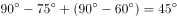
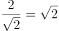
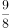
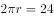
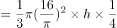

# 2020年贵州省公务员录用考试《行测》试题（网友回忆版）

> 数量关系 · 10 题 · 贵州 2020

## 第 1 题　qid 2616087 · 数学运算

某企业员工组织周末自驾游。集合后发现，如果每辆小车坐5人，则空出4个座位；如果每辆小车少坐1人，则有8人没坐上车。那么，参加自驾游的小车有：

- **A**. 9辆
- **B**. 10辆
- **C**. 11辆
- **D**. 12辆　✅

**答案**：D

**官方解析**

设一共有辆车，根据总人数一定，列方程得：。解得，故参加自驾游的小车有12辆。

故正确答案为D。

---

## 第 2 题　qid 2616085 · 数学运算

南部某战区一个10人小分队里有6人是特种兵，某次突击任务需派出5人参战，若抽到3名或3名以上特种兵可成功完成突击任务，那么成功完成突击任务的概率有多大？

- **A**. 

- **B**. 

- **C**. 

- **D**. 

　✅

**答案**：D

**官方解析**

10人小分队里有6人是特种兵，则另外4人是非特种兵，派出5人参战，共有种组合情况。

若不能成功完成突击任务，则5名参战队员中只有1名特种兵或2名特种兵，共有种组合情况。

则成功完成突击任务的概率。

故正确答案为D。

---

## 第 3 题　qid 2616069 · 数学运算

某篮球队共有九人，分三组举行三人制篮球赛，他们的球衣号码分别是从1号到9号，分组后发现三组的球衣号码之和不同，且最大和是最小和的两倍。则各组号码之和不可能是下列哪个数？

- **A**. 10
- **B**. 11
- **C**. 12
- **D**. 13　✅

**答案**：D

**官方解析**

根据等差数列求和公式可得，所有球衣号码之和为。

方法一：代入排除法。

A项：假设最小和为10，则最大和为，则中间和为，满足题意，排除；

B项：假设最小和为11，则最大和为，则中间和为满足题意，排除；

C项：根据B项可得，12为可能的号码和，排除；

D项：假设最小和为13，则最大和为，则中间和为，不满足题意；假设中间和为13，则，32不是3的倍数，不满足题意，当选。

方法二：方程法。

根据题意设最小和与最大和分别为、，中间和为，，根据可得，，则，对应A、B两项，当时，，；当时，，，均符合题意，排除；根据倍数特性，中与45均为3的倍数，则必为3的倍数，对应C项，时，，，符合题意，排除。 

本题为选非题，故正确答案为D。

---

## 第 4 题　qid 2616083 · 数学运算

某公司现有6箱不同的水果，安排三个配送员送到A、B、C三个不同的仓储点，其中A地1箱，B地2箱，C地3箱，问配送方式有：

- **A**. 60种
- **B**. 180种
- **C**. 360种　✅
- **D**. 420种

**答案**：C

**官方解析**

根据分步原理，选择一个配送员给A地送1箱的情况数为：种；选择一个剩下的配送员给B地送2箱的情况数为：种；最后剩下的一个配送员将剩下的3箱送给C地，情况数为1种，分步用乘法，则所求情况数为种。

故正确答案为C。

---

## 第 5 题　qid 2616076 · 数学运算

甲乙丙丁四人通过手机的位置共享，发现乙在甲正南方向2公里处，丙在乙北偏西方向2公里处，丁在甲北偏西方向。若丁与甲、丙的距离相等，则该距离为：

- **A**. 
1公里

- **B**. 
公里
　✅
- **C**. 
公里

- **D**. 
2公里

**答案**：B

**官方解析**

根据题意，四人的位置关系如下图所示：

因为丙在乙北偏西方向，且乙与甲、丙的距离均为2公里，所以甲乙丙三人的位置构成等边三角形，则甲到丙的距离为2公里。丁在甲北偏西方向，则丁-甲-丙构成的角度为，且丁与甲、丙的距离相等，则甲丁丙三人的位置构成等腰直角三角形，因此所求的距离为公里。

故正确答案为B。

---

## 第 6 题　qid 2616156 · 数学运算

物业派出小王、小曾、小郭三名工作人员负责修剪小区内的6棵树，每名工作人员至少修剪1棵（只考虑修剪的棵数），问小王至少修剪3棵的概率为：

- **A**. 

　✅
- **B**. 

- **C**. 

- **D**. 

**答案**：A

**官方解析**

3个人修剪6棵树，每人至少1棵，根据插板法，m个相同的元素分成n组，每组至少1个，则情况数为。总的情况数是种。小王至少修剪3棵，则满足条件的有3种情况：①小王3棵、小曾2棵、小郭1棵。②小王3棵、小曾1棵、小郭2棵。③小王4棵，小曾、小郭各1棵。所求。

故正确答案为A。

---

## 第 7 题　qid 2616079 · 数学运算

某电商平台每隔5千米有一座仓库，共有A、B、C、D四座仓库，图中数字表示各仓库库存货物的吨数。现需要把所有的货物集中存放在其中某一个仓库中，如果每吨货物运输1千米需要运费3元，要使运费最少，则需将货物集中到哪座仓库？

- **A**. 仓库A
- **B**. 仓库B
- **C**. 仓库C　✅
- **D**. 仓库D

**答案**：C

**官方解析**

方法一：根据题意直接代入选项计算总运费。

若将货物集中到仓库A，则运费为元;

若将货物集中到仓库B，则运费为元；

若将货物集中到仓库C，则运费为元；

若将货物集中到仓库D，则运费为元；

则运费最少的是将货物集中到仓库C。

方法二：货物集中问题，只与各个仓库的存放量有关，与距离及运费无关。先考虑AB打包，CD打包，显然前者存放量（30吨）不如后者（40吨）多，因此AB的货物均需要向CD方向移动，先移到仓库C中。此时仓库C共有货物吨，仓库D有25吨，则仓库D向仓库C移动，最后货物都集中到仓库C中。

故正确答案为C。

---

## 第 8 题　qid 2616143 · 数学运算

村民陶某承包一块长方形种植地，他将地分割成如图所示的4个小长方形，在A、B、C、D四块长方形土地上分别种植西瓜、花生、地瓜、水稻。其中长方形A、B、C的周长分别是20米、24米、28米，那么长方形D的最大面积是：

- **A**. 42平方米
- **B**. 49平方米
- **C**. 64平方米　✅
- **D**. 81平方米

**答案**：C

**官方解析**

如下图所示，假设标注的四条边长分别为、、、，已知长方形A、B、C的周长分别是20米、24米、28米，根据长方形周长，可得，化简得，即，解得。而c、d分别代表长方形D的长和宽，和一定时，当且仅当时面积最大，此时米，故长方形D的最大面积平方米。

故正确答案为C。

---

## 第 9 题　qid 2616081 · 数学运算

某会展中心布置会场，从花卉市场购买郁金香、月季花、牡丹花三种花卉各20盆，每盆均用纸箱打包好装车运送至会展中心，再由工人搬运至布展区。问至少要搬出多少盆花卉才能保证搬出的鲜花中一定有郁金香？

- **A**. 20盆
- **B**. 21盆
- **C**. 40盆
- **D**. 41盆　✅

**答案**：D

**官方解析**

根据问法“至少······才能保证······”，可判定本题为最不利构造型最值问题。考虑最不利情况为前面搬出的花卉都是月季花和牡丹花，则一共搬出盆花卉。在此基础上再搬1盆花，就可以保证一定是郁金香，则至少需要搬盆花卉。

故正确答案为D。

---

## 第 10 题　qid 2616082 · 数学运算

在屋内墙角处堆放稻谷（如图，谷堆为一个圆锥的四分之一），谷堆底部的弧长为6米，高为2米，经过一夜发现谷堆在重力作用下底部的弧长变为8米，若谷堆的谷量不变，那么此时谷堆的高为：

- **A**. 
米
　✅
- **B**. 
米

- **C**. 
米

- **D**. 
米

**答案**：A

**官方解析**

根据图示，谷堆的体积恰好是四分之一圆锥，则圆锥的底面圆周长为米。根据周长公式，，米。经过一夜之后，底部弧长变为8米，则新的四分之一圆锥底部圆的半径为米。谷堆为四分之一圆锥，体积。谷堆的谷量不变，有，整理得米。

故正确答案为A。

---
